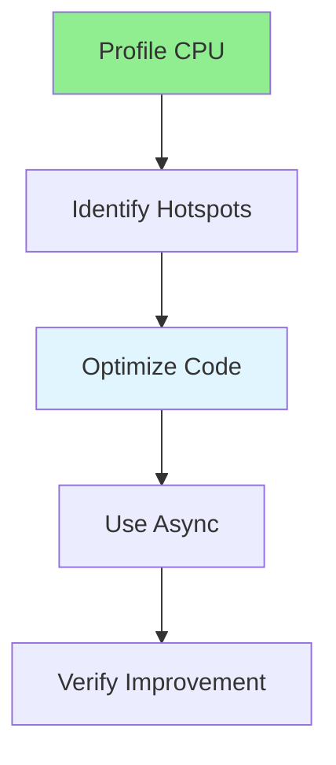

# 16.13 CPU Optimization / Tối ưu CPU

## Table of Contents / Mục lục
1. [Introduction / Giới thiệu](#introduction--giới-thiệu)
2. [CPU Optimization Techniques / Kỹ thuật tối ưu CPU](#cpu-optimization-techniques--kỹ-thuật-tối-ưu-cpu)
3. [Best Practices / Thực hành tốt nhất](#best-practices--thực-hành-tốt-nhất)
4. [Summary / Tóm tắt](#summary--tóm-tắt)

---

## Introduction / Giới thiệu

### Overview / Tổng quan

**English**: CPU optimization improves processing efficiency. Learn to optimize algorithms, use async operations, and reduce CPU-intensive work.

**Vietnamese**: Tối ưu CPU cải thiện hiệu quả xử lý. Học cách tối ưu thuật toán, sử dụng thao tác async và giảm công việc tốn CPU.

### CPU Optimization Flow / Luồng tối ưu CPU



---

## CPU Optimization Techniques / Kỹ thuật tối ưu CPU

### Example 1: CPU Optimization / Ví dụ 1: Tối ưu CPU

```typescript
// CPU optimization / Tối ưu CPU
// Use async / Sử dụng async
async function processData(data: any[]) {
  // Process in parallel / Xử lý song song
  const results = await Promise.all(
    data.map(item => processItem(item))
  );
  return results;
}

// Optimize algorithm / Tối ưu thuật toán
// Before / Trước
function slowSearch(arr: number[], target: number): boolean {
  return arr.includes(target); // O(n) / O(n)
}

// After / Sau
function fastSearch(arr: number[], target: number): boolean {
  const sorted = arr.sort((a, b) => a - b);
  return binarySearch(sorted, target); // O(log n) / O(log n)
}
```

---

## Best Practices / Thực hành tốt nhất

1. **Profile first** - Identify bottlenecks
2. **Optimize algorithms** - Better complexity
3. **Use async** - Non-blocking operations
4. **Parallel processing** - Process concurrently
5. **Cache results** - Avoid recomputation

---

## Summary / Tóm tắt

### Key Takeaways / Điểm chính

- **Profiling**: Identify CPU hotspots
- **Algorithms**: Optimize complexity
- **Async**: Non-blocking operations
- **Parallel**: Concurrent processing

### Next Steps / Bước tiếp theo

- [16.14 Network Optimization](./16.14_Network_Optimization.md) - Next: Network Optimization

---

**Last Updated / Cập nhật lần cuối**: 2024

