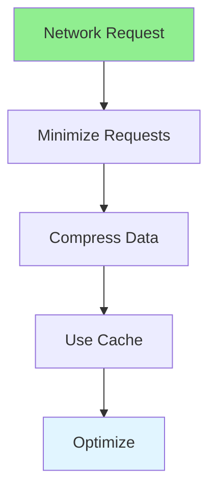

# 16.14 Network Optimization / Tối ưu mạng

## Table of Contents / Mục lục
1. [Introduction / Giới thiệu](#introduction--giới-thiệu)
2. [Network Optimization Techniques / Kỹ thuật tối ưu mạng](#network-optimization-techniques--kỹ-thuật-tối-ưu-mạng)
3. [Best Practices / Thực hành tốt nhất](#best-practices--thực-hành-tốt-nhất)
4. [Summary / Tóm tắt](#summary--tóm-tắt)

---

## Introduction / Giới thiệu

### Overview / Tổng quan

**English**: Network optimization reduces latency and bandwidth. Learn to minimize requests, compress data, and optimize network usage.

**Vietnamese**: Tối ưu mạng giảm độ trễ và băng thông. Học cách giảm thiểu requests, nén dữ liệu và tối ưu sử dụng mạng.

### Network Optimization Flow / Luồng tối ưu mạng



---

## Network Optimization Techniques / Kỹ thuật tối ưu mạng

### Example 1: Network Optimization / Ví dụ 1: Tối ưu mạng

```typescript
// Network optimization / Tối ưu mạng
// Request batching / Gộp requests
async function batchRequests(requests: Request[]) {
  // Batch multiple requests / Gộp nhiều requests
  const responses = await Promise.all(requests);
  return responses;
}

// Compression / Nén
import compression from 'compression';

app.use(compression()); // Enable gzip / Bật gzip

// HTTP/2 / HTTP/2
// Use HTTP/2 for multiplexing / Sử dụng HTTP/2 cho multiplexing

// Connection pooling / Pool kết nối
const httpAgent = new https.Agent({
  keepAlive: true,
  maxSockets: 50
});
```

---

## Best Practices / Thực hành tốt nhất

1. **Minimize requests** - Batch requests
2. **Compress data** - Use gzip/brotli
3. **HTTP/2** - Use HTTP/2
4. **Connection pooling** - Reuse connections
5. **CDN** - Use CDN for static assets

---

## Summary / Tóm tắt

### Key Takeaways / Điểm chính

- **Requests**: Minimize number
- **Compression**: Reduce payload
- **HTTP/2**: Multiplexing
- **Pooling**: Reuse connections

### Next Steps / Bước tiếp theo

- [16.15 Performance Monitoring](./16.15_Performance_Monitoring.md) - Next: Performance Monitoring

---

**Last Updated / Cập nhật lần cuối**: 2024


