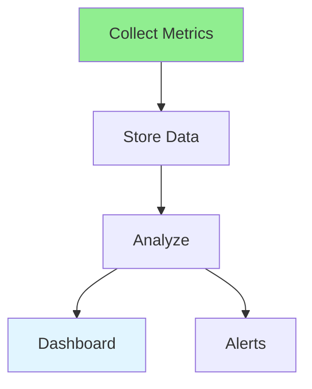
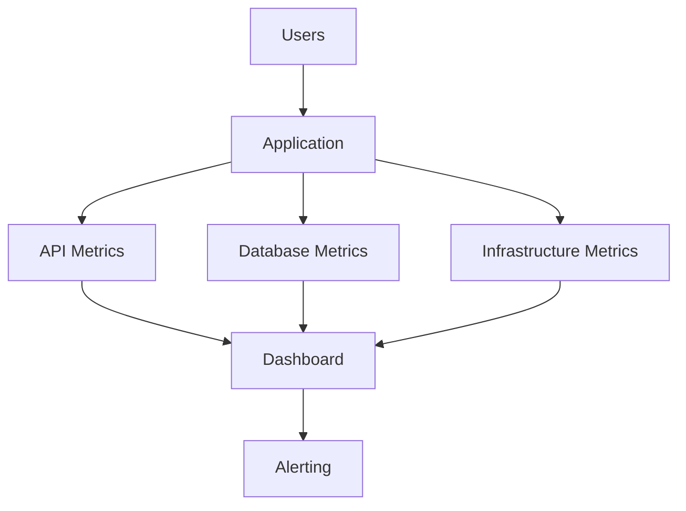

# 16.15 Performance Monitoring / Giám sát hiệu năng

## Table of Contents / Mục lục
1. [Introduction / Giới thiệu](#introduction--giới-thiệu)
2. [Monitoring Tools / Công cụ giám sát](#monitoring-tools--công-cụ-giám-sát)
3. [Dashboard Strategy / Chiến lược dashboard](#dashboard-strategy--chiến-lược-dashboard)
4. [Alerting / Cảnh báo](#alerting--cảnh-báo)
5. [Best Practices / Thực hành tốt nhất](#best-practices--thực-hành-tốt-nhất)
6. [Summary / Tóm tắt](#summary--tóm-tắt)

---

## Introduction / Giới thiệu

### Overview / Tổng quan

**English**: Performance monitoring tracks system performance continuously. Learn to set up monitoring, create dashboards, and set alerts.

**Vietnamese**: Giám sát hiệu năng theo dõi hiệu năng hệ thống liên tục. Học cách thiết lập giám sát, tạo dashboard và đặt cảnh báo.

### Performance Monitoring Flow / Luồng giám sát hiệu năng



---

## Monitoring Tools / Công cụ giám sát

### Example 1: Performance Monitoring / Ví dụ 1: Giám sát hiệu năng

```typescript
// Performance monitoring / Giám sát hiệu năng
import { PrometheusClient } from 'prometheus-client';

// Metrics / Metrics
const httpRequestDuration = new PrometheusClient.Histogram({
  name: 'http_request_duration_seconds',
  help: 'HTTP request duration',
  labelNames: ['method', 'route', 'status']
});

// Track request / Theo dõi request
function trackRequest(method: string, route: string, duration: number) {
  httpRequestDuration.observe({ method, route }, duration);
}

// APM / APM
import * as Sentry from '@sentry/node';

Sentry.init({
  dsn: process.env.SENTRY_DSN,
  tracesSampleRate: 1.0
});
```

### Monitoring Layers / Các lớp giám sát



---

## Dashboard Strategy / Chiến lược dashboard

### Useful Dashboard Sections / Các phần dashboard hữu ích

- traffic and request volume
- latency percentiles
- error rate
- infrastructure usage
- database health
- deployment annotations

### Why Dashboards Fail / Tại sao dashboard thất bại

- too many charts without actionability
- no distinction between symptom and cause
- no baseline or normal range

---

## Alerting / Cảnh báo

### Good Alert Targets / Mục tiêu cảnh báo tốt

- sustained error rate increase
- p95 latency above target
- health endpoint failure
- memory or CPU saturation
- queue growth without drain

### Example 2: Incident Triage / Ví dụ 2: Xử lý sự cố

1. confirm whether the alert is real
2. assess user impact
3. compare with recent deploys
4. inspect logs and traces
5. mitigate first, optimize second

---

## Best Practices / Thực hành tốt nhất

1. **Real-time monitoring** - Continuous tracking
2. **Dashboards** - Visualize metrics
3. **Alerts** - Set up alerts
4. **Historical data** - Keep for analysis
5. **Multiple metrics** - Track various indicators
6. **Track percentiles** - Averages hide tail latency problems
7. **Annotate deploys** - Performance changes often follow releases
8. **Tie metrics to action** - Monitoring should shorten diagnosis time

---

## Summary / Tóm tắt

### Key Takeaways / Điểm chính

- **Metrics**: Response time, throughput, errors
- **Dashboards**: Visual representation
- **Alerts**: Proactive notifications
- **Tools**: Prometheus, Grafana, APM
- **Dashboards**: Should help operators decide what to do next
- **Alerting**: Useful alerts reduce noise and speed up mitigation

### Next Steps / Bước tiếp theo

- [16.16 Performance Tuning](./16.16_Performance_Tuning.md) - Next: Performance Tuning

---

**Last Updated / Cập nhật lần cuối**: 2024

