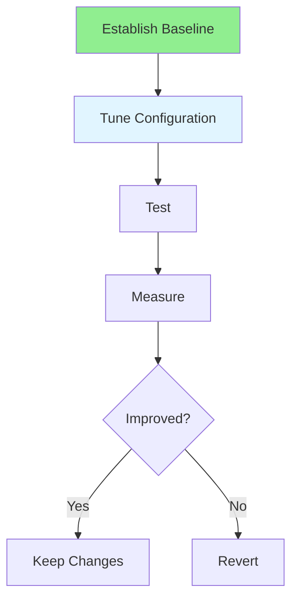

# 16.16 Performance Tuning / Điều chỉnh hiệu năng

## Table of Contents / Mục lục
1. [Introduction / Giới thiệu](#introduction--giới-thiệu)
2. [Tuning Process / Quy trình điều chỉnh](#tuning-process--quy-trình-điều-chỉnh)
3. [Best Practices / Thực hành tốt nhất](#best-practices--thực-hành-tốt-nhất)
4. [Summary / Tóm tắt](#summary--tóm-tắt)

---

## Introduction / Giới thiệu

### Overview / Tổng quan

**English**: Performance tuning optimizes system configuration. Learn to tune databases, application servers, and infrastructure for optimal performance.

**Vietnamese**: Điều chỉnh hiệu năng tối ưu cấu hình hệ thống. Học cách điều chỉnh database, application server và hạ tầng cho hiệu năng tối ưu.

### Performance Tuning Flow / Luồng điều chỉnh hiệu năng



---

## Tuning Process / Quy trình điều chỉnh

### Example 1: Performance Tuning / Ví dụ 1: Điều chỉnh hiệu năng

```typescript
// Performance tuning / Điều chỉnh hiệu năng
interface TuningConfig {
  database: {
    connectionPool: number;
    queryCache: boolean;
    indexes: string[];
  };
  application: {
    workers: number;
    memoryLimit: string;
    timeout: number;
  };
  infrastructure: {
    cpu: number;
    memory: string;
    network: string;
  };
}

// Tune system / Điều chỉnh hệ thống
function tuneSystem(config: TuningConfig): void {
  // Database tuning / Điều chỉnh database
  // SET max_connections = config.database.connectionPool;
  
  // Application tuning / Điều chỉnh ứng dụng
  // Set worker threads / Đặt worker threads
  // Set memory limits / Đặt giới hạn bộ nhớ
}
```

---

## Best Practices / Thực hành tốt nhất

1. **Measure first** - Establish baseline
2. **Tune incrementally** - One change at a time
3. **Test thoroughly** - Verify improvements
4. **Document changes** - Record configurations
5. **Monitor continuously** - Track performance

---

## Summary / Tóm tắt

### Key Takeaways / Điểm chính

- **Baseline**: Establish before tuning
- **Incremental**: One change at a time
- **Testing**: Verify improvements
- **Documentation**: Record changes

### Next Steps / Bước tiếp theo

- Complete Group 16: Performance Testing ✅
- Move to [Group 17: DevOps & Automation](../Group-17-DevOps-Automation/) - Coming next

---

**Last Updated / Cập nhật lần cuối**: 2024


