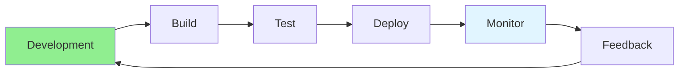
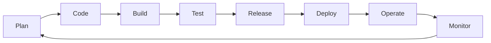

# 17.01 DevOps Fundamentals / Cơ bản DevOps

## Table of Contents / Mục lục
1. [Introduction / Giới thiệu](#introduction--giới-thiệu)
2. [DevOps Concepts / Khái niệm DevOps](#devops-concepts--khái-niệm-devops)
3. [DevOps Practices / Thực hành DevOps](#devops-practices--thực-hành-devops)
4. [Team Impact / Tác động tới team](#team-impact--tác-động-tới-team)
5. [Best Practices / Thực hành tốt nhất](#best-practices--thực-hành-tốt-nhất)
6. [Summary / Tóm tắt](#summary--tóm-tắt)

---

## Introduction / Giới thiệu

### Overview / Tổng quan

**English**: DevOps bridges development and operations. Learn DevOps culture, practices, and tools for faster, more reliable software delivery.

**Vietnamese**: DevOps kết nối phát triển và vận hành. Học văn hóa, thực hành và công cụ DevOps cho giao phần mềm nhanh hơn, đáng tin cậy hơn.

### DevOps Flow / Luồng DevOps



---

## DevOps Concepts / Khái niệm DevOps

### Example 1: DevOps Practices / Ví dụ 1: Thực hành DevOps

```typescript
// DevOps practices / Thực hành DevOps
const devOpsPractices = {
  continuousIntegration: 'Automate builds and tests',
  continuousDelivery: 'Automate deployment',
  infrastructureAsCode: 'Manage infrastructure as code',
  monitoring: 'Monitor applications continuously',
  collaboration: 'Dev and Ops work together'
};

// DevOps culture / Văn hóa DevOps
interface DevOpsCulture {
  collaboration: 'Dev and Ops collaboration';
  automation: 'Automate everything possible';
  measurement: 'Measure everything';
  sharing: 'Share knowledge and tools';
}
```

### DevOps Lifecycle / Vòng đời DevOps



---

## Best Practices / Thực hành tốt nhất

## Team Impact / Tác động tới team

### What DevOps Changes / DevOps thay đổi điều gì

- faster feedback loops
- shared ownership for reliability
- more automation and less repetitive manual work
- stronger release discipline

### What DevOps Is Not / DevOps không phải là gì

- only a tooling choice
- only a separate operations team
- just CI/CD without monitoring or ownership

---

## Best Practices / Thực hành tốt nhất

1. **Automate** - Automate repetitive tasks
2. **Measure** - Track metrics
3. **Collaborate** - Work together
4. **Iterate** - Continuous improvement
5. **Share** - Share knowledge
6. **Own outcomes** - Reliability is part of delivery
7. **Reduce handoff friction** - Favor shared processes and visibility
8. **Learn from incidents** - Use failures to improve systems

---

## Summary / Tóm tắt

### Key Takeaways / Điểm chính

- **Culture**: Collaboration and automation
- **Practices**: CI/CD, IaC, monitoring
- **Tools**: Automation tools
- **Benefits**: Faster delivery, reliability
- **Ownership**: DevOps improves both release speed and operational responsibility
- **Lifecycle**: Build, deploy, monitor, and learn form one loop

### Next Steps / Bước tiếp theo

- [17.02 CI/CD Basics](./17.02_CI_CD_Basics.md) - Next: CI/CD Basics

---

**Last Updated / Cập nhật lần cuối**: 2024

