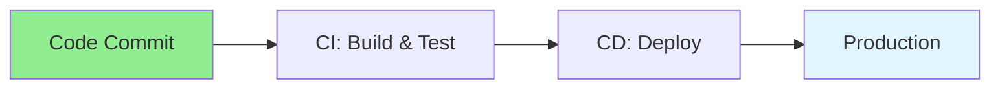

# 17.02 CI/CD Basics / Cơ bản CI/CD

## Table of Contents / Mục lục
1. [Introduction / Giới thiệu](#introduction--giới-thiệu)
2. [CI/CD Pipeline / Pipeline CI/CD](#cicd-pipeline--pipeline-cicd)
3. [Stages / Các giai đoạn](#stages--các-giai-đoạn)
4. [Release Safety / An toàn release](#release-safety--an-toàn-release)
5. [Best Practices / Thực hành tốt nhất](#best-practices--thực-hành-tốt-nhất)
6. [Summary / Tóm tắt](#summary--tóm-tắt)

---

## Introduction / Giới thiệu

### Overview / Tổng quan

**English**: CI/CD automates build, test, and deployment. Learn to create CI/CD pipelines for automated software delivery.

**Vietnamese**: CI/CD tự động hóa build, test và deployment. Học cách tạo pipeline CI/CD cho giao phần mềm tự động.

### CI/CD Pipeline Flow / Luồng Pipeline CI/CD



---

## CI/CD Pipeline / Pipeline CI/CD

### Example 1: CI/CD Pipeline / Ví dụ 1: Pipeline CI/CD

```yaml
# GitHub Actions CI/CD / GitHub Actions CI/CD
name: CI/CD

on:
  push:
    branches: [ main ]
  pull_request:
    branches: [ main ]

jobs:
  test:
    runs-on: ubuntu-latest
    steps:
      - uses: actions/checkout@v3
      - uses: actions/setup-node@v3
        with:
          node-version: '18'
      - run: npm ci
      - run: npm test
  
  deploy:
    needs: test
    runs-on: ubuntu-latest
    if: github.ref == 'refs/heads/main'
    steps:
      - uses: actions/checkout@v3
      - name: Deploy
        run: echo "Deploy to production"
```

---

## Stages / Các giai đoạn

### Typical Pipeline / Pipeline điển hình


### Good Early Checks / Kiểm tra sớm nên có

- formatting
- linting
- unit tests
- integration tests where practical
- build validation

---

## Release Safety / An toàn release

### What A Basic Pipeline Still Needs / Pipeline cơ bản vẫn cần gì

- secret management
- rollback path
- controlled deploy to production
- health check after deploy
- migration coordination

### Example 2: Health Verification / Ví dụ 2: Xác minh health

```yaml
- name: Verify deployment
  run: curl --fail https://app.example.com/health
```

---

## Best Practices / Thực hành tốt nhất

1. **Fast feedback** - Quick test cycles
2. **Automate everything** - Build, test, deploy
3. **Fail fast** - Stop on first failure
4. **Version control** - Track all changes
5. **Rollback plan** - Plan for failures
6. **Protect main branch** - Require checks before merge
7. **Reuse tested artifacts** - Avoid rebuilding different outputs later
8. **Verify after deployment** - Successful execution is not enough

---

## Summary / Tóm tắt

### Key Takeaways / Điểm chính

- **CI**: Continuous integration
- **CD**: Continuous deployment
- **Automation**: Automated workflows
- **Benefits**: Faster delivery
- **Stages**: Good pipelines validate, package, deploy, and verify
- **Safety**: Even basic CI/CD needs rollback and health validation

### Next Steps / Bước tiếp theo

- [17.03 Infrastructure as Code](./17.03_Infrastructure_as_Code.md) - Next: Infrastructure as Code

---

**Last Updated / Cập nhật lần cuối**: 2024

