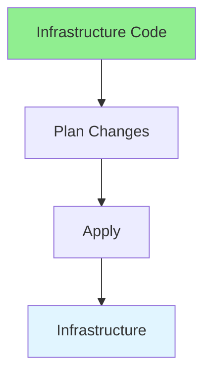
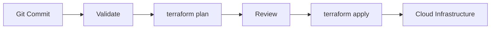

# 17.03 Infrastructure as Code / Infrastructure as Code

## Table of Contents / Mục lục
1. [Introduction / Giới thiệu](#introduction--giới-thiệu)
2. [IaC Tools / Công cụ IaC](#iac-tools--công-cụ-iac)
3. [Environment Structure / Cấu trúc môi trường](#environment-structure--cấu-trúc-môi-trường)
4. [Workflow / Quy trình](#workflow--quy-trình)
5. [Best Practices / Thực hành tốt nhất](#best-practices--thực-hành-tốt-nhất)
6. [Summary / Tóm tắt](#summary--tóm-tắt)

---

## Introduction / Giới thiệu

### Overview / Tổng quan

**English**: Infrastructure as Code manages infrastructure through code. Learn to use Terraform, CloudFormation, and other IaC tools.

**Vietnamese**: Infrastructure as Code quản lý hạ tầng qua code. Học cách sử dụng Terraform, CloudFormation và các công cụ IaC khác.

### Infrastructure as Code Flow / Luồng Infrastructure as Code



---

## IaC Tools / Công cụ IaC

### Example 1: Terraform / Ví dụ 1: Terraform

```hcl
# Terraform / Terraform
terraform {
  required_providers {
    aws = {
      source  = "hashicorp/aws"
      version = "~> 4.0"
    }
  }
}

resource "aws_instance" "app_server" {
  ami           = "ami-0c55b159cbfafe1f0"
  instance_type = "t2.micro"
  
  tags = {
    Name = "AppServer"
  }
}
```

### Example 2: Module Usage / Ví dụ 2: Sử dụng module

```hcl
module "app_network" {
  source = "./modules/network"

  project_name = "fullstack-app"
  cidr_block   = "10.0.0.0/16"
}
```

### IaC Delivery Flow / Luồng triển khai IaC



---

## Environment Structure / Cấu trúc môi trường

### Example 3: Directory Layout / Ví dụ 3: Cấu trúc thư mục

```text
infra/
  modules/
    network/
    app_service/
    database/
  envs/
    dev/
      main.tf
      variables.tf
    staging/
      main.tf
      variables.tf
    production/
      main.tf
      variables.tf
```

### Example 4: Variables / Ví dụ 4: Biến

```hcl
variable "project_name" {
  type = string
}

variable "environment" {
  type = string
}

variable "instance_count" {
  type    = number
  default = 2
}
```

---

## Workflow / Quy trình

### Example 5: Safe Workflow / Ví dụ 5: Quy trình an toàn

1. Write infrastructure code in version control.
2. Run format and validation locally.
3. Generate a plan in CI.
4. Review the plan before apply.
5. Apply changes to the target environment.
6. Verify infrastructure health and outputs.

### Example 6: Outputs / Ví dụ 6: Outputs

```hcl
output "app_url" {
  value = aws_instance.app_server.public_dns
}
```

---

## Best Practices / Thực hành tốt nhất

1. **Version control** - Track infrastructure code
2. **Modular** - Reusable modules
3. **Test** - Test infrastructure changes
4. **Document** - Document infrastructure
5. **Review** - Review infrastructure changes
6. **Separate environments** - Keep dev, staging, and production isolated
7. **Avoid manual drift** - Prefer code changes over console edits
8. **Review plans carefully** - Infrastructure mistakes are expensive

---

## Summary / Tóm tắt

### Key Takeaways / Điểm chính

- **Code**: Infrastructure defined as code
- **Version control**: Track changes
- **Tools**: Terraform, CloudFormation
- **Benefits**: Reproducible, testable
- **Modules**: Reuse infrastructure building blocks
- **Workflow**: Validate, plan, review, then apply

### Next Steps / Bước tiếp theo

- [17.04 Container Orchestration](./17.04_Container_Orchestration.md) - Next: Container Orchestration

---

**Last Updated / Cập nhật lần cuối**: 2024

