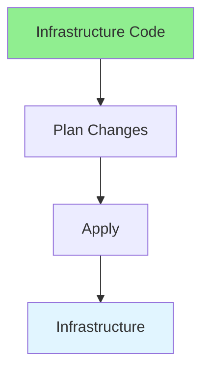

# 17.03 Infrastructure as Code / Infrastructure as Code

## Table of Contents / Mục lục
1. [Introduction / Giới thiệu](#introduction--giới-thiệu)
2. [IaC Tools / Công cụ IaC](#iac-tools--công-cụ-iac)
3. [Best Practices / Thực hành tốt nhất](#best-practices--thực-hành-tốt-nhất)
4. [Summary / Tóm tắt](#summary--tóm-tắt)

---

## Introduction / Giới thiệu

### Overview / Tổng quan

**English**: Infrastructure as Code manages infrastructure through code. Learn to use Terraform, CloudFormation, and other IaC tools.

**Vietnamese**: Infrastructure as Code quản lý hạ tầng qua code. Học cách sử dụng Terraform, CloudFormation và các công cụ IaC khác.

### Infrastructure as Code Flow / Luồng Infrastructure as Code



---

## IaC Tools / Công cụ IaC

### Example 1: Terraform / Ví dụ 1: Terraform

```hcl
# Terraform / Terraform
terraform {
  required_providers {
    aws = {
      source  = "hashicorp/aws"
      version = "~> 4.0"
    }
  }
}

resource "aws_instance" "app_server" {
  ami           = "ami-0c55b159cbfafe1f0"
  instance_type = "t2.micro"
  
  tags = {
    Name = "AppServer"
  }
}
```

---

## Best Practices / Thực hành tốt nhất

1. **Version control** - Track infrastructure code
2. **Modular** - Reusable modules
3. **Test** - Test infrastructure changes
4. **Document** - Document infrastructure
5. **Review** - Review infrastructure changes

---

## Summary / Tóm tắt

### Key Takeaways / Điểm chính

- **Code**: Infrastructure defined as code
- **Version control**: Track changes
- **Tools**: Terraform, CloudFormation
- **Benefits**: Reproducible, testable

### Next Steps / Bước tiếp theo

- [17.04 Container Orchestration](./17.04_Container_Orchestration.md) - Next: Container Orchestration

---

**Last Updated / Cập nhật lần cuối**: 2024

