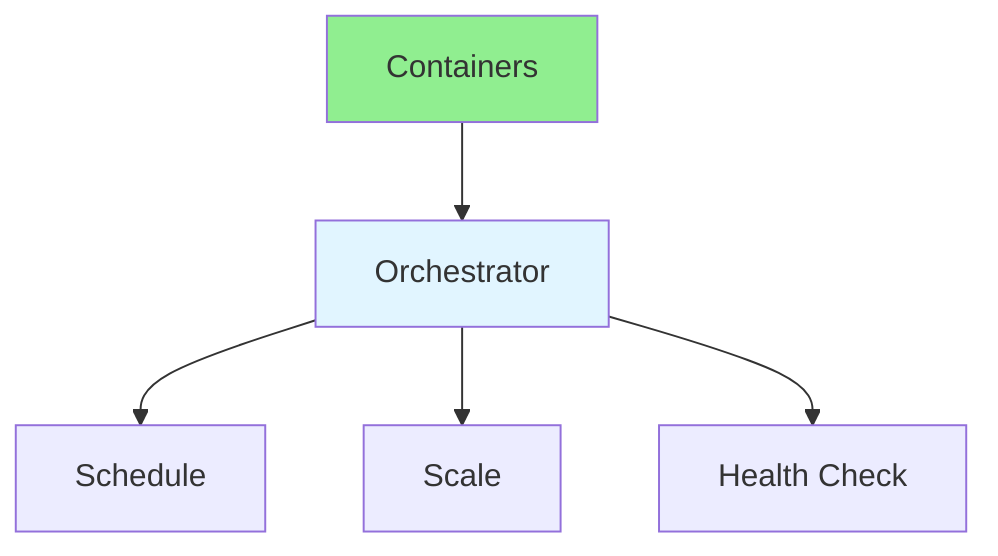
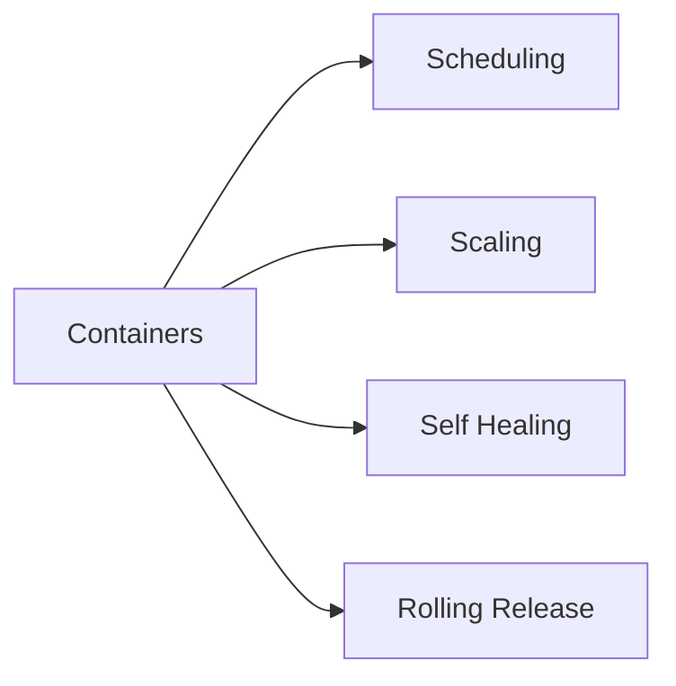

# 17.04 Container Orchestration / Điều phối container

## Table of Contents / Mục lục
1. [Introduction / Giới thiệu](#introduction--giới-thiệu)
2. [Orchestration Tools / Công cụ điều phối](#orchestration-tools--công-cụ-điều-phối)
3. [Use Cases / Trường hợp sử dụng](#use-cases--trường-hợp-sử-dụng)
4. [Release and Health Management / Quản lý release và health](#release-and-health-management--quản-lý-release-và-health)
5. [Best Practices / Thực hành tốt nhất](#best-practices--thực-hành-tốt-nhất)
6. [Summary / Tóm tắt](#summary--tóm-tắt)

---

## Introduction / Giới thiệu

### Overview / Tổng quan

**English**: Container orchestration manages containers at scale. Learn Kubernetes basics, Docker Compose, and container management.

**Vietnamese**: Điều phối container quản lý container ở quy mô lớn. Học cơ bản Kubernetes, Docker Compose và quản lý container.

### Container Orchestration Flow / Luồng điều phối container



---

## Orchestration Tools / Công cụ điều phối

### Example 1: Kubernetes Deployment / Ví dụ 1: Kubernetes Deployment

```yaml
# Kubernetes deployment / Kubernetes deployment
apiVersion: apps/v1
kind: Deployment
metadata:
  name: app-deployment
spec:
  replicas: 3
  selector:
    matchLabels:
      app: myapp
  template:
    metadata:
      labels:
        app: myapp
    spec:
      containers:
      - name: app
        image: myapp:latest
        ports:
        - containerPort: 3000
        resources:
          requests:
            memory: "256Mi"
            cpu: "250m"
          limits:
            memory: "512Mi"
            cpu: "500m"
```

### Example 2: Docker Compose As Simple Orchestration / Ví dụ 2: Docker Compose như điều phối đơn giản

```yaml
services:
  web:
    image: my-web:latest
    ports:
      - "3000:3000"
    depends_on:
      - api

  api:
    image: my-api:latest
    ports:
      - "4000:4000"
    depends_on:
      - db

  db:
    image: postgres:16
```

---

## Use Cases / Trường hợp sử dụng

### When To Use What / Khi nào dùng gì

- Docker Compose: local development, small server setups, simpler staging systems
- Kubernetes: multi-service systems, autoscaling, stronger resilience, larger teams
- managed container platforms: faster operations with less cluster management burden

### Orchestration Goals / Mục tiêu của orchestration



---

## Release and Health Management / Quản lý release và health

### Example 3: Readiness and Liveness / Ví dụ 3: Readiness và Liveness

```yaml
livenessProbe:
  httpGet:
    path: /health
    port: 3000

readinessProbe:
  httpGet:
    path: /ready
    port: 3000
```

### Example 4: Rolling Update / Ví dụ 4: Rolling update

```yaml
strategy:
  type: RollingUpdate
  rollingUpdate:
    maxUnavailable: 1
    maxSurge: 1
```

---

## Best Practices / Thực hành tốt nhất

1. **Resource limits** - Set CPU and memory limits
2. **Health checks** - Liveness and readiness probes
3. **Scaling** - Horizontal pod autoscaling
4. **Rolling updates** - Zero-downtime updates
5. **Monitoring** - Monitor pod health
6. **Choose the simplest tool that fits** - Not every project needs Kubernetes
7. **Separate app and state** - Databases need extra care outside normal container lifecycle
8. **Design for restarts** - Containers will be replaced and rescheduled

---

## Summary / Tóm tắt

### Key Takeaways / Điểm chính

- **Orchestration**: Manage containers
- **Scaling**: Auto-scaling
- **Health**: Health checks
- **Tools**: Kubernetes, Docker Swarm
- **Release control**: Rolling updates reduce downtime
- **Tool choice**: Start simple and grow only when needed

### Next Steps / Bước tiếp theo

- [17.05 Monitoring & Logging](./17.05_Monitoring_Logging.md) - Next: Monitoring & Logging

---

**Last Updated / Cập nhật lần cuối**: 2024

