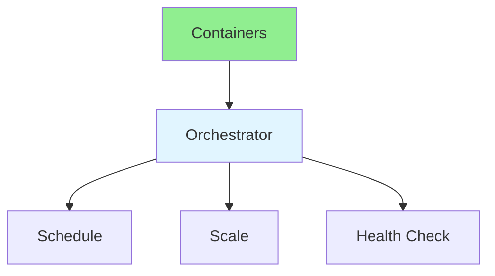

# 17.04 Container Orchestration / Điều phối container

## Table of Contents / Mục lục
1. [Introduction / Giới thiệu](#introduction--giới-thiệu)
2. [Orchestration Tools / Công cụ điều phối](#orchestration-tools--công-cụ-điều-phối)
3. [Best Practices / Thực hành tốt nhất](#best-practices--thực-hành-tốt-nhất)
4. [Summary / Tóm tắt](#summary--tóm-tắt)

---

## Introduction / Giới thiệu

### Overview / Tổng quan

**English**: Container orchestration manages containers at scale. Learn Kubernetes basics, Docker Compose, and container management.

**Vietnamese**: Điều phối container quản lý container ở quy mô lớn. Học cơ bản Kubernetes, Docker Compose và quản lý container.

### Container Orchestration Flow / Luồng điều phối container



---

## Orchestration Tools / Công cụ điều phối

### Example 1: Kubernetes Deployment / Ví dụ 1: Kubernetes Deployment

```yaml
# Kubernetes deployment / Kubernetes deployment
apiVersion: apps/v1
kind: Deployment
metadata:
  name: app-deployment
spec:
  replicas: 3
  selector:
    matchLabels:
      app: myapp
  template:
    metadata:
      labels:
        app: myapp
    spec:
      containers:
      - name: app
        image: myapp:latest
        ports:
        - containerPort: 3000
        resources:
          requests:
            memory: "256Mi"
            cpu: "250m"
          limits:
            memory: "512Mi"
            cpu: "500m"
```

---

## Best Practices / Thực hành tốt nhất

1. **Resource limits** - Set CPU and memory limits
2. **Health checks** - Liveness and readiness probes
3. **Scaling** - Horizontal pod autoscaling
4. **Rolling updates** - Zero-downtime updates
5. **Monitoring** - Monitor pod health

---

## Summary / Tóm tắt

### Key Takeaways / Điểm chính

- **Orchestration**: Manage containers
- **Scaling**: Auto-scaling
- **Health**: Health checks
- **Tools**: Kubernetes, Docker Swarm

### Next Steps / Bước tiếp theo

- [17.05 Monitoring & Logging](./17.05_Monitoring_Logging.md) - Next: Monitoring & Logging

---

**Last Updated / Cập nhật lần cuối**: 2024


