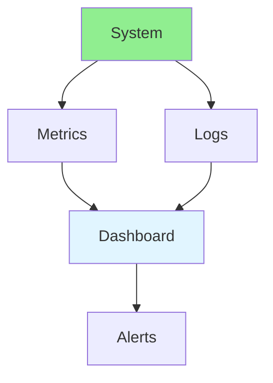

# 17.05 Monitoring & Logging / Giám sát & Ghi log

## Table of Contents / Mục lục
1. [Introduction / Giới thiệu](#introduction--giới-thiệu)
2. [Monitoring Setup / Thiết lập giám sát](#monitoring-setup--thiết-lập-giám-sát)
3. [Best Practices / Thực hành tốt nhất](#best-practices--thực-hành-tốt-nhất)
4. [Summary / Tóm tắt](#summary--tóm-tắt)

---

## Introduction / Giới thiệu

### Overview / Tổng quan

**English**: Monitoring and logging provide system visibility. Learn to set up monitoring, collect logs, and create dashboards.

**Vietnamese**: Giám sát và ghi log cung cấp khả năng hiển thị hệ thống. Học cách thiết lập giám sát, thu thập logs và tạo dashboard.

### Monitoring & Logging Flow / Luồng giám sát & ghi log



---

## Monitoring Setup / Thiết lập giám sát

### Example 1: Monitoring Setup / Ví dụ 1: Thiết lập giám sát

```typescript
// Monitoring setup / Thiết lập giám sát
import { PrometheusClient } from 'prometheus-client';
import winston from 'winston';

// Metrics / Metrics
const httpRequests = new PrometheusClient.Counter({
  name: 'http_requests_total',
  help: 'Total HTTP requests'
});

// Logging / Logging
const logger = winston.createLogger({
  level: 'info',
  format: winston.format.json(),
  transports: [
    new winston.transports.File({ filename: 'error.log', level: 'error' }),
    new winston.transports.File({ filename: 'combined.log' })
  ]
});

// Track request / Theo dõi request
function handleRequest(req: any, res: any) {
  httpRequests.inc();
  logger.info('Request received', { method: req.method, path: req.path });
}
```

---

## Best Practices / Thực hành tốt nhất

1. **Comprehensive monitoring** - Metrics, logs, traces
2. **Centralized logging** - Aggregate logs
3. **Dashboards** - Visualize data
4. **Alerts** - Set up alerts
5. **Retention** - Keep data appropriately

---

## Summary / Tóm tắt

### Key Takeaways / Điểm chính

- **Metrics**: Quantitative measurements
- **Logs**: Event records
- **Dashboards**: Visual representation
- **Alerts**: Proactive notifications

### Next Steps / Bước tiếp theo

- [17.06 Configuration Management](./17.06_Configuration_Management.md) - Next: Configuration Management

---

**Last Updated / Cập nhật lần cuối**: 2024


