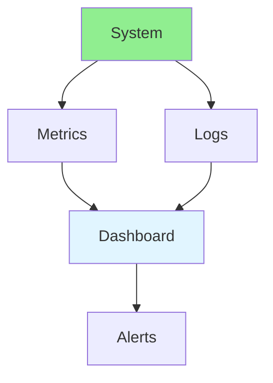
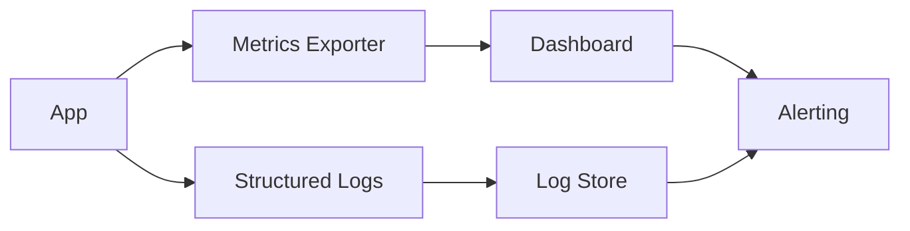

# 17.05 Monitoring & Logging / Giám sát & Ghi log

## Table of Contents / Mục lục
1. [Introduction / Giới thiệu](#introduction--giới-thiệu)
2. [Monitoring Setup / Thiết lập giám sát](#monitoring-setup--thiết-lập-giám-sát)
3. [Log Design / Thiết kế log](#log-design--thiết-kế-log)
4. [Dashboards and Alerts / Dashboard và cảnh báo](#dashboards-and-alerts--dashboard-và-cảnh-báo)
5. [Best Practices / Thực hành tốt nhất](#best-practices--thực-hành-tốt-nhất)
6. [Summary / Tóm tắt](#summary--tóm-tắt)

---

## Introduction / Giới thiệu

### Overview / Tổng quan

**English**: Monitoring and logging provide system visibility. Learn to set up monitoring, collect logs, and create dashboards.

**Vietnamese**: Giám sát và ghi log cung cấp khả năng hiển thị hệ thống. Học cách thiết lập giám sát, thu thập logs và tạo dashboard.

### Monitoring & Logging Flow / Luồng giám sát & ghi log



---

## Monitoring Setup / Thiết lập giám sát

### Example 1: Monitoring Setup / Ví dụ 1: Thiết lập giám sát

```typescript
// Monitoring setup / Thiết lập giám sát
import { PrometheusClient } from 'prometheus-client';
import winston from 'winston';

// Metrics / Metrics
const httpRequests = new PrometheusClient.Counter({
  name: 'http_requests_total',
  help: 'Total HTTP requests'
});

// Logging / Logging
const logger = winston.createLogger({
  level: 'info',
  format: winston.format.json(),
  transports: [
    new winston.transports.File({ filename: 'error.log', level: 'error' }),
    new winston.transports.File({ filename: 'combined.log' })
  ]
});

// Track request / Theo dõi request
function handleRequest(req: any, res: any) {
  httpRequests.inc();
  logger.info('Request received', { method: req.method, path: req.path });
}
```

### Example 2: Structured Log Example / Ví dụ 2: Ví dụ log có cấu trúc

```json
{
  "level": "info",
  "message": "request_complete",
  "service": "api",
  "method": "GET",
  "path": "/users/42",
  "status": 200,
  "durationMs": 42.8,
  "requestId": "req_123"
}
```

### Monitoring Pipeline / Pipeline giám sát



---

## Log Design / Thiết kế log

### What Good Logs Include / Log tốt cần có gì

- timestamp
- level
- service name
- request or trace id
- key business context
- error message and stack when relevant

### What To Avoid / Cần tránh gì

- logging secrets
- unbounded payload dumps
- logs without identifiers
- duplicate logs at every layer

---

## Dashboards and Alerts / Dashboard và cảnh báo

### Useful Dashboards / Dashboard hữu ích

- request rate and latency
- error rate
- database health
- background job health
- deployment timeline

### Example 3: Alert Conditions / Ví dụ 3: Điều kiện cảnh báo

- API 5xx rate above threshold
- average or p95 latency rising sharply
- service health check failing
- disk or memory saturation
- queue backlog not draining

### Example 4: Operational Triage / Ví dụ 4: Điều tra vận hành

1. Check current alerts.
2. Check dashboards for blast radius.
3. Inspect recent deploys.
4. Correlate logs with metrics.
5. Roll back or mitigate first, then optimize.

---

## Best Practices / Thực hành tốt nhất

1. **Comprehensive monitoring** - Metrics, logs, traces
2. **Centralized logging** - Aggregate logs
3. **Dashboards** - Visualize data
4. **Alerts** - Set up alerts
5. **Retention** - Keep data appropriately
6. **Use structured logs** - Better search and correlation
7. **Add request identifiers** - Trace incidents across services
8. **Monitor for action** - Collect signals you will actually use

---

## Summary / Tóm tắt

### Key Takeaways / Điểm chính

- **Metrics**: Quantitative measurements
- **Logs**: Event records
- **Dashboards**: Visual representation
- **Alerts**: Proactive notifications
- **Structure**: Good logs are searchable and correlated
- **Operations**: Dashboards and triage flow reduce outage time

### Next Steps / Bước tiếp theo

- [17.06 Configuration Management](./17.06_Configuration_Management.md) - Next: Configuration Management

---

**Last Updated / Cập nhật lần cuối**: 2024

