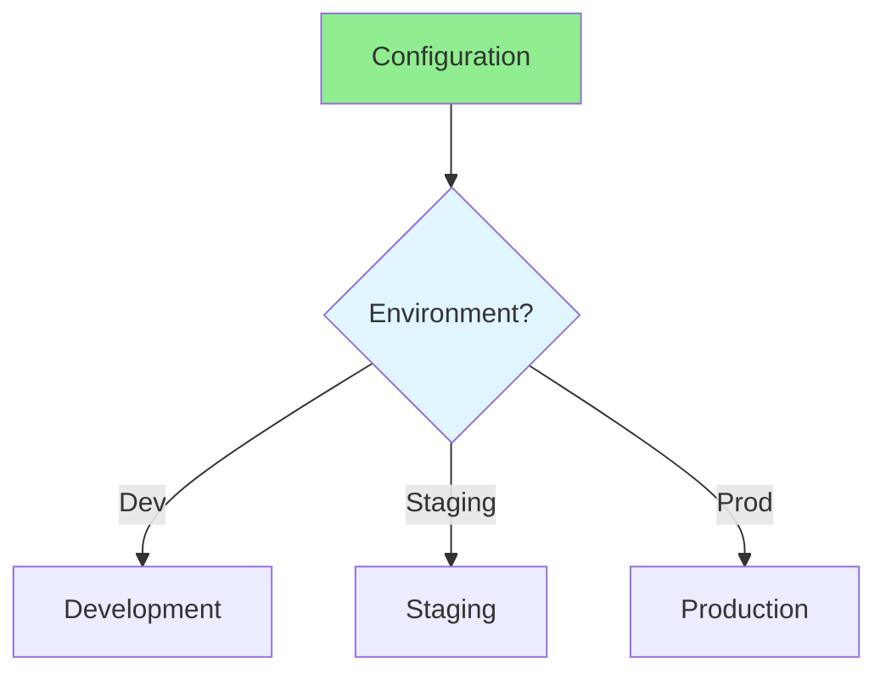

# 17.06 Configuration Management / Quản lý cấu hình

## Table of Contents / Mục lục
1. [Introduction / Giới thiệu](#introduction--giới-thiệu)
2. [Configuration Strategies / Chiến lược cấu hình](#configuration-strategies--chiến-lược-cấu-hình)
3. [Best Practices / Thực hành tốt nhất](#best-practices--thực-hành-tốt-nhất)
4. [Summary / Tóm tắt](#summary--tóm-tắt)

---

## Introduction / Giới thiệu

### Overview / Tổng quan

**English**: Configuration management handles application settings. Learn to manage configurations across environments securely.

**Vietnamese**: Quản lý cấu hình xử lý cài đặt ứng dụng. Học cách quản lý cấu hình giữa các môi trường một cách an toàn.

### Configuration Management Flow / Luồng quản lý cấu hình



---

## Configuration Strategies / Chiến lược cấu hình

### Example 1: Configuration Management / Ví dụ 1: Quản lý cấu hình

```typescript
// Configuration management / Quản lý cấu hình
interface Config {
  database: {
    host: string;
    port: number;
    name: string;
  };
  api: {
    baseUrl: string;
    timeout: number;
  };
}

// Environment-based config / Cấu hình theo môi trường
const config = {
  development: {
    database: { host: 'localhost', port: 5432, name: 'dev_db' },
    api: { baseUrl: 'http://localhost:3000', timeout: 5000 }
  },
  production: {
    database: { host: process.env.DB_HOST, port: 5432, name: process.env.DB_NAME },
    api: { baseUrl: process.env.API_URL, timeout: 10000 }
  }
};

// Use config / Sử dụng cấu hình
const env = process.env.NODE_ENV || 'development';
const appConfig = config[env];
```

---

## Best Practices / Thực hành tốt nhất

1. **Environment variables** - Use for secrets
2. **Separate configs** - Different per environment
3. **Version control** - Track config changes
4. **Secrets management** - Use secret managers
5. **Validation** - Validate configurations

---

## Summary / Tóm tắt

### Key Takeaways / Điểm chính

- **Environments**: Separate configs
- **Secrets**: Secure management
- **Version control**: Track changes
- **Validation**: Validate configs

### Next Steps / Bước tiếp theo

- [17.07 Deployment Strategies](./17.07_Deployment_Strategies.md) - Next: Deployment Strategies

---

**Last Updated / Cập nhật lần cuối**: 2024

