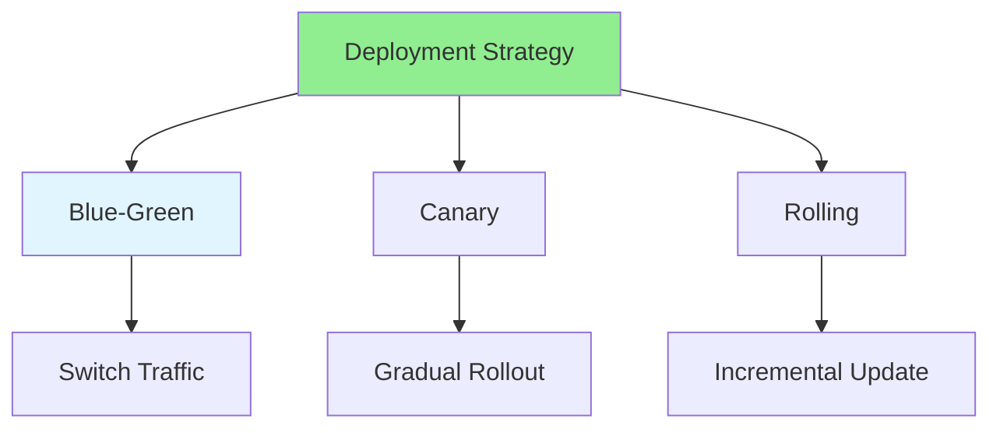

# 17.07 Deployment Strategies / Chiến lược triển khai

## Table of Contents / Mục lục
1. [Introduction / Giới thiệu](#introduction--giới-thiệu)
2. [Deployment Types / Loại triển khai](#deployment-types--loại-triển-khai)
3. [Best Practices / Thực hành tốt nhất](#best-practices--thực-hành-tốt-nhất)
4. [Summary / Tóm tắt](#summary--tóm-tắt)

---

## Introduction / Giới thiệu

### Overview / Tổng quan

**English**: Deployment strategies determine how applications are released. Learn blue-green, canary, and rolling deployment strategies.

**Vietnamese**: Chiến lược triển khai xác định cách ứng dụng được phát hành. Học chiến lược blue-green, canary và rolling deployment.

### Deployment Strategies / Chiến lược triển khai



---

## Deployment Types / Loại triển khai

### Example 1: Deployment Strategies / Ví dụ 1: Chiến lược triển khai

```typescript
// Deployment strategies / Chiến lược triển khai
enum DeploymentStrategy {
  BLUE_GREEN = 'blue-green', // Switch between versions / Chuyển đổi giữa các phiên bản
  CANARY = 'canary', // Gradual rollout / Triển khai dần dần
  ROLLING = 'rolling' // Incremental update / Cập nhật tăng dần
}

// Blue-green deployment / Triển khai blue-green
function blueGreenDeploy(newVersion: string) {
  // Deploy new version to green / Triển khai phiên bản mới lên green
  deployToGreen(newVersion);
  // Test green / Kiểm thử green
  testGreen();
  // Switch traffic / Chuyển traffic
  switchTrafficToGreen();
  // Keep blue for rollback / Giữ blue để rollback
}

// Canary deployment / Triển khai canary
function canaryDeploy(newVersion: string) {
  // Deploy to small percentage / Triển khai đến phần trăm nhỏ
  deployToPercentage(newVersion, 10);
  // Monitor / Giám sát
  monitor();
  // Gradually increase / Tăng dần
  increasePercentage(newVersion, 50);
  monitor();
  increasePercentage(newVersion, 100);
}
```

---

## Best Practices / Thực hành tốt nhất

1. **Zero downtime** - Minimize downtime
2. **Rollback plan** - Quick rollback capability
3. **Monitoring** - Monitor during deployment
4. **Gradual rollout** - Deploy incrementally
5. **Testing** - Test before full rollout

---

## Summary / Tóm tắt

### Key Takeaways / Điểm chính

- **Blue-green**: Switch between versions
- **Canary**: Gradual rollout
- **Rolling**: Incremental update
- **Zero downtime**: Minimize disruption

### Next Steps / Bước tiếp theo

- [17.08 Version Control Advanced](./17.08_Version_Control_Advanced.md) - Next: Version Control Advanced

---

**Last Updated / Cập nhật lần cuối**: 2024


