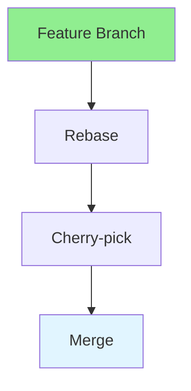

# 17.08 Version Control Advanced / Kiểm soát phiên bản nâng cao

## Table of Contents / Mục lục
1. [Introduction / Giới thiệu](#introduction--giới-thiệu)
2. [Advanced Git / Git nâng cao](#advanced-git--git-nâng-cao)
3. [Best Practices / Thực hành tốt nhất](#best-practices--thực-hành-tốt-nhất)
4. [Summary / Tóm tắt](#summary--tóm-tắt)

---

## Introduction / Giới thiệu

### Overview / Tổng quan

**English**: Advanced Git skills improve workflow efficiency. Learn rebasing, cherry-picking, and advanced Git techniques.

**Vietnamese**: Kỹ năng Git nâng cao cải thiện hiệu quả workflow. Học rebasing, cherry-picking và kỹ thuật Git nâng cao.

### Advanced Git Flow / Luồng Git nâng cao



---

## Advanced Git / Git nâng cao

### Example 1: Advanced Git / Ví dụ 1: Git nâng cao

```bash
# Rebase / Rebase
git checkout feature-branch
git rebase main

# Interactive rebase / Rebase tương tác
git rebase -i HEAD~3

# Cherry-pick / Cherry-pick
git cherry-pick <commit-hash>

# Stash / Stash
git stash
git stash pop

# Reflog / Reflog
git reflog
git reset --hard HEAD@{1}
```

---

## Best Practices / Thực hành tốt nhất

1. **Rebase before merge** - Keep history clean
2. **Use reflog** - Recover lost commits
3. **Cherry-pick carefully** - Select commits wisely
4. **Stash changes** - Save work in progress
5. **Clean history** - Maintain readable history

---

## Summary / Tóm tắt

### Key Takeaways / Điểm chính

- **Rebase**: Clean history
- **Cherry-pick**: Select commits
- **Reflog**: Recover commits
- **Stash**: Save changes

### Next Steps / Bước tiếp theo

- [17.09 Environment Management](./17.09_Environment_Management.md) - Next: Environment Management

---

**Last Updated / Cập nhật lần cuối**: 2024


