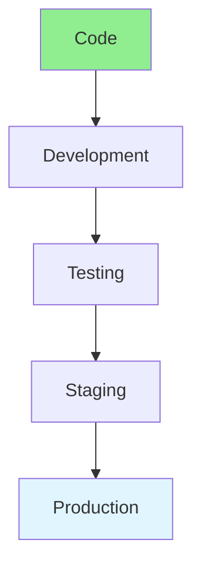
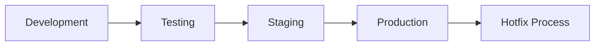

# 17.09 Environment Management / Quản lý môi trường

## Table of Contents / Mục lục
1. [Introduction / Giới thiệu](#introduction--giới-thiệu)
2. [Environment Types / Loại môi trường](#environment-types--loại-môi-trường)
3. [Configuration Strategy / Chiến lược cấu hình](#configuration-strategy--chiến-lược-cấu-hình)
4. [Promotion Flow / Luồng promotion](#promotion-flow--luồng-promotion)
5. [Best Practices / Thực hành tốt nhất](#best-practices--thực-hành-tốt-nhất)
6. [Summary / Tóm tắt](#summary--tóm-tắt)

---

## Introduction / Giới thiệu

### Overview / Tổng quan

**English**: Environment management ensures consistent deployments. Learn to manage development, staging, and production environments.

**Vietnamese**: Quản lý môi trường đảm bảo triển khai nhất quán. Học cách quản lý môi trường development, staging và production.

### Environment Management Flow / Luồng quản lý môi trường



---

## Environment Types / Loại môi trường

### Example 1: Environment Management / Ví dụ 1: Quản lý môi trường

```typescript
// Environment management / Quản lý môi trường
enum Environment {
  DEVELOPMENT = 'development',
  STAGING = 'staging',
  PRODUCTION = 'production'
}

// Environment configuration / Cấu hình môi trường
const environments = {
  development: {
    database: 'dev_db',
    apiUrl: 'http://localhost:3000',
    logLevel: 'debug'
  },
  staging: {
    database: 'staging_db',
    apiUrl: 'https://staging.api.com',
    logLevel: 'info'
  },
  production: {
    database: 'prod_db',
    apiUrl: 'https://api.com',
    logLevel: 'error'
  }
};

// Get config / Lấy cấu hình
function getConfig(env: Environment) {
  return environments[env];
}
```

### Environment Flow / Luồng môi trường



---

## Configuration Strategy / Chiến lược cấu hình

### What Should Vary / Những gì nên khác nhau

- database endpoints
- API base URLs
- secrets
- logging level
- feature flags
- external service credentials

### What Should Stay Consistent / Những gì nên nhất quán

- application behavior
- schema expectations
- deployment process shape

---

## Promotion Flow / Luồng promotion

### Good Promotion Practice / Thực hành promotion tốt

- validate in development
- verify integration in staging
- promote tested artifact to production
- avoid environment-only manual tweaks

### Example 2: Environment Variables / Ví dụ 2: Biến môi trường

```bash
NODE_ENV=production
DATABASE_URL=postgresql://app:secret@db:5432/app
REDIS_URL=redis://redis:6379
LOG_LEVEL=info
```

---

## Best Practices / Thực hành tốt nhất

1. **Separate environments** - Isolate environments
2. **Consistent setup** - Same configuration
3. **Environment variables** - Use for differences
4. **Access control** - Restrict production access
5. **Documentation** - Document environment setup
6. **Promote tested artifacts** - Reduce environment drift
7. **Keep secrets out of code** - Use secret stores or secured runtime injection
8. **Minimize special cases** - Production should not be a snowflake

---

## Summary / Tóm tắt

### Key Takeaways / Điểm chính

- **Environments**: Dev, staging, production
- **Isolation**: Separate environments
- **Configuration**: Environment-specific
- **Access**: Control access
- **Promotion**: Safer release flow depends on clear environment progression
- **Consistency**: Differences should be deliberate, minimal, and documented

### Next Steps / Bước tiếp theo

- [17.10 Automation Scripts](./17.10_Automation_Scripts.md) - Next: Automation Scripts

---

**Last Updated / Cập nhật lần cuối**: 2024

