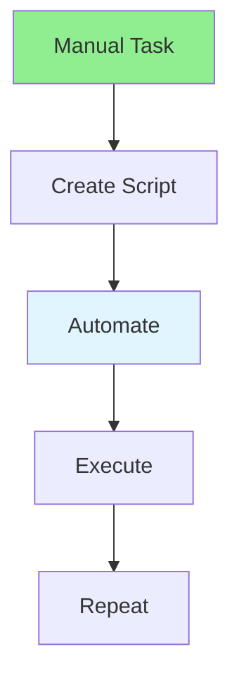

# 17.10 Automation Scripts / Script tự động hóa

## Table of Contents / Mục lục
1. [Introduction / Giới thiệu](#introduction--giới-thiệu)
2. [Script Types / Loại script](#script-types--loại-script)
3. [Best Practices / Thực hành tốt nhất](#best-practices--thực-hành-tốt-nhất)
4. [Summary / Tóm tắt](#summary--tóm-tắt)

---

## Introduction / Giới thiệu

### Overview / Tổng quan

**English**: Automation scripts reduce manual work. Learn to write scripts for deployment, testing, and maintenance tasks.

**Vietnamese**: Script tự động hóa giảm công việc thủ công. Học cách viết script cho deployment, testing và tác vụ bảo trì.

### Automation Scripts Flow / Luồng script tự động hóa



---

## Script Types / Loại script

### Example 1: Automation Scripts / Ví dụ 1: Script tự động hóa

```bash
#!/bin/bash
# Deployment script / Script deployment

set -e # Exit on error / Thoát khi lỗi

echo "Building application..."
npm run build

echo "Running tests..."
npm test

echo "Deploying to production..."
npm run deploy

echo "Deployment complete!"
```

```typescript
// TypeScript automation script / Script tự động hóa TypeScript
import { execSync } from 'child_process';

function deploy() {
  try {
    console.log('Building...');
    execSync('npm run build', { stdio: 'inherit' });
    
    console.log('Testing...');
    execSync('npm test', { stdio: 'inherit' });
    
    console.log('Deploying...');
    execSync('npm run deploy', { stdio: 'inherit' });
    
    console.log('Deployment successful!');
  } catch (error) {
    console.error('Deployment failed:', error);
    process.exit(1);
  }
}

deploy();
```

---

## Best Practices / Thực hành tốt nhất

1. **Idempotent** - Safe to run multiple times
2. **Error handling** - Handle errors gracefully
3. **Logging** - Log operations
4. **Documentation** - Document scripts
5. **Testing** - Test scripts

---

## Summary / Tóm tắt

### Key Takeaways / Điểm chính

- **Automation**: Reduce manual work
- **Scripts**: Bash, Node.js, Python
- **Error handling**: Graceful failures
- **Documentation**: Document scripts

### Next Steps / Bước tiếp theo

- [17.11 Low-Code Platforms](./17.11_Low_Code_Platforms.md) - Next: Low-Code Platforms

---

**Last Updated / Cập nhật lần cuối**: 2024


