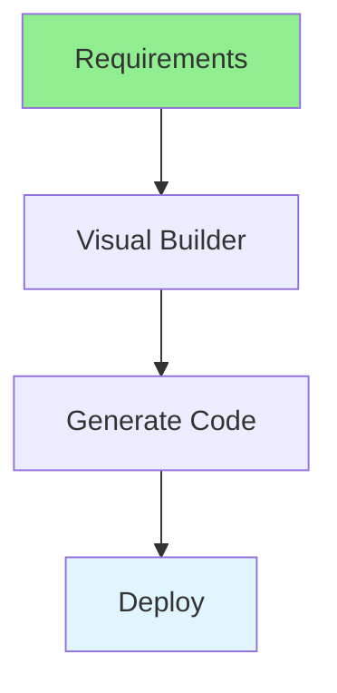

# 17.11 Low-Code Platforms / Nền tảng Low-Code

## Table of Contents / Mục lục
1. [Introduction / Giới thiệu](#introduction--giới-thiệu)
2. [Low-Code Concepts / Khái niệm Low-Code](#low-code-concepts--khái-niệm-low-code)
3. [Best Practices / Thực hành tốt nhất](#best-practices--thực-hành-tốt-nhất)
4. [Summary / Tóm tắt](#summary--tóm-tắt)

---

## Introduction / Giới thiệu

### Overview / Tổng quan

**English**: Low-code platforms enable rapid application development. Learn to use low-code tools for building applications quickly.

**Vietnamese**: Nền tảng low-code cho phép phát triển ứng dụng nhanh. Học cách sử dụng công cụ low-code để xây dựng ứng dụng nhanh chóng.

### Low-Code Flow / Luồng Low-Code



---

## Low-Code Concepts / Khái niệm Low-Code

### Example 1: Low-Code Platforms / Ví dụ 1: Nền tảng Low-Code

```typescript
// Low-code platform features / Tính năng nền tảng low-code
const lowCodeFeatures = {
  visualBuilder: 'Drag-and-drop interface',
  prebuiltComponents: 'Ready-to-use components',
  workflowAutomation: 'Automate business processes',
  integration: 'Connect to external services',
  rapidDevelopment: 'Faster than traditional coding'
};

// Low-code vs traditional / Low-code vs truyền thống
const comparison = {
  lowCode: {
    speed: 'Fast development',
    skill: 'Less coding required',
    flexibility: 'Limited customization'
  },
  traditional: {
    speed: 'Slower development',
    skill: 'Full coding required',
    flexibility: 'Full customization'
  }
};
```

---

## Best Practices / Thực hành tốt nhất

1. **Choose wisely** - Select appropriate platform
2. **Understand limits** - Know platform constraints
3. **Custom code** - Use when needed
4. **Maintainability** - Consider long-term
5. **Training** - Train team on platform

---

## Summary / Tóm tắt

### Key Takeaways / Điểm chính

- **Speed**: Rapid development
- **Visual**: Drag-and-drop
- **Components**: Pre-built
- **Limits**: Platform constraints

### Next Steps / Bước tiếp theo

- [17.12 AI Automation Tools](./17.12_AI_Automation_Tools.md) - Next: AI Automation Tools

---

**Last Updated / Cập nhật lần cuối**: 2024


