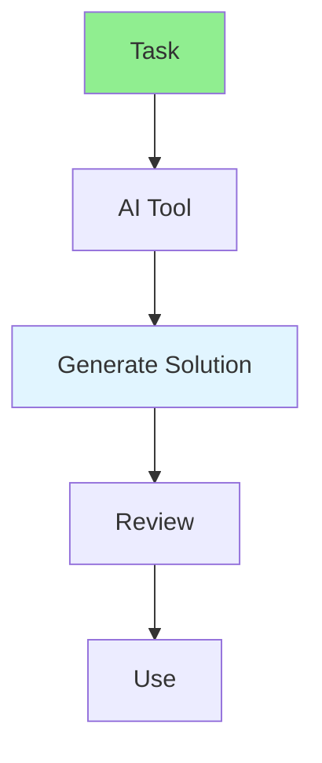

# 17.12 AI Automation Tools / Công cụ tự động hóa AI

## Table of Contents / Mục lục
1. [Introduction / Giới thiệu](#introduction--giới-thiệu)
2. [AI Tools / Công cụ AI](#ai-tools--công-cụ-ai)
3. [Best Practices / Thực hành tốt nhất](#best-practices--thực-hành-tốt-nhất)
4. [Summary / Tóm tắt](#summary--tóm-tắt)

---

## Introduction / Giới thiệu

### Overview / Tổng quan

**English**: AI automation tools enhance development productivity. Learn to use AI tools for code generation, testing, and automation.

**Vietnamese**: Công cụ tự động hóa AI tăng cường năng suất phát triển. Học cách sử dụng công cụ AI cho tạo code, testing và tự động hóa.

### AI Automation Flow / Luồng tự động hóa AI



---

## AI Tools / Công cụ AI

### Example 1: AI Automation Tools / Ví dụ 1: Công cụ tự động hóa AI

```typescript
// AI automation tools / Công cụ tự động hóa AI
const aiTools = {
  codeGeneration: {
    githubCopilot: 'Code suggestions and completion',
    chatgpt: 'Code generation and explanation',
    cursor: 'AI-powered IDE'
  },
  testing: {
    testGeneration: 'Generate test cases',
    bugDetection: 'Find bugs automatically'
  },
  automation: {
    workflowAutomation: 'Automate workflows',
    codeReview: 'AI-assisted code review'
  }
};

// Use AI for code generation / Sử dụng AI cho tạo code
// Example prompt / Ví dụ prompt
const prompt = `
Generate a TypeScript function that:
- Takes an array of users
- Filters active users
- Returns user names
`;

// AI generates / AI tạo
function getActiveUserNames(users: User[]): string[] {
  return users
    .filter(user => user.active)
    .map(user => user.name);
}
```

---

## Best Practices / Thực hành tốt nhất

1. **Review AI code** - Always review generated code
2. **Understand output** - Know what AI generates
3. **Iterate** - Refine prompts
4. **Combine** - Use AI with human judgment
5. **Security** - Be careful with sensitive data

---

## Summary / Tóm tắt

### Key Takeaways / Điểm chính

- **Code generation**: AI-assisted coding
- **Testing**: AI test generation
- **Review**: Always review AI output
- **Security**: Handle sensitive data carefully

### Next Steps / Bước tiếp theo

- [17.13 Workflow Automation](./17.13_Workflow_Automation.md) - Next: Workflow Automation

---

**Last Updated / Cập nhật lần cuối**: 2024


