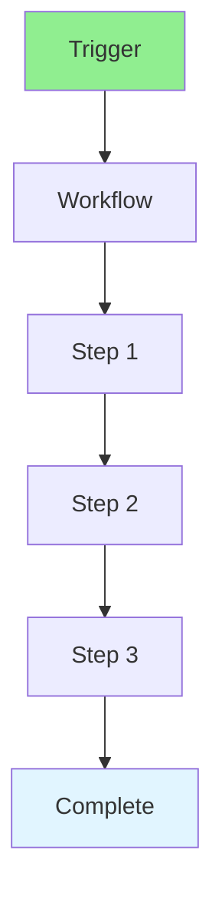

# 17.13 Workflow Automation / Tự động hóa quy trình

## Table of Contents / Mục lục
1. [Introduction / Giới thiệu](#introduction--giới-thiệu)
2. [Automation Tools / Công cụ tự động hóa](#automation-tools--công-cụ-tự-động-hóa)
3. [Best Practices / Thực hành tốt nhất](#best-practices--thực-hành-tốt-nhất)
4. [Summary / Tóm tắt](#summary--tóm-tắt)

---

## Introduction / Giới thiệu

### Overview / Tổng quan

**English**: Workflow automation streamlines processes. Learn to automate repetitive tasks, approvals, and workflows.

**Vietnamese**: Tự động hóa quy trình hợp lý hóa quy trình. Học cách tự động hóa tác vụ lặp lại, phê duyệt và quy trình.

### Workflow Automation Flow / Luồng tự động hóa quy trình



---

## Automation Tools / Công cụ tự động hóa

### Example 1: Workflow Automation / Ví dụ 1: Tự động hóa quy trình

```typescript
// Workflow automation / Tự động hóa quy trình
interface Workflow {
  name: string;
  steps: WorkflowStep[];
  triggers: Trigger[];
}

interface WorkflowStep {
  action: string;
  condition?: string;
  onSuccess?: string;
  onFailure?: string;
}

// Define workflow / Định nghĩa quy trình
const deploymentWorkflow: Workflow = {
  name: 'Deployment',
  triggers: [{ type: 'push', branch: 'main' }],
  steps: [
    { action: 'build', onSuccess: 'test' },
    { action: 'test', onSuccess: 'deploy', onFailure: 'notify' },
    { action: 'deploy', onSuccess: 'monitor' }
  ]
};
```

---

## Best Practices / Thực hành tốt nhất

1. **Identify repetitive tasks** - Find automation opportunities
2. **Start simple** - Automate one task at a time
3. **Test workflows** - Verify automation
4. **Monitor** - Track workflow execution
5. **Document** - Document workflows

---

## Summary / Tóm tắt

### Key Takeaways / Điểm chính

- **Automation**: Reduce manual work
- **Workflows**: Define processes
- **Triggers**: Event-driven
- **Monitoring**: Track execution

### Next Steps / Bước tiếp theo

- [17.14 Testing Automation](./17.14_Testing_Automation.md) - Next: Testing Automation

---

**Last Updated / Cập nhật lần cuối**: 2024

