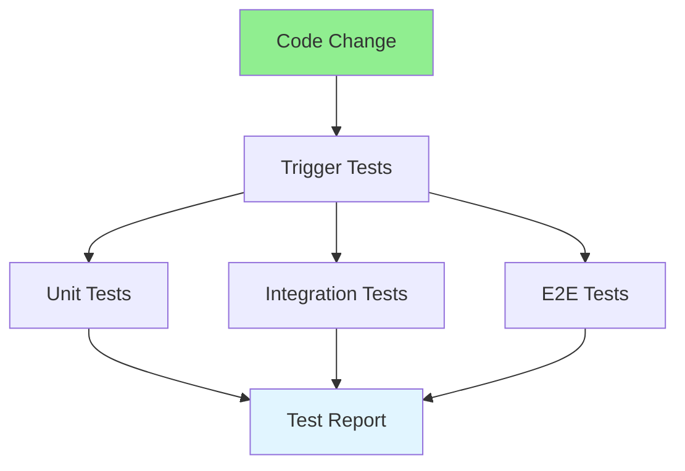

# 17.14 Testing Automation / Tự động hóa kiểm thử

## Table of Contents / Mục lục
1. [Introduction / Giới thiệu](#introduction--giới-thiệu)
2. [Automated Testing / Kiểm thử tự động](#automated-testing--kiểm-thử-tự-động)
3. [Best Practices / Thực hành tốt nhất](#best-practices--thực-hành-tốt-nhất)
4. [Summary / Tóm tắt](#summary--tóm-tắt)

---

## Introduction / Giới thiệu

### Overview / Tổng quan

**English**: Automated testing runs tests automatically. Learn to set up test automation, integrate with CI/CD, and maintain test suites.

**Vietnamese**: Kiểm thử tự động chạy tests tự động. Học cách thiết lập tự động hóa kiểm thử, tích hợp với CI/CD và duy trì test suites.

### Testing Automation Flow / Luồng tự động hóa kiểm thử



---

## Automated Testing / Kiểm thử tự động

### Example 1: Test Automation / Ví dụ 1: Tự động hóa kiểm thử

```typescript
// Test automation / Tự động hóa kiểm thử
// Jest configuration / Cấu hình Jest
module.exports = {
  testEnvironment: 'node',
  coverageThreshold: {
    global: {
      branches: 80,
      functions: 80,
      lines: 80,
      statements: 80
    }
  }
};

// Automated test / Test tự động
describe('UserService', () => {
  it('should create user', async () => {
    const user = await userService.create({ name: 'John', email: 'john@example.com' });
    expect(user).toBeDefined();
    expect(user.name).toBe('John');
  });
});

// CI/CD integration / Tích hợp CI/CD
// Runs automatically on push / Chạy tự động khi push
```

---

## Best Practices / Thực hành tốt nhất

1. **Automate all tests** - Unit, integration, E2E
2. **CI/CD integration** - Run in pipeline
3. **Fast feedback** - Quick test execution
4. **Maintain tests** - Keep tests updated
5. **Coverage** - Maintain good coverage

---

## Summary / Tóm tắt

### Key Takeaways / Điểm chính

- **Automation**: Run tests automatically
- **CI/CD**: Integrate with pipeline
- **Coverage**: Maintain test coverage
- **Speed**: Fast test execution

### Next Steps / Bước tiếp theo

- [17.15 DevOps Best Practices](./17.15_DevOps_Best_Practices.md) - Next: DevOps Best Practices

---

**Last Updated / Cập nhật lần cuối**: 2024

