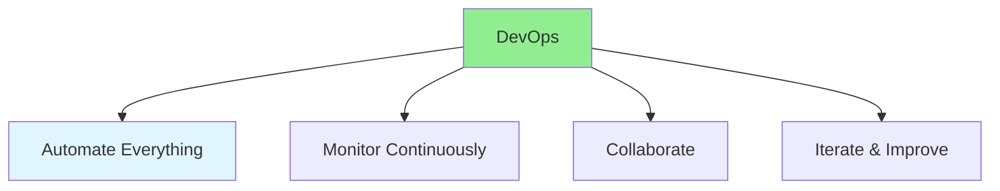

# 17.15 DevOps Best Practices / Thực hành tốt nhất DevOps

## Table of Contents / Mục lục
1. [Introduction / Giới thiệu](#introduction--giới-thiệu)
2. [DevOps Practices / Thực hành DevOps](#devops-practices--thực-hành-devops)
3. [Best Practices / Thực hành tốt nhất](#best-practices--thực-hành-tốt-nhất)
4. [Summary / Tóm tắt](#summary--tóm-tắt)

---

## Introduction / Giới thiệu

### Overview / Tổng quan

**English**: DevOps best practices improve software delivery. Learn proven practices for CI/CD, infrastructure, monitoring, and collaboration.

**Vietnamese**: Thực hành tốt nhất DevOps cải thiện giao phần mềm. Học thực hành đã được chứng minh cho CI/CD, hạ tầng, giám sát và cộng tác.

### DevOps Best Practices / Thực hành tốt nhất DevOps



---

## DevOps Practices / Thực hành DevOps

### Example 1: DevOps Best Practices / Ví dụ 1: Thực hành tốt nhất DevOps

```typescript
// DevOps best practices / Thực hành tốt nhất DevOps
const devOpsBestPractices = {
  automation: [
    'Automate builds',
    'Automate tests',
    'Automate deployments',
    'Automate infrastructure'
  ],
  monitoring: [
    'Monitor applications',
    'Monitor infrastructure',
    'Set up alerts',
    'Create dashboards'
  ],
  collaboration: [
    'Dev and Ops work together',
    'Share knowledge',
    'Cross-functional teams',
    'Open communication'
  ],
  continuousImprovement: [
    'Measure metrics',
    'Identify bottlenecks',
    'Optimize processes',
    'Iterate and improve'
  ]
};
```

---

## Best Practices / Thực hành tốt nhất

1. **Automate** - Automate repetitive tasks
2. **Monitor** - Continuous monitoring
3. **Collaborate** - Work together
4. **Measure** - Track metrics
5. **Improve** - Continuous improvement

---

## Summary / Tóm tắt

### Key Takeaways / Điểm chính

- **Automation**: Automate everything possible
- **Monitoring**: Continuous visibility
- **Collaboration**: Dev and Ops together
- **Improvement**: Iterate continuously

### Next Steps / Bước tiếp theo

- Complete Group 17: DevOps & Automation ✅
- All 17 groups complete! 🎉

---

**Last Updated / Cập nhật lần cuối**: 2024


