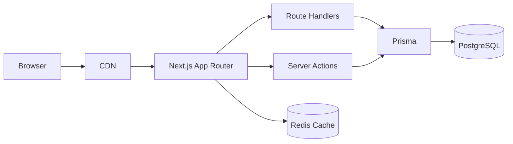
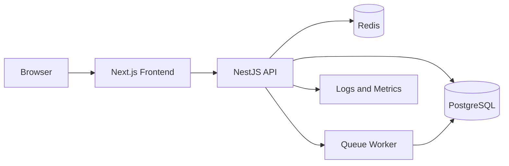
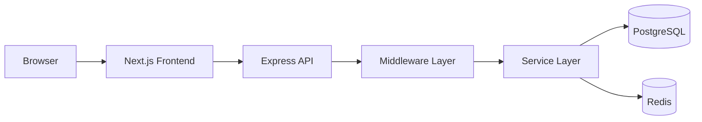
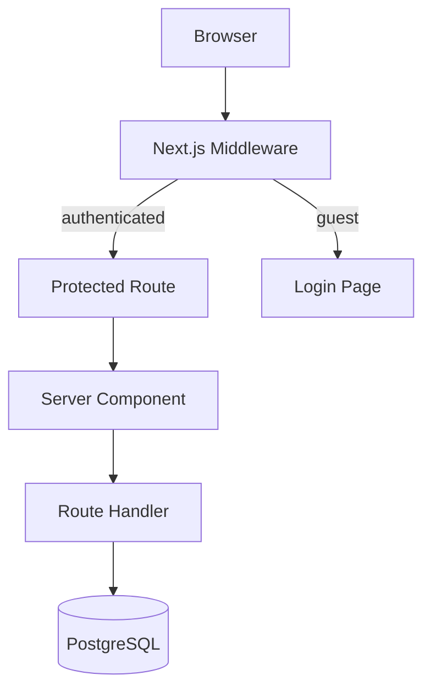
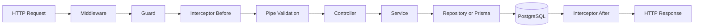
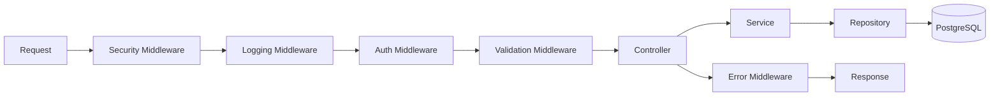
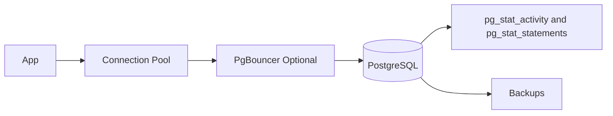
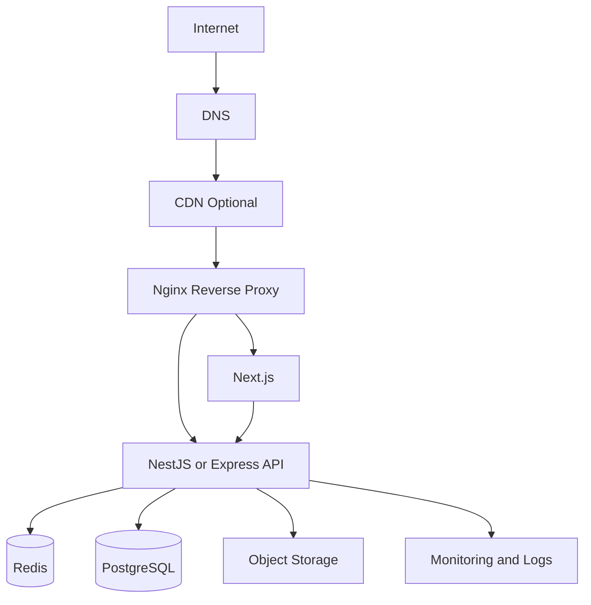
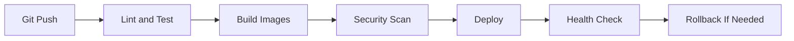

# Modern Full-Stack Research Roadmap 2026

## Overview

**English**: This guide turns the existing topic-based folder into a practical framework-focused roadmap for modern full-stack work with Next.js, NestJS, Express.js, PostgreSQL, and production servers.

**Vietnamese**: Hướng dẫn này chuyển bộ tài liệu hiện có từ dạng theo chủ đề sang lộ trình thực hành theo framework cho công việc full-stack hiện đại với Next.js, NestJS, Express.js, PostgreSQL và server production.

## Why This Guide Exists

The current `Full-Stack-Guides` folder is broad and useful, but it is mainly organized by concepts.

That works well for:

- junior onboarding
- foundational review
- topic lookup
- cross-functional learning

It is weaker for:

- building a real Next.js application using App Router
- building a structured NestJS backend
- building an Express.js production API
- running PostgreSQL safely in production
- deploying the whole stack on a real server

This document adds the missing bridge between theory and implementation.

## Recommended Stack Paths

### Path A: Fastest Product Delivery

- Next.js App Router
- PostgreSQL
- Prisma
- Redis
- Docker
- Nginx

Best for:

- admin panels
- internal tools
- MVPs
- teams that want one codebase first

### Path B: Most Structured Enterprise Path

- Next.js frontend
- NestJS backend
- PostgreSQL
- Redis
- message queue
- Docker Compose or Kubernetes

Best for:

- large teams
- clear backend boundaries
- strong testing and modularity
- future microservice migration

### Path C: Lean API-First Path

- Next.js frontend
- Express.js backend
- PostgreSQL
- Redis
- PM2 or Docker

Best for:

- simple APIs
- smaller teams
- low-complexity services
- systems that need speed over framework abstraction

## Architecture Options

### Option 1: Next.js Full-Stack Monolith



Use this when:

- the product is still small
- the team is frontend-heavy
- the backend is mostly CRUD and dashboard workflows

### Option 2: Next.js + NestJS



Use this when:

- backend rules are complex
- you need DTO validation, guards, interceptors, modules
- multiple developers will work on backend domains

Detailed implementation path:

- [Next.js + NestJS Dedicated Track](./Tracks/NextJS-NestJS/00_Track_Overview.md)
  - Canonical end-to-end reference for Option 2
  - Covers App Router, NestJS modular backend, PostgreSQL, Redis, Prisma vs Drizzle, and deployment

### Option 3: Next.js + Express.js



Use this when:

- you want low abstraction
- the team is comfortable with Node fundamentals
- you prefer explicit architecture over framework conventions

## Current Folder Coverage vs Real Project Needs

### Covered Well Already

- CRUD
- authentication and authorization basics
- pagination, search, filtering
- SQL optimization concepts
- connection pooling basics
- performance testing
- Docker and Kubernetes introductions
- CI/CD and deployment basics

### Missing or Too Thin

- dedicated Next.js track
- dedicated NestJS track
- dedicated Express.js track
- dedicated PostgreSQL production track
- reverse proxy and TLS setup
- Linux service management
- end-to-end app reference architecture
- production deployment targets
- framework-specific testing strategy
- ORM selection and migration strategy

## Next.js Research Track

### What To Learn First

1. App Router
2. Server Components
3. Client Components
4. Route Handlers
5. Server Actions
6. caching and revalidation
7. middleware
8. auth integration
9. file uploads
10. deployment and observability

### High-Priority Topics Missing From The Folder

- `app/` directory conventions
- layouts, nested routes, loading states, error states
- Route Handlers instead of only `pages/api`
- server/client boundary design
- cookie/session handling in App Router
- cache invalidation with `revalidatePath` and `revalidateTag`
- streaming and Suspense
- self-hosting vs platform deployment

### Example: Route Handler

```typescript
// app/api/users/route.ts
import { NextResponse } from 'next/server';
import { prisma } from '@/lib/prisma';
import { z } from 'zod';

const createUserSchema = z.object({
  email: z.string().email(),
  name: z.string().min(2).max(100),
});

export async function GET() {
  const users = await prisma.user.findMany({
    orderBy: { createdAt: 'desc' },
    take: 20,
  });

  return NextResponse.json({ data: users });
}

export async function POST(request: Request) {
  const payload = await request.json();
  const parsed = createUserSchema.safeParse(payload);

  if (!parsed.success) {
    return NextResponse.json(
      { message: 'Invalid payload', issues: parsed.error.flatten() },
      { status: 400 }
    );
  }

  const user = await prisma.user.create({ data: parsed.data });
  return NextResponse.json({ data: user }, { status: 201 });
}
```

### Example: Server Component Page

```typescript
// app/users/page.tsx
import { prisma } from '@/lib/prisma';

export default async function UsersPage() {
  const users = await prisma.user.findMany({
    orderBy: { createdAt: 'desc' },
    take: 50,
  });

  return (
    <main>
      <h1>Users</h1>
      <ul>
        {users.map((user) => (
          <li key={user.id}>
            {user.name} ({user.email})
          </li>
        ))}
      </ul>
    </main>
  );
}
```

### Example: Server Action

```typescript
// app/users/actions.ts
'use server';

import { revalidatePath } from 'next/cache';
import { prisma } from '@/lib/prisma';
import { z } from 'zod';

const schema = z.object({
  email: z.string().email(),
  name: z.string().min(2),
});

export async function createUserAction(formData: FormData) {
  const payload = {
    email: String(formData.get('email') || ''),
    name: String(formData.get('name') || ''),
  };

  const parsed = schema.safeParse(payload);
  if (!parsed.success) {
    return { ok: false, error: 'Validation failed' };
  }

  await prisma.user.create({ data: parsed.data });
  revalidatePath('/users');
  return { ok: true };
}
```

### Example: Auth Boundary Diagram



### Common Mistakes

- putting too much logic in client components
- using browser fetch everywhere instead of server-side access where appropriate
- mixing direct database access and remote API access without a boundary
- using old `pages/api` examples as the only backend approach
- missing cache invalidation rules

## NestJS Research Track

### What To Learn First

1. modules
2. controllers
3. providers
4. dependency injection
5. DTO validation
6. guards
7. interceptors
8. exception filters
9. config and environment modules
10. testing

### Core Mental Model



### Example: Module + Controller + Service

```typescript
// users.module.ts
import { Module } from '@nestjs/common';
import { UsersController } from './users.controller';
import { UsersService } from './users.service';
import { PrismaService } from '../prisma/prisma.service';

@Module({
  controllers: [UsersController],
  providers: [UsersService, PrismaService],
  exports: [UsersService],
})
export class UsersModule {}
```

```typescript
// users.controller.ts
import { Body, Controller, Get, Post, UseGuards } from '@nestjs/common';
import { UsersService } from './users.service';
import { CreateUserDto } from './dto/create-user.dto';
import { JwtAuthGuard } from '../auth/jwt-auth.guard';

@Controller('users')
export class UsersController {
  constructor(private readonly usersService: UsersService) {}

  @UseGuards(JwtAuthGuard)
  @Get()
  findAll() {
    return this.usersService.findAll();
  }

  @Post()
  create(@Body() dto: CreateUserDto) {
    return this.usersService.create(dto);
  }
}
```

```typescript
// users.service.ts
import { Injectable } from '@nestjs/common';
import { PrismaService } from '../prisma/prisma.service';
import { CreateUserDto } from './dto/create-user.dto';

@Injectable()
export class UsersService {
  constructor(private readonly prisma: PrismaService) {}

  findAll() {
    return this.prisma.user.findMany({
      orderBy: { createdAt: 'desc' },
    });
  }

  create(dto: CreateUserDto) {
    return this.prisma.user.create({ data: dto });
  }
}
```

### Example: DTO Validation

```typescript
// dto/create-user.dto.ts
import { IsEmail, IsString, Length } from 'class-validator';

export class CreateUserDto {
  @IsEmail()
  email!: string;

  @IsString()
  @Length(2, 100)
  name!: string;
}
```

### Research Priorities For NestJS

- Prisma integration patterns
- module boundaries by business domain
- guards for RBAC and permissions
- request-scoped concerns and performance cost
- queue processing with BullMQ
- WebSocket gateways
- OpenAPI generation
- e2e testing with Nest testing utilities

### Common Mistakes

- putting all logic in controllers
- making a single `AppModule` too large
- skipping validation pipes
- inconsistent exception handling
- weak domain boundaries between modules

## Express.js Research Track

### What To Learn First

1. project structure
2. routers
3. middleware chain
4. validation
5. centralized error handling
6. auth
7. logging
8. graceful shutdown
9. reverse proxy deployment
10. production security

### Recommended Application Layout

```text
src/
  app.ts
  server.ts
  routes/
    users.routes.ts
  controllers/
    users.controller.ts
  services/
    users.service.ts
  repositories/
    users.repository.ts
  middleware/
    auth.middleware.ts
    error.middleware.ts
    request-id.middleware.ts
  validators/
    users.validator.ts
  lib/
    db.ts
    logger.ts
```

### Request Flow



### Example: App Bootstrap

```typescript
// app.ts
import express from 'express';
import helmet from 'helmet';
import cors from 'cors';
import { usersRouter } from './routes/users.routes';
import { errorHandler } from './middleware/error.middleware';

export function createApp() {
  const app = express();

  app.set('trust proxy', 1);
  app.use(helmet());
  app.use(cors());
  app.use(express.json({ limit: '1mb' }));

  app.get('/health', (_req, res) => {
    res.status(200).json({ ok: true });
  });

  app.use('/users', usersRouter);
  app.use(errorHandler);

  return app;
}
```

### Example: Route + Controller

```typescript
// routes/users.routes.ts
import { Router } from 'express';
import { body } from 'express-validator';
import { createUser, listUsers } from '../controllers/users.controller';
import { validate } from '../middleware/validate.middleware';

export const usersRouter = Router();

usersRouter.get('/', listUsers);

usersRouter.post(
  '/',
  body('email').isEmail(),
  body('name').isLength({ min: 2, max: 100 }),
  validate,
  createUser
);
```

```typescript
// controllers/users.controller.ts
import type { Request, Response, NextFunction } from 'express';
import { usersService } from '../services/users.service';

export async function listUsers(_req: Request, res: Response, next: NextFunction) {
  try {
    const users = await usersService.list();
    res.json({ data: users });
  } catch (error) {
    next(error);
  }
}

export async function createUser(req: Request, res: Response, next: NextFunction) {
  try {
    const user = await usersService.create(req.body);
    res.status(201).json({ data: user });
  } catch (error) {
    next(error);
  }
}
```

### Example: Error Middleware

```typescript
// middleware/error.middleware.ts
import type { Request, Response, NextFunction } from 'express';

export function errorHandler(
  error: unknown,
  _req: Request,
  res: Response,
  _next: NextFunction
) {
  console.error(error);

  res.status(500).json({
    message: 'Internal server error',
  });
}
```

### Research Priorities For Express.js

- secure middleware defaults
- input validation strategy
- async error handling patterns
- rate limiting and abuse protection
- observability with request ids
- running behind Nginx or HAProxy
- health checks and graceful shutdown

### Common Mistakes

- direct database access in routes
- missing layered structure
- missing validation before controller logic
- no request timeout strategy
- weak deployment configuration

## PostgreSQL Research Track

### What To Learn First

1. schema design
2. constraints
3. indexes
4. transactions
5. isolation levels
6. query plans
7. connection pooling
8. migrations
9. backup and restore
10. monitoring

### Database Flow



### Example: Schema With Constraints And Indexes

```sql
CREATE TABLE users (
  id BIGSERIAL PRIMARY KEY,
  email TEXT NOT NULL UNIQUE,
  name TEXT NOT NULL,
  status TEXT NOT NULL DEFAULT 'active',
  created_at TIMESTAMPTZ NOT NULL DEFAULT NOW(),
  updated_at TIMESTAMPTZ NOT NULL DEFAULT NOW(),
  CHECK (char_length(name) >= 2)
);

CREATE TABLE orders (
  id BIGSERIAL PRIMARY KEY,
  user_id BIGINT NOT NULL REFERENCES users(id) ON DELETE RESTRICT,
  total_amount NUMERIC(12, 2) NOT NULL CHECK (total_amount >= 0),
  status TEXT NOT NULL,
  created_at TIMESTAMPTZ NOT NULL DEFAULT NOW()
);

CREATE INDEX idx_orders_user_id_created_at
  ON orders(user_id, created_at DESC);

CREATE INDEX idx_users_status_created_at
  ON users(status, created_at DESC);
```

### Example: Transaction

```sql
BEGIN;

INSERT INTO orders (user_id, total_amount, status)
VALUES (42, 199.99, 'pending');

UPDATE users
SET updated_at = NOW()
WHERE id = 42;

COMMIT;
```

### Example: Explain Analyze Workflow

```sql
EXPLAIN ANALYZE
SELECT o.id, o.total_amount
FROM orders o
WHERE o.user_id = 42
ORDER BY o.created_at DESC
LIMIT 20;
```

What to inspect:

- sequential scan vs index scan
- row estimate quality
- actual time
- sort cost
- filter selectivity

### Example: Node `pg` Pool

```typescript
import { Pool } from 'pg';

export const pool = new Pool({
  connectionString: process.env.DATABASE_URL,
  max: 20,
  idleTimeoutMillis: 30000,
  connectionTimeoutMillis: 2000,
});
```

### PostgreSQL Topics To Add Later

- partial indexes
- covering indexes
- JSONB indexing
- row locking
- deadlock debugging
- long transaction detection
- autovacuum basics
- partitioning
- replication
- PgBouncer

### Common Mistakes

- too few constraints in the schema
- too many indexes without measuring write cost
- ORM-only thinking without checking query plans
- long transactions in web requests
- no backup verification process

## Servers, Deployment, And Operations Track

### What To Learn First

1. Linux basics
2. Nginx reverse proxy
3. TLS certificates
4. process management
5. Docker Compose
6. health checks
7. logs and metrics
8. backup strategy
9. CI/CD
10. rollback plan

### Production Topology



### Example: Nginx Reverse Proxy

```nginx
server {
    listen 80;
    server_name app.example.com;

    location / {
        proxy_pass http://127.0.0.1:3000;
        proxy_http_version 1.1;
        proxy_set_header Host $host;
        proxy_set_header X-Real-IP $remote_addr;
        proxy_set_header X-Forwarded-For $proxy_add_x_forwarded_for;
        proxy_set_header X-Forwarded-Proto $scheme;
    }

    location /api/ {
        proxy_pass http://127.0.0.1:4000/;
        proxy_http_version 1.1;
        proxy_set_header Host $host;
        proxy_set_header X-Real-IP $remote_addr;
        proxy_set_header X-Forwarded-For $proxy_add_x_forwarded_for;
        proxy_set_header X-Forwarded-Proto $scheme;
    }
}
```

### Example: Docker Compose

```yaml
services:
  web:
    build: ./web
    ports:
      - "3000:3000"
    depends_on:
      - api

  api:
    build: ./api
    ports:
      - "4000:4000"
    environment:
      DATABASE_URL: postgresql://app:secret@db:5432/app
      REDIS_URL: redis://redis:6379
    depends_on:
      - db
      - redis

  db:
    image: postgres:16
    environment:
      POSTGRES_DB: app
      POSTGRES_USER: app
      POSTGRES_PASSWORD: secret
    volumes:
      - postgres_data:/var/lib/postgresql/data

  redis:
    image: redis:7-alpine

volumes:
  postgres_data:
```

### Example: Graceful Shutdown

```typescript
import http from 'node:http';
import { createApp } from './app';

const app = createApp();
const server = http.createServer(app);

server.listen(4000);

async function shutdown(signal: string) {
  console.log(`received ${signal}`);

  server.close(() => {
    console.log('http server closed');
    process.exit(0);
  });
}

process.on('SIGTERM', () => void shutdown('SIGTERM'));
process.on('SIGINT', () => void shutdown('SIGINT'));
```

### Example: CI/CD Outline



### Operations Topics To Add Later

- UFW or cloud firewall
- TLS via Let's Encrypt
- managed Postgres vs self-hosted Postgres
- object storage for uploads
- structured logs
- OpenTelemetry
- Sentry
- blue-green vs canary deployment
- zero-downtime database migrations

## Suggested End-To-End Learning Sequence

1. Read HTTP, REST, environment variables, and architecture basics in Group 01.
2. Read CRUD, validation, auth, integration, and deployment in Group 02.
3. Read query optimization and code quality in Group 03.
4. Read all of Group 06 with PostgreSQL focus.
5. Read integration test, logging, debugging, and test automation in Group 07.
6. Read security and performance review in Group 08.
7. Read background jobs, real-time updates, and event-driven architecture in Group 09.
8. Read design patterns that map well to backend systems in Group 13.
9. Read Docker, Kubernetes, queues, monitoring, and scalability in Group 14.
10. Read deployment, environment management, monitoring, and DevOps practices in Group 17.

## Suggested New Files To Create Later

If this folder becomes framework-first, these files would be high value:

- `Tracks/NextJS/01_App_Router_Fundamentals.md`
- `Tracks/NextJS/02_Server_Components_and_Server_Actions.md`
- `Tracks/NextJS/03_Auth_Caching_and_Deployment.md`
- `Tracks/NestJS/01_Modules_Controllers_Providers.md`
- `Tracks/NestJS/02_Guards_Pipes_Interceptors_Filters.md`
- `Tracks/NestJS/03_Testing_Queues_WebSockets.md`
- `Tracks/NextJS-NestJS/00_Track_Overview.md` - Now created
- `Tracks/NextJS-NestJS/01_Architecture_and_Project_Structure.md` - Now created
- `Tracks/NextJS-NestJS/02_NextJS_App_Router_Integration.md` - Now created
- `Tracks/NextJS-NestJS/03_NestJS_Backend_Foundation.md` - Now created
- `Tracks/NextJS-NestJS/04_Data_Layer_Postgres_Redis_Prisma_vs_Drizzle.md` - Now created
- `Tracks/NextJS-NestJS/05_Deployment_Observability_and_Appendices.md` - Now created
- `Tracks/ExpressJS/01_Project_Structure_and_Middleware.md`
- `Tracks/ExpressJS/02_Validation_Error_Handling_Security.md`
- `Tracks/PostgreSQL/01_Schema_Constraints_Indexes.md`
- `Tracks/PostgreSQL/02_Transactions_Query_Plans_Pooling.md`
- `Tracks/Servers/01_Nginx_TLS_PM2_systemd.md`
- `Tracks/Servers/02_Docker_CI_CD_Observability.md`

## Official Research Links

Use these as the primary references when expanding the folder:

- Next.js docs: https://nextjs.org/docs
- NestJS docs: https://docs.nestjs.com
- Express docs: https://expressjs.com
- PostgreSQL docs: https://www.postgresql.org/docs/current/
- Prisma connection docs: https://www.prisma.io/docs/orm/prisma-client/setup-and-configuration/databases-connections

Recommended reference areas:

- Next.js App Router, Route Handlers, Middleware, Server Actions, Self-Hosting
- NestJS Modules, Providers, Controllers, Guards, Pipes, Interceptors, Exception Filters
- Express production best practices, reverse proxy, health checks, graceful shutdown
- PostgreSQL transaction isolation, EXPLAIN, indexes, monitoring
- Prisma connection management and serverless pooling behavior

## Summary

The current folder already contains the building blocks for a strong full-stack curriculum.

To make it much more practical for real-world 2026 work, prioritize:

- modern Next.js application structure
- clear NestJS and Express backend architecture
- PostgreSQL production knowledge
- server operations and deployment patterns
- one end-to-end reference stack that ties everything together

This document should be used as the navigation layer for that expansion.
