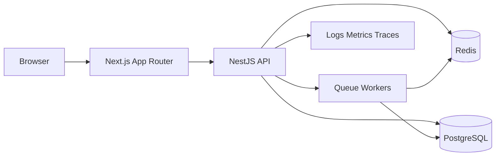

# Next.js + NestJS Track Overview / Tổng quan lộ trình Next.js + NestJS

## Overview / Tổng quan

**English**: This dedicated track is the canonical end-to-end path for building a modern full-stack application with Next.js App Router on the frontend and NestJS on the backend. It is designed for a mixed audience: clear enough for junior developers, but detailed enough to remain useful for mid-level and senior engineers planning a production-ready system.

**Vietnamese**: Lộ trình chuyên sâu này là con đường chuẩn để xây dựng ứng dụng full-stack hiện đại với Next.js App Router ở frontend và NestJS ở backend. Nội dung hướng đến đối tượng hỗn hợp: đủ rõ ràng cho junior, nhưng vẫn đủ chi tiết để hữu ích với mid-level và senior đang thiết kế hệ thống production.

## When To Use This Guide / Khi nào nên dùng tài liệu này

- when you want one canonical path instead of mixing many isolated docs
- when the project needs a real backend boundary, not only frontend route logic
- when you want to compare `Prisma` and `Drizzle` without redesigning the whole system twice
- when deployment, observability, and database operations must be part of the learning path

## What This Track Covers / Lộ trình này bao phủ gì

- Next.js App Router, Server Components, Client Components, Route Handlers, Server Actions
- NestJS modules, controllers, providers, DTO validation, guards, interceptors, exception filters
- PostgreSQL as the system of record
- Redis for caching, queue support, and runtime support concerns
- REST-first API design with Swagger/OpenAPI
- Prisma vs Drizzle comparison at the data-access layer
- Docker Compose + Nginx on a VM as the primary deployment path
- Vercel split-hosting and Kubernetes as shorter appendix deployment paths

## Who Should Use This Track / Ai nên dùng lộ trình này

### Best For / Phù hợp nhất với

- teams building a real product, not just isolated tutorials
- projects with moderate to complex backend rules
- teams that want clear backend architecture and strong TypeScript boundaries
- developers who want an end-to-end path instead of scattered topic notes

### Not The Best Fit / Không phải lựa chọn tốt nhất nếu

- the app is a very small CRUD dashboard and one-codebase simplicity matters more than modular backend design
- the team wants the thinnest possible backend abstraction and is more comfortable with Express
- the deployment target is highly specialized and far from the default stack used in this track

## Why Choose Next.js + NestJS / Tại sao chọn Next.js + NestJS

### Compared With Next.js Full-Stack Monolith / So với monolith Next.js

- choose `Next.js + NestJS` when backend rules are complex
- choose it when API ownership should be separate from UI ownership
- choose it when DTO validation, guards, Swagger, queues, and modular backend design are important

### Compared With Next.js + Express / So với Next.js + Express

- choose `Next.js + NestJS` when team structure, conventions, and scalable backend architecture matter more than minimal abstraction
- choose it when you want stronger built-in patterns for modules, validation, DI, guards, and interceptors
- choose `Next.js + Express` only when low abstraction and explicit manual architecture are the priority

## Canonical Reference Architecture / Kiến trúc tham chiếu chuẩn



## Reference Stack Snapshot / Ảnh chụp nhanh stack tham chiếu

```yaml
frontend:
  framework: Next.js App Router
  responsibilities:
    - routing
    - rendering
    - auth-aware UI
backend:
  framework: NestJS modular monolith
  responsibilities:
    - REST API
    - validation
    - authorization
    - background jobs
data:
  primary_db: PostgreSQL
  runtime_support: Redis
deploy:
  primary: Docker Compose + Nginx on a VM
  appendices:
    - Vercel frontend + separate NestJS API host
    - Kubernetes-first outline
```

## Learning Order / Thứ tự học

1. [01 Architecture and Project Structure](./01_Architecture_and_Project_Structure.md)
2. [02 NextJS App Router Integration](./02_NextJS_App_Router_Integration.md)
3. [03 NestJS Backend Foundation](./03_NestJS_Backend_Foundation.md)
4. [04 Data Layer Postgres Redis Prisma vs Drizzle](./04_Data_Layer_Postgres_Redis_Prisma_vs_Drizzle.md)
5. [05 Deployment Observability and Appendices](./05_Deployment_Observability_and_Appendices.md)

## Prerequisites / Điều kiện nền tảng

Read these first if needed:

- [Group 01 Foundation Review](../../Group-01-Foundation-Review/README.md)
- [Group 02 Basic Functions](../../Group-02-Basic-Functions/README.md)
- [Group 06 Database Analysis](../../Group-06-Database-Analysis/README.md)

Most relevant existing topic guides:

- [02.08 Authentication](../../Group-02-Basic-Functions/02.08_Authentication_JWT_Session.md)
- [02.09 Authorization](../../Group-02-Basic-Functions/02.09_Authorization_User_Permissions.md)
- [02.12 Backend Frontend Integration](../../Group-02-Basic-Functions/02.12_Backend_Frontend_Integration.md)
- [02.13 API Documentation Swagger OpenAPI](../../Group-02-Basic-Functions/02.13_API_Documentation_Swagger_OpenAPI.md)
- [14.06 Message Queues](../../Group-14-Advanced-Tech/14.06_Message_Queues.md)
- [14.12 Monitoring Observability](../../Group-14-Advanced-Tech/14.12_Monitoring_Observability.md)

## System Boundaries / Ranh giới hệ thống

### Next.js Owns / Next.js chịu trách nhiệm

- routing, layouts, rendering strategy
- page-level data consumption
- auth-aware UI behavior
- loading and error boundaries
- browser and UI state

### NestJS Owns / NestJS chịu trách nhiệm

- API contracts and domain logic
- validation and authorization
- data access orchestration
- background jobs and WebSockets
- observability and service boundaries

### PostgreSQL Owns / PostgreSQL chịu trách nhiệm

- source of truth for domain data
- relational integrity
- transactions and durable persistence

### Redis Owns / Redis chịu trách nhiệm

- cache acceleration
- queue broker support
- transient runtime coordination concerns

## Public Interface Of This Track / Giao diện công khai của lộ trình này

This track becomes the canonical place to answer:

- how a Next.js App Router frontend should talk to a NestJS backend
- how to structure the app and API projects
- how to compare Prisma vs Drizzle without splitting the architecture
- how to deploy the stack end-to-end

## Common Mistakes / Lỗi thường gặp

- mixing frontend-only and backend-only responsibilities
- turning Next.js Route Handlers into a second backend layer when NestJS is already the main API
- putting too much business logic in NestJS controllers
- ignoring cache and queue responsibilities when introducing Redis
- comparing ORMs by syntax only instead of by architecture impact

## Best Practices / Thực hành tốt nhất

1. Keep one canonical reference architecture across the track.
2. Use Next.js for UI concerns and NestJS for backend concerns.
3. Use PostgreSQL as the durable source of truth.
4. Use Redis only for responsibilities where transient speed or coordination matters.
5. Treat deployment, logging, and monitoring as part of the architecture, not post-launch add-ons.

## Next Step / Bước tiếp theo

- Read [01 Architecture and Project Structure](./01_Architecture_and_Project_Structure.md)
