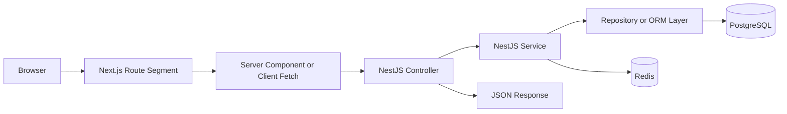

# Architecture and Project Structure / Kiến trúc và cấu trúc dự án

## Overview / Tổng quan

**English**: This guide defines the canonical architecture for the `Next.js + NestJS` track. It explains the frontend/backend boundary, project structure, request lifecycle, module boundaries, and how shared types should be handled without creating tight coupling.

**Vietnamese**: Tài liệu này xác định kiến trúc chuẩn cho lộ trình `Next.js + NestJS`. Nội dung giải thích ranh giới frontend/backend, cấu trúc dự án, vòng đời request, ranh giới module, và cách xử lý shared types mà không tạo coupling quá chặt.

## When To Use This Guide / Khi nào nên dùng tài liệu này

- when the team is deciding how to split `apps/web` and `apps/api`
- when architecture drift is starting because frontend and backend boundaries are unclear
- when you need one workspace structure that scales from tutorial size to production size

## Canonical Workspace Shape / Cấu trúc workspace chuẩn

```text
apps/
  web/
    app/
    components/
    lib/
    middleware.ts
  api/
    src/
      auth/
      users/
      orders/
      common/
      config/
shared/
  contracts/
  schemas/
infra/
  docker/
  nginx/
  compose/
```

## Why Split This Way / Tại sao tách như vậy

### `apps/web`

- owns rendering and UI
- owns route hierarchy and user-facing interaction
- should not become the primary domain-logic layer

### `apps/api`

- owns business rules and backend orchestration
- owns data-access boundary and queue/event integration
- provides a stable API surface for the frontend

### `shared`

- only contains stable contracts and validation-safe primitives
- should not become a dumping ground for backend implementation details

## Request Lifecycle / Vòng đời request



## Frontend and Backend Boundary / Ranh giới frontend và backend

### Frontend Responsibilities / Trách nhiệm frontend

- route segments, layouts, templates
- loading and error UI
- form UX and optimistic or pending states
- calling backend endpoints
- presenting backend responses clearly

### Backend Responsibilities / Trách nhiệm backend

- auth, authz, validation
- transactional business logic
- persistence and data consistency
- rate limiting and API documentation
- observability and operational boundaries

### Boundary Rule / Quy tắc ranh giới

If the logic must remain correct even when another client calls the API, it belongs in NestJS.

## Recommended NestJS Module Boundaries / Ranh giới module NestJS khuyến nghị

Reference domain split:

- `auth`
- `users`
- `orders`
- `common`
- `config`
- `health`

Each feature module should normally contain:

- controller
- service
- DTOs
- optional repository or adapter layer
- tests

## Recommended Next.js Structure / Cấu trúc Next.js khuyến nghị

```text
app/
  (marketing)/
  (app)/
    dashboard/
    users/
    orders/
  login/
  layout.tsx
  error.tsx
  loading.tsx
components/
lib/
  api-client.ts
  auth.ts
  env.ts
```

### Route and Component Rules / Quy tắc route và component

- use Server Components by default
- use Client Components only where interactivity or browser APIs are needed
- keep page-level data loading close to route segments
- keep reusable UI in `components/`
- keep API client, auth helpers, and env parsing in `lib/`

## Shared Contracts / Contract dùng chung

### What To Share / Những gì nên chia sẻ

- DTO-like request and response shapes
- zod schemas or validation-safe contract definitions
- enum-like stable business constants

### What Not To Share / Những gì không nên chia sẻ

- NestJS decorators and framework classes
- ORM-specific entity models
- backend infrastructure implementation

## Example: Shared Contract / Ví dụ: Contract dùng chung

```typescript
// shared/contracts/user.ts
import { z } from 'zod';

export const createUserSchema = z.object({
  email: z.string().email(),
  name: z.string().min(2).max(100),
});

export type CreateUserInput = z.infer<typeof createUserSchema>;
```

## Example: API Project Structure / Ví dụ: Cấu trúc dự án API

```text
src/
  main.ts
  app.module.ts
  auth/
    auth.module.ts
    auth.controller.ts
    auth.service.ts
    dto/
  users/
    users.module.ts
    users.controller.ts
    users.service.ts
    dto/
  common/
    guards/
    interceptors/
    filters/
    pipes/
```

## Example: Web Project Structure / Ví dụ: Cấu trúc dự án web

```text
app/
  users/
    page.tsx
    loading.tsx
    error.tsx
  orders/
    page.tsx
components/
  users/
  orders/
lib/
  api-client.ts
  auth.ts
  server-session.ts
```

## Environment Layout / Bố cục môi trường

- `apps/web/.env.local` for local web-only variables
- `apps/api/.env` for backend runtime variables
- shared documentation of required variables in the deployment guide
- secret values injected at runtime, not committed

## Common Mistakes / Lỗi thường gặp

- using Next.js Route Handlers as a shadow API while NestJS is already present
- leaking ORM details into shared contracts
- putting too many modules into one NestJS feature boundary
- pushing validation only to the frontend
- overusing Client Components

## Best Practices / Thực hành tốt nhất

1. Keep UI concerns in Next.js and domain correctness in NestJS.
2. Default to Server Components in Next.js.
3. Default to modular backend boundaries in NestJS.
4. Share contracts, not framework internals.
5. Use one stable request lifecycle and architecture across the whole project.

## Next Step / Bước tiếp theo

- Read [02 NextJS App Router Integration](./02_NextJS_App_Router_Integration.md)
