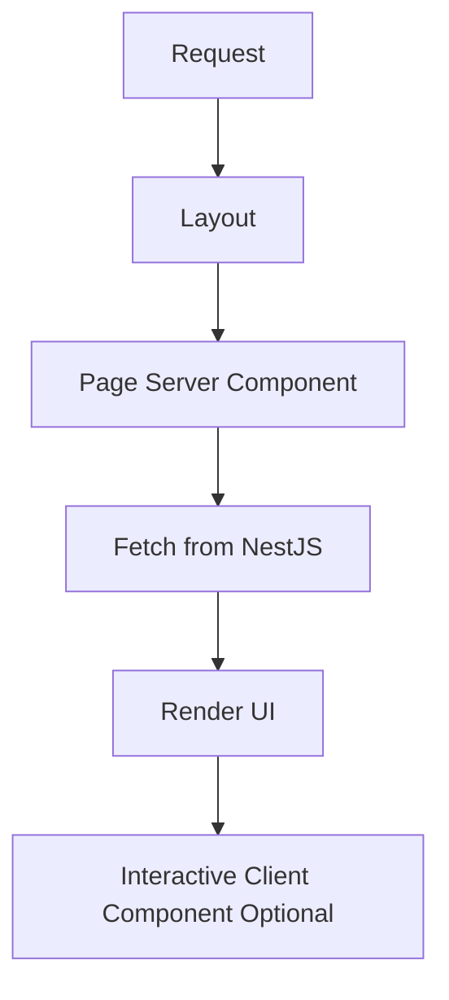
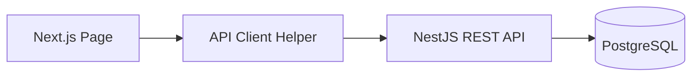
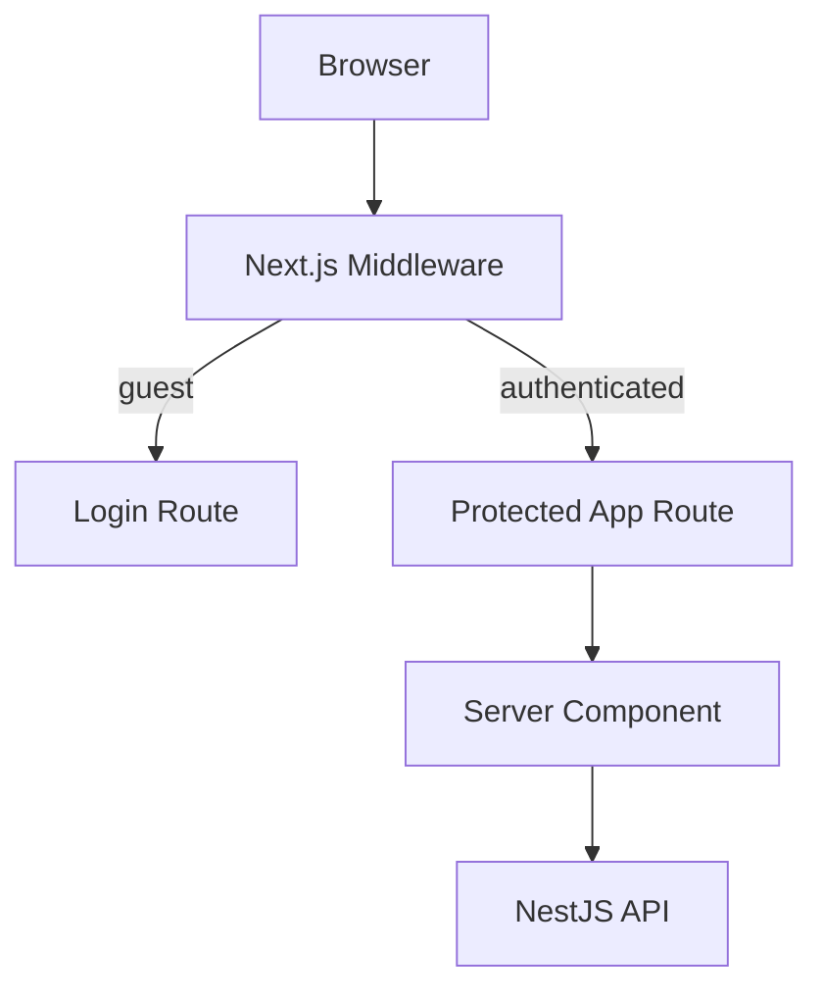
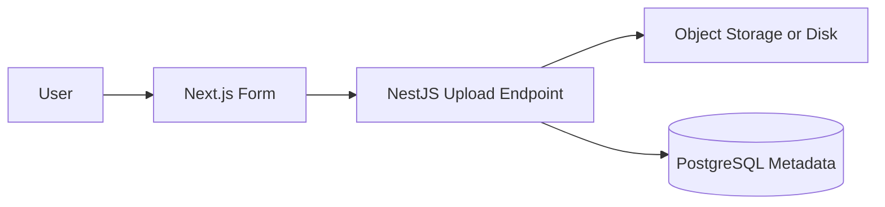

# NextJS App Router Integration / Tích hợp NextJS App Router

## Overview / Tổng quan

**English**: This guide explains how Next.js App Router should integrate with a NestJS backend in the reference stack. It covers Server Components, Client Components, Route Handlers, Server Actions, auth-aware UI, caching, and file integration patterns.

**Vietnamese**: Tài liệu này giải thích cách Next.js App Router nên tích hợp với backend NestJS trong stack tham chiếu. Nội dung bao gồm Server Components, Client Components, Route Handlers, Server Actions, UI có nhận biết auth, caching, và các mẫu tích hợp file.

## When To Use This Guide / Khi nào nên dùng tài liệu này

- when the frontend team is unsure whether logic belongs in App Router or in NestJS
- when pages are mixing Server Components, Client Components, and ad hoc fetch patterns
- when you need one clear frontend integration model for auth, caching, and mutations

## App Router Mental Model / Tư duy về App Router

### Default Rule / Quy tắc mặc định

- Server Components by default
- Client Components only where needed
- NestJS remains the primary backend API
- Route Handlers are for lightweight edge or app-adjacent tasks, not a second full backend

## Rendering Model / Mô hình rendering



## Server Components vs Client Components / So sánh Server và Client Components

### Server Components / Server Components

- good for data loading
- good for protected pages where server can inspect cookies or headers
- reduce browser JavaScript payload

### Client Components / Client Components

- good for forms, local state, browser events, and real-time interactivity
- use only where browser APIs or immediate interaction require them

## API Consumption Pattern / Mẫu tiêu thụ API

### Recommended Path / Cách khuyến nghị

Next.js fetches data from NestJS through a typed API client or service layer.



## Example: Server Component Fetching / Ví dụ: Server Component fetch dữ liệu

```typescript
// app/users/page.tsx
import { getUsers } from '@/lib/api-client';

export default async function UsersPage() {
  const users = await getUsers();

  return (
    <main>
      <h1>Users</h1>
      <ul>
        {users.map((user) => (
          <li key={user.id}>{user.name}</li>
        ))}
      </ul>
    </main>
  );
}
```

```typescript
// lib/api-client.ts
export async function getUsers() {
  const res = await fetch(`${process.env.API_BASE_URL}/users`, {
    headers: { 'Content-Type': 'application/json' },
    cache: 'no-store',
  });

  if (!res.ok) throw new Error('Failed to load users');
  return res.json();
}
```

## Route Handlers / Route Handlers

### Use Them For / Dùng cho các trường hợp

- lightweight application-adjacent endpoints
- webhook receivers that belong tightly to the frontend deployment
- proxying or session-aware adapter behavior when justified

### Do Not Use Them As / Không dùng như

- the primary domain API when NestJS already exists
- a duplicate business-logic layer

## Example: Lightweight Route Handler / Ví dụ: Route Handler nhẹ

```typescript
// app/api/session/route.ts
import { NextResponse } from 'next/server';
import { cookies } from 'next/headers';

export async function GET() {
  const token = (await cookies()).get('access_token')?.value;
  return NextResponse.json({ authenticated: Boolean(token) });
}
```

## Server Actions / Server Actions

### Good Uses / Dùng tốt cho

- form submission glue
- mutation triggers followed by `revalidatePath`
- lightweight server-side orchestration close to the UI

### Rule / Quy tắc

Server Actions may call NestJS APIs, but NestJS still owns business correctness.

## Example: Server Action / Ví dụ: Server Action

```typescript
// app/users/actions.ts
'use server';

import { revalidatePath } from 'next/cache';

export async function createUserAction(formData: FormData) {
  const payload = {
    email: String(formData.get('email') || ''),
    name: String(formData.get('name') || ''),
  };

  const res = await fetch(`${process.env.API_BASE_URL}/users`, {
    method: 'POST',
    headers: { 'Content-Type': 'application/json' },
    body: JSON.stringify(payload),
  });

  if (!res.ok) {
    return { ok: false, error: 'Request failed' };
  }

  revalidatePath('/users');
  return { ok: true };
}
```

## Auth-Aware UI / UI có nhận biết auth



### Auth Rules / Quy tắc auth

- middleware can protect route access
- server components can fetch authenticated data
- NestJS must still verify auth and authorization
- never rely on frontend route protection alone

## Loading and Error States / Trạng thái loading và lỗi

Use App Router primitives:

- `loading.tsx`
- `error.tsx`
- `not-found.tsx` where relevant

These belong in Next.js because they are user-experience concerns.

## Caching and Revalidation / Cache và revalidation

### Good Rules / Quy tắc tốt

- use `no-store` for sensitive or rapidly changing data
- use revalidation for semi-static resources
- use `revalidatePath` or `revalidateTag` after successful mutations
- keep backend cache policy and frontend cache policy aligned

## File Upload and Download Integration / Tích hợp upload và download file

### Recommended Path / Cách khuyến nghị

- frontend handles selection and UX
- NestJS handles validation, persistence, authorization, and storage integration

### Example Upload Flow / Ví dụ luồng upload



## Legacy Note: `pages/api` / Ghi chú về `pages/api`

`pages/api` is not the primary pattern for this track.

Mention it only as legacy or background context. App Router patterns are the default path.

## Common Mistakes / Lỗi thường gặp

- making too many Client Components
- duplicating domain logic in Route Handlers
- mixing direct database access into the web app when NestJS already owns the backend
- ignoring loading and error UX
- treating auth checks in middleware as sufficient backend security

## Best Practices / Thực hành tốt nhất

1. Use Server Components by default.
2. Keep NestJS as the canonical domain API.
3. Use Route Handlers sparingly and intentionally.
4. Make caching policy explicit after every important read and write path.
5. Separate UX concerns from backend correctness concerns.

## Next Step / Bước tiếp theo

- Read [03 NestJS Backend Foundation](./03_NestJS_Backend_Foundation.md)
