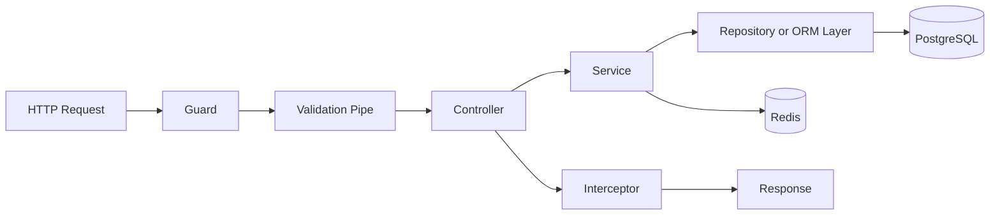
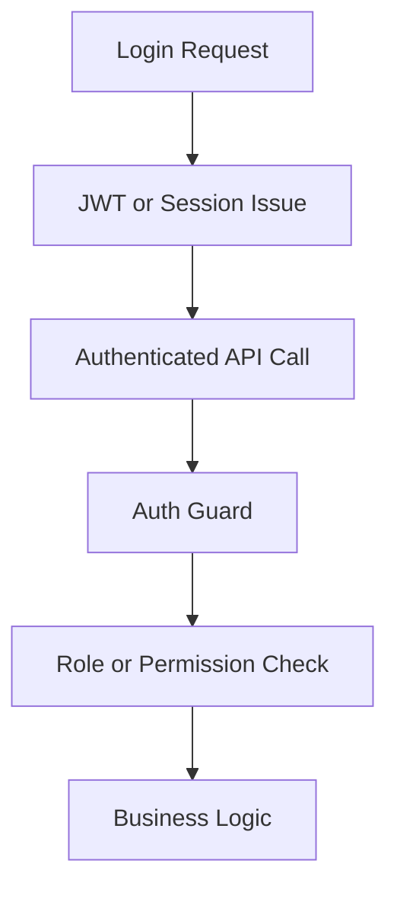

# NestJS Backend Foundation / Nền tảng backend NestJS

## Overview / Tổng quan

**English**: This guide defines the backend side of the reference stack. It explains how to structure a NestJS modular monolith, where DTOs, controllers, providers, guards, interceptors, filters, Swagger, queues, and WebSockets fit, and how to keep backend complexity manageable.

**Vietnamese**: Tài liệu này xác định phía backend của stack tham chiếu. Nội dung giải thích cách cấu trúc modular monolith bằng NestJS, vị trí của DTO, controller, provider, guard, interceptor, filter, Swagger, queue, và WebSocket, cũng như cách giữ độ phức tạp backend ở mức kiểm soát được.

## When To Use This Guide / Khi nào nên dùng tài liệu này

- when the API is growing beyond a small Express-style service
- when controllers are getting too large and service boundaries are unclear
- when the team needs standard patterns for validation, auth, Swagger, and background work

## Request Lifecycle In NestJS / Vòng đời request trong NestJS



## Module Design / Thiết kế module

### Reference Modules / Module tham chiếu

- `auth`
- `users`
- `orders`
- `health`
- `common`
- `config`

### Module Rule / Quy tắc module

Split by business domain first, not by technical layer only.

## Controller vs Service vs Repository / Controller so với Service so với Repository

### Controller Owns / Controller chịu trách nhiệm

- request mapping
- status codes and response shape
- route-level decorators
- delegating to service

### Service Owns / Service chịu trách nhiệm

- business rules
- orchestration across repositories, cache, and external services
- transactional intent

### Repository or ORM Layer Owns / Repository hoặc ORM layer chịu trách nhiệm

- data access details
- query construction
- mapping persistence concerns

## Example: Users Module / Ví dụ: Users module

```typescript
// users.module.ts
import { Module } from '@nestjs/common';
import { UsersController } from './users.controller';
import { UsersService } from './users.service';
import { UsersRepository } from './users.repository';

@Module({
  controllers: [UsersController],
  providers: [UsersService, UsersRepository],
  exports: [UsersService],
})
export class UsersModule {}
```

```typescript
// users.controller.ts
import { Body, Controller, Get, Param, Post, UseGuards } from '@nestjs/common';
import { UsersService } from './users.service';
import { CreateUserDto } from './dto/create-user.dto';
import { JwtAuthGuard } from '../auth/jwt-auth.guard';

@Controller('users')
export class UsersController {
  constructor(private readonly usersService: UsersService) {}

  @UseGuards(JwtAuthGuard)
  @Get(':id')
  findOne(@Param('id') id: string) {
    return this.usersService.findOne(id);
  }

  @Post()
  create(@Body() dto: CreateUserDto) {
    return this.usersService.create(dto);
  }
}
```

```typescript
// users.service.ts
import { Injectable } from '@nestjs/common';
import { UsersRepository } from './users.repository';
import { CreateUserDto } from './dto/create-user.dto';

@Injectable()
export class UsersService {
  constructor(private readonly usersRepository: UsersRepository) {}

  findOne(id: string) {
    return this.usersRepository.findOne(id);
  }

  create(dto: CreateUserDto) {
    return this.usersRepository.create(dto);
  }
}
```

## DTO Validation / Validation bằng DTO

```typescript
// dto/create-user.dto.ts
import { IsEmail, IsString, Length } from 'class-validator';

export class CreateUserDto {
  @IsEmail()
  email!: string;

  @IsString()
  @Length(2, 100)
  name!: string;
}
```

### Validation Rule / Quy tắc validation

- validate at API boundary
- never trust frontend validation alone
- keep DTOs close to module boundaries

## Guards, Interceptors, Filters / Guards, Interceptors, Filters

### Guards / Guards

- authentication
- authorization
- route access policy

### Interceptors / Interceptors

- response transformation
- logging and timing
- caching integration

### Exception Filters / Exception Filters

- consistent error translation
- centralized mapping of backend errors to HTTP responses

## Swagger and REST Contracts / Swagger và contract REST

### Why REST First / Tại sao REST-first

- stable contracts for frontend and external tools
- easier observability and caching than many alternative designs
- clearer onboarding for mixed audiences

### Example: Swagger Decorators / Ví dụ: Swagger decorators

```typescript
import { ApiBearerAuth, ApiOperation, ApiTags } from '@nestjs/swagger';

@ApiTags('users')
@ApiBearerAuth()
@Controller('users')
export class UsersController {
  @ApiOperation({ summary: 'Get one user' })
  @Get(':id')
  findOne(@Param('id') id: string) {
    return this.usersService.findOne(id);
  }
}
```

## Auth and Authorization / Auth và phân quyền



### Auth Rules / Quy tắc auth

- Next.js may protect routes for UX
- NestJS must protect data and actions for correctness
- authorization should be explicit at route or domain boundaries

## Queue and WebSocket Integration Points / Điểm tích hợp queue và WebSocket

### Queue Use Cases / Trường hợp dùng queue

- email sending
- report generation
- slow external calls
- retry workflows

### WebSocket Use Cases / Trường hợp dùng WebSocket

- real-time status updates
- notifications
- collaborative features

### Rule / Quy tắc

Keep synchronous request handlers small and move slow or bursty work into workers when possible.

## Common Mistakes / Lỗi thường gặp

- putting business logic in controllers
- making one giant `AppModule`
- skipping DTO validation
- hiding authorization inside ad hoc service logic without clear boundaries
- coupling frontend assumptions directly into backend contracts

## Best Practices / Thực hành tốt nhất

1. Keep controllers thin and services meaningful.
2. Validate at the boundary with DTOs and pipes.
3. Use guards for access policy, not just ad hoc checks.
4. Use Swagger to keep API contracts visible.
5. Move slow or non-user-blocking work into queues or WebSockets where appropriate.

## Next Step / Bước tiếp theo

- Read [04 Data Layer Postgres Redis Prisma vs Drizzle](./04_Data_Layer_Postgres_Redis_Prisma_vs_Drizzle.md)
