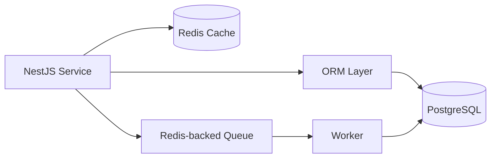

# Data Layer: Postgres, Redis, Prisma vs Drizzle / Tầng dữ liệu: Postgres, Redis, Prisma so với Drizzle

## Overview / Tổng quan

**English**: This guide explains the canonical data layer for the track. PostgreSQL is the durable system of record. Redis handles fast transient concerns such as caching and queue support. Prisma and Drizzle are compared directly so the reader can understand the architectural impact of each choice without forking the entire stack into two parallel tutorials.

**Vietnamese**: Tài liệu này giải thích tầng dữ liệu chuẩn của lộ trình. PostgreSQL là hệ thống lưu trữ bền vững và là nguồn sự thật chính. Redis xử lý các nhu cầu tạm thời tốc độ cao như cache và hỗ trợ queue. Prisma và Drizzle được so sánh trực tiếp để người đọc hiểu tác động kiến trúc của từng lựa chọn mà không phải tách lộ trình thành hai tutorial song song.

## When To Use This Guide / Khi nào nên dùng tài liệu này

- when the team is deciding between `Prisma` and `Drizzle`
- when Redis is being introduced and its responsibilities need to stay controlled
- when migrations, indexing, pooling, and monitoring need to be designed intentionally

## Canonical Data Roles / Vai trò dữ liệu chuẩn

### PostgreSQL / PostgreSQL

- source of truth
- relational integrity
- transactions
- reporting-friendly persistence

### Redis / Redis

- cache layer
- queue backing store
- short-lived coordination state

## Data Flow / Luồng dữ liệu



## PostgreSQL In The Stack / PostgreSQL trong stack

### What To Model Well / Những gì cần model tốt

- domain entities
- foreign key relationships
- unique constraints
- transactions for multi-step correctness
- indexed lookup paths

### Example Schema Shape / Ví dụ hình dạng schema

```sql
CREATE TABLE users (
  id BIGSERIAL PRIMARY KEY,
  email TEXT NOT NULL UNIQUE,
  name TEXT NOT NULL,
  created_at TIMESTAMPTZ NOT NULL DEFAULT NOW()
);

CREATE TABLE orders (
  id BIGSERIAL PRIMARY KEY,
  user_id BIGINT NOT NULL REFERENCES users(id),
  status TEXT NOT NULL,
  total_amount NUMERIC(12, 2) NOT NULL,
  created_at TIMESTAMPTZ NOT NULL DEFAULT NOW()
);

CREATE INDEX idx_orders_user_created_at
  ON orders(user_id, created_at DESC);
```

## Redis In The Stack / Redis trong stack

### Good Uses / Cách dùng tốt

- cache read-heavy endpoints
- support queue workers
- hold short-lived derived or coordination state

### Avoid / Tránh

- treating Redis as the only durable source for important business data
- storing critical workflow state only in cache without persistence

## Prisma vs Drizzle / Prisma so với Drizzle

### High-Level Comparison / So sánh cấp cao

| Area | Prisma | Drizzle |
| --- | --- | --- |
| Philosophy | full ORM and client generation | SQL-first typed query builder |
| NestJS fit | strong for service + repository abstraction | strong for explicit SQL-heavy control |
| Migration style | Prisma migrations and schema model | SQL-oriented schema and migration flow |
| Query style | generated client API | typed SQL-like composition |
| Tradeoff | more abstraction and generator workflow | more explicit query ownership |

## Architectural Impact / Tác động kiến trúc

### If Using Prisma / Nếu dùng Prisma

- repository layer can be thinner
- generated client becomes a strong typed dependency
- schema-first workflow is convenient for many teams

### If Using Drizzle / Nếu dùng Drizzle

- query intent is often more explicit
- teams closer to SQL may prefer the control
- repository boundaries often stay clearer because query authorship is more deliberate

## Example: Prisma Repository / Ví dụ: Repository với Prisma

```typescript
// users.repository.prisma.ts
import { Injectable } from '@nestjs/common';
import { PrismaService } from '../prisma/prisma.service';

@Injectable()
export class UsersRepository {
  constructor(private readonly prisma: PrismaService) {}

  findOne(id: string) {
    return this.prisma.user.findUnique({ where: { id } });
  }

  create(data: { email: string; name: string }) {
    return this.prisma.user.create({ data });
  }
}
```

## Example: Drizzle Repository / Ví dụ: Repository với Drizzle

```typescript
// users.repository.drizzle.ts
import { Injectable } from '@nestjs/common';
import { db } from '../db';
import { users } from '../schema/users';
import { eq } from 'drizzle-orm';

@Injectable()
export class UsersRepository {
  findOne(id: number) {
    return db.query.users.findFirst({
      where: eq(users.id, id),
    });
  }

  async create(data: { email: string; name: string }) {
    const result = await db.insert(users).values(data).returning();
    return result[0];
  }
}
```

## Decision Guidance / Hướng dẫn chọn

### Prefer Prisma When / Ưu tiên Prisma khi

- the team values generated client ergonomics
- the team wants a more abstracted ORM workflow
- existing examples and onboarding flow should stay close to repo precedent

### Prefer Drizzle When / Ưu tiên Drizzle khi

- the team prefers SQL-forward explicitness
- query control matters more than ORM abstraction
- the team wants tighter visibility into data-access behavior

### Canonical Rule For This Track / Quy tắc chuẩn cho lộ trình này

The track keeps one architecture. Prisma and Drizzle are compared only at the data-access boundary. The rest of the system design remains the same.

## Connection Pooling, Indexing, and Migrations / Pooling, indexing và migrations

### Connection Pooling / Pooling kết nối

- size pools globally, not per service in isolation
- account for web API, workers, and cron-like tasks
- monitor active and idle connections

### Indexing / Indexing

- add indexes for real lookup and ordering patterns
- measure before adding many indexes
- inspect `EXPLAIN ANALYZE` for slow queries

### Migrations / Migrations

- apply in CI/CD controlled steps
- coordinate with deployment strategy
- avoid destructive unreviewed production changes

## Backup and Monitoring Pointers / Gợi ý backup và monitoring

Most relevant companion docs:

- [06.11 Database Connection Pooling](../../Group-06-Database-Analysis/06.11_Database_Connection_Pooling.md)
- [06.14 Database Backup and Recovery](../../Group-06-Database-Analysis/06.14_Database_Backup_Recovery.md)
- [06.15 Database Performance Monitoring](../../Group-06-Database-Analysis/06.15_Database_Performance_Monitoring.md)
- [16.07 Database Performance](../../Group-16-Performance-Testing/16.07_Database_Performance.md)

## Common Mistakes / Lỗi thường gặp

- using Redis as durable truth
- choosing an ORM only by popularity
- hiding poor query design behind ORM abstractions
- ignoring migration and rollback planning
- forgetting that workers also consume database connections

## Best Practices / Thực hành tốt nhất

1. Keep PostgreSQL as the durable source of truth.
2. Use Redis for speed and coordination, not durable domain truth.
3. Compare Prisma and Drizzle at the repository boundary, not by rewriting the whole architecture.
4. Measure query behavior and pool usage continuously.
5. Treat migrations, backups, and monitoring as part of the data-layer design.

## Next Step / Bước tiếp theo

- Read [05 Deployment Observability and Appendices](./05_Deployment_Observability_and_Appendices.md)
