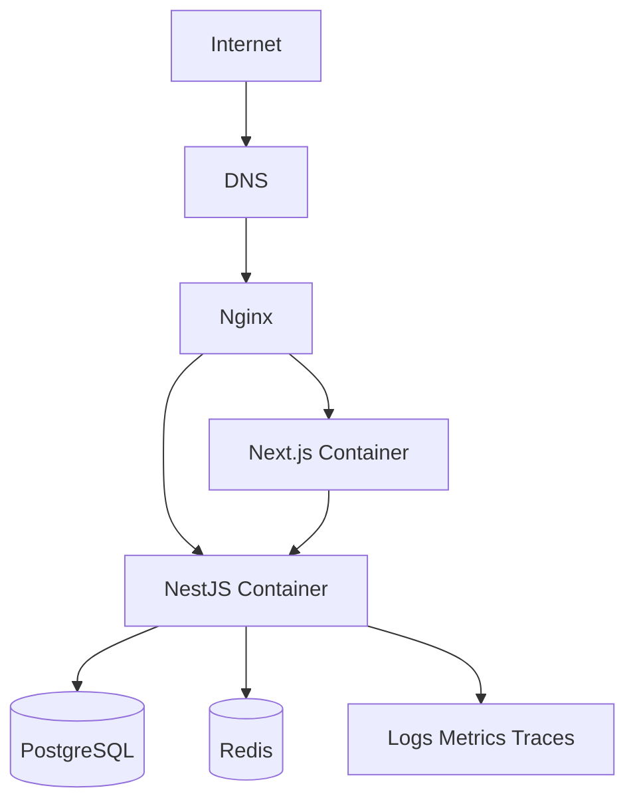
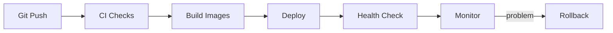

# Deployment, Observability, and Appendices / Triển khai, quan sát, và phụ lục

## Overview / Tổng quan

**English**: This guide closes the track with one primary worked deployment path and two shorter alternatives. The canonical implementation uses Docker Compose + Nginx on a VM. Observability, rollback, CI/CD, and health verification are treated as part of the deployment design.

**Vietnamese**: Tài liệu này kết thúc lộ trình bằng một con đường triển khai chính và hai phương án thay thế ngắn hơn. Cách triển khai chuẩn dùng Docker Compose + Nginx trên VM. Observability, rollback, CI/CD và xác minh health được xem là một phần của thiết kế triển khai.

## When To Use This Guide / Khi nào nên dùng tài liệu này

- when you need one default production deployment story for the stack
- when release safety, telemetry, and rollback are still informal or undocumented
- when the team wants a practical VM-based path before moving to more complex platforms

## Primary Deployment Path / Con đường triển khai chính

### Canonical Choice / Lựa chọn chuẩn

- Docker Compose
- Nginx reverse proxy
- VM-based deployment
- separate `web` and `api` services
- PostgreSQL and Redis as runtime services or managed equivalents

## Primary Topology / Topology chính



## Example: Docker Compose / Ví dụ: Docker Compose

```yaml
services:
  web:
    build: ./apps/web
    ports:
      - "3000:3000"
    environment:
      NEXT_PUBLIC_APP_URL: https://app.example.com
      API_BASE_URL: http://api:4000
    depends_on:
      - api

  api:
    build: ./apps/api
    ports:
      - "4000:4000"
    environment:
      NODE_ENV: production
      DATABASE_URL: postgresql://app:secret@db:5432/app
      REDIS_URL: redis://redis:6379
      JWT_SECRET: replace-me
    depends_on:
      - db
      - redis

  db:
    image: postgres:16
    environment:
      POSTGRES_DB: app
      POSTGRES_USER: app
      POSTGRES_PASSWORD: secret
    volumes:
      - postgres_data:/var/lib/postgresql/data

  redis:
    image: redis:7-alpine

volumes:
  postgres_data:
```

## Example: Nginx / Ví dụ: Nginx

```nginx
server {
    listen 80;
    server_name app.example.com;

    location / {
        proxy_pass http://127.0.0.1:3000;
        proxy_http_version 1.1;
        proxy_set_header Host $host;
        proxy_set_header X-Forwarded-For $proxy_add_x_forwarded_for;
        proxy_set_header X-Forwarded-Proto $scheme;
    }

    location /api/ {
        proxy_pass http://127.0.0.1:4000/;
        proxy_http_version 1.1;
        proxy_set_header Host $host;
        proxy_set_header X-Forwarded-For $proxy_add_x_forwarded_for;
        proxy_set_header X-Forwarded-Proto $scheme;
    }
}
```

## Deployment Flow / Luồng triển khai



## Health Checks and Readiness / Health check và readiness

### Required Endpoints / Endpoint bắt buộc

- `/health` for basic process liveness
- `/ready` for service readiness where applicable

### Why They Matter / Tại sao quan trọng

- Nginx, orchestrators, and deployment pipelines need safe verification points
- rollback decisions should be telemetry-driven, not guesswork-driven

## Logging, Metrics, and Traces / Log, metrics, và traces

### Minimum Observability / Mức observability tối thiểu

- structured logs for API requests and important background jobs
- request timing and error-rate metrics
- deployment annotations or release markers
- database and queue health visibility

### Core Companion Docs / Tài liệu liên quan chính

- [14.11 CI/CD Pipelines](../../Group-14-Advanced-Tech/14.11_CI_CD_Pipelines.md)
- [14.12 Monitoring Observability](../../Group-14-Advanced-Tech/14.12_Monitoring_Observability.md)
- [17.05 Monitoring Logging](../../Group-17-DevOps-Automation/17.05_Monitoring_Logging.md)
- [17.07 Deployment Strategies](../../Group-17-DevOps-Automation/17.07_Deployment_Strategies.md)

## Rollback Strategy / Chiến lược rollback

### Principles / Nguyên tắc

- deploy immutable images
- verify after deploy
- keep rollback steps documented
- coordinate rollout with database migration risk

### Example Rollback Checklist / Ví dụ checklist rollback

- confirm regression via health and telemetry
- switch traffic back or redeploy last known good image
- verify app, API, DB connectivity, and queue behavior
- document incident and follow-up fixes

## CI/CD Expectations / Kỳ vọng với CI/CD

- run lint and tests before deployment
- build once and promote tested artifacts
- control secrets securely
- verify deployment with health checks

## Appendix A: Vercel + Separate NestJS API Host / Phụ lục A: Vercel + API NestJS riêng

### Best For / Phù hợp nhất với

- teams wanting a hosted frontend workflow
- projects where frontend and backend deployment cadence differ

### Shape / Hình dạng

- Next.js deployed on Vercel
- NestJS deployed on separate host or platform
- PostgreSQL and Redis remain shared backend infrastructure concerns

### Tradeoffs / Đánh đổi

- split operational story across platforms
- often simpler frontend delivery
- backend observability and auth integration still need strong design

## Appendix B: Kubernetes-First Outline / Phụ lục B: Phác thảo hướng Kubernetes

### Best For / Phù hợp nhất với

- larger teams
- multi-service environments
- stronger autoscaling and orchestration needs

### Shape / Hình dạng

- ingress in front of web and api workloads
- deployment resources for web and api
- readiness and liveness probes
- separate database and cache strategy

### Tradeoffs / Đánh đổi

- more operational complexity
- stronger platform capabilities
- less approachable for the primary mixed-audience path

## Common Mistakes / Lỗi thường gặp

- treating deployment as only “docker up”
- missing Nginx or reverse-proxy concerns
- no health verification after release
- no rollback plan
- weak visibility into logs, metrics, and failures

## Best Practices / Thực hành tốt nhất

1. Keep one primary deployment story for the core track.
2. Treat Docker Compose + Nginx on a VM as the canonical reference path.
3. Verify releases with health checks and telemetry.
4. Document rollback before the first production deploy.
5. Keep Vercel and Kubernetes as appendices, not competing primary paths.

## Track Completion / Hoàn thành lộ trình

After finishing this file, the reader should understand:

- why this track uses `Next.js + NestJS`
- how frontend and backend boundaries are divided
- where PostgreSQL and Redis fit
- how Prisma and Drizzle differ
- how to deploy the stack end-to-end with one primary path and two alternative appendices
