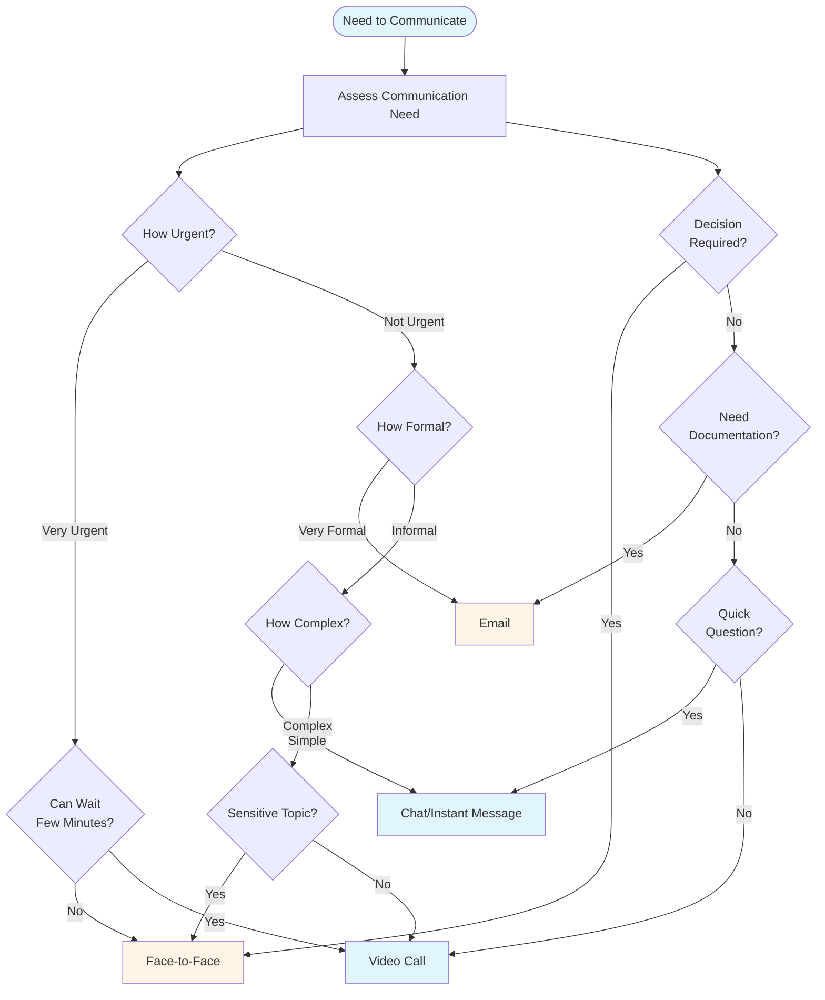
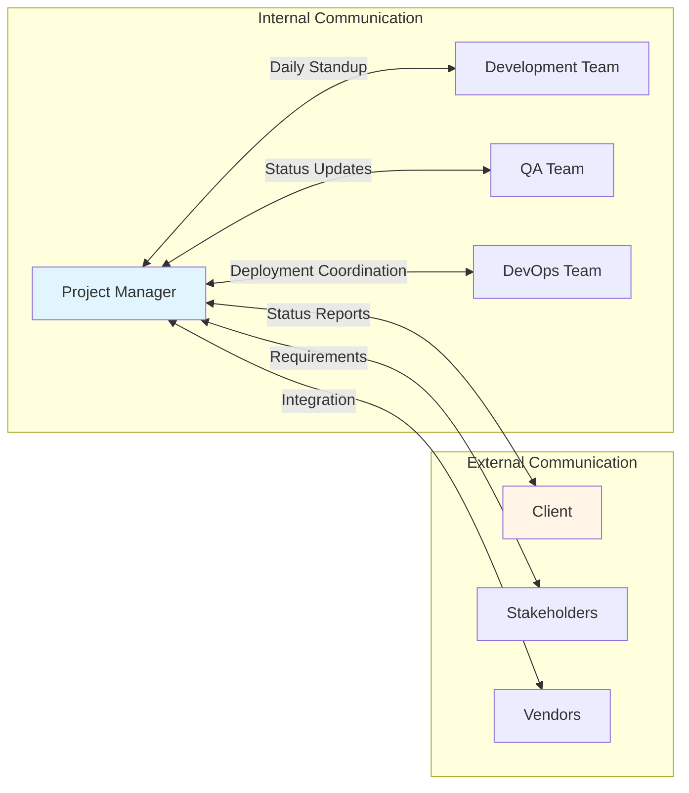
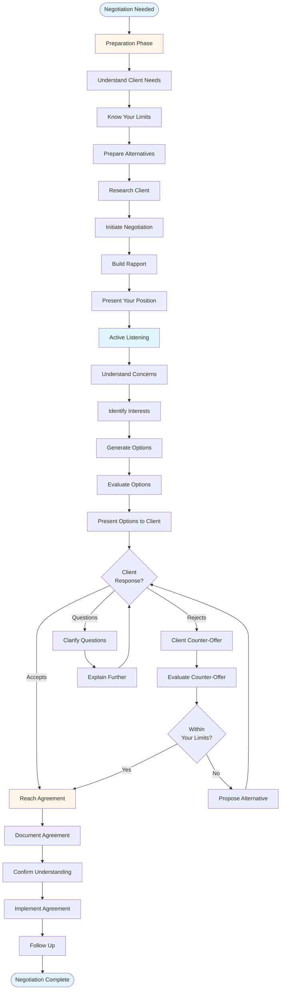
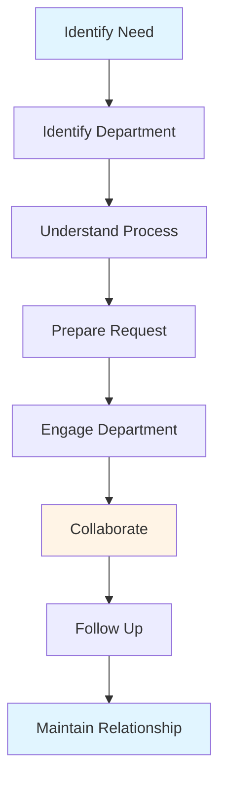
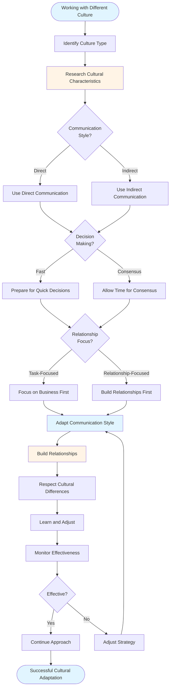
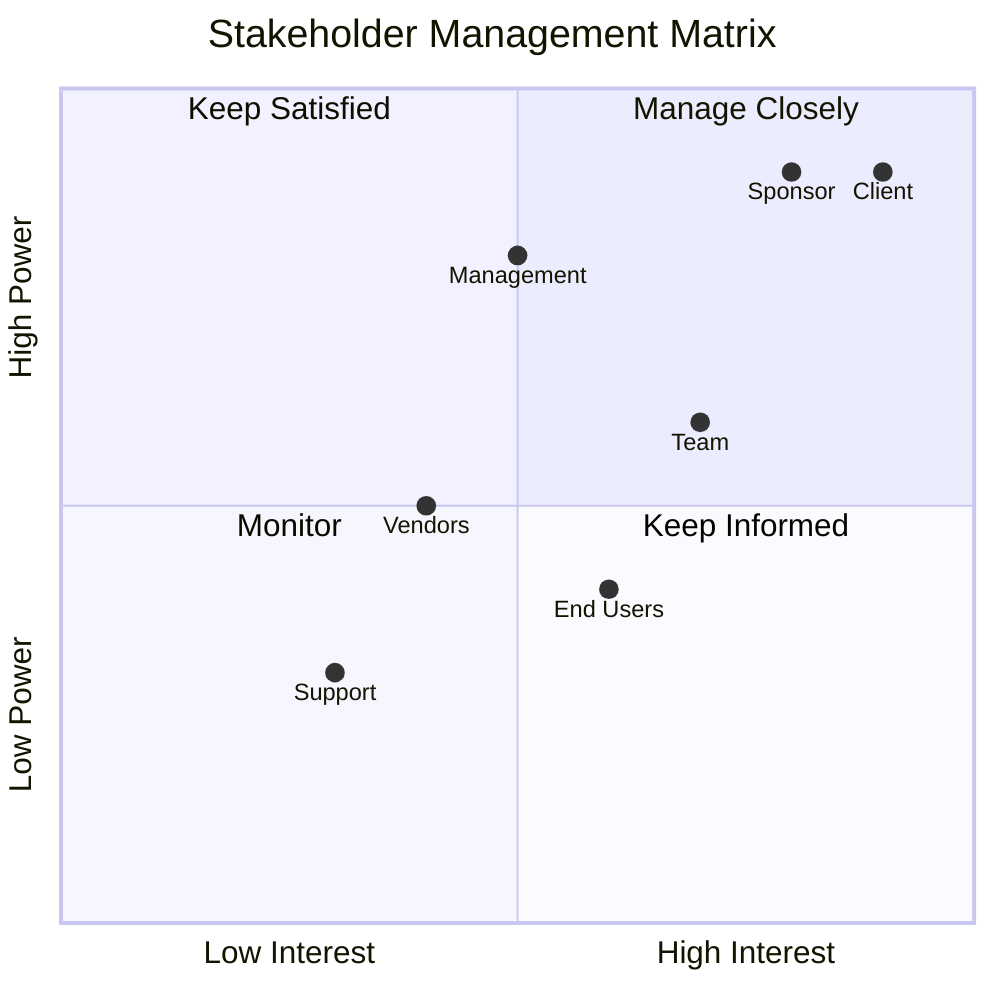

# Communication & Negotiation Guide - Comprehensive

## Table of Contents
1. [Introduction](#introduction)
2. [Communication Channels](#communication-channels)
3. [Client Negotiation](#client-negotiation)
4. [Internal Negotiation](#internal-negotiation)
5. [Cross-Department Collaboration](#cross-department-collaboration)
6. [Cultural Considerations](#cultural-considerations)
7. [Best Practices](#best-practices)
8. [Common Pitfalls](#common-pitfalls)
9. [Real-World Examples](#real-world-examples)
10. [Templates & Checklists](#templates--checklists)
11. [Tools & Software](#tools--software)
12. [Resources](#resources)
13. [Summary](#summary)

---

## Introduction

Effective communication and negotiation are fundamental skills for project managers. This guide covers communication channel selection, negotiation techniques with clients and internal stakeholders, cross-department collaboration, and cultural awareness for working with diverse clients.

### Who This Guide Is For
- Project managers communicating with stakeholders
- Team leads negotiating with clients
- Anyone involved in stakeholder management
- Leaders working with diverse teams and clients

### Key Learning Objectives
- Choose appropriate communication channels
- Negotiate effectively with clients
- Handle internal negotiations
- Collaborate across departments
- Understand cultural differences
- Use communication tools effectively

---

## Communication Channels

### Overview

Choosing the right communication channel is crucial for effective communication. Different situations require different channels, and using the wrong channel can lead to misunderstandings, delays, or conflicts.

### Communication Channel Types

#### 1. Face-to-Face Communication
**Characteristics**:
- In-person meetings
- Direct interaction
- Non-verbal cues visible
- Immediate feedback

**Best For**:
- Important decisions
- Sensitive topics
- Complex discussions
- Relationship building
- Conflict resolution
- First-time meetings

**Advantages**:
- Rich communication (verbal + non-verbal)
- Immediate feedback
- Builds relationships
- Clear understanding
- Personal connection

**Disadvantages**:
- Requires physical presence
- Time-consuming
- May be expensive (travel)
- Not always possible

**When to Use**:
- Critical project decisions
- Performance reviews
- Conflict resolution
- Important client meetings
- Team building
- Complex problem solving

#### 2. Video Calls
**Characteristics**:
- Remote but visual
- Screen sharing possible
- Recording capability
- Multiple participants

**Best For**:
- Regular team meetings
- Client status updates
- Technical discussions
- Presentations
- When face-to-face not possible

**Advantages**:
- Visual communication
- Remote but personal
- Cost-effective
- Flexible scheduling
- Screen sharing

**Disadvantages**:
- Technology dependent
- May have connection issues
- Less personal than face-to-face
- Can be tiring (video fatigue)

**When to Use**:
- Daily standups (distributed teams)
- Weekly status meetings
- Client presentations
- Technical demos
- Regular check-ins

#### 3. Email
**Characteristics**:
- Asynchronous
- Written record
- Can attach documents
- Formal communication

**Best For**:
- Formal communications
- Documentation
- Non-urgent matters
- Detailed information
- Official approvals
- Status reports

**Advantages**:
- Written record
- Can be detailed
- Asynchronous (flexible timing)
- Professional
- Can reach many people

**Disadvantages**:
- Can be slow
- May be ignored
- No immediate feedback
- Can be misinterpreted
- Email overload

**When to Use**:
- Official communications
- Status reports
- Documentation
- Non-urgent requests
- Formal approvals
- Information sharing

#### 4. Chat/Instant Messaging
**Characteristics**:
- Real-time
- Quick responses
- Informal
- Group or 1-on-1

**Best For**:
- Quick questions
- Urgent matters
- Daily coordination
- Informal updates
- Team coordination

**Advantages**:
- Fast communication
- Real-time
- Informal and friendly
- Quick coordination
- Group chats

**Disadvantages**:
- Can be distracting
- Not for complex topics
- May be missed
- Less formal
- Can create noise

**When to Use**:
- Quick questions
- Urgent coordination
- Daily updates
- Informal communication
- Team coordination
- Status checks

### Communication Channel Selection Flow

### Communication Channel Selection Matrix

| Situation | Face-to-Face | Video Call | Email | Chat |
|-----------|--------------|------------|-------|------|
| **Critical Decision** | ✓✓✓ | ✓✓ | ✓ | ✗ |
| **Sensitive Topic** | ✓✓✓ | ✓✓ | ✗ | ✗ |
| **Daily Standup** | ✓✓ | ✓✓✓ | ✗ | ✓ |
| **Status Report** | ✗ | ✓ | ✓✓✓ | ✗ |
| **Quick Question** | ✗ | ✗ | ✗ | ✓✓✓ |
| **Formal Approval** | ✓ | ✓ | ✓✓✓ | ✗ |
| **Technical Discussion** | ✓✓ | ✓✓✓ | ✓ | ✓ |
| **Conflict Resolution** | ✓✓✓ | ✓✓ | ✗ | ✗ |
| **Urgent Matter** | ✓✓✓ | ✓✓✓ | ✓ | ✓✓✓ |
| **Documentation** | ✗ | ✗ | ✓✓✓ | ✗ |

**Legend**: ✓✓✓ Best | ✓✓ Good | ✓ Acceptable | ✗ Not Suitable

### Communication Flow Diagram

### Communication Channel Best Practices

1. **Match Channel to Purpose**
   - Critical = Face-to-face or video
   - Formal = Email
   - Quick = Chat
   - Complex = Face-to-face or video

2. **Consider Audience**
   - Client = More formal (email, video)
   - Team = More informal (chat, video)
   - Management = Formal (email, face-to-face)

3. **Respect Preferences**
   - Some prefer email
   - Some prefer calls
   - Adapt to preferences when possible

4. **Use Multiple Channels**
   - Follow up email with call
   - Summarize meeting in email
   - Use chat for quick coordination

5. **Document Important Communications**
   - Email for decisions
   - Meeting notes
   - Important chat logs

---

## Client Negotiation

### Overview

Client negotiation is about reaching agreements that benefit both your team and the client. Successful negotiation maintains relationships while protecting project interests.

### Negotiation Process Flow

### Negotiation Principles

#### 1. Win-Win Approach
- Both sides benefit
- Long-term relationship
- Sustainable agreements
- Mutual respect

#### 2. Preparation
- Understand client needs
- Know your limits
- Prepare alternatives
- Research client

#### 3. Active Listening
- Understand concerns
- Identify interests
- Show respect
- Build rapport

#### 4. Clear Communication
- Be transparent
- Explain rationale
- Avoid jargon
- Confirm understanding

#### 5. Flexibility
- Creative solutions
- Multiple options
- Compromise when appropriate
- Adapt to situation

### Client Negotiation Scenarios

#### Scenario 1: Scope Change Request

**Situation**: Client wants additional feature

**Preparation**:
- Understand requested feature
- Assess impact (time, cost, resources)
- Identify alternatives
- Prepare options

**Negotiation Approach**:
1. **Acknowledge Request**: Show you understand
2. **Assess Impact**: Explain implications
3. **Present Options**:
   - Option A: Add to current scope (extend timeline/budget)
   - Option B: Add to next phase
   - Option C: Remove lower priority feature
4. **Recommend Solution**: Best option for both
5. **Agree on Action**: Clear agreement

**Example Dialogue**:
> "I understand you'd like to add the reporting feature. This is a valuable addition. Let me explain the impact: it would require 3 additional weeks and $15,000. I have a few options:
> 
> Option 1: We add it to the current phase, extending the timeline by 3 weeks and increasing budget by $15,000.
> 
> Option 2: We include it in Phase 2, which we can start immediately after Phase 1.
> 
> Option 3: We can remove the advanced search feature (lower priority) to make room.
> 
> I recommend Option 2 as it maintains our current timeline while ensuring we deliver quality. What are your thoughts?"

#### Scenario 2: Timeline Pressure

**Situation**: Client wants earlier delivery

**Preparation**:
- Understand why (business need?)
- Assess feasibility
- Identify what's possible
- Prepare alternatives

**Negotiation Approach**:
1. **Understand Need**: Why earlier?
2. **Assess Feasibility**: What's realistic?
3. **Present Options**:
   - Option A: Phased delivery (MVP first)
   - Option B: Additional resources (cost)
   - Option C: Reduce scope
4. **Recommend Solution**: Best approach
5. **Agree on Plan**: Realistic timeline

**Example Dialogue**:
> "I understand you need this earlier for the Q2 launch. Let me explain what's feasible:
> 
> To deliver 2 months earlier, we have a few options:
> 
> Option 1: Phased delivery - we deliver the core features (MVP) by your deadline, then complete remaining features in the following month.
> 
> Option 2: We add 2 more developers, which would allow us to meet the deadline but increases cost by $40,000.
> 
> Option 3: We reduce scope by removing 3 lower-priority features.
> 
> I recommend Option 1 as it meets your business need while maintaining quality. Would this work for you?"

#### Scenario 3: Budget Constraints

**Situation**: Client has limited budget

**Preparation**:
- Understand budget limit
- Assess what's possible
- Identify must-haves vs nice-to-haves
- Prepare scaled options

**Negotiation Approach**:
1. **Acknowledge Constraint**: Understand limitation
2. **Assess Options**: What can we deliver?
3. **Present Scaled Solutions**:
   - Option A: Full scope (original budget)
   - Option B: Reduced scope (their budget)
   - Option C: Phased approach
4. **Recommend Solution**: Best value
5. **Agree on Scope**: Clear agreement

### Client Negotiation Techniques

#### Technique 1: Anchoring
**Definition**: Start with your preferred position

**Example**: "Based on our analysis, this feature would require 4 weeks and $20,000."

**Use When**: You have strong position

#### Technique 2: Framing
**Definition**: Present information in favorable way

**Example**: "By adding this feature now, you'll save $10,000 compared to adding it later."

**Use When**: Emphasizing benefits

#### Technique 3: Trade-offs
**Definition**: Give something to get something

**Example**: "We can deliver 2 weeks earlier if we reduce scope by 2 features."

**Use When**: Need to balance competing interests

#### Technique 4: BATNA (Best Alternative to Negotiated Agreement)
**Definition**: Know your walk-away point

**Example**: "If we can't agree on scope, we may need to reconsider the project."

**Use When**: Setting boundaries

### Client Negotiation Best Practices

1. **Build Relationship First**
   - Trust is foundation
   - Understand client
   - Show you care
   - Long-term thinking

2. **Focus on Interests, Not Positions**
   - Why do they want this?
   - What's the real need?
   - Creative solutions
   - Win-win outcomes

3. **Be Transparent**
   - Honest about constraints
   - Explain rationale
   - Show calculations
   - Build trust

4. **Document Agreements**
   - Written confirmation
   - Clear scope
   - Updated contracts
   - Change orders

5. **Follow Through**
   - Deliver on promises
   - Maintain relationship
   - Regular communication
   - Build reputation

---

## Internal Negotiation

### Overview

Internal negotiation involves negotiating with team members, other departments, or management. This is often needed when dealing with difficult requirements, resource constraints, or conflicting priorities.

### Internal Negotiation Scenarios

#### Scenario 1: Difficult Client Requirements

**Situation**: Client requests something team finds unreasonable

**Challenge**: Team doesn't want to do it, but client expects it

**Negotiation Approach**:

1. **Understand Team Concerns**
   - Why is it difficult?
   - What are the concerns?
   - What would make it acceptable?

2. **Understand Client Need**
   - Why does client want this?
   - What's the real requirement?
   - Can we find alternatives?

3. **Find Solutions**
   - Alternative approaches
   - Phased implementation
   - Additional resources
   - Scope adjustment

4. **Present to Team**
   - Explain client need
   - Present solutions
   - Get team input
   - Agree on approach

5. **Present to Client**
   - Explain constraints
   - Present alternatives
   - Negotiate solution
   - Get agreement

**Example**:
> **Team Concern**: "This feature requires technology we don't know, and the timeline is too tight."
> 
> **PM Response**: "I understand your concerns. Let me negotiate with the client:
> 1. We can extend the timeline by 2 weeks
> 2. We can bring in a consultant with this expertise
> 3. We can use a different approach that's more familiar
> 
> Let me discuss these options with the client and come back with a solution that works for everyone."

#### Scenario 2: Resource Allocation

**Situation**: Need team member for your project, but they're on another project

**Negotiation Approach**:

1. **Assess Need**
   - Why do you need them?
   - How critical is it?
   - What are alternatives?

2. **Understand Other Project**
   - What's their role?
   - How critical are they?
   - When can they be available?

3. **Find Solutions**
   - Part-time allocation
   - Phased approach
   - Alternative resources
   - Timeline adjustment

4. **Negotiate with Other PM**
   - Present your need
   - Understand their constraints
   - Find win-win solution
   - Agree on allocation

**Example**:
> "I need Sarah for 2 weeks for a critical integration. I understand she's on your project. Can we work out a solution?
> 
> Option 1: She works 50% on each project for 4 weeks
> Option 2: We delay my project by 2 weeks
> Option 3: We find an alternative resource
> 
> What works best for your project?"

#### Scenario 3: Conflicting Priorities

**Situation**: Management wants different priority than team thinks

**Negotiation Approach**:

1. **Understand Management Perspective**
   - Why this priority?
   - Business reasons?
   - Strategic importance?

2. **Present Team Perspective**
   - Technical considerations
   - Dependencies
   - Risks of changing priority

3. **Find Common Ground**
   - Understand both sides
   - Creative solutions
   - Compromise
   - Phased approach

4. **Agree on Approach**
   - Clear priority
   - Timeline
   - Resources
   - Communication

### Internal Negotiation Best Practices

1. **Understand Perspectives**
   - See from their viewpoint
   - Understand constraints
   - Identify interests
   - Find common ground

2. **Communicate Clearly**
   - Explain your needs
   - Present rationale
   - Listen actively
   - Confirm understanding

3. **Focus on Solutions**
   - Problem-solving mindset
   - Creative alternatives
   - Win-win outcomes
   - Collaborative approach

4. **Build Relationships**
   - Long-term thinking
   - Mutual respect
   - Trust building
   - Future collaboration

5. **Document Agreements**
   - Clear agreements
   - Written confirmation
   - Follow through
   - Maintain relationships

---

## Cross-Department Collaboration

### Overview

Projects often require collaboration with multiple departments (HR, Finance, Legal, Sales, Marketing, etc.). Effective cross-department collaboration ensures smooth project execution.

### Key Departments and Collaboration

#### 1. Human Resources (HR)
**Common Interactions**:
- Team member hiring
- Performance reviews
- Compensation discussions
- Policy questions
- Conflict resolution

**Collaboration Tips**:
- Understand HR processes
- Provide clear requirements
- Follow policies
- Build relationships
- Plan ahead

#### 2. Finance
**Common Interactions**:
- Budget approval
- Expense management
- Invoice processing
- Financial reporting
- Cost analysis

**Collaboration Tips**:
- Understand financial processes
- Provide accurate estimates
- Submit on time
- Clear documentation
- Regular updates

#### 3. Legal
**Common Interactions**:
- Contract reviews
- Client agreements
- Intellectual property
- Compliance
- Risk assessment

**Collaboration Tips**:
- Involve early
- Provide context
- Understand legal requirements
- Follow processes
- Document agreements

#### 4. Sales
**Common Interactions**:
- Client requirements
- Proposal support
- Client communication
- Feature requests
- Timeline commitments

**Collaboration Tips**:
- Understand sales needs
- Provide technical input
- Realistic commitments
- Regular communication
- Support sales efforts

#### 5. Marketing
**Common Interactions**:
- Product launches
- Feature announcements
- Content creation
- Customer communication
- Brand guidelines

**Collaboration Tips**:
- Coordinate launches
- Provide technical details
- Support marketing efforts
- Clear communication
- Timeline alignment

### Cross-Department Collaboration Framework

### Cross-Department Collaboration Best Practices

1. **Understand Their World**
   - Learn their processes
   - Understand their priorities
   - Know their constraints
   - Respect their expertise

2. **Build Relationships**
   - Regular communication
   - Mutual respect
   - Help when possible
   - Long-term thinking

3. **Clear Communication**
   - Explain your needs
   - Provide context
   - Set expectations
   - Follow up

4. **Plan Ahead**
   - Early engagement
   - Lead times
   - Process understanding
   - Buffer time

5. **Be Collaborative**
   - Win-win mindset
   - Flexible approach
   - Problem solving
   - Team player

---

## Cultural Considerations

### Overview

Working with clients and teams from different cultures requires cultural awareness and adaptation. Understanding cultural differences improves communication and project success.

### Cultural Dimensions

#### 1. Communication Style
- **Direct vs Indirect**: Direct (Western) vs Indirect (Asian)
- **High Context vs Low Context**: Context matters (Asian) vs Explicit (Western)
- **Formal vs Informal**: Formal (Japanese) vs Informal (American)

#### 2. Decision Making
- **Top-Down vs Consensus**: Hierarchical vs Collaborative
- **Speed**: Fast (American) vs Slow (Japanese)
- **Risk Tolerance**: High (American) vs Low (Japanese)

#### 3. Relationship Building
- **Business First vs Relationship First**: Task-focused vs Relationship-focused
- **Time Investment**: Quick (Western) vs Long (Asian)

#### 4. Time Orientation
- **Monochronic vs Polychronic**: One thing at a time vs Multiple things
- **Punctuality**: Strict (German) vs Flexible (Latin)

### Working with Western Clients (US, Europe)

#### Characteristics
- **Direct Communication**: Say what they mean
- **Fast Decisions**: Quick decision-making
- **Task-Focused**: Business first
- **Individualistic**: Individual achievement
- **Low Context**: Explicit communication

#### Best Practices
1. **Be Direct**: Clear, explicit communication
2. **Respect Time**: Punctual, efficient
3. **Focus on Results**: Emphasize outcomes
4. **Professional**: Business-like approach
5. **Document**: Written agreements

#### Communication Tips
- Email: Direct, clear, action-oriented
- Meetings: Efficient, agenda-driven
- Presentations: Data-driven, concise
- Negotiations: Direct, transparent

### Working with Japanese Clients

#### Characteristics
- **Indirect Communication**: Implicit, reading between lines
- **Consensus Decision-Making**: Group agreement
- **Relationship-Focused**: Build relationships first
- **Formal**: Respectful, hierarchical
- **High Context**: Context matters

#### Best Practices
1. **Build Relationships**: Invest time in relationships
2. **Be Respectful**: Formal, polite
3. **Be Patient**: Decisions take time
4. **Understand Hierarchy**: Respect seniority
5. **Read Non-Verbals**: Pay attention to cues

#### Communication Tips
- Email: Formal, respectful, detailed
- Meetings: Formal, prepared, consensus
- Presentations: Detailed, thorough
- Negotiations: Patient, relationship-focused

#### Cultural Nuances
- **"Yes" may mean "I understand" not "I agree"**
- **Silence is thinking, not disagreement**
- **Business cards**: Exchange with both hands
- **Bowing**: Respectful greeting
- **Gift-giving**: Appropriate in business

### Working with Vietnamese Clients

#### Characteristics
- **Relationship-Focused**: Personal relationships important
- **Respectful**: Respect for age, seniority
- **Indirect**: Sometimes indirect communication
- **Flexible**: Adaptable approach
- **Family-Oriented**: Family values important

#### Best Practices
1. **Build Personal Relationships**: Get to know them
2. **Show Respect**: Especially to elders
3. **Be Flexible**: Adaptable approach
4. **Understand Hierarchy**: Respect authority
5. **Be Patient**: Relationship building takes time

#### Communication Tips
- **Face-to-Face**: Preferred for important matters
- **Respectful Language**: Use appropriate titles
- **Personal Touch**: Show interest in personal life
- **Gift-Giving**: Appropriate for relationships
- **Meals**: Important for relationship building

### Cultural Adaptation Framework

### Stakeholder Management Matrix

### Cultural Best Practices

1. **Research Culture**: Learn about their culture
2. **Observe and Learn**: Watch how they interact
3. **Ask Questions**: Clarify when unsure
4. **Be Respectful**: Show respect for differences
5. **Adapt Communication**: Adjust your style
6. **Build Relationships**: Invest in relationships
7. **Be Patient**: Cultural adaptation takes time
8. **Learn from Mistakes**: Improve continuously

---

## Best Practices

### Communication Best Practices

1. **Choose Right Channel**: Match channel to purpose
2. **Be Clear**: Clear, concise communication
3. **Listen Actively**: Understand before responding
4. **Confirm Understanding**: Ensure message received
5. **Document Important**: Written record of decisions
6. **Follow Up**: Ensure action taken
7. **Be Respectful**: Professional, courteous

### Negotiation Best Practices

1. **Prepare Thoroughly**: Understand needs and limits
2. **Build Relationships**: Trust foundation
3. **Focus on Interests**: Not just positions
4. **Be Creative**: Multiple solutions
5. **Be Transparent**: Honest communication
6. **Document Agreements**: Written confirmation
7. **Follow Through**: Deliver on promises

### Cross-Department Best Practices

1. **Understand Processes**: Learn their ways
2. **Build Relationships**: Long-term thinking
3. **Plan Ahead**: Early engagement
4. **Clear Communication**: Explain needs clearly
5. **Be Collaborative**: Win-win mindset
6. **Respect Expertise**: Value their knowledge
7. **Follow Processes**: Work within systems

### Cultural Best Practices

1. **Research**: Learn about cultures
2. **Observe**: Watch and learn
3. **Adapt**: Adjust your approach
4. **Respect**: Show respect for differences
5. **Build Relationships**: Invest time
6. **Be Patient**: Cultural adaptation takes time
7. **Learn Continuously**: Improve understanding

---

## Common Pitfalls

### Communication Pitfalls

1. **Wrong Channel**: Using inappropriate channel
2. **Unclear Message**: Vague communication
3. **Not Listening**: Talking without listening
4. **No Follow-Up**: Not ensuring action
5. **Assumptions**: Assuming understanding
6. **Too Much Information**: Information overload
7. **Too Little Information**: Insufficient details

### Negotiation Pitfalls

1. **Poor Preparation**: Not understanding needs
2. **Win-Lose Mindset**: Only thinking of self
3. **Too Rigid**: Not flexible
4. **Poor Listening**: Not understanding concerns
5. **No Alternatives**: Limited options
6. **Emotional**: Letting emotions drive
7. **No Documentation**: Verbal only agreements

### Cross-Department Pitfalls

1. **Late Engagement**: Involving too late
2. **Unclear Requests**: Vague requirements
3. **No Relationships**: Not building connections
4. **Process Ignorance**: Not understanding processes
5. **Unrealistic Expectations**: Expecting too much
6. **No Follow-Up**: Not maintaining relationships
7. **Silo Thinking**: Only thinking of own needs

### Cultural Pitfalls

1. **Stereotyping**: Assuming all are same
2. **Ignoring Differences**: Not adapting
3. **Impatience**: Not allowing time
4. **Misinterpreting**: Wrong assumptions
5. **Disrespect**: Not showing respect
6. **No Learning**: Not improving understanding
7. **Ethnocentrism**: Thinking your way is best

---

## Real-World Examples

### Example 1: Channel Selection Success

**Situation**: Critical project decision needed

**Action**: Scheduled face-to-face meeting with key stakeholders

**Result**: 
- Clear understanding
- Quick decision
- Strong agreement
- Relationship strengthened

**Lesson**: Critical decisions need face-to-face communication

### Example 2: Client Negotiation Success

**Situation**: Client wanted feature that would delay project

**Approach**: 
- Understood client need
- Presented phased delivery option
- Explained benefits
- Got agreement

**Result**: 
- Client satisfied
- Project on track
- Relationship maintained
- Win-win outcome

**Lesson**: Focus on interests, present alternatives

### Example 3: Cultural Adaptation

**Situation**: Working with Japanese client

**Approach**:
- Researched Japanese business culture
- Adapted communication style
- Built relationships first
- Showed respect

**Result**:
- Strong relationship
- Successful project
- Future opportunities
- Cultural learning

**Lesson**: Cultural adaptation is essential for success

---

## Templates & Checklists

### Communication Channel Selection Checklist

- [ ] Purpose identified (decision, update, question)
- [ ] Urgency assessed
- [ ] Formality level determined
- [ ] Audience considered
- [ ] Appropriate channel selected
- [ ] Message prepared
- [ ] Follow-up planned

### Negotiation Preparation Checklist

- [ ] Client/party needs understood
- [ ] Your needs/limits identified
- [ ] Alternatives prepared
- [ ] BATNA determined
- [ ] Supporting data gathered
- [ ] Meeting scheduled
- [ ] Agenda prepared

### Cross-Department Request Template

**To**: [Department Name]
**From**: [Your Name]
**Date**: [Date]
**Subject**: [Request Subject]

**Request**:
[Clear description of what you need]

**Context**:
[Why you need this, project background]

**Timeline**:
[When you need it]

**Impact if Delayed**:
[Consequences of delay]

**Questions**:
[Any questions]

**Next Steps**:
[What happens next]

---

## Tools & Software

### Communication Tools

1. **Email**: Outlook, Gmail
2. **Video Calls**: Zoom, Microsoft Teams, Google Meet
3. **Chat**: Slack, Microsoft Teams, Discord
4. **Project Management**: Jira, Asana, Monday.com

### Collaboration Tools

1. **Documentation**: Confluence, Google Docs, Notion
2. **Whiteboards**: Miro, Mural, Figma
3. **File Sharing**: SharePoint, Google Drive, Dropbox

### Cultural Resources

1. **Culture Guides**: Hofstede Insights, Culture Crossing
2. **Language Tools**: Google Translate, DeepL
3. **Time Zones**: World Time Buddy, Time Zone Converter

---

## Resources

### Books

1. "Getting to Yes" - Roger Fisher
2. "The Culture Map" - Erin Meyer
3. "Crucial Conversations" - Kerry Patterson
4. "Never Split the Difference" - Chris Voss

### Online Resources

1. **Hofstede Insights**: Cultural dimensions
2. **Culture Crossing**: Country guides
3. **Harvard Business Review**: Negotiation articles

---

## Summary

### Key Takeaways

1. **Communication Channels**: Choose based on purpose, urgency, formality
2. **Client Negotiation**: Win-win approach, preparation, transparency
3. **Internal Negotiation**: Understand perspectives, find solutions
4. **Cross-Department**: Build relationships, understand processes
5. **Cultural Awareness**: Research, adapt, respect, learn

### Final Recommendations

1. **Match Channel to Purpose**: Right tool for the job
2. **Prepare for Negotiations**: Understand needs and limits
3. **Build Relationships**: Long-term thinking
4. **Respect Differences**: Cultural and personal
5. **Communicate Clearly**: Clear, concise, confirmed
6. **Document Important**: Written agreements
7. **Learn Continuously**: Improve skills

Remember: Effective communication and negotiation are skills that improve with practice. Be patient, learn from experience, and continuously improve.

---

**Last Updated**: 2024

**Related Guides**:
- [Team Management & Leadership Guide](./TEAM_MANAGEMENT_LEADERSHIP_GUIDE.md)
- [Project Methodologies Guide](./PROJECT_METHODOLOGIES_GUIDE.md)
- [Monitoring, Control & Reporting Guide](./MONITORING_CONTROL_REPORTING_GUIDE.md)

