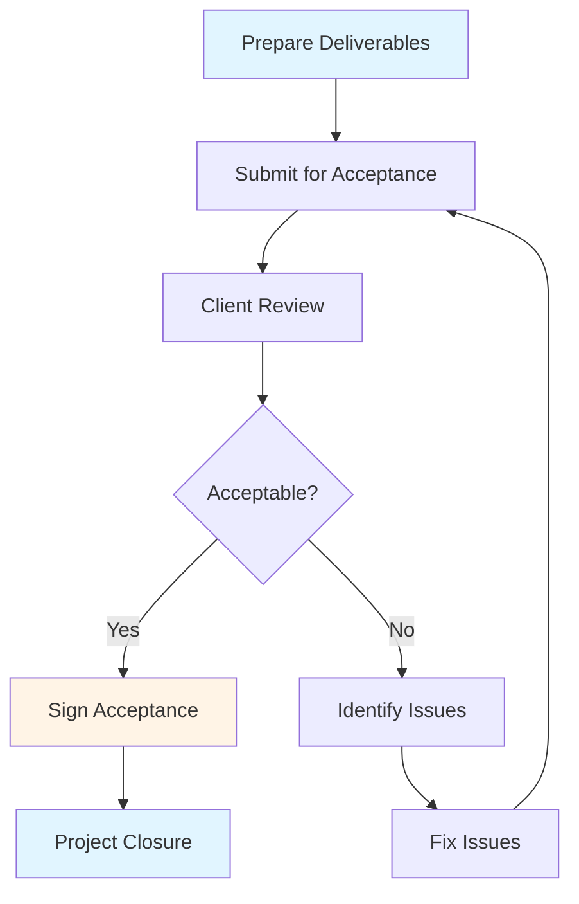

# Delivery & Handover Guide - Comprehensive

## Table of Contents
1. [Introduction](#introduction)
2. [Handover Preparation](#handover-preparation)
3. [Handover Checklist](#handover-checklist)
4. [Documentation Requirements](#documentation-requirements)
5. [Client Acceptance Process](#client-acceptance-process)
6. [Knowledge Transfer](#knowledge-transfer)
7. [Project Closure Activities](#project-closure-activities)
8. [Lessons Learned](#lessons-learned)
9. [Hands-On PM Experience](#hands-on-pm-experience)
10. [Best Practices](#best-practices)
11. [Common Pitfalls](#common-pitfalls)
12. [Real-World Examples](#real-world-examples)
13. [Templates & Checklists](#templates--checklists)
14. [Tools & Software](#tools--software)
15. [Resources](#resources)
16. [Summary](#summary)

---

## Introduction

Professional product handover is the final critical phase of a project. This guide covers the complete handover process, documentation requirements, client acceptance, knowledge transfer, project closure, and lessons learned. It also includes guidance for hands-on PM experience with real projects.

### Who This Guide Is For
- Project managers closing projects
- Teams preparing for handover
- Clients receiving deliverables
- New PMs gaining experience

### Key Learning Objectives
- Prepare comprehensive handover
- Create complete documentation
- Facilitate client acceptance
- Transfer knowledge effectively
- Close projects professionally
- Learn from project experience
- Gain hands-on PM experience

---

## Handover Preparation

### Overview

Handover preparation should begin early in the project, not just at the end. Proper preparation ensures smooth transition and client satisfaction.

### When to Start Preparation

**Early Preparation** (Throughout Project):
- Document as you go
- Maintain documentation
- Prepare handover materials
- Build knowledge base

**Final Preparation** (Last 2-4 Weeks):
- Finalize documentation
- Prepare handover package
- Schedule handover meetings
- Plan knowledge transfer

### Handover Preparation Activities

#### 1. Documentation Review
- [ ] All documentation complete
- [ ] Documentation reviewed
- [ ] Documentation approved
- [ ] Documentation organized

#### 2. System Preparation
- [ ] System tested
- [ ] System deployed
- [ ] System configured
- [ ] System verified

#### 3. Training Preparation
- [ ] Training materials prepared
- [ ] Training schedule created
- [ ] Trainers assigned
- [ ] Training environment ready

#### 4. Support Preparation
- [ ] Support team identified
- [ ] Support processes defined
- [ ] Support documentation ready
- [ ] Support contacts provided

#### 5. Client Preparation
- [ ] Client team identified
- [ ] Client expectations set
- [ ] Handover schedule agreed
- [ ] Acceptance criteria clear

### Handover Timeline

**4 Weeks Before Handover**:
- Finalize all features
- Complete testing
- Start documentation review
- Begin training preparation

**2 Weeks Before Handover**:
- Complete documentation
- Deploy to production
- Schedule training
- Prepare handover package

**1 Week Before Handover**:
- Final testing
- Documentation review
- Training sessions
- Handover package review

**Handover Week**:
- Final handover meetings
- Knowledge transfer sessions
- Client acceptance
- Project closure

---

## Handover Checklist

### Comprehensive Handover Checklist

#### Technical Deliverables
- [ ] Source code delivered
- [ ] Code documentation complete
- [ ] Database schema documented
- [ ] API documentation complete
- [ ] Configuration documented
- [ ] Deployment scripts provided
- [ ] Environment setup guide
- [ ] Troubleshooting guide

#### System Deliverables
- [ ] System deployed to production
- [ ] System tested and verified
- [ ] Performance acceptable
- [ ] Security reviewed
- [ ] Backup procedures in place
- [ ] Monitoring configured
- [ ] Logging configured
- [ ] Error handling verified

#### Documentation Deliverables
- [ ] User manual
- [ ] Administrator guide
- [ ] Technical documentation
- [ ] API documentation
- [ ] Database documentation
- [ ] Architecture documentation
- [ ] Deployment guide
- [ ] Operations manual

#### Training Deliverables
- [ ] User training completed
- [ ] Administrator training completed
- [ ] Training materials provided
- [ ] Training videos (if applicable)
- [ ] FAQ document
- [ ] Quick reference guide

#### Support Deliverables
- [ ] Support team identified
- [ ] Support process documented
- [ ] Support contacts provided
- [ ] Escalation process defined
- [ ] Support SLA agreed
- [ ] Support tools access

#### Business Deliverables
- [ ] Project completion report
- [ ] Final status report
- [ ] Budget report
- [ ] Lessons learned document
- [ ] Client acceptance sign-off
- [ ] Project closure document

### Handover Package Contents

**1. Executive Summary**
- Project overview
- Key achievements
- Deliverables summary
- Final status

**2. Technical Package**
- Source code
- Documentation
- Deployment materials
- Configuration files

**3. User Package**
- User manuals
- Training materials
- Quick guides
- FAQ

**4. Operations Package**
- Operations manual
- Support procedures
- Monitoring setup
- Backup procedures

**5. Project Package**
- Project documentation
- Status reports
- Budget reports
- Lessons learned

---

## Documentation Requirements

### Overview

Comprehensive documentation is essential for successful handover. Documentation enables client teams to understand, operate, and maintain the system.

### Documentation Types

#### 1. User Documentation
**Purpose**: Help end users use the system

**Contents**:
- Getting started guide
- Feature documentation
- Step-by-step procedures
- Screenshots and examples
- FAQ
- Troubleshooting

**Format**: PDF, online help, video tutorials

#### 2. Administrator Documentation
**Purpose**: Help administrators manage the system

**Contents**:
- Installation guide
- Configuration guide
- User management
- System configuration
- Backup and restore
- Monitoring
- Troubleshooting

**Format**: PDF, wiki, online documentation

#### 3. Technical Documentation
**Purpose**: Help developers understand and maintain the system

**Contents**:
- Architecture overview
- System design
- Database schema
- API documentation
- Code structure
- Development setup
- Testing procedures

**Format**: Markdown, wiki, code comments

#### 4. Operations Documentation
**Purpose**: Help operations team run the system

**Contents**:
- Deployment procedures
- Environment setup
- Monitoring setup
- Backup procedures
- Disaster recovery
- Incident response
- Maintenance procedures

**Format**: Runbooks, wiki, procedures

### Documentation Standards

#### Quality Standards
- **Clear**: Easy to understand
- **Complete**: All information included
- **Accurate**: Correct and up-to-date
- **Organized**: Logical structure
- **Accessible**: Easy to find
- **Maintainable**: Easy to update

#### Documentation Template

**Document Structure**:
1. **Title Page**: Document name, version, date
2. **Table of Contents**: Easy navigation
3. **Introduction**: Purpose and scope
4. **Main Content**: Detailed information
5. **Examples**: Practical examples
6. **Appendices**: Additional information
7. **Index**: Quick reference

### Documentation Best Practices

1. **Write as You Go**: Don't wait until end
2. **Keep Updated**: Maintain current
3. **Use Templates**: Consistent format
4. **Include Examples**: Practical examples
5. **Review Regularly**: Ensure accuracy
6. **Get Feedback**: From users
7. **Version Control**: Track changes

---

## Client Acceptance Process

### Overview

Client acceptance is the formal process where the client approves the deliverables. Clear acceptance process ensures both parties agree on what's been delivered.

### Acceptance Criteria

#### Definition
Acceptance criteria define what must be true for the client to accept the deliverable.

#### Types of Acceptance Criteria

**1. Functional Criteria**
- All features work as specified
- Requirements met
- User stories completed
- Acceptance tests passed

**2. Non-Functional Criteria**
- Performance acceptable
- Security requirements met
- Usability acceptable
- Compatibility verified

**3. Documentation Criteria**
- Documentation complete
- Documentation reviewed
- Documentation approved

**4. Training Criteria**
- Training completed
- Users competent
- Support team trained

### Acceptance Process

### Acceptance Testing

#### User Acceptance Testing (UAT)
**Purpose**: Verify system meets user needs

**Process**:
1. Prepare test scenarios
2. Execute tests
3. Document results
4. Fix issues
5. Retest
6. Sign off

**Participants**: End users, client representatives

#### Acceptance Sign-Off

**Acceptance Form**:
- Project name
- Deliverables list
- Acceptance criteria
- Test results
- Signatures
- Date

**Sign-Off Process**:
1. Complete acceptance form
2. Review with client
3. Get signatures
4. Document acceptance
5. Archive documents

### Handling Acceptance Issues

#### Common Issues
- Missing features
- Bugs
- Performance issues
- Documentation gaps
- Training needs

#### Resolution Process
1. **Document Issues**: Clear description
2. **Prioritize**: Critical vs minor
3. **Plan Fixes**: Timeline and resources
4. **Implement Fixes**: Resolve issues
5. **Verify**: Test fixes
6. **Re-submit**: For acceptance

---

## Knowledge Transfer

### Overview

Knowledge transfer ensures the client team can operate and maintain the system independently. Effective knowledge transfer is critical for long-term success.

### Knowledge Transfer Methods

#### 1. Training Sessions
**Types**:
- User training
- Administrator training
- Technical training
- Train-the-trainer

**Format**:
- Classroom training
- Hands-on workshops
- Online training
- Video tutorials

**Duration**: 1-5 days depending on complexity

#### 2. Documentation
**Types**:
- User manuals
- Technical documentation
- Procedures
- FAQs

**Format**: PDF, wiki, online help

#### 3. Pairing/Shadowing
**Method**: Client team works alongside project team

**Duration**: 1-4 weeks

**Benefits**:
- Hands-on learning
- Real-time support
- Relationship building

#### 4. Knowledge Base
**Contents**:
- Common issues
- Solutions
- Best practices
- Tips and tricks

**Format**: Wiki, knowledge base system

#### 5. Support Period
**Duration**: 1-3 months post-handover

**Activities**:
- Answer questions
- Troubleshoot issues
- Provide guidance
- Transfer knowledge

### Knowledge Transfer Plan

#### Training Plan Template

**Training Program**: [System Name]

**Target Audience**: [Users/Administrators/Developers]

**Training Sessions**:
1. **Session 1**: Introduction and Overview
   - Duration: 2 hours
   - Topics: System overview, key features
   - Format: Presentation + demo

2. **Session 2**: Basic Operations
   - Duration: 4 hours
   - Topics: Common tasks, basic features
   - Format: Hands-on workshop

3. **Session 3**: Advanced Features
   - Duration: 4 hours
   - Topics: Advanced features, customization
   - Format: Hands-on workshop

4. **Session 4**: Administration
   - Duration: 8 hours
   - Topics: System administration, configuration
   - Format: Hands-on workshop

**Materials**:
- Training slides
- Hands-on exercises
- Quick reference guide
- Video recordings

**Schedule**: [Dates and times]

**Trainers**: [Names]

### Knowledge Transfer Best Practices

1. **Start Early**: Begin during project
2. **Tailor Content**: To audience needs
3. **Hands-On**: Practical exercises
4. **Document**: Training materials
5. **Follow Up**: Support after training
6. **Measure**: Assess understanding
7. **Iterate**: Improve based on feedback

---

## Project Closure Activities

### Overview

Project closure activities formally end the project, document outcomes, and transition to operations or maintenance.

### Closure Activities

#### 1. Final Deliverables
- [ ] All deliverables completed
- [ ] Deliverables reviewed
- [ ] Deliverables accepted
- [ ] Deliverables archived

#### 2. Financial Closure
- [ ] Final budget report
- [ ] Invoice submission
- [ ] Payment received
- [ ] Financial records closed

#### 3. Resource Release
- [ ] Team members released
- [ ] Resources returned
- [ ] Access revoked
- [ ] Equipment returned

#### 4. Documentation Closure
- [ ] Final documentation
- [ ] Documentation archived
- [ ] Knowledge base updated
- [ ] Lessons learned documented

#### 5. Stakeholder Communication
- [ ] Final status report
- [ ] Closure announcement
- [ ] Thank you messages
- [ ] Future opportunities

#### 6. Administrative Closure
- [ ] Project closed in systems
- [ ] Timesheets closed
- [ ] Contracts closed
- [ ] Records archived

### Project Closure Report

#### Closure Report Template

**Project Closure Report**

**Project**: [Name]
**Closure Date**: [Date]
**Project Manager**: [Name]

**Executive Summary**:
[2-3 paragraph overview]

**Project Objectives**:
- [Objective 1] - [Status]
- [Objective 2] - [Status]
- [Objective 3] - [Status]

**Deliverables**:
- [Deliverable 1] - [Status]
- [Deliverable 2] - [Status]
- [Deliverable 3] - [Status]

**Schedule**:
- Planned Start: [Date]
- Actual Start: [Date]
- Planned End: [Date]
- Actual End: [Date]
- Variance: [Days]

**Budget**:
- Planned Budget: $[Amount]
- Actual Cost: $[Amount]
- Variance: $[Amount] ([%])

**Quality**:
- Defect Rate: [Rate]
- Test Coverage: [%]
- Client Satisfaction: [Rating]

**Lessons Learned**:
[Key lessons]

**Recommendations**:
[Future recommendations]

**Sign-Off**:
- Project Manager: [Signature]
- Client: [Signature]
- Date: [Date]

---

## Lessons Learned

### Overview

Lessons learned capture knowledge and experience from the project for future improvement. Documenting lessons learned is essential for organizational learning.

### Lessons Learned Process

#### 1. Collection
**When**: Throughout project and at closure

**Methods**:
- Retrospectives (Agile)
- Post-mortem meetings
- Surveys
- Interviews
- Documentation review

**Participants**: Project team, stakeholders

#### 2. Documentation
**Format**: Lessons learned document

**Contents**:
- What went well
- What could be improved
- What to do differently
- Recommendations

#### 3. Analysis
**Activities**:
- Categorize lessons
- Identify patterns
- Prioritize improvements
- Develop recommendations

#### 4. Sharing
**Methods**:
- Share with team
- Present to management
- Update processes
- Update templates
- Knowledge base

#### 5. Implementation
**Activities**:
- Update processes
- Update templates
- Training updates
- Tool improvements
- Policy changes

### Lessons Learned Template

**Lessons Learned Document**

**Project**: [Name]
**Date**: [Date]
**Facilitator**: [Name]

**What Went Well**:
1. [Success 1]
   - Description: [Description]
   - Why it worked: [Reason]
   - Recommendation: [Recommendation]

2. [Success 2]
   - [Details]

**What Could Be Improved**:
1. [Area 1]
   - Description: [Description]
   - Impact: [Impact]
   - Recommendation: [Recommendation]

2. [Area 2]
   - [Details]

**What to Do Differently**:
1. [Change 1]
   - Current approach: [Approach]
   - Recommended approach: [Approach]
   - Rationale: [Rationale]

2. [Change 2]
   - [Details]

**Recommendations**:
- [Recommendation 1]
- [Recommendation 2]
- [Recommendation 3]

**Action Items**:
- [Action 1] - Owner: [Name] - Due: [Date]
- [Action 2] - Owner: [Name] - Due: [Date]

### Lessons Learned Best Practices

1. **Be Honest**: Honest assessment
2. **Be Specific**: Concrete examples
3. **Be Constructive**: Focus on improvement
4. **Involve Team**: Team participation
5. **Document**: Written record
6. **Share**: Communicate findings
7. **Act**: Implement improvements

---

## Hands-On PM Experience

### Overview

Hands-on PM experience with real projects is essential for developing practical project management skills. This section provides guidance for gaining real-world PM experience.

### Finding PM Opportunities

#### 1. Internal Projects
**Opportunities**:
- Volunteer for PM role
- Shadow experienced PM
- Take on PM responsibilities
- Lead small projects

**Benefits**:
- Real experience
- Support available
- Lower risk
- Learning opportunity

#### 2. External Projects
**Opportunities**:
- Freelance projects
- Consulting projects
- Non-profit projects
- Startup projects

**Benefits**:
- Diverse experience
- Real client interaction
- Portfolio building
- Networking

#### 3. Training Programs
**Opportunities**:
- PM training programs
- Internship programs
- Mentorship programs
- Certification programs

**Benefits**:
- Structured learning
- Support and guidance
- Credentials
- Network building

### PM Experience Framework

#### Phase 1: Preparation (Weeks 1-2)
**Activities**:
- Understand project scope
- Review project documentation
- Meet team and stakeholders
- Learn project context
- Set up tools and processes

**Goals**:
- Understand project
- Build relationships
- Prepare for PM role

#### Phase 2: Planning (Weeks 3-4)
**Activities**:
- Create project plan
- Define scope
- Estimate effort
- Plan resources
- Identify risks
- Set up tracking

**Goals**:
- Complete project plan
- Get stakeholder approval
- Set up project management

#### Phase 3: Execution (Weeks 5-12)
**Activities**:
- Track progress
- Manage team
- Communicate with stakeholders
- Manage risks and issues
- Control quality
- Report status

**Goals**:
- Deliver on schedule
- Maintain quality
- Manage stakeholders

#### Phase 4: Closure (Weeks 13-14)
**Activities**:
- Prepare handover
- Facilitate acceptance
- Transfer knowledge
- Close project
- Document lessons learned

**Goals**:
- Successful handover
- Project closure
- Learning documentation

### PM Experience Best Practices

1. **Start Small**: Begin with small projects
2. **Get Support**: Mentor or experienced PM
3. **Learn Continuously**: Read, train, practice
4. **Document Experience**: Keep journal
5. **Reflect**: Regular reflection
6. **Ask Questions**: Don't hesitate to ask
7. **Take Responsibility**: Own the project

### PM Experience Checklist

**Before Starting**:
- [ ] Understand PM role
- [ ] Review PM guides
- [ ] Set up tools
- [ ] Get support/mentor
- [ ] Prepare learning plan

**During Project**:
- [ ] Track progress daily
- [ ] Communicate regularly
- [ ] Manage risks and issues
- [ ] Document decisions
- [ ] Reflect weekly

**After Project**:
- [ ] Document experience
- [ ] Analyze what worked
- [ ] Identify improvements
- [ ] Update skills
- [ ] Plan next project

### Learning from Experience

#### Reflection Questions
1. What went well?
2. What could be improved?
3. What did I learn?
4. What would I do differently?
5. What skills need development?

#### Skill Development
**Technical Skills**:
- Project planning
- Risk management
- Quality control
- Reporting

**Soft Skills**:
- Communication
- Leadership
- Negotiation
- Problem solving

**Tools**:
- Project management tools
- Reporting tools
- Communication tools

---

## Best Practices

### Handover Best Practices

1. **Start Early**: Prepare throughout project
2. **Be Comprehensive**: Complete documentation
3. **Test Thoroughly**: Verify everything works
4. **Train Effectively**: Ensure knowledge transfer
5. **Communicate Clearly**: Set expectations
6. **Get Sign-Off**: Formal acceptance
7. **Follow Up**: Support after handover

### Documentation Best Practices

1. **Write as You Go**: Don't wait until end
2. **Keep Updated**: Maintain current
3. **Use Templates**: Consistent format
4. **Include Examples**: Practical examples
5. **Review Regularly**: Ensure accuracy
6. **Get Feedback**: From users
7. **Version Control**: Track changes

### Knowledge Transfer Best Practices

1. **Start Early**: Begin during project
2. **Tailor Content**: To audience needs
3. **Hands-On**: Practical exercises
4. **Document**: Training materials
5. **Follow Up**: Support after training
6. **Measure**: Assess understanding
7. **Iterate**: Improve based on feedback

### Project Closure Best Practices

1. **Complete All Activities**: Don't skip steps
2. **Document Everything**: Complete records
3. **Get Sign-Off**: Formal closure
4. **Release Resources**: Free up team
5. **Archive Documents**: Store properly
6. **Communicate**: Announce closure
7. **Learn**: Document lessons

---

## Common Pitfalls

### Handover Pitfalls

1. **Last-Minute Preparation**: Rushing at end
2. **Incomplete Documentation**: Missing information
3. **Insufficient Training**: Not enough knowledge transfer
4. **No Support Plan**: Unclear support
5. **Unclear Acceptance**: Vague criteria
6. **No Follow-Up**: Abandon after handover
7. **Poor Communication**: Unclear expectations

### Documentation Pitfalls

1. **Outdated**: Not maintained
2. **Incomplete**: Missing information
3. **Unclear**: Hard to understand
4. **Inconsistent**: Different formats
5. **Not Accessible**: Hard to find
6. **No Examples**: Abstract only
7. **No Review**: Not validated

### Knowledge Transfer Pitfalls

1. **Too Late**: Start at end
2. **Too Fast**: Rushed training
3. **Not Tailored**: Generic content
4. **No Hands-On**: Theory only
5. **No Follow-Up**: No support
6. **No Measurement**: Don't assess learning
7. **One-Time**: No ongoing support

---

## Real-World Examples

### Example 1: Successful Handover

**Project**: E-commerce Platform
**Preparation**: Started 4 weeks before
**Documentation**: Complete and reviewed
**Training**: 5-day comprehensive program
**Result**: Smooth transition, client satisfied

### Example 2: Knowledge Transfer Success

**Project**: Banking System
**Method**: Pairing + training + documentation
**Duration**: 3 months support period
**Result**: Client team independent, successful operation

### Example 3: PM Experience

**Project**: Small Web Application
**PM**: First-time PM with mentor
**Duration**: 3 months
**Result**: Successful delivery, valuable learning

---

## Templates & Checklists

### Handover Checklist

See [Handover Checklist](#handover-checklist) section above.

### Acceptance Form Template

**Project Acceptance Form**

**Project**: [Name]
**Date**: [Date]

**Deliverables**:
- [Deliverable 1] - [Status]
- [Deliverable 2] - [Status]

**Acceptance Criteria Met**: [Yes/No]
**Comments**: [Comments]

**Signatures**:
- Client: [Name, Signature, Date]
- Project Manager: [Name, Signature, Date]

### Project Closure Checklist

- [ ] All deliverables completed
- [ ] Client acceptance received
- [ ] Documentation complete
- [ ] Training completed
- [ ] Knowledge transferred
- [ ] Support plan in place
- [ ] Financial closure
- [ ] Resources released
- [ ] Lessons learned documented
- [ ] Project closed in systems
- [ ] Final report submitted
- [ ] Stakeholders notified

---

## Tools & Software

### Documentation Tools

1. **Confluence**: Team documentation
2. **Google Docs**: Collaborative documentation
3. **Markdown**: Technical documentation
4. **Word**: Formal documentation

### Project Management Tools

1. **Jira**: Project tracking
2. **Microsoft Project**: Project planning
3. **Asana**: Task management

### Knowledge Base Tools

1. **Confluence**: Knowledge base
2. **Notion**: Documentation
3. **GitBook**: Documentation platform

---

## Resources

### Books

1. "Project Management: A Systems Approach to Planning, Scheduling, and Controlling" - Harold Kerzner
2. "The PMI Guide to Project Management" - PMI

### Online Resources

1. **PMI**: Project Management Institute
2. **Project Management.com**: PM resources

---

## Summary

### Key Takeaways

1. **Prepare Early**: Start handover preparation early
2. **Be Comprehensive**: Complete documentation and training
3. **Get Acceptance**: Formal client acceptance
4. **Transfer Knowledge**: Effective knowledge transfer
5. **Close Properly**: Complete closure activities
6. **Learn**: Document lessons learned
7. **Gain Experience**: Hands-on PM experience

### Final Recommendations

1. **Plan Handover**: Include in project plan
2. **Document Continuously**: Don't wait until end
3. **Train Effectively**: Comprehensive training
4. **Get Sign-Off**: Formal acceptance
5. **Support Transition**: Post-handover support
6. **Learn Continuously**: From every project
7. **Build Experience**: Real projects

Remember: Professional handover ensures client satisfaction, smooth transition, and sets foundation for long-term success. Invest time in preparation, documentation, and knowledge transfer.

---

**Last Updated**: 2024

**Related Guides**:
- [Project Methodologies Guide](./PROJECT_METHODOLOGIES_GUIDE.md)
- [Planning & Estimation Guide](./PLANNING_ESTIMATION_GUIDE.md)
- [Team Management & Leadership Guide](./TEAM_MANAGEMENT_LEADERSHIP_GUIDE.md)

