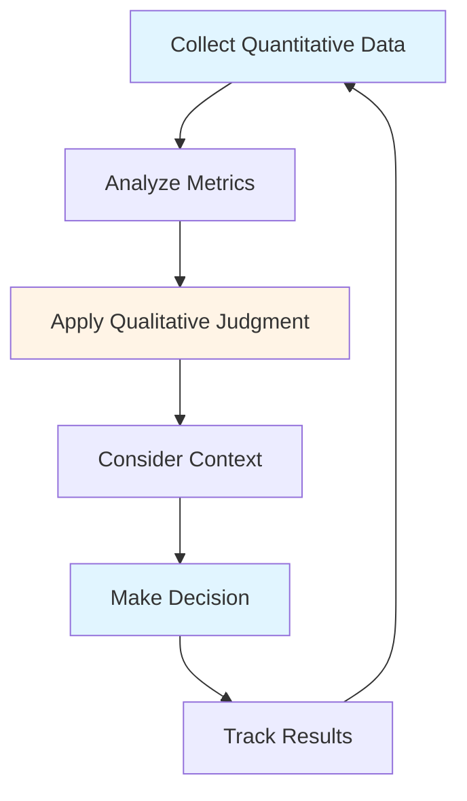

# Monitoring, Control & Reporting Guide - Comprehensive

## Table of Contents
1. [Introduction](#introduction)
2. [Progress Tracking](#progress-tracking)
3. [Quality Control](#quality-control)
4. [Reporting Tools](#reporting-tools)
5. [Metrics and KPIs](#metrics-and-kpis)
6. [Dashboard Creation](#dashboard-creation)
7. [Qualitative vs Quantitative PM](#qualitative-vs-quantitative-pm)
8. [Best Practices](#best-practices)
9. [Common Pitfalls](#common-pitfalls)
10. [Real-World Examples](#real-world-examples)
11. [Templates & Checklists](#templates--checklists)
12. [Tools & Software](#tools--software)
13. [Resources](#resources)
14. [Summary](#summary)

---

## Introduction

Effective monitoring, control, and reporting are essential for project success. This guide covers daily progress tracking, quality control, reporting tools (Excel, PowerBI), metrics and KPIs, dashboard creation, and the balance between qualitative and quantitative project management.

### Who This Guide Is For
- Project managers tracking project progress
- Team leads monitoring team performance
- Anyone responsible for project reporting
- Managers needing project visibility

### Key Learning Objectives
- Track progress effectively
- Control project quality
- Use reporting tools (Excel, PowerBI)
- Define and track KPIs
- Create effective dashboards
- Balance qualitative and quantitative approaches

---

## Progress Tracking

### Overview

Progress tracking involves monitoring project activities, deliverables, and milestones to ensure the project is on track. Effective tracking enables early problem detection and timely corrective actions.

### Progress Tracking Methods

#### 1. Task-Level Tracking
**What to Track**:
- Task status (Not Started, In Progress, Done)
- Task completion percentage
- Time spent vs estimated
- Blockers and impediments
- Dependencies

**Tools**:
- Jira, Asana, Trello
- Excel spreadsheets
- Project management software

**Frequency**: Daily/Weekly

#### 2. Sprint/Iteration Tracking (Agile)
**What to Track**:
- Sprint velocity
- Story points completed
- Burndown chart
- Sprint goal achievement
- Impediments

**Tools**:
- Jira, Azure DevOps
- Burndown charts
- Velocity charts

**Frequency**: Daily during sprint

#### 3. Milestone Tracking
**What to Track**:
- Milestone dates
- Deliverable completion
- Dependencies
- Risks
- Budget status

**Tools**:
- Gantt charts
- Milestone reports
- Project dashboards

**Frequency**: Weekly/Monthly

#### 4. Resource Tracking
**What to Track**:
- Team member availability
- Workload distribution
- Utilization rates
- Overtime
- Skills and capacity

**Tools**:
- Resource management software
- Excel spreadsheets
- HR systems

**Frequency**: Weekly

### Daily Progress Tracking

#### Daily Standup (Agile)
**Format**:
- What did I complete yesterday?
- What will I work on today?
- Are there any blockers?

**Duration**: 15 minutes
**Participants**: Development team

#### Daily Status Report (Waterfall)
**Format**:
- Tasks completed
- Tasks in progress
- Blockers
- Next day plan

**Duration**: 5-10 minutes per person
**Method**: Email, chat, or tool update

### Progress Tracking Best Practices

1. **Consistent Tracking**: Same method, same time
2. **Real-Time Updates**: Update as work happens
3. **Accurate Data**: Honest reporting
4. **Visual Representation**: Charts and graphs
5. **Regular Reviews**: Weekly/monthly reviews
6. **Action on Variance**: Act on deviations
7. **Communication**: Share with stakeholders

### Progress Tracking Template

**Daily Status Report**:

**Date**: [Date]
**Team Member**: [Name]
**Project**: [Project Name]

**Completed Today**:
- [Task 1]
- [Task 2]

**In Progress**:
- [Task 3] - 60% complete
- [Task 4] - 30% complete

**Blockers**:
- [Blocker 1] - Need [Resource/Information]
- [Blocker 2] - Waiting for [Dependency]

**Planned for Tomorrow**:
- [Task 5]
- [Task 6]

**Notes**:
[Any additional information]

---

## Quality Control

### Overview

Quality control ensures that project deliverables meet requirements and standards. It involves processes, tools, and techniques to monitor and verify quality throughout the project.

### Quality Control Processes

#### 1. Code Reviews
**Purpose**: Ensure code quality and standards

**Process**:
- Developer submits code for review
- Reviewer examines code
- Feedback provided
- Issues fixed
- Code approved

**Checklist**:
- [ ] Code follows standards
- [ ] No obvious bugs
- [ ] Proper error handling
- [ ] Adequate comments
- [ ] Performance considerations
- [ ] Security best practices

**Frequency**: For every code change

#### 2. Testing
**Types**:
- Unit testing
- Integration testing
- System testing
- User acceptance testing

**Process**:
- Test planning
- Test case creation
- Test execution
- Defect reporting
- Retesting
- Test reporting

**Frequency**: Continuous throughout project

#### 3. Quality Gates
**Definition**: Checkpoints where quality is verified

**Gates**:
- Requirements review
- Design review
- Code review
- Testing completion
- Deployment readiness

**Criteria**: Must meet criteria to proceed

#### 4. Defect Management
**Process**:
- Defect identification
- Defect logging
- Defect prioritization
- Defect assignment
- Defect fixing
- Defect verification
- Defect closure

**Tracking**: Defect tracking system (Jira, Bugzilla)

### Quality Metrics

#### 1. Defect Density
**Formula**: Defects per KLOC (thousand lines of code)

**Target**: < 5 defects per KLOC

**Calculation**:
```
Defect Density = Total Defects / (Lines of Code / 1000)
```

#### 2. Defect Removal Efficiency
**Formula**: Percentage of defects found before release

**Target**: > 90%

**Calculation**:
```
DRE = (Defects Found Before Release / Total Defects) × 100
```

#### 3. Test Coverage
**Formula**: Percentage of code covered by tests

**Target**: > 80%

**Calculation**:
```
Test Coverage = (Lines Covered by Tests / Total Lines) × 100
```

#### 4. Code Review Coverage
**Formula**: Percentage of code reviewed

**Target**: 100%

**Calculation**:
```
Review Coverage = (Lines Reviewed / Total Lines) × 100
```

### Quality Control Best Practices

1. **Early Quality Focus**: Quality from start
2. **Automated Testing**: Automated test suites
3. **Continuous Integration**: Regular builds and tests
4. **Code Reviews**: All code reviewed
5. **Standards**: Clear quality standards
6. **Training**: Team training on quality
7. **Metrics**: Track quality metrics

### Quality Control Checklist

**Code Quality**:
- [ ] Code follows standards
- [ ] No known bugs
- [ ] Proper error handling
- [ ] Adequate documentation
- [ ] Performance acceptable
- [ ] Security considerations

**Testing**:
- [ ] Unit tests written
- [ ] Integration tests passed
- [ ] System tests passed
- [ ] UAT completed
- [ ] Test coverage adequate

**Documentation**:
- [ ] Code documented
- [ ] API documented
- [ ] User guide updated
- [ ] Technical docs updated

---

## Reporting Tools

### Microsoft Excel

#### Overview
Excel is a powerful tool for project reporting, data analysis, and visualization. It's widely available and most stakeholders are familiar with it.

#### Common Excel Uses

**1. Status Reports**
- Task lists with status
- Progress percentages
- Timeline tracking
- Resource allocation

**2. Budget Tracking**
- Budget vs actual
- Cost breakdown
- Variance analysis
- Forecasting

**3. Metrics Tracking**
- KPIs over time
- Trend analysis
- Comparative analysis
- Performance metrics

**4. Data Analysis**
- Pivot tables
- Charts and graphs
- Data filtering
- Conditional formatting

#### Excel Best Practices

1. **Structure**: Clear, organized structure
2. **Formulas**: Use formulas for calculations
3. **Charts**: Visual representation
4. **Formatting**: Consistent formatting
5. **Documentation**: Explain formulas and data
6. **Version Control**: Track versions
7. **Templates**: Use templates for consistency

#### Excel Templates

**Status Report Template**:
- Project name and date
- Task list with status
- Progress percentages
- Timeline (Gantt-style)
- Risks and issues
- Next steps

**Budget Template**:
- Budget categories
- Planned vs actual
- Variance calculation
- Percentage variance
- Trend analysis

**Metrics Dashboard**:
- Key metrics
- Charts and graphs
- Trend indicators
- Color coding (green/yellow/red)

### Power BI

#### Overview
Power BI is a business analytics tool for creating interactive dashboards and reports. It's powerful for data visualization and analysis.

#### Power BI Features

**1. Data Connection**
- Connect to multiple data sources
- Excel, databases, APIs
- Real-time data
- Scheduled refreshes

**2. Data Modeling**
- Relationships between tables
- Calculated columns
- Measures (DAX formulas)
- Data transformation

**3. Visualization**
- Various chart types
- Interactive dashboards
- Drill-down capabilities
- Custom visuals

**4. Sharing**
- Publish to Power BI service
- Share with stakeholders
- Mobile access
- Scheduled reports

#### Power BI Use Cases

**1. Project Dashboard**
- Project status overview
- Progress metrics
- Resource utilization
- Budget tracking
- Risk and issue summary

**2. Portfolio Dashboard**
- Multiple projects overview
- Resource allocation across projects
- Budget summary
- Performance comparison

**3. Team Performance**
- Team velocity
- Productivity metrics
- Quality metrics
- Individual performance

#### Power BI Best Practices

1. **Data Model**: Well-structured data model
2. **Performance**: Optimize for performance
3. **Visualization**: Choose right chart types
4. **Interactivity**: Enable drill-down
5. **Documentation**: Document data sources
6. **Security**: Proper access control
7. **Refresh Schedule**: Regular data refresh

### Other Reporting Tools

#### 1. Tableau
- Advanced data visualization
- Interactive dashboards
- Strong analytics capabilities

#### 2. Google Data Studio
- Free reporting tool
- Google ecosystem integration
- Easy sharing

#### 3. Jira Dashboards
- Built-in project tracking
- Customizable widgets
- Real-time updates

#### 4. Custom Dashboards
- Web-based dashboards
- Real-time data
- Customizable

---

## Metrics and KPIs

### Overview

Key Performance Indicators (KPIs) measure project success. Selecting the right metrics and tracking them effectively provides visibility into project health.

### Project KPIs

#### 1. Schedule Performance
**Metrics**:
- **Schedule Variance (SV)**: Planned vs actual
- **Schedule Performance Index (SPI)**: Efficiency measure
- **Milestone Achievement**: On-time milestones

**Formulas**:
```
SV = Earned Value - Planned Value
SPI = Earned Value / Planned Value
```

**Target**: SPI > 1.0 (ahead of schedule)

#### 2. Cost Performance
**Metrics**:
- **Cost Variance (CV)**: Budget vs actual
- **Cost Performance Index (CPI)**: Efficiency measure
- **Budget Utilization**: Percentage used

**Formulas**:
```
CV = Earned Value - Actual Cost
CPI = Earned Value / Actual Cost
```

**Target**: CPI > 1.0 (under budget)

#### 3. Quality Metrics
**Metrics**:
- Defect density
- Defect removal efficiency
- Test coverage
- Code review coverage

**Targets**: As defined in quality standards

#### 4. Scope Performance
**Metrics**:
- Requirements completion
- Feature completion
- Scope change rate
- Change request count

**Target**: Minimal scope creep

#### 5. Team Performance
**Metrics**:
- Velocity (Agile)
- Productivity
- Utilization
- Team satisfaction

**Target**: Stable or improving

### KPI Dashboard

**Essential KPIs**:
1. **Schedule**: On track / Behind / Ahead
2. **Budget**: On budget / Over / Under
3. **Quality**: Defect rate, test coverage
4. **Scope**: Requirements completion
5. **Team**: Velocity, utilization

**Visualization**:
- Traffic light indicators (Green/Yellow/Red)
- Gauge charts
- Trend lines
- Comparative charts

### Metrics Best Practices

1. **Relevant**: Metrics that matter
2. **Measurable**: Can be quantified
3. **Actionable**: Lead to actions
4. **Timely**: Available when needed
5. **Accurate**: Reliable data
6. **Balanced**: Multiple perspectives
7. **Reviewed**: Regular review and adjustment

---

## Dashboard Creation

### Overview

Dashboards provide visual representation of project status, enabling quick understanding of project health. Effective dashboards are clear, concise, and actionable.

### Dashboard Design Principles

#### 1. Clarity
- Clear labels
- Obvious metrics
- Easy to understand
- No clutter

#### 2. Relevance
- Show what matters
- Key metrics only
- Stakeholder-focused
- Action-oriented

#### 3. Visual Hierarchy
- Most important first
- Logical grouping
- Clear sections
- Visual flow

#### 4. Consistency
- Consistent colors
- Standard formats
- Regular updates
- Familiar layout

### Dashboard Components

#### 1. Executive Summary
- Overall project status
- Key metrics
- Traffic lights
- High-level view

#### 2. Progress Section
- Timeline/Gantt chart
- Milestone status
- Task completion
- Burndown chart (Agile)

#### 3. Budget Section
- Budget vs actual
- Cost breakdown
- Variance analysis
- Forecast

#### 4. Quality Section
- Defect metrics
- Test coverage
- Quality trends
- Quality gates

#### 5. Risks and Issues
- Risk summary
- Issue list
- Trend analysis
- Mitigation status

#### 6. Team Section
- Resource utilization
- Team velocity
- Availability
- Workload

### Dashboard Examples

#### Excel Dashboard
**Layout**:
- Top: Executive summary (traffic lights)
- Left: Progress charts
- Right: Budget and quality
- Bottom: Risks and issues

**Charts**:
- Gantt chart (timeline)
- Pie chart (budget breakdown)
- Bar chart (progress)
- Line chart (trends)

#### Power BI Dashboard
**Pages**:
- Page 1: Executive summary
- Page 2: Detailed progress
- Page 3: Budget analysis
- Page 4: Quality metrics
- Page 5: Team performance

**Features**:
- Interactive filters
- Drill-down capabilities
- Real-time updates
- Mobile responsive

### Dashboard Best Practices

1. **Know Your Audience**: Tailor to stakeholders
2. **Keep It Simple**: Don't overcrowd
3. **Use Color Wisely**: Consistent color coding
4. **Update Regularly**: Keep data current
5. **Make It Actionable**: Enable decisions
6. **Test Usability**: Get feedback
7. **Document**: Explain metrics

---

## Qualitative vs Quantitative PM

### Overview

Project management uses both qualitative (subjective, experience-based) and quantitative (data-driven, metrics-based) approaches. Effective PM balances both.

### Qualitative Project Management

#### Characteristics
- **Subjective**: Based on judgment
- **Experience-Based**: Uses experience
- **Intuitive**: Gut feelings
- **Contextual**: Considers context
- **Relationship-Focused**: Emphasizes relationships

#### Methods
- **Team Feelings**: How team feels
- **Stakeholder Perception**: What stakeholders think
- **Risk Intuition**: Gut feeling about risks
- **Quality Sense**: Sense of quality
- **Relationship Health**: Team dynamics

#### When to Use
- **Early Stages**: Limited data available
- **Complex Situations**: Hard to quantify
- **Team Dynamics**: People issues
- **Stakeholder Management**: Relationships
- **Risk Assessment**: Intuitive risks

#### Advantages
- **Flexible**: Adapts to situations
- **Fast**: Quick decisions
- **Holistic**: Considers all factors
- **Relationship-Aware**: Understands people
- **Context-Sensitive**: Considers context

#### Disadvantages
- **Subjective**: May be biased
- **Inconsistent**: Different judgments
- **Hard to Defend**: Difficult to justify
- **Experience-Dependent**: Needs experience
- **Not Measurable**: Can't track

### Quantitative Project Management

#### Characteristics
- **Objective**: Based on data
- **Measurable**: Can be measured
- **Comparable**: Can compare
- **Trackable**: Can track over time
- **Defensible**: Can justify

#### Methods
- **Metrics**: KPIs and metrics
- **Earned Value**: EVM analysis
- **Statistical Analysis**: Data analysis
- **Trends**: Historical trends
- **Forecasting**: Predictive analysis

#### When to Use
- **Planning**: Estimation and planning
- **Tracking**: Progress tracking
- **Reporting**: Status reports
- **Decision Making**: Data-driven decisions
- **Forecasting**: Predictions

#### Advantages
- **Objective**: Less bias
- **Comparable**: Can compare projects
- **Trackable**: Can track trends
- **Defensible**: Can justify decisions
- **Predictable**: Can forecast

#### Disadvantages
- **Data Dependent**: Needs good data
- **Time-Consuming**: Takes time to collect
- **May Miss Context**: Doesn't capture everything
- **Can Be Misleading**: Wrong interpretation
- **Requires Tools**: Needs systems

### Balancing Qualitative and Quantitative

#### Best Approach: Combination

**Use Quantitative For**:
- Progress tracking
- Budget management
- Schedule adherence
- Quality metrics
- Resource planning

**Use Qualitative For**:
- Team dynamics
- Stakeholder relationships
- Risk assessment
- Quality perception
- Team morale

#### Integration Framework



### Qualitative vs Quantitative Comparison

| Aspect | Qualitative | Quantitative |
|--------|-------------|--------------|
| **Basis** | Judgment, experience | Data, metrics |
| **Speed** | Fast | Slower |
| **Accuracy** | Variable | More consistent |
| **Defensibility** | Hard to defend | Easy to justify |
| **Context** | Considers context | May miss context |
| **Relationships** | Understands people | Focuses on data |
| **Flexibility** | Very flexible | Less flexible |
| **Measurement** | Not measurable | Measurable |

### Best Practices

1. **Start Quantitative**: Use data when available
2. **Add Qualitative**: Apply judgment and context
3. **Validate**: Check quantitative with qualitative
4. **Document**: Record both perspectives
5. **Learn**: Improve both skills
6. **Balance**: Don't rely on only one
7. **Communicate**: Explain both to stakeholders

---

## Best Practices

### Monitoring Best Practices

1. **Regular Tracking**: Consistent schedule
2. **Real-Time Updates**: Update as work happens
3. **Accurate Data**: Honest reporting
4. **Visual Representation**: Charts and graphs
5. **Action on Variance**: Act on deviations
6. **Communication**: Share with stakeholders
7. **Continuous Improvement**: Learn and improve

### Quality Control Best Practices

1. **Early Focus**: Quality from start
2. **Automated Testing**: Automated test suites
3. **Continuous Integration**: Regular builds
4. **Code Reviews**: All code reviewed
5. **Standards**: Clear quality standards
6. **Training**: Team training
7. **Metrics**: Track quality metrics

### Reporting Best Practices

1. **Know Audience**: Tailor to stakeholders
2. **Be Concise**: Key information only
3. **Be Visual**: Use charts and graphs
4. **Be Timely**: Regular, on-time reports
5. **Be Accurate**: Reliable data
6. **Be Actionable**: Enable decisions
7. **Be Consistent**: Standard format

---

## Common Pitfalls

### Monitoring Pitfalls

1. **No Tracking**: Not tracking progress
2. **Inaccurate Data**: Wrong information
3. **No Action**: Not acting on issues
4. **Too Much Data**: Information overload
5. **Too Little Data**: Insufficient information
6. **No Communication**: Not sharing with stakeholders
7. **Reactive Only**: Only reacting, not proactive

### Quality Control Pitfalls

1. **Late Testing**: Testing at the end
2. **No Standards**: Unclear quality standards
3. **Skipping Reviews**: Not reviewing code
4. **Ignoring Metrics**: Not tracking quality
5. **No Training**: Team not trained
6. **Rushing**: Compromising quality for speed
7. **No Follow-Up**: Not fixing issues

### Reporting Pitfalls

1. **Wrong Audience**: Not tailored
2. **Too Complex**: Hard to understand
3. **Outdated Data**: Not current
4. **No Insights**: Just data, no analysis
5. **Inconsistent**: Different formats
6. **Too Frequent**: Information overload
7. **Not Actionable**: Can't make decisions

---

## Real-World Examples

### Example 1: Effective Progress Tracking

**Project**: E-commerce Platform
**Method**: Daily standups + weekly reports

**Tracking**:
- Daily: Team standups, task updates
- Weekly: Status report with metrics
- Monthly: Dashboard review

**Result**:
- Early problem detection
- On-time delivery
- Stakeholder satisfaction

### Example 2: Quality Control Success

**Project**: Banking System
**Approach**: Automated testing + code reviews

**Process**:
- All code reviewed
- Automated test suite
- Continuous integration
- Quality gates

**Result**:
- Low defect rate
- High quality
- Customer satisfaction

### Example 3: Dashboard Implementation

**Project**: Multiple Projects Portfolio
**Tool**: Power BI dashboard

**Features**:
- Executive summary
- Project status
- Budget tracking
- Resource utilization

**Result**:
- Better visibility
- Faster decisions
- Improved management

---

## Templates & Checklists

### Status Report Template

**Project Status Report**

**Project**: [Name]
**Period**: [Date Range]
**Report Date**: [Date]
**Status**: [Green/Yellow/Red]

**Executive Summary**:
[2-3 sentence overview]

**Progress**:
- Completed: [List]
- In Progress: [List]
- Planned: [List]

**Budget**:
- Planned: $[Amount]
- Spent: $[Amount]
- Remaining: $[Amount]
- Variance: [%]

**Schedule**:
- On Track / Behind / Ahead
- Next Milestone: [Date]

**Quality**:
- Defects: [Count]
- Test Coverage: [%]
- Code Reviews: [%]

**Risks and Issues**:
- [Risk/Issue 1]
- [Risk/Issue 2]

**Next Steps**:
- [Action 1]
- [Action 2]

### Quality Control Checklist

- [ ] Code reviews completed
- [ ] Unit tests written and passing
- [ ] Integration tests passed
- [ ] System tests completed
- [ ] UAT completed
- [ ] Defect rate acceptable
- [ ] Test coverage adequate
- [ ] Documentation updated
- [ ] Performance acceptable
- [ ] Security reviewed

---

## Tools & Software

### Progress Tracking Tools

1. **Jira**: Task and sprint tracking
2. **Asana**: Project management
3. **Microsoft Project**: Gantt charts
4. **Trello**: Simple task boards

### Quality Tools

1. **SonarQube**: Code quality
2. **Jira**: Defect tracking
3. **TestRail**: Test management
4. **GitHub**: Code reviews

### Reporting Tools

1. **Excel**: Spreadsheets and charts
2. **Power BI**: Business intelligence
3. **Tableau**: Data visualization
4. **Google Data Studio**: Free reporting

### Dashboard Tools

1. **Power BI**: Interactive dashboards
2. **Tableau**: Advanced visualization
3. **Grafana**: Metrics dashboards
4. **Custom**: Web-based dashboards

---

## Resources

### Books

1. "Project Management Metrics, KPIs, and Dashboards" - Harold Kerzner
2. "Earned Value Project Management" - Quentin Fleming
3. "Quality Software Management" - Gerald Weinberg

### Online Resources

1. **PMI**: Project Management Institute
2. **Microsoft Power BI**: Documentation and training
3. **Excel**: Microsoft Excel training

---

## Summary

### Key Takeaways

1. **Progress Tracking**: Regular, accurate, actionable
2. **Quality Control**: Early focus, automated, continuous
3. **Reporting Tools**: Excel for basic, Power BI for advanced
4. **Metrics and KPIs**: Relevant, measurable, actionable
5. **Dashboards**: Clear, relevant, actionable
6. **Balance**: Both qualitative and quantitative

### Final Recommendations

1. **Track Regularly**: Consistent tracking schedule
2. **Use Tools**: Leverage Excel, Power BI, etc.
3. **Define Metrics**: Clear, relevant KPIs
4. **Create Dashboards**: Visual, actionable
5. **Balance Approaches**: Quantitative + qualitative
6. **Communicate**: Share with stakeholders
7. **Improve Continuously**: Learn and refine

Remember: Effective monitoring and reporting provide visibility, enable decisions, and drive project success. Use both data and judgment for best results.

---

**Last Updated**: 2024

**Related Guides**:
- [Planning & Estimation Guide](./PLANNING_ESTIMATION_GUIDE.md)
- [Risk & Issue Management Guide](./RISK_ISSUE_MANAGEMENT_GUIDE.md)
- [Team Management & Leadership Guide](./TEAM_MANAGEMENT_LEADERSHIP_GUIDE.md)

