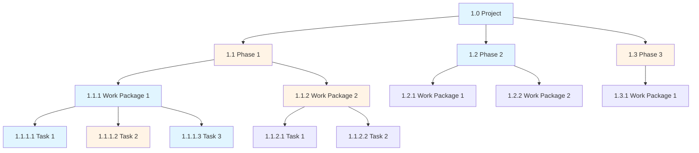
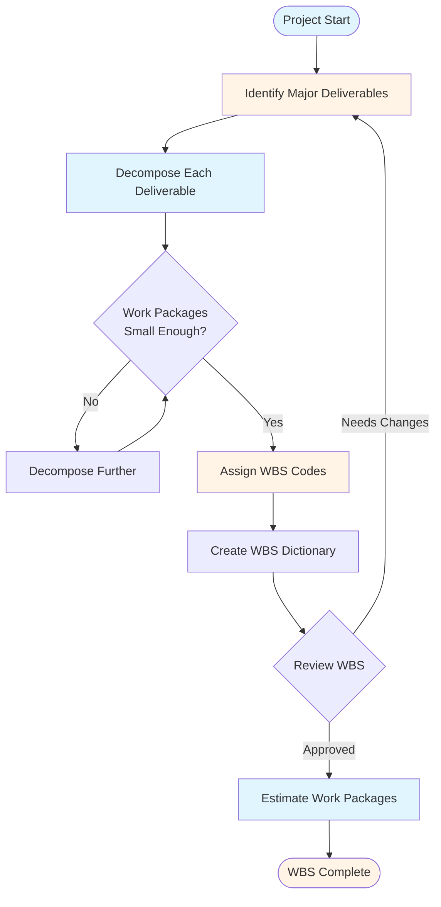
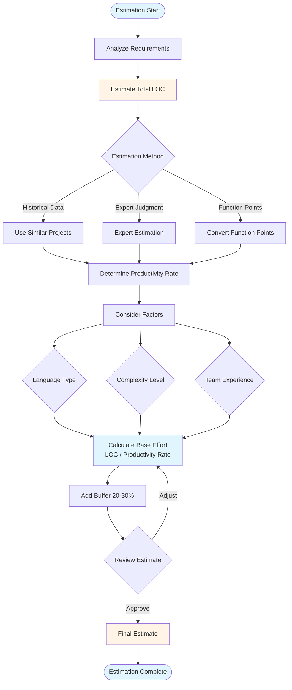
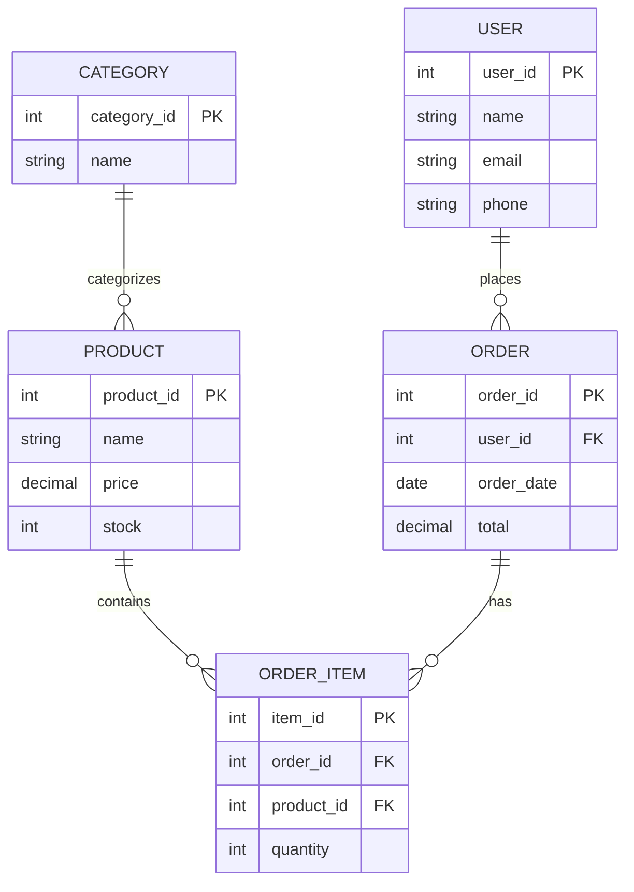
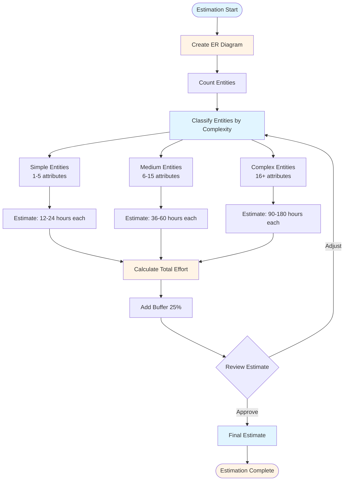
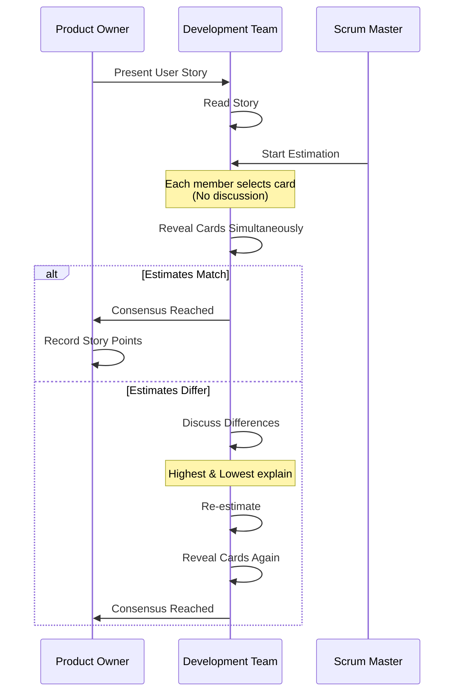
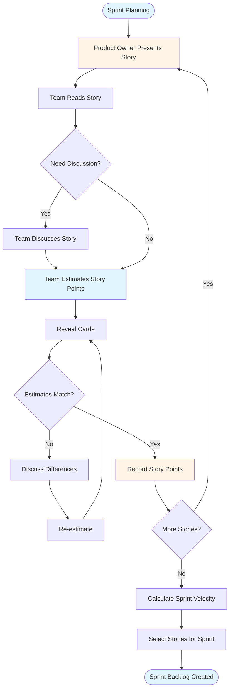
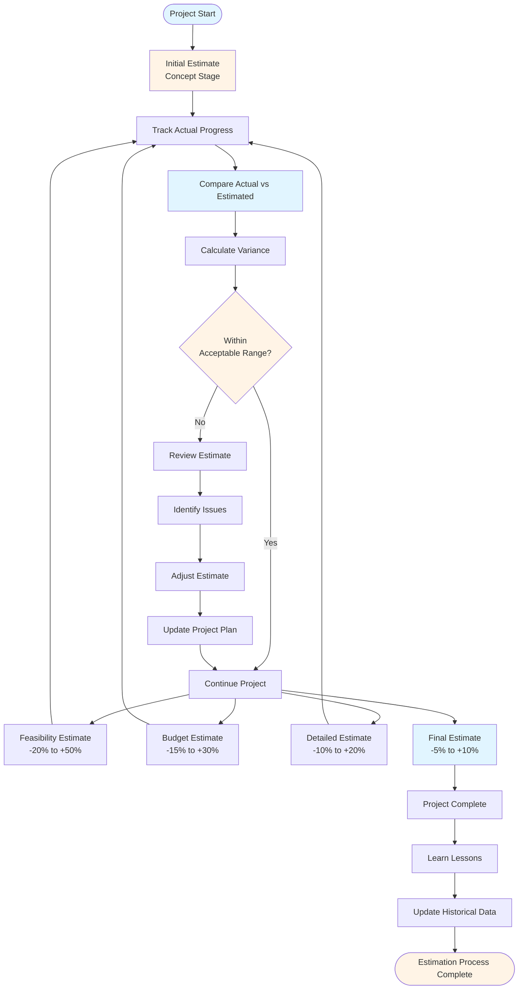

# Planning & Estimation Guide - Comprehensive

## Table of Contents
1. [Introduction](#introduction)
2. [Work Breakdown Structure (WBS)](#work-breakdown-structure-wbs)
3. [Lines of Code (LOC) Estimation](#lines-of-code-loc-estimation)
4. [Entity-Based Estimation](#entity-based-estimation)
5. [Story Point Estimation](#story-point-estimation)
6. [Other Estimation Methods](#other-estimation-methods)
7. [Proposal Writing](#proposal-writing)
8. [Estimation Accuracy and Buffers](#estimation-accuracy-and-buffers)
9. [Best Practices](#best-practices)
10. [Common Pitfalls](#common-pitfalls)
11. [Real-World Examples](#real-world-examples)
12. [Templates & Checklists](#templates--checklists)
13. [Tools & Software](#tools--software)
14. [Resources](#resources)
15. [Summary](#summary)

---

## Introduction

Accurate project estimation is one of the most critical skills for a project manager. Poor estimation leads to budget overruns, missed deadlines, and unhappy stakeholders. This guide covers various estimation methods and proposal writing techniques to help you create accurate project plans.

### Who This Guide Is For
- Project managers creating project estimates
- Business analysts preparing proposals
- Team leads estimating work
- Anyone involved in project planning

### Key Learning Objectives
- Master Work Breakdown Structure (WBS)
- Understand different estimation methods
- Learn when to use each estimation technique
- Create professional proposals
- Improve estimation accuracy

---

## Work Breakdown Structure (WBS)

### Overview

Work Breakdown Structure (WBS) is a hierarchical decomposition of the total scope of work to be carried out by the project team. It breaks down the project into smaller, more manageable components.

### WBS Structure



### WBS Creation Process



### WBS Principles

1. **100% Rule**: The WBS includes 100% of the work defined by the project scope
2. **Mutually Exclusive**: No overlap between elements
3. **Outcome-Oriented**: Focus on deliverables, not activities
4. **Hierarchical**: Organized in levels of detail
5. **Progressive Elaboration**: Detailed as project progresses

### WBS Levels

#### Level 1: Project
The entire project scope

#### Level 2: Major Phases/Deliverables
Main project phases or major deliverables

#### Level 3: Work Packages
Groups of related tasks that produce deliverables

#### Level 4: Activities/Tasks
Individual tasks that can be assigned and estimated

#### Level 5: Subtasks (Optional)
Further breakdown if needed

### Creating a WBS

#### Step 1: Identify Major Deliverables
- List all major deliverables
- Group related deliverables
- Ensure completeness

**Example**:
- Web Application Project
  - Requirements Document
  - Design Documents
  - Source Code
  - Test Cases
  - User Documentation
  - Deployed System

#### Step 2: Decompose Each Deliverable
Break down each deliverable into smaller components

**Example**:
- Requirements Document
  - Business Requirements
  - Functional Requirements
  - Non-Functional Requirements
  - Use Cases
  - User Stories

#### Step 3: Continue Decomposition
Continue until work packages are:
- Small enough to estimate accurately
- Clear enough to assign
- Manageable (40-80 hours typically)

#### Step 4: Assign WBS Codes
Use hierarchical numbering:
- 1.0 Project
  - 1.1 Phase 1
    - 1.1.1 Work Package 1
      - 1.1.1.1 Task 1
      - 1.1.1.2 Task 2

### WBS Dictionary

A WBS Dictionary provides detailed information about each WBS element:

**Template**:
- **WBS Code**: 1.1.1.1
- **Name**: User Authentication Module
- **Description**: Develop user login, registration, and password reset functionality
- **Deliverable**: Working authentication module with unit tests
- **Assumptions**: Using OAuth 2.0
- **Dependencies**: Database design must be complete
- **Resources**: 2 developers, 1 tester
- **Estimated Effort**: 80 hours
- **Acceptance Criteria**: 
  - User can register
  - User can login
  - User can reset password
  - All security requirements met

### WBS Best Practices

1. **Involve Team**: Get input from team members
2. **Use Templates**: Leverage industry templates
3. **Review Regularly**: Update as project evolves
4. **Keep Balanced**: Similar level of detail at each level
5. **Focus on Deliverables**: Not activities or processes

### WBS Example: E-commerce Website

```
1.0 E-commerce Website Project
├── 1.1 Requirements
│   ├── 1.1.1 Business Requirements
│   ├── 1.1.2 Functional Requirements
│   └── 1.1.3 Non-Functional Requirements
├── 1.2 Design
│   ├── 1.2.1 System Architecture
│   ├── 1.2.2 Database Design
│   ├── 1.2.3 UI/UX Design
│   └── 1.2.4 API Design
├── 1.3 Development
│   ├── 1.3.1 Backend Development
│   │   ├── 1.3.1.1 User Management
│   │   ├── 1.3.1.2 Product Management
│   │   ├── 1.3.1.3 Order Management
│   │   └── 1.3.1.4 Payment Integration
│   ├── 1.3.2 Frontend Development
│   │   ├── 1.3.2.1 Homepage
│   │   ├── 1.3.2.2 Product Pages
│   │   ├── 1.3.2.3 Shopping Cart
│   │   └── 1.3.2.4 Checkout
│   └── 1.3.3 Integration
├── 1.4 Testing
│   ├── 1.4.1 Unit Testing
│   ├── 1.4.2 Integration Testing
│   ├── 1.4.3 System Testing
│   └── 1.4.4 User Acceptance Testing
└── 1.5 Deployment
    ├── 1.5.1 Environment Setup
    ├── 1.5.2 Data Migration
    ├── 1.5.3 User Training
    └── 1.5.4 Go-Live Support
```

---

## Lines of Code (LOC) Estimation

### Overview

Lines of Code (LOC) estimation is a quantitative method that estimates project effort based on the number of lines of code to be written.

### LOC Estimation Process Flow



### LOC Estimation Process

#### Step 1: Estimate Total LOC
Based on:
- Similar past projects
- Industry benchmarks
- Expert judgment
- Function point analysis conversion

#### Step 2: Determine Productivity Rate
Lines of code per person-day:
- **Junior Developer**: 50-100 LOC/day
- **Mid-level Developer**: 100-200 LOC/day
- **Senior Developer**: 200-400 LOC/day

**Factors Affecting Productivity**:
- Language (Java vs Python)
- Complexity
- Team experience
- Tools and frameworks
- Code quality requirements

#### Step 3: Calculate Effort
```
Effort (person-days) = Total LOC / Productivity Rate
```

#### Step 4: Add Buffer
Add 20-30% buffer for:
- Code reviews
- Refactoring
- Bug fixes
- Documentation

### LOC by Language

Average LOC per function point:

| Language | LOC per Function Point |
|----------|------------------------|
| Assembly | 320 |
| C | 128 |
| C++ | 53 |
| Java | 55 |
| JavaScript | 58 |
| Python | 29 |
| PHP | 58 |
| Ruby | 30 |

### LOC Estimation Example

**Project**: Web Application
**Estimated LOC**: 50,000 lines
**Team**: 3 developers (2 mid-level, 1 senior)
**Average Productivity**: 150 LOC/day

**Calculation**:
- Base Effort: 50,000 / 150 = 333 person-days
- Buffer (25%): 83 person-days
- Total Effort: 416 person-days
- With 3 developers: ~139 days (~6.5 months)

### LOC Estimation Advantages

1. **Quantitative**: Based on measurable data
2. **Historical Data**: Can use past project data
3. **Objective**: Less subjective than other methods
4. **Detailed**: Can estimate by module

### LOC Estimation Disadvantages

1. **Language Dependent**: Different languages have different LOC
2. **Quality Varies**: LOC doesn't reflect code quality
3. **Framework Impact**: Modern frameworks reduce LOC
4. **Not Universal**: Doesn't work for all project types

### When to Use LOC Estimation

**Best For**:
- Software development projects
- When historical data available
- Similar projects in same language
- Detailed technical specifications

**Not Suitable For**:
- Projects with heavy configuration
- Maintenance projects
- Projects using high-level frameworks
- Non-coding work

---

## Entity-Based Estimation

### Overview

Entity-Based Estimation uses the number of entities in an Entity-Relationship (ER) diagram to estimate project effort. This method is particularly useful for database-centric applications.

### ER Diagram Example



### Entity-Based Estimation Process Flow



### ER Diagram Basics

An ER diagram shows:
- **Entities**: Objects (User, Product, Order)
- **Attributes**: Properties of entities
- **Relationships**: Connections between entities

### Entity-Based Estimation Process

#### Step 1: Count Entities
Count distinct entities in ER diagram:
- Core entities
- Lookup entities
- Junction entities

#### Step 2: Classify Entities
Categorize by complexity:

**Simple Entity** (1-5 attributes):
- Lookup tables
- Configuration tables
- Simple reference data

**Medium Entity** (6-15 attributes):
- Standard business entities
- Moderate relationships

**Complex Entity** (16+ attributes):
- Entities with many relationships
- Complex business logic
- Multiple inheritance

#### Step 3: Estimate Effort per Entity

**Effort per Entity Type**:

| Entity Type | Development Hours | Testing Hours | Total Hours |
|-------------|-------------------|---------------|-------------|
| Simple | 8-16 | 4-8 | 12-24 |
| Medium | 24-40 | 12-20 | 36-60 |
| Complex | 60-120 | 30-60 | 90-180 |

#### Step 4: Calculate Total Effort
```
Total Effort = Σ(Entity Count × Effort per Entity)
```

### Entity-Based Estimation Example

**Project**: Customer Management System
**ER Diagram Entities**:
- User (Medium): 1 entity
- Customer (Complex): 1 entity
- Product (Medium): 1 entity
- Order (Complex): 1 entity
- OrderItem (Medium): 1 entity
- Category (Simple): 1 entity
- Payment (Medium): 1 entity

**Calculation**:
- Simple (1 × 18): 18 hours
- Medium (4 × 48): 192 hours
- Complex (2 × 135): 270 hours
- **Subtotal**: 480 hours
- **Buffer (25%)**: 120 hours
- **Total**: 600 hours (~15 weeks with 2 developers)

### Entity Complexity Factors

1. **Number of Attributes**
   - More attributes = more complex

2. **Relationships**
   - Many-to-many relationships increase complexity
   - Self-referencing relationships

3. **Business Rules**
   - Complex validation rules
   - Workflow dependencies

4. **Integration Points**
   - External system integration
   - API dependencies

### Entity-Based Estimation Advantages

1. **Early Estimation**: Can estimate from design phase
2. **Database-Centric**: Perfect for data-heavy applications
3. **Visual**: Based on ER diagram
4. **Structured**: Systematic approach

### Entity-Based Estimation Disadvantages

1. **Design Dependent**: Requires ER diagram
2. **Limited Scope**: Doesn't cover all work
3. **Complexity Variation**: Entities vary in complexity
4. **Not Universal**: Only for database projects

### When to Use Entity-Based Estimation

**Best For**:
- Database-centric applications
- CRUD-heavy applications
- When ER diagram is available
- Data modeling projects

**Not Suitable For**:
- Algorithm-heavy projects
- UI-focused projects
- Integration projects
- Projects without clear data model

---

## Story Point Estimation

### Overview

Story Points are a unit of measure for expressing the overall effort required to implement a user story. They're used in Agile/Scrum methodologies.

### Story Point Basics

Story Points represent:
- **Effort**: How much work
- **Complexity**: How difficult
- **Risk**: How uncertain
- **Relative**: Not absolute time

### Story Point Scale

Common scales:

#### Fibonacci Scale (Most Common)
1, 2, 3, 5, 8, 13, 21, 34, 55, 89

#### T-Shirt Sizes
XS, S, M, L, XL, XXL

#### Linear Scale
1, 2, 3, 4, 5, 6, 7, 8, 9, 10

### Planning Poker

Planning Poker is a consensus-based estimation technique:

#### Planning Poker Process Flow



#### Process
1. **Product Owner** presents user story
2. **Team** discusses story
3. **Each member** selects story point card
4. **Reveal** cards simultaneously
5. **Discuss** if estimates differ significantly
6. **Repeat** until consensus

#### Rules
- Use Fibonacci sequence
- No discussion before first vote
- Discuss differences
- Re-estimate after discussion

### Story Point Estimation Flow



### Story Point Reference

Establish reference stories:

**Example**:
- **1 Point**: Simple bug fix (2 hours)
- **2 Points**: Small feature (4 hours)
- **3 Points**: Medium feature (8 hours)
- **5 Points**: Large feature (16 hours)
- **8 Points**: Very large feature (32 hours)
- **13 Points**: Epic (64+ hours - should be split)

### Velocity

**Velocity** = Story points completed per sprint

**Example**:
- Sprint 1: 21 points
- Sprint 2: 23 points
- Sprint 3: 20 points
- **Average Velocity**: 21.3 points

**Use Velocity For**:
- Sprint planning
- Release planning
- Long-term forecasting

### Story Point Estimation Example

**Sprint Planning**:
- Team Velocity: 20 points
- Available Stories:
  - User Login (3 points)
  - Product Search (5 points)
  - Shopping Cart (8 points)
  - Checkout (8 points)
  - Payment Integration (13 points) - Too large
  - User Profile (5 points)

**Selected for Sprint**:
- User Login (3)
- Product Search (5)
- Shopping Cart (8)
- User Profile (5)
- **Total**: 21 points (slightly over, but acceptable)

### Story Point Best Practices

1. **Relative Estimation**: Compare to reference stories
2. **Team Consensus**: Everyone participates
3. **Don't Convert to Hours**: Story points ≠ hours
4. **Track Velocity**: Use historical data
5. **Re-estimate**: Update if story changes
6. **Split Large Stories**: Nothing over 13 points

### Story Point Advantages

1. **Team-Based**: Involves entire team
2. **Relative**: Easier than absolute estimation
3. **Fast**: Quick estimation process
4. **Flexible**: Adapts to team velocity
5. **Agile-Friendly**: Works with Scrum

### Story Point Disadvantages

1. **Subjective**: Based on team judgment
2. **Team-Specific**: Can't compare across teams
3. **Learning Curve**: Takes time to calibrate
4. **Not Time-Based**: Doesn't directly give timeline

### When to Use Story Points

**Best For**:
- Agile/Scrum projects
- User story estimation
- Sprint planning
- Team-based estimation

**Not Suitable For**:
- Fixed-price contracts
- Detailed time estimates needed
- Waterfall projects
- When stakeholders need hours

---

## Other Estimation Methods

### Function Point Analysis (FPA)

**Overview**: Measures software functionality from user perspective

**Components**:
- **External Inputs**: Data entering system
- **External Outputs**: Data leaving system
- **External Inquiries**: Input-output combinations
- **Internal Logical Files**: Data maintained by system
- **External Interface Files**: Data used but not maintained

**Process**:
1. Count function points
2. Apply complexity factors
3. Calculate adjusted function points
4. Convert to effort using productivity rate

### Use Case Points (UCP)

**Overview**: Estimates effort based on use cases

**Components**:
- **Unadjusted Use Case Weight**: Based on transactions
- **Unadjusted Actor Weight**: Based on actor complexity
- **Technical Complexity Factor**: 13 factors
- **Environmental Factor**: 8 factors

**Calculation**:
```
UCP = (UUCW + UAW) × TCF × EF
Effort = UCP × Productivity Rate
```

### Three-Point Estimation

**Overview**: Uses optimistic, pessimistic, and most likely estimates

**Formula**:
```
Expected = (Optimistic + 4×Most Likely + Pessimistic) / 6
```

**Example**:
- Optimistic: 40 hours
- Most Likely: 60 hours
- Pessimistic: 100 hours
- **Expected**: (40 + 4×60 + 100) / 6 = 63.3 hours

### Analogous Estimation

**Overview**: Uses similar past projects

**Process**:
1. Find similar past project
2. Adjust for differences
3. Apply to current project

**Adjustment Factors**:
- Team experience
- Technology changes
- Scope differences
- Complexity differences

### Parametric Estimation

**Overview**: Uses statistical relationship between variables

**Example**:
- Historical data: 100 LOC = 1 person-day
- Project: 50,000 LOC
- Estimate: 500 person-days

### Bottom-Up Estimation

**Overview**: Estimate each task, then sum

**Process**:
1. Break down into tasks
2. Estimate each task
3. Sum all estimates
4. Add buffer

**Advantages**:
- Most accurate
- Detailed
- Team involvement

**Disadvantages**:
- Time-consuming
- Requires detailed breakdown

### Top-Down Estimation

**Overview**: Estimate overall, then allocate

**Process**:
1. Estimate total project
2. Allocate to phases/components
3. Refine as needed

**Advantages**:
- Fast
- Good for high-level planning

**Disadvantages**:
- Less accurate
- May miss details

---

## Proposal Writing

### Overview

A proposal (RFP response, bid document) is a formal document submitted to win a project. It demonstrates understanding, capability, and value proposition.

### Proposal Structure

#### 1. Executive Summary
- Project overview
- Key benefits
- Why choose us
- Investment summary

**Length**: 1-2 pages
**Audience**: Decision makers

#### 2. Understanding of Requirements
- Problem statement
- Business objectives
- Technical requirements
- Success criteria

**Shows**: You understand their needs

#### 3. Proposed Solution
- Solution overview
- Architecture (high-level)
- Technology stack
- Approach/methodology
- Key features

**Shows**: How you'll solve their problem

#### 4. Project Plan
- Timeline/milestones
- Phases and deliverables
- Resource plan
- Dependencies and assumptions

**Shows**: Realistic planning

#### 5. Team & Experience
- Team composition
- Key personnel
- Relevant experience
- Case studies

**Shows**: Capability and credibility

#### 6. Pricing
- Cost breakdown
- Payment terms
- What's included/excluded
- Optional services

**Shows**: Transparent pricing

#### 7. Risk Management
- Identified risks
- Mitigation strategies
- Contingency plans

**Shows**: Proactive risk management

#### 8. Terms & Conditions
- Project scope
- Change management
- Acceptance criteria
- Warranty/support

**Shows**: Professional approach

### Proposal Writing Process

**Proposal Writing Flow**:

```mermaid
flowchart TD
    Start([RFP Received]) --> Phase1[Phase 1: Preparation<br/>Week 1]
    
    Phase1 --> AnalyzeRFP[Analyze RFP Thoroughly]
    AnalyzeRFP --> Research[Research Client & Industry]
    Research --> IdentifyReq[Identify Key Requirements]
    IdentifyReq --> FormTeam[Form Proposal Team]
    FormTeam --> CreatePlan[Create Proposal Plan]
    
    CreatePlan --> Phase2[Phase 2: Writing<br/>Week 2-3]
    
    Phase2 --> WriteExec[Write Executive Summary]
    WriteExec --> WriteSolution[Write Proposed Solution]
    WriteSolution --> WritePlan[Write Project Plan]
    WritePlan --> WriteTeam[Write Team & Experience]
    WriteTeam --> DevelopPricing[Develop Pricing]
    DevelopPricing --> CreateDiagrams[Create Diagrams/Charts]
    CreateDiagrams --> ReviewDraft[Review Draft]
    
    ReviewDraft --> Phase3[Phase 3: Review<br/>Week 4]
    
    Phase3 --> InternalReview[Internal Review]
    InternalReview --> TechReview[Technical Review]
    TechReview --> PricingReview[Pricing Review]
    PricingReview --> LegalReview[Legal Review]
    LegalReview --> FinalPolish[Final Polish]
    
    FinalPolish --> Phase4[Phase 4: Submission<br/>Week 4]
    
    Phase4 --> Format[Final Formatting]
    Format --> QualityCheck[Quality Check]
    QualityCheck --> Submit[Submit Before Deadline]
    Submit --> FollowUp[Follow Up]
    FollowUp --> End([Proposal Submitted])
    
    style Start fill:#e1f5ff
    style Phase1 fill:#fff4e6
    style Phase2 fill:#e1f5ff
    style Phase3 fill:#fff4e6
    style Phase4 fill:#e1f5ff
    style End fill:#fff4e6
```



#### Phase 1: Preparation (Week 1)
- Analyze RFP thoroughly
- Research client and industry
- Identify key requirements
- Form proposal team
- Create proposal plan

#### Phase 2: Writing (Week 2-3)
- Write each section
- Create diagrams/charts
- Develop pricing
- Review and refine

#### Phase 3: Review (Week 4)
- Internal review
- Technical review
- Pricing review
- Legal review
- Final polish

#### Phase 4: Submission (Week 4)
- Final formatting
- Quality check
- Submit before deadline
- Follow up

### Proposal Best Practices

1. **Understand Client Needs**
   - Read RFP carefully
   - Ask clarifying questions
   - Research client

2. **Be Clear and Concise**
   - Use simple language
   - Avoid jargon
   - Clear structure

3. **Show Value**
   - Focus on benefits
   - Quantify where possible
   - Differentiate

4. **Be Realistic**
   - Honest timelines
   - Realistic pricing
   - Achievable promises

5. **Professional Presentation**
   - Clean formatting
   - Good visuals
   - Error-free

6. **Address Concerns**
   - Anticipate questions
   - Address risks
   - Provide reassurance

### Common Proposal Mistakes

1. **Generic Content**: Not tailored to client
2. **Unrealistic Promises**: Overpromising
3. **Poor Pricing**: Unclear or too high/low
4. **Weak Team**: Unconvincing team section
5. **Missing Details**: Vague proposals
6. **Late Submission**: Missing deadline
7. **Errors**: Typos, formatting issues

### Proposal Template

```markdown
# Project Proposal: [Project Name]

## Executive Summary
[1-2 pages overview]

## 1. Understanding of Requirements
### 1.1 Business Objectives
### 1.2 Technical Requirements
### 1.3 Success Criteria

## 2. Proposed Solution
### 2.1 Solution Overview
### 2.2 Architecture
### 2.3 Technology Stack
### 2.4 Methodology
### 2.5 Key Features

## 3. Project Plan
### 3.1 Timeline
### 3.2 Phases and Deliverables
### 3.3 Resource Plan
### 3.4 Dependencies

## 4. Team & Experience
### 4.1 Team Composition
### 4.2 Key Personnel
### 4.3 Relevant Experience
### 4.4 Case Studies

## 5. Pricing
### 5.1 Cost Breakdown
### 5.2 Payment Terms
### 5.3 Inclusions/Exclusions

## 6. Risk Management
### 6.1 Identified Risks
### 6.2 Mitigation Strategies

## 7. Terms & Conditions
### 7.1 Project Scope
### 7.2 Change Management
### 7.3 Acceptance Criteria

## Appendices
- Technical specifications
- References
- Certifications
```

---

## Estimation Accuracy and Buffers

### Estimation Accuracy Tracking Flow



### Estimation Accuracy

**Factors Affecting Accuracy**:
1. **Project Size**: Larger = less accurate
2. **Complexity**: More complex = less accurate
3. **Team Experience**: Less experience = less accurate
4. **Requirements Clarity**: Unclear = less accurate
5. **Historical Data**: More data = more accurate

### Accuracy Ranges

| Estimation Stage | Accuracy Range |
|-----------------|----------------|
| Initial (Concept) | -25% to +75% |
| Feasibility | -20% to +50% |
| Budget | -15% to +30% |
| Detailed | -10% to +20% |
| Final | -5% to +10% |

### Buffer Management

#### Types of Buffers

1. **Contingency Buffer**
   - For known unknowns
   - Typically 10-20%
   - Managed by PM

2. **Management Reserve**
   - For unknown unknowns
   - Typically 5-10%
   - Controlled by management

3. **Schedule Buffer**
   - Time buffer in schedule
   - Critical path buffer
   - Milestone buffers

#### Buffer Calculation

**Simple Method**:
```
Buffer = Base Estimate × Buffer Percentage
```

**Three-Point Method**:
```
Expected = (O + 4M + P) / 6
Buffer = (P - O) / 6
```

**Statistical Method**:
```
Buffer = Z × σ × √n
Where:
- Z = Confidence level (1.96 for 95%)
- σ = Standard deviation
- n = Number of tasks
```

### Buffer Best Practices

1. **Don't Hide Buffers**: Be transparent
2. **Use Wisely**: Not for scope creep
3. **Monitor**: Track buffer usage
4. **Communicate**: Explain buffer purpose
5. **Adjust**: Update as project progresses

---

## Best Practices

### Estimation Best Practices

1. **Use Multiple Methods**
   - Combine different approaches
   - Compare results
   - Use consensus

2. **Involve Team**
   - Get team input
   - Use their expertise
   - Build commitment

3. **Use Historical Data**
   - Learn from past projects
   - Track actual vs estimated
   - Improve over time

4. **Account for Risks**
   - Identify risks early
   - Add appropriate buffers
   - Plan contingencies

5. **Document Assumptions**
   - Write down assumptions
   - Review regularly
   - Update as needed

6. **Review and Refine**
   - Regular estimation reviews
   - Update as project progresses
   - Learn from variance

### Proposal Best Practices

1. **Start Early**: Don't rush
2. **Understand Client**: Research thoroughly
3. **Be Specific**: Avoid vague language
4. **Show Value**: Focus on benefits
5. **Be Realistic**: Honest estimates
6. **Professional**: Error-free, well-formatted
7. **Follow Up**: After submission

---

## Common Pitfalls

### Estimation Pitfalls

1. **Optimism Bias**: Underestimating
2. **Anchoring**: Sticking to initial estimate
3. **Scope Creep**: Not accounting for changes
4. **Pressure**: Bowing to pressure
5. **No Historical Data**: Ignoring past projects
6. **Single Method**: Relying on one technique
7. **No Buffer**: Not adding contingency

### Proposal Pitfalls

1. **Generic Content**: Not customized
2. **Overpromising**: Unrealistic commitments
3. **Poor Pricing**: Unclear or wrong pricing
4. **Weak Team Section**: Unconvincing
5. **Missing Information**: Incomplete proposals
6. **Late Submission**: Missing deadline
7. **No Follow-up**: Not engaging after submission

---

## Real-World Examples

### Example 1: Web Application Estimation

**Project**: E-commerce Platform
**Method**: WBS + Story Points

**Process**:
1. Created WBS with 50 work packages
2. Estimated each using story points
3. Converted to hours using team velocity
4. Added 25% buffer

**Result**:
- Estimated: 1,200 hours
- Actual: 1,350 hours
- Variance: +12.5% (within acceptable range)

### Example 2: Proposal Success

**Client**: Manufacturing Company
**RFP**: ERP System Implementation

**Proposal Highlights**:
- Clear understanding of manufacturing processes
- Relevant case studies
- Competitive pricing
- Strong team with ERP experience

**Result**: Won contract, 30% above next bidder

### Example 3: Estimation Failure

**Project**: Mobile App Development
**Issue**: Underestimated by 50%

**Root Causes**:
- No similar project experience
- Optimistic estimates
- Scope not clearly defined
- No buffer added

**Lessons Learned**:
- Always add buffer
- Use multiple estimation methods
- Clarify scope before estimating
- Learn from this for future projects

---

## Templates & Checklists

### WBS Template

```
1.0 [Project Name]
├── 1.1 [Phase 1]
│   ├── 1.1.1 [Work Package 1]
│   │   ├── 1.1.1.1 [Task 1]
│   │   └── 1.1.1.2 [Task 2]
│   └── 1.1.2 [Work Package 2]
├── 1.2 [Phase 2]
└── 1.3 [Phase 3]
```

### Estimation Checklist

- [ ] Requirements clearly understood
- [ ] WBS created
- [ ] Multiple estimation methods used
- [ ] Team involved in estimation
- [ ] Historical data reviewed
- [ ] Risks identified
- [ ] Buffer added
- [ ] Assumptions documented
- [ ] Estimates reviewed
- [ ] Stakeholders informed

### Proposal Checklist

- [ ] RFP thoroughly analyzed
- [ ] Client researched
- [ ] All sections completed
- [ ] Pricing calculated
- [ ] Team section strong
- [ ] Case studies included
- [ ] Professional formatting
- [ ] Reviewed for errors
- [ ] Submitted on time
- [ ] Follow-up planned

---

## Tools & Software

### Estimation Tools

1. **Microsoft Project**: WBS, scheduling, resource planning
2. **Jira**: Story point estimation, velocity tracking
3. **Excel**: Custom estimation models
4. **Estimate**: Function point analysis
5. **COCOMO**: Cost estimation model

### Proposal Tools

1. **Microsoft Word**: Document creation
2. **PowerPoint**: Presentations
3. **InDesign**: Professional layouts
4. **Proposal Software**: PandaDoc, Proposify
5. **Collaboration**: Google Docs, Confluence

### Planning Tools

1. **WBS Chart Pro**: WBS creation
2. **MindMeister**: Mind mapping
3. **Lucidchart**: Diagrams
4. **Miro**: Collaborative planning

---

## Resources

### Books

1. "Software Estimation: Demystifying the Black Art" - Steve McConnell
2. "Agile Estimating and Planning" - Mike Cohn
3. "Winning Proposals" - Tom Sant
4. "Proposal Writing for Dummies" - Cheryl Carter

### Online Resources

1. **PMI**: Project Management Institute
2. **Agile Alliance**: Agile estimation
3. **Function Point Analysis**: IFPUG
4. **COCOMO**: Software cost estimation

### Training

1. PMI Estimation Training
2. Agile Estimation Workshops
3. Proposal Writing Courses
4. WBS Training

---

## Summary

### Key Takeaways

1. **Multiple Methods**: Use different estimation techniques
2. **Team Involvement**: Get team input
3. **Historical Data**: Learn from past projects
4. **Buffers**: Always add contingency
5. **Documentation**: Document assumptions
6. **Proposals**: Understand client, show value, be realistic
7. **Continuous Improvement**: Learn and refine

### Estimation Method Selection

| Method | Best For | Accuracy |
|--------|----------|----------|
| WBS | All projects | High |
| LOC | Software development | Medium |
| Entity-Based | Database projects | Medium |
| Story Points | Agile projects | Medium-High |
| Function Points | Large projects | High |
| Analogous | Similar projects | Medium |

### Final Recommendations

1. **Start with WBS**: Foundation for all estimation
2. **Use Multiple Methods**: Cross-validate estimates
3. **Involve Team**: Better accuracy and buy-in
4. **Add Buffers**: Account for uncertainty
5. **Document Everything**: Assumptions, methods, results
6. **Learn Continuously**: Improve from each project
7. **Be Realistic**: Honest estimates build trust

Remember: Estimation is both art and science. Combine quantitative methods with team judgment and experience for best results.

---

**Last Updated**: 2024

**Related Guides**:
- [Project Methodologies Guide](./PROJECT_METHODOLOGIES_GUIDE.md)
- [Team Management & Leadership Guide](./TEAM_MANAGEMENT_LEADERSHIP_GUIDE.md)
- [Monitoring, Control & Reporting Guide](./MONITORING_CONTROL_REPORTING_GUIDE.md)


