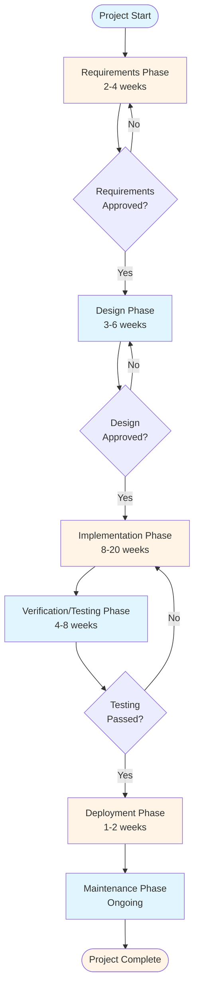
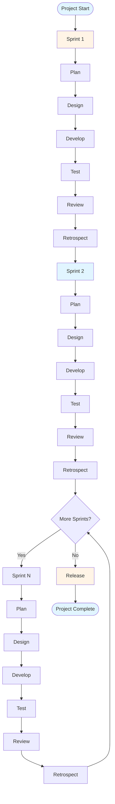
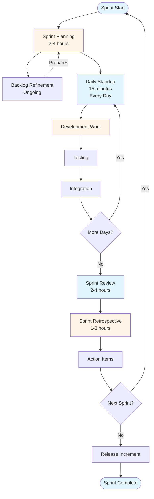
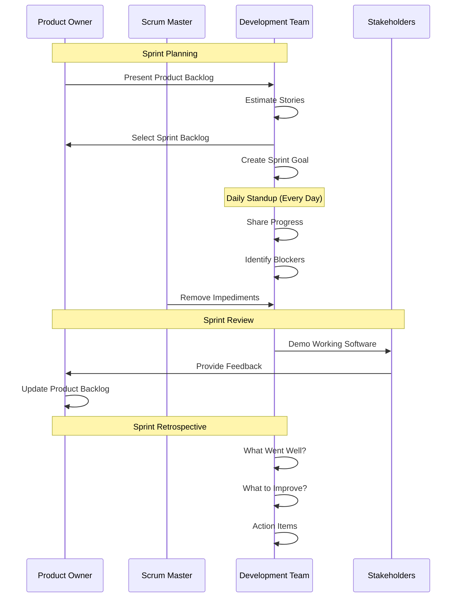
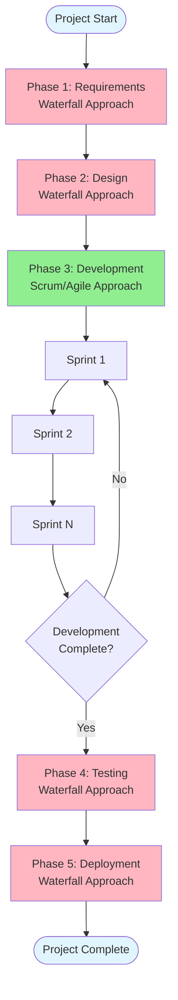
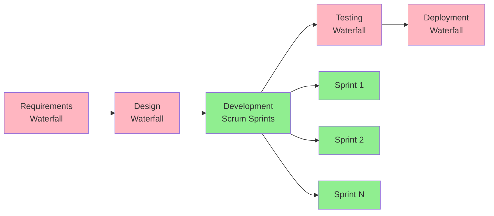
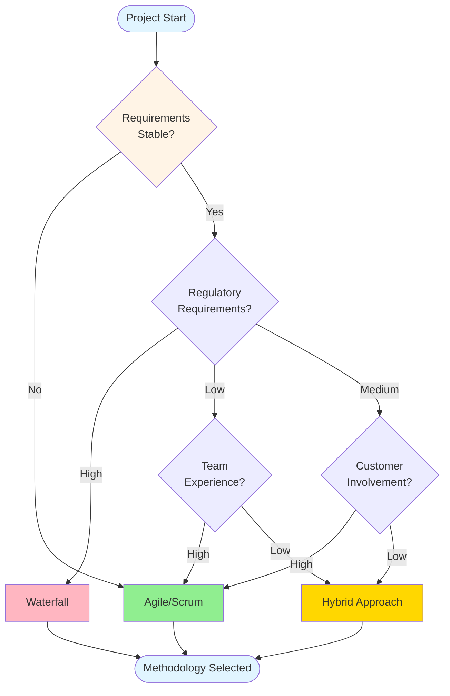
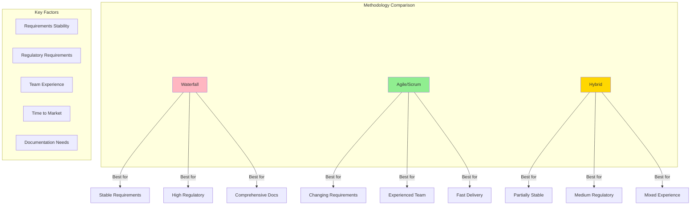
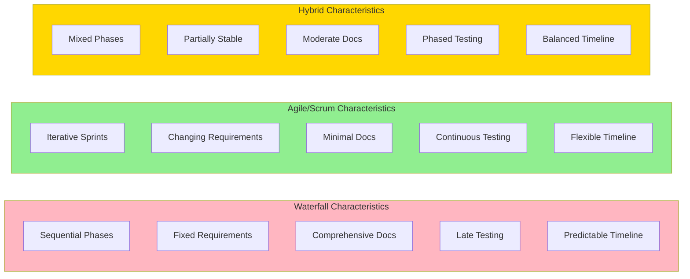

# Project Methodologies Guide - Comprehensive

## Table of Contents
1. [Introduction](#introduction)
2. [Waterfall Model](#waterfall-model)
3. [Agile Methodology](#agile-methodology)
4. [Scrum Framework](#scrum-framework)
5. [Hybrid Approaches](#hybrid-approaches)
6. [Decision Framework](#decision-framework)
7. [Best Practices](#best-practices)
8. [Common Pitfalls](#common-pitfalls)
9. [Real-World Examples](#real-world-examples)
10. [Templates & Checklists](#templates--checklists)
11. [Tools & Software](#tools--software)
12. [Resources](#resources)
13. [Summary](#summary)

---

## Introduction

This guide covers the two primary project management methodologies: Waterfall (traditional) and Agile/Scrum. Understanding when to use each methodology is crucial for project success. This guide provides comprehensive coverage of both approaches, their applications, and decision frameworks.

### Who This Guide Is For
- New project managers learning methodologies
- Experienced PMs choosing the right approach
- Teams transitioning between methodologies
- Stakeholders understanding project approaches

### Key Learning Objectives
- Understand Waterfall model phases and applications
- Master Agile principles and Scrum framework
- Learn when to use each methodology
- Understand hybrid approaches
- Make informed methodology decisions

---

## Waterfall Model

### Overview

The Waterfall model is a linear, sequential approach to project management where each phase must be completed before moving to the next. It's called "waterfall" because progress flows downward like a waterfall through phases.

### Waterfall Process Flow

### Phases of Waterfall

#### 1. Requirements Phase
**Duration**: 2-4 weeks (varies by project size)
**Activities**:
- Gather all requirements from stakeholders
- Document functional and non-functional requirements
- Create requirement specification document (RSD)
- Get stakeholder approval
- Freeze requirements (minimal changes allowed)

**Deliverables**:
- Requirements Specification Document
- Stakeholder sign-off
- Project scope document

**Key Activities**:
- Stakeholder interviews
- Requirement workshops
- Gap analysis
- Requirement prioritization

#### 2. Design Phase
**Duration**: 3-6 weeks
**Activities**:
- System architecture design
- Database design
- UI/UX design
- Technical design documents
- Interface specifications

**Deliverables**:
- System Design Document (SDD)
- Database Design Document
- UI/UX Mockups
- Technical Architecture Document

**Key Activities**:
- Architecture reviews
- Design walkthroughs
- Technology selection
- Security design

#### 3. Implementation Phase
**Duration**: 8-20 weeks (largest phase)
**Activities**:
- Code development
- Unit testing
- Code reviews
- Integration
- Technical documentation

**Deliverables**:
- Source code
- Unit test cases
- Code documentation
- Technical documentation

**Key Activities**:
- Daily standups (optional)
- Code reviews
- Version control management
- Continuous integration

#### 4. Verification/Testing Phase
**Duration**: 4-8 weeks
**Activities**:
- System testing
- Integration testing
- User acceptance testing (UAT)
- Performance testing
- Security testing
- Bug fixing

**Deliverables**:
- Test plans
- Test cases
- Test reports
- Bug reports
- UAT sign-off

**Key Activities**:
- Test case execution
- Defect management
- Test reporting
- Stakeholder demos

#### 5. Deployment Phase
**Duration**: 1-2 weeks
**Activities**:
- Production deployment
- Data migration
- User training
- Documentation handover
- Go-live support

**Deliverables**:
- Deployed system
- User manuals
- Operations manual
- Training materials

#### 6. Maintenance Phase
**Duration**: Ongoing
**Activities**:
- Bug fixes
- Enhancements
- Performance optimization
- User support
- System updates

### Advantages of Waterfall

1. **Clear Structure**
   - Well-defined phases
   - Easy to understand and follow
   - Clear milestones and deliverables

2. **Documentation**
   - Comprehensive documentation at each phase
   - Easy to maintain and reference
   - Good for compliance and audit

3. **Predictability**
   - Fixed scope and timeline
   - Easier budget estimation
   - Clear expectations

4. **Suitable for Fixed Requirements**
   - When requirements are well-understood
   - When changes are unlikely
   - For regulated industries

5. **Resource Planning**
   - Easy to plan resources per phase
   - Clear skill requirements
   - Better resource allocation

### Disadvantages of Waterfall

1. **Inflexibility**
   - Difficult to accommodate changes
   - Late discovery of issues
   - Expensive to change requirements

2. **Late Testing**
   - Testing happens at the end
   - Bugs discovered late
   - Higher cost of fixing defects

3. **No Early Feedback**
   - Stakeholders see product late
   - Limited user feedback
   - Risk of building wrong product

4. **Long Delivery Time**
   - No working software until end
   - Long time to market
   - Delayed value delivery

5. **High Risk**
   - All risks discovered late
   - High project failure risk
   - Difficult to pivot

### When to Use Waterfall

**Best Suited For**:
- Projects with fixed, well-defined requirements
- Regulated industries (healthcare, finance, aerospace)
- Projects with strict compliance requirements
- Small projects with clear scope
- Projects where documentation is critical
- When team is distributed and communication is limited

**Examples**:
- Government projects
- Medical device software
- Banking systems
- Aerospace software
- Small internal tools

### Waterfall Best Practices

1. **Thorough Requirements Gathering**
   - Spend adequate time in requirements phase
   - Involve all stakeholders
   - Document everything clearly

2. **Design Reviews**
   - Conduct thorough design reviews
   - Get stakeholder approval
   - Consider all edge cases

3. **Change Control**
   - Implement strict change control process
   - Document all changes
   - Assess impact before approval

4. **Early Testing Planning**
   - Plan testing early
   - Prepare test cases during design
   - Consider testability in design

5. **Risk Management**
   - Identify risks early
   - Plan mitigation strategies
   - Regular risk reviews

---

## Agile Methodology

### Overview

Agile is an iterative and incremental approach to project management that emphasizes flexibility, collaboration, and customer feedback. It was formalized in the Agile Manifesto in 2001.

### Agile Manifesto

The Agile Manifesto values:
1. **Individuals and interactions** over processes and tools
2. **Working software** over comprehensive documentation
3. **Customer collaboration** over contract negotiation
4. **Responding to change** over following a plan

### Agile Principles

1. Customer satisfaction through early and continuous delivery
2. Welcome changing requirements, even late in development
3. Deliver working software frequently (weeks rather than months)
4. Business people and developers must work together daily
5. Build projects around motivated individuals
6. Face-to-face conversation is most effective
7. Working software is primary measure of progress
8. Sustainable development pace
9. Continuous attention to technical excellence
10. Simplicity is essential
11. Self-organizing teams
12. Regular reflection and adaptation

### Agile Process Flow

### Advantages of Agile

1. **Flexibility**
   - Easy to accommodate changes
   - Adapt to market needs
   - Respond to feedback quickly

2. **Early Delivery**
   - Working software in weeks
   - Early value delivery
   - Faster time to market

3. **Customer Collaboration**
   - Continuous stakeholder involvement
   - Early feedback
   - Better alignment with needs

4. **Risk Reduction**
   - Early issue detection
   - Incremental risk mitigation
   - Fail fast, learn fast

5. **Team Morale**
   - Empowered teams
   - Better collaboration
   - Higher job satisfaction

6. **Quality**
   - Continuous testing
   - Early bug detection
   - Better code quality

### Disadvantages of Agile

1. **Less Predictability**
   - Difficult to estimate timeline
   - Scope can change
   - Budget uncertainty

2. **Requires Discipline**
   - Needs experienced team
   - Requires commitment
   - Can be chaotic without discipline

3. **Documentation**
   - Less comprehensive documentation
   - Knowledge in people's heads
   - Difficult for new team members

4. **Resource Intensive**
   - Requires dedicated team
   - Daily collaboration needed
   - Higher communication overhead

5. **Not Suitable for All Projects**
   - Fixed-price contracts challenging
   - Regulated industries difficult
   - Large distributed teams challenging

### When to Use Agile

**Best Suited For**:
- Projects with changing requirements
- Software development projects
- Innovative products
- Customer-facing applications
- Projects requiring rapid delivery
- When customer feedback is critical

**Examples**:
- Web applications
- Mobile apps
- SaaS products
- Startup products
- E-commerce platforms
- Marketing websites

---

## Scrum Framework

### Overview

Scrum is the most popular Agile framework. It provides a structured approach to implementing Agile principles with defined roles, events, and artifacts.

### Scrum Roles

#### 1. Product Owner (PO)
**Responsibilities**:
- Manage product backlog
- Prioritize features
- Define acceptance criteria
- Communicate vision
- Make decisions on features
- Accept or reject work

**Key Activities**:
- Backlog refinement
- Sprint planning participation
- Sprint review participation
- Stakeholder communication

#### 2. Scrum Master
**Responsibilities**:
- Facilitate Scrum events
- Remove impediments
- Coach team on Scrum
- Protect team from distractions
- Ensure Scrum process is followed

**Key Activities**:
- Daily standup facilitation
- Sprint planning facilitation
- Retrospective facilitation
- Impediment removal
- Team coaching

#### 3. Development Team
**Responsibilities**:
- Deliver working software
- Estimate work
- Commit to sprint goals
- Self-organize
- Collaborate effectively

**Key Activities**:
- Sprint planning
- Daily standups
- Development work
- Testing
- Sprint review
- Retrospective

### Scrum Events

#### 1. Sprint Planning
**Duration**: 2-4 hours for 2-week sprint
**Participants**: Product Owner, Scrum Master, Development Team
**Purpose**: Plan work for upcoming sprint

**Activities**:
- Review product backlog
- Select items for sprint
- Break down into tasks
- Estimate effort
- Commit to sprint goal

**Outputs**:
- Sprint backlog
- Sprint goal
- Task breakdown

#### 2. Daily Standup (Daily Scrum)
**Duration**: 15 minutes
**Participants**: Development Team (Scrum Master optional)
**Purpose**: Synchronize work and identify impediments

**Questions**:
1. What did I complete yesterday?
2. What will I work on today?
3. Are there any impediments?

**Best Practices**:
- Same time every day
- Stand up (keeps it short)
- Focus on blockers
- Not a status report to manager

#### 3. Sprint Review
**Duration**: 2-4 hours
**Participants**: All stakeholders
**Purpose**: Demonstrate completed work

**Activities**:
- Demo working software
- Gather feedback
- Discuss what's next
- Update product backlog

**Outputs**:
- Stakeholder feedback
- Updated backlog
- Release planning input

#### 4. Sprint Retrospective
**Duration**: 1-3 hours
**Participants**: Product Owner, Scrum Master, Development Team
**Purpose**: Improve team process

**Activities**:
- What went well?
- What could be improved?
- Action items for next sprint

**Outputs**:
- Improvement action items
- Process changes
- Team commitments

#### 5. Backlog Refinement
**Duration**: 1-2 hours (ongoing)
**Participants**: Product Owner, Development Team
**Purpose**: Prepare backlog items

**Activities**:
- Clarify requirements
- Estimate stories
- Split large stories
- Prioritize items

### Scrum Artifacts

#### 1. Product Backlog
- Ordered list of features
- Owned by Product Owner
- Continuously refined
- Prioritized by value

**Backlog Item Structure**:
- User story format
- Acceptance criteria
- Estimation (story points)
- Priority

#### 2. Sprint Backlog
- Items selected for sprint
- Committed by team
- Owned by development team
- Updated daily

#### 3. Increment
- Working software
- Potentially shippable
- Meets definition of done
- Integrated and tested

### Definition of Done

Common criteria:
- Code complete
- Unit tests written and passing
- Code reviewed
- Integrated with main branch
- Tested (QA)
- Documentation updated
- No known bugs
- Product Owner acceptance

### Sprint Lifecycle

### Scrum Ceremonies Flow

### Scrum Best Practices

1. **Sprint Length**
   - 2 weeks is most common
   - 1 week for fast-moving teams
   - 3-4 weeks for complex projects
   - Keep consistent

2. **Team Size**
   - 5-9 team members ideal
   - Too small: limited capacity
   - Too large: communication overhead

3. **Story Points**
   - Use Fibonacci sequence (1, 2, 3, 5, 8, 13)
   - Relative estimation
   - Team consensus
   - Don't equate to hours

4. **Velocity Tracking**
   - Track story points per sprint
   - Use for planning
   - Don't use for performance evaluation
   - Allow time to stabilize

5. **Impediment Management**
   - Log all impediments
   - Prioritize removal
   - Escalate when needed
   - Track resolution

---

## Hybrid Approaches

### Overview

Many organizations use hybrid approaches combining Waterfall and Agile elements to suit their specific needs.

### Hybrid Approach Flow

### Common Hybrid Models

#### 1. Water-Scrum-Fall
**Description**: Waterfall for planning and design, Scrum for development, Waterfall for deployment

**Water-Scrum-Fall Process Flow**:

**When to Use**:
- Large organizations
- Regulated industries
- When initial planning is critical
- When deployment requires formal process

**Structure**:
- Phase 1: Requirements (Waterfall)
- Phase 2: Design (Waterfall)
- Phase 3: Development (Scrum)
- Phase 4: Testing (Waterfall)
- Phase 5: Deployment (Waterfall)

#### 2. Agile-Waterfall Hybrid
**Description**: Agile for development, Waterfall for project management

**When to Use**:
- When PM needs structured reporting
- When stakeholders want predictability
- Large projects with multiple teams

**Structure**:
- Project planning: Waterfall
- Development: Agile/Scrum
- Reporting: Waterfall metrics
- Delivery: Waterfall milestones

#### 3. Wagile (Waterfall-Agile)
**Description**: Sequential phases using Agile within each phase

**When to Use**:
- Projects with distinct phases
- When each phase has different requirements
- Multi-phase projects

**Structure**:
- Each phase uses Agile
- Phases follow Waterfall sequence
- Deliverables between phases

### Hybrid Approach Decision Factors

1. **Project Size**
   - Small: Pure Agile
   - Medium: Hybrid
   - Large: Waterfall or Hybrid

2. **Team Distribution**
   - Co-located: Agile
   - Distributed: Hybrid or Waterfall

3. **Regulatory Requirements**
   - High: Waterfall or Hybrid
   - Low: Agile

4. **Stakeholder Preferences**
   - Flexible: Agile
   - Structured: Waterfall or Hybrid

---

## Decision Framework

### Methodology Selection Matrix

| Factor | Waterfall | Agile/Scrum | Hybrid |
|--------|-----------|-------------|--------|
| **Requirements Stability** | Stable | Changing | Partially stable |
| **Project Size** | Small-Medium | Any | Large |
| **Team Experience** | Any | Experienced | Mixed |
| **Time to Market** | Not critical | Critical | Moderate |
| **Regulatory** | High | Low | Medium |
| **Customer Involvement** | Low | High | Medium |
| **Documentation** | Critical | Minimal | Moderate |
| **Budget Flexibility** | Fixed | Flexible | Moderate |

### Decision Tree

### Methodology Comparison Matrix

### Key Decision Questions

1. **Are requirements well-understood and stable?**
   - Yes → Consider Waterfall
   - No → Consider Agile

2. **Is early delivery critical?**
   - Yes → Agile
   - No → Either

3. **Are there strict regulatory requirements?**
   - Yes → Waterfall or Hybrid
   - No → Agile

4. **Is customer feedback critical?**
   - Yes → Agile
   - No → Either

5. **Is comprehensive documentation required?**
   - Yes → Waterfall or Hybrid
   - No → Agile

6. **Is the team experienced with Agile?**
   - Yes → Agile
   - No → Waterfall or Hybrid

7. **Is budget fixed?**
   - Yes → Waterfall
   - No → Agile

8. **Is the project large and complex?**
   - Yes → Hybrid or Waterfall
   - No → Agile

---

## Best Practices

### Waterfall Best Practices

1. **Thorough Planning**
   - Spend 20-30% of time in planning
   - Involve all stakeholders
   - Document everything

2. **Change Control**
   - Implement formal change process
   - Assess impact before approval
   - Update all documents

3. **Phase Gates**
   - Don't proceed without approval
   - Review deliverables thoroughly
   - Get sign-offs

4. **Risk Management**
   - Identify risks early
   - Plan mitigation
   - Regular risk reviews

5. **Testing Strategy**
   - Plan testing early
   - Prepare test cases during design
   - Allocate adequate time

### Agile/Scrum Best Practices

1. **Sprint Planning**
   - Prepare backlog before planning
   - Break down stories properly
   - Don't overcommit

2. **Daily Standups**
   - Keep it short (15 min)
   - Focus on blockers
   - Same time every day

3. **Sprint Reviews**
   - Demo working software
   - Gather feedback
   - Update backlog

4. **Retrospectives**
   - Be honest and open
   - Focus on improvements
   - Follow through on actions

5. **Backlog Management**
   - Keep backlog prioritized
   - Refine regularly
   - Keep items small

6. **Team Empowerment**
   - Trust the team
   - Remove impediments
   - Provide support

### Hybrid Best Practices

1. **Clear Boundaries**
   - Define what's Agile vs Waterfall
   - Communicate clearly
   - Set expectations

2. **Integration Points**
   - Plan integration carefully
   - Define handoff criteria
   - Document interfaces

3. **Flexibility**
   - Be flexible within constraints
   - Adapt as needed
   - Learn and improve

---

## Common Pitfalls

### Waterfall Pitfalls

1. **Insufficient Requirements Gathering**
   - Rushing requirements phase
   - Missing stakeholders
   - Incomplete documentation

2. **Scope Creep**
   - Allowing changes without control
   - Not assessing impact
   - No change approval process

3. **Late Testing**
   - Not planning testing early
   - Insufficient test time
   - Poor test coverage

4. **Poor Communication**
   - Limited stakeholder involvement
   - Late feedback
   - Assumptions not validated

5. **Rigid Process**
   - Not adapting to issues
   - Following process blindly
   - No flexibility

### Agile/Scrum Pitfalls

1. **No Real Product Owner**
   - PO not available
   - PO doesn't prioritize
   - No clear vision

2. **Sprint Commitment Issues**
   - Overcommitting
   - Undercommitting
   - Not tracking velocity

3. **Skipping Ceremonies**
   - Missing standups
   - Skipping retrospectives
   - No sprint reviews

4. **No Definition of Done**
   - Unclear acceptance criteria
   - Incomplete work
   - Technical debt

5. **Micromanagement**
   - Scrum Master as manager
   - Daily status reports
   - Not trusting team

6. **Waterfall in Disguise**
   - Mini-waterfalls in sprints
   - No incremental delivery
   - Big bang releases

### Hybrid Pitfalls

1. **Confusion**
   - Team doesn't understand approach
   - Mixed signals
   - Unclear process

2. **Worst of Both Worlds**
   - Waterfall rigidity
   - Agile chaos
   - No benefits

3. **Poor Integration**
   - Handoffs not planned
   - Gaps between phases
   - Lost information

---

## Real-World Examples

### Example 1: Government Project (Waterfall)

**Project**: Tax System Modernization
**Duration**: 18 months
**Team Size**: 50 people
**Methodology**: Waterfall

**Why Waterfall**:
- Strict regulatory requirements
- Fixed requirements from legislation
- Comprehensive documentation needed
- Multiple stakeholder approvals required

**Phases**:
1. Requirements (3 months) - Legal review, stakeholder approval
2. Design (4 months) - Architecture, security design
3. Implementation (8 months) - Development, integration
4. Testing (2 months) - UAT, security testing
5. Deployment (1 month) - Phased rollout

**Key Success Factors**:
- Thorough requirements phase
- Strong change control
- Comprehensive testing
- Phased deployment

### Example 2: Startup Product (Agile/Scrum)

**Project**: Mobile E-commerce App
**Duration**: Ongoing
**Team Size**: 8 people
**Methodology**: Scrum

**Why Agile**:
- Changing market requirements
- Need for rapid delivery
- Customer feedback critical
- Small, experienced team

**Sprint Structure**:
- 2-week sprints
- Daily standups
- Weekly releases
- Continuous customer feedback

**Key Success Factors**:
- Strong Product Owner
- Experienced team
- Continuous deployment
- Customer collaboration

### Example 3: Enterprise System (Hybrid)

**Project**: ERP System Implementation
**Duration**: 24 months
**Team Size**: 100 people
**Methodology**: Hybrid (Water-Scrum-Fall)

**Why Hybrid**:
- Large, complex project
- Initial planning critical
- Development needs flexibility
- Formal deployment process

**Structure**:
- Planning: Waterfall (6 months)
- Development: Scrum (12 months)
- Testing: Waterfall (4 months)
- Deployment: Waterfall (2 months)

**Key Success Factors**:
- Clear phase boundaries
- Strong integration planning
- Effective communication
- Phased approach

---

## Templates & Checklists

### Waterfall Project Checklist

#### Requirements Phase
- [ ] All stakeholders identified
- [ ] Requirements gathered
- [ ] Requirements documented
- [ ] Requirements reviewed
- [ ] Requirements approved
- [ ] Change control process defined
- [ ] Requirements baseline established

#### Design Phase
- [ ] Architecture designed
- [ ] Database designed
- [ ] UI/UX designed
- [ ] Design reviewed
- [ ] Design approved
- [ ] Technical specifications complete

#### Implementation Phase
- [ ] Development environment setup
- [ ] Coding standards defined
- [ ] Code review process established
- [ ] Unit testing strategy defined
- [ ] Version control configured
- [ ] Continuous integration setup

#### Testing Phase
- [ ] Test plan created
- [ ] Test cases prepared
- [ ] Test environment ready
- [ ] Testing executed
- [ ] Defects logged and tracked
- [ ] UAT completed
- [ ] Test reports generated

#### Deployment Phase
- [ ] Deployment plan created
- [ ] Production environment ready
- [ ] Data migration planned
- [ ] Rollback plan prepared
- [ ] User training completed
- [ ] Documentation delivered
- [ ] Go-live support planned

### Scrum Sprint Checklist

#### Sprint Planning
- [ ] Product backlog prioritized
- [ ] Stories refined
- [ ] Team capacity known
- [ ] Sprint goal defined
- [ ] Stories selected
- [ ] Tasks broken down
- [ ] Estimates completed
- [ ] Sprint backlog created

#### During Sprint
- [ ] Daily standups held
- [ ] Sprint backlog updated
- [ ] Impediments tracked
- [ ] Definition of done followed
- [ ] Code reviews completed
- [ ] Tests written and passing

#### Sprint Review
- [ ] Working software ready
- [ ] Demo prepared
- [ ] Stakeholders invited
- [ ] Feedback collected
- [ ] Backlog updated

#### Sprint Retrospective
- [ ] Team participated
- [ ] Issues identified
- [ ] Improvements discussed
- [ ] Action items created
- [ ] Actions assigned

### Methodology Selection Template

**Project Information**:
- Project Name: ___________
- Project Duration: ___________
- Team Size: ___________
- Budget: ___________

**Decision Factors**:
- Requirements Stability: [ ] Stable [ ] Changing [ ] Unknown
- Regulatory Requirements: [ ] High [ ] Medium [ ] Low
- Team Experience: [ ] High [ ] Medium [ ] Low
- Customer Involvement: [ ] High [ ] Medium [ ] Low
- Documentation Needs: [ ] High [ ] Medium [ ] Low
- Time to Market: [ ] Critical [ ] Important [ ] Not Critical

**Recommended Methodology**: ___________

**Rationale**: ___________

---

## Tools & Software

### Waterfall Tools

#### Project Planning
- **Microsoft Project**: Gantt charts, resource management
- **Primavera P6**: Enterprise project management
- **Smartsheet**: Collaborative project management
- **Wrike**: Project planning and tracking

#### Requirements Management
- **Jira**: Requirements tracking
- **Confluence**: Requirements documentation
- **DOORS**: Requirements management
- **ReqView**: Requirements documentation

#### Documentation
- **Confluence**: Team documentation
- **SharePoint**: Document management
- **Google Docs**: Collaborative documentation
- **Notion**: All-in-one workspace

### Agile/Scrum Tools

#### Backlog Management
- **Jira**: Most popular Scrum tool
- **Azure DevOps**: Microsoft ecosystem
- **Trello**: Simple kanban boards
- **Asana**: Task and project management

#### Planning Tools
- **Planning Poker**: Story point estimation
- **Miro**: Virtual whiteboards
- **Mural**: Collaborative planning
- **Figma**: Design collaboration

#### Communication
- **Slack**: Team communication
- **Microsoft Teams**: Enterprise collaboration
- **Zoom**: Video conferencing
- **Discord**: Team chat

### Hybrid Tools

- **Jira**: Supports both methodologies
- **Azure DevOps**: Flexible workflows
- **Monday.com**: Customizable workflows
- **ClickUp**: All-in-one platform

### Tool Selection Criteria

1. **Team Size**
   - Small (<10): Simple tools (Trello, Asana)
   - Medium (10-50): Jira, Azure DevOps
   - Large (>50): Enterprise tools

2. **Budget**
   - Free: Trello, Asana (basic)
   - Paid: Jira, Azure DevOps
   - Enterprise: Custom solutions

3. **Integration Needs**
   - Development tools
   - Communication tools
   - Documentation tools

4. **Team Preferences**
   - User-friendly
   - Feature-rich
   - Mobile support

---

## Resources

### Books

1. **"The Waterfall Model"** - Winston Royce
2. **"Agile Manifesto"** - Agile Alliance
3. **"Scrum: The Art of Doing Twice the Work in Half the Time"** - Jeff Sutherland
4. **"The Agile Samurai"** - Jonathan Rasmusson
5. **"Succeeding with Agile"** - Mike Cohn
6. **"PMBOK Guide"** - Project Management Institute

### Online Resources

1. **Agile Alliance**: https://www.agilealliance.org/
2. **Scrum.org**: https://www.scrum.org/
3. **PMI**: https://www.pmi.org/
4. **Atlassian Agile Guide**: https://www.atlassian.com/agile

### Certifications

1. **PMP (Project Management Professional)** - PMI
2. **CSM (Certified ScrumMaster)** - Scrum Alliance
3. **PSM (Professional Scrum Master)** - Scrum.org
4. **SAFe (Scaled Agile Framework)** - Scaled Agile

### Training

1. **PMI Training**: Project management courses
2. **Scrum Alliance**: Scrum training
3. **Coursera**: Online PM courses
4. **Udemy**: Agile and Scrum courses

---

## Summary

### Key Takeaways

1. **Waterfall** is best for:
   - Stable requirements
   - Regulatory compliance
   - Comprehensive documentation
   - Fixed scope projects

2. **Agile/Scrum** is best for:
   - Changing requirements
   - Rapid delivery
   - Customer collaboration
   - Innovation projects

3. **Hybrid** approaches combine benefits:
   - Use when neither pure approach fits
   - Requires careful planning
   - Clear boundaries needed

4. **Decision Factors**:
   - Requirements stability
   - Regulatory requirements
   - Team experience
   - Customer involvement
   - Documentation needs

5. **Success Factors**:
   - Choose right methodology
   - Follow best practices
   - Avoid common pitfalls
   - Adapt as needed
   - Continuous improvement

### Methodology Comparison

**Visual Comparison Diagram**:

| Aspect | Waterfall | Agile/Scrum |
|--------|-----------|-------------|
| **Flexibility** | Low | High |
| **Predictability** | High | Medium |
| **Documentation** | Comprehensive | Minimal |
| **Customer Involvement** | Low | High |
| **Risk Management** | Late | Early |
| **Time to Market** | Slow | Fast |
| **Team Structure** | Hierarchical | Self-organizing |
| **Change Management** | Difficult | Easy |

### Final Recommendations

1. **Start with understanding your project needs**
2. **Evaluate decision factors carefully**
3. **Choose methodology that fits**
4. **Don't force fit methodology**
5. **Be willing to adapt**
6. **Learn from experience**
7. **Continuously improve**

Remember: The best methodology is the one that works for your specific project, team, and organization. There's no one-size-fits-all solution.

---

**Last Updated**: 2024

**Related Guides**:
- [Planning & Estimation Guide](./PLANNING_ESTIMATION_GUIDE.md)
- [Team Management & Leadership Guide](./TEAM_MANAGEMENT_LEADERSHIP_GUIDE.md)
- [Monitoring, Control & Reporting Guide](./MONITORING_CONTROL_REPORTING_GUIDE.md)

