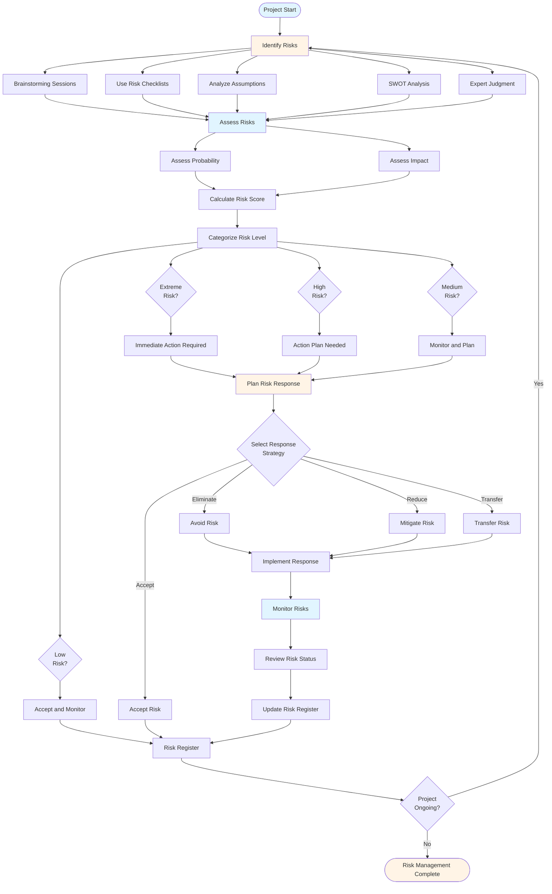
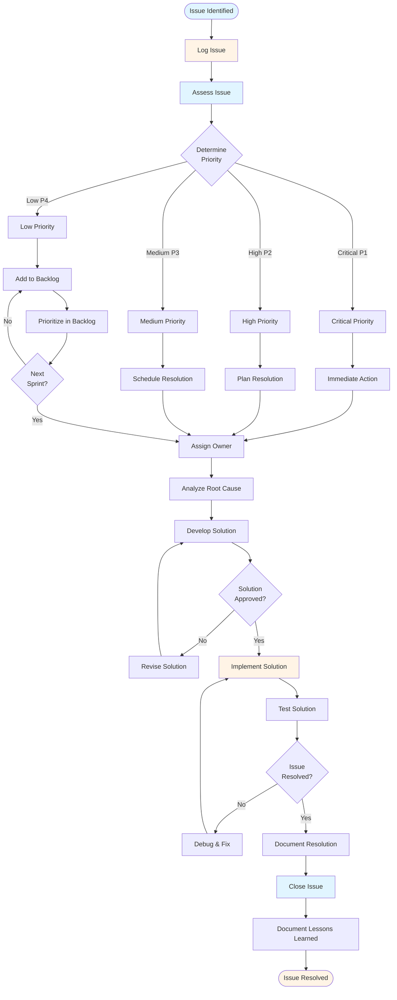
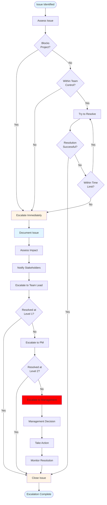

# Risk & Issue Management Guide - Comprehensive

## Table of Contents
1. [Introduction](#introduction)
2. [Risk Management](#risk-management)
3. [Issue Management](#issue-management)
4. [Security Policies](#security-policies)
5. [Best Practices](#best-practices)
6. [Common Pitfalls](#common-pitfalls)
7. [Real-World Examples](#real-world-examples)
8. [Templates & Checklists](#templates--checklists)
9. [Tools & Software](#tools--software)
10. [Resources](#resources)
11. [Summary](#summary)

---

## Introduction

Effective risk and issue management is critical for project success. This guide covers risk identification, assessment, mitigation, issue tracking and resolution, and security policy implementation. Proactive risk and issue management prevents problems and minimizes impact.

### Who This Guide Is For
- Project managers managing risks and issues
- Team leads identifying project risks
- Anyone responsible for risk management
- Security officers implementing policies

### Key Learning Objectives
- Identify and assess risks
- Develop risk mitigation strategies
- Track and resolve issues effectively
- Implement security policies
- Create risk registers and issue logs
- Escalate appropriately

---

## Risk Management

### Overview

Risk management involves identifying, assessing, and mitigating risks that could impact project success. Proactive risk management prevents problems and reduces negative impact.

### Risk Management Process Flow



### Risk Assessment Matrix

```mermaid
graph TB
    subgraph Matrix[Risk Assessment Matrix]
        direction TB
        VH[Very High<br/>90-100%]
        H[High<br/>70-90%]
        M[Medium<br/>30-70%]
        L[Low<br/>10-30%]
        VL[Very Low<br/>0-10%]
        
        Crit[Critical Impact]
        HighI[High Impact]
        MedI[Medium Impact]
        LowI[Low Impact]
        VLowI[Very Low Impact]
    end
    
    VH -->|Extreme| E1[Extreme Risk]
    VH -->|Extreme| E2[Extreme Risk]
    VH -->|High| H1[High Risk]
    VH -->|Medium| M1[Medium Risk]
    VH -->|Low| L1[Low Risk]
    
    H -->|Extreme| E3[Extreme Risk]
    H -->|High| H2[High Risk]
    H -->|High| H3[High Risk]
    H -->|Medium| M2[Medium Risk]
    H -->|Low| L2[Low Risk]
    
    M -->|High| H4[High Risk]
    M -->|High| H5[High Risk]
    M -->|Medium| M3[Medium Risk]
    M -->|Low| L3[Low Risk]
    M -->|Very Low| VL1[Very Low Risk]
    
    L -->|High| H6[High Risk]
    L -->|Medium| M4[Medium Risk]
    L -->|Very Low| VL2[Very Low Risk]
    L -->|Very Low| VL3[Very Low Risk]
    L -->|Very Low| VL4[Very Low Risk]
    
    VL -->|Medium| M5[Medium Risk]
    VL -->|Very Low| VL5[Very Low Risk]
    VL -->|Very Low| VL6[Very Low Risk]
    VL -->|Very Low| VL7[Very Low Risk]
    VL -->|Very Low| VL8[Very Low Risk]
    
    style E1 fill:#ff0000
    style E2 fill:#ff0000
    style E3 fill:#ff0000
    style H1 fill:#ff8800
    style H2 fill:#ff8800
    style H3 fill:#ff8800
    style H4 fill:#ff8800
    style H5 fill:#ff8800
    style H6 fill:#ff8800
    style M1 fill:#ffaa00
    style M2 fill:#ffaa00
    style M3 fill:#ffaa00
    style M4 fill:#ffaa00
    style M5 fill:#ffaa00
```



### Risk Identification

#### Methods for Identifying Risks

**1. Brainstorming**
- Team brainstorming sessions
- Stakeholder workshops
- Expert interviews
- Historical data review

**2. Checklists**
- Industry risk checklists
- Past project risks
- Common risk categories
- Lessons learned

**3. Assumptions Analysis**
- Document assumptions
- Identify risks if assumptions false
- Validate assumptions
- Plan for assumption failures

**4. SWOT Analysis**
- Strengths, Weaknesses, Opportunities, Threats
- Identify threats
- Assess impact
- Plan mitigation

**5. Expert Judgment**
- Consult experts
- Industry knowledge
- Experience-based
- External consultants

#### Common Risk Categories

**1. Technical Risks**
- Technology unproven
- Integration challenges
- Performance issues
- Security vulnerabilities
- Scalability concerns

**2. Schedule Risks**
- Unrealistic timelines
- Resource unavailability
- Dependencies
- Scope creep
- Delays

**3. Resource Risks**
- Key person dependency
- Skill gaps
- Resource unavailability
- Team turnover
- Budget constraints

**4. Scope Risks**
- Unclear requirements
- Scope creep
- Changing requirements
- Gold plating
- Feature creep

**5. Quality Risks**
- Insufficient testing
- Code quality issues
- Performance problems
- Security vulnerabilities
- User acceptance

**6. External Risks**
- Vendor delays
- Regulatory changes
- Market changes
- Economic factors
- Natural disasters

**7. Organizational Risks**
- Management changes
- Budget cuts
- Priority changes
- Resource reallocation
- Company restructuring

### Risk Assessment

#### Risk Probability

**Probability Levels**:
- **Very High (90-100%)**: Almost certain
- **High (70-90%)**: Likely
- **Medium (30-70%)**: Possible
- **Low (10-30%)**: Unlikely
- **Very Low (0-10%)**: Rare

#### Risk Impact

**Impact Levels**:
- **Critical**: Project failure, major budget overrun
- **High**: Significant delay, major cost increase
- **Medium**: Moderate delay, moderate cost increase
- **Low**: Minor delay, minor cost increase
- **Very Low**: Negligible impact

#### Risk Matrix

| Probability | Critical | High | Medium | Low | Very Low |
|------------|---------|------|--------|-----|----------|
| **Very High** | Extreme | Extreme | High | Medium | Low |
| **High** | Extreme | High | High | Medium | Low |
| **Medium** | High | High | Medium | Low | Very Low |
| **Low** | High | Medium | Low | Very Low | Very Low |
| **Very Low** | Medium | Low | Very Low | Very Low | Very Low |

**Risk Levels**:
- **Extreme**: Immediate action required
- **High**: Action plan needed
- **Medium**: Monitor and plan
- **Low**: Accept and monitor
- **Very Low**: Accept

#### Risk Score

**Formula**:
```
Risk Score = Probability × Impact
```

**Example**:
- Probability: High (80%)
- Impact: High (8/10)
- Risk Score: 0.8 × 8 = 6.4 (High Risk)

### Risk Response Strategies

#### 1. Avoid
**Definition**: Eliminate the risk

**Methods**:
- Change project plan
- Remove risky activities
- Change approach
- Cancel risky features

**When to Use**: High impact, avoidable risks

**Example**: Avoid using unproven technology by using proven alternative

#### 2. Mitigate
**Definition**: Reduce probability or impact

**Methods**:
- Early action
- Additional resources
- Contingency planning
- Training
- Prototyping

**When to Use**: Most risks

**Example**: Mitigate key person dependency by cross-training team members

#### 3. Transfer
**Definition**: Shift risk to another party

**Methods**:
- Insurance
- Contracts
- Outsourcing
- Warranties

**When to Use**: Risks that can be transferred

**Example**: Transfer infrastructure risk to cloud provider

#### 4. Accept
**Definition**: Accept the risk

**Methods**:
- Active acceptance (contingency plan)
- Passive acceptance (monitor only)

**When to Use**: Low impact or unavoidable risks

**Example**: Accept minor schedule risk with buffer time

### Risk Register

#### Risk Register Template

**Risk ID**: RISK-001
**Risk Name**: Key Developer Unavailability
**Category**: Resource Risk
**Description**: Lead developer may leave project
**Probability**: Medium (50%)
**Impact**: High (8/10)
**Risk Score**: 4.0 (High)
**Status**: Active
**Owner**: Project Manager

**Response Strategy**: Mitigate
**Response Plan**:
- Cross-train team members
- Document knowledge
- Identify backup resources
- Regular knowledge sharing

**Contingency Plan**:
- Hire contractor if needed
- Extend timeline if necessary
- Reassign tasks

**Trigger**: Developer gives notice or becomes unavailable
**Date Identified**: 2024-01-15
**Next Review**: 2024-02-15

### Risk Monitoring

#### Regular Reviews
- **Frequency**: Weekly/Monthly
- **Participants**: Project team, stakeholders
- **Activities**: Review risks, update status, identify new risks

#### Risk Indicators
- Early warning signs
- Metrics to monitor
- Thresholds for action
- Escalation criteria

#### Risk Reporting
- Risk register updates
- Risk dashboard
- Status reports
- Escalation reports

---

## Issue Management

### Overview

Issue management involves identifying, tracking, and resolving issues that have already occurred. Unlike risks (potential problems), issues are current problems that need resolution.

### Issue vs Risk

| Aspect | Risk | Issue |
|--------|------|-------|
| **Status** | Potential problem | Current problem |
| **Management** | Prevent or mitigate | Resolve |
| **Focus** | Future impact | Current impact |
| **Action** | Planning | Immediate action |

### Issue Management Process Flow



### Issue Escalation Process



### Issue Identification

#### Sources of Issues
- Team members
- Stakeholders
- Testing
- Code reviews
- Daily standups
- Status reports
- Client feedback

#### Issue Types

**1. Technical Issues**
- Bugs
- Performance problems
- Integration issues
- Infrastructure problems

**2. Process Issues**
- Workflow problems
- Communication gaps
- Tool issues
- Process inefficiencies

**3. Resource Issues**
- Resource unavailability
- Skill gaps
- Workload problems
- Team conflicts

**4. Scope Issues**
- Unclear requirements
- Scope creep
- Change requests
- Misunderstandings

**5. External Issues**
- Vendor problems
- Client delays
- Third-party issues
- External dependencies

### Issue Assessment

#### Priority Levels

**1. Critical (P1)**
- Blocks project progress
- Immediate action required
- Significant impact
- Escalate immediately

**2. High (P2)**
- Affects major functionality
- Action needed soon
- Moderate impact
- Plan resolution

**3. Medium (P3)**
- Affects minor functionality
- Can be planned
- Low impact
- Schedule resolution

**4. Low (P4)**
- Minor impact
- Can be deferred
- Nice to have
- Backlog item

#### Severity Levels

**1. Critical**
- System down
- Data loss
- Security breach
- Complete failure

**2. High**
- Major functionality broken
- Significant impact
- Many users affected

**3. Medium**
- Minor functionality broken
- Moderate impact
- Some users affected

**4. Low**
- Cosmetic issues
- Minor impact
- Few users affected

### Issue Resolution

#### Resolution Process

**1. Analyze Issue**
- Understand root cause
- Gather information
- Assess impact
- Identify stakeholders

**2. Develop Solution**
- Brainstorm options
- Evaluate alternatives
- Choose best solution
- Plan implementation

**3. Implement Solution**
- Execute plan
- Monitor progress
- Adjust as needed
- Document changes

**4. Verify Resolution**
- Test solution
- Confirm fix
- Validate with stakeholders
- Document resolution

**5. Close Issue**
- Update status
- Document lessons learned
- Communicate resolution
- Archive issue

### Issue Escalation

#### When to Escalate

**Escalate When**:
- Issue blocks project
- Resolution delayed
- Outside team control
- Requires management decision
- Budget impact
- Client impact

#### Escalation Process

**1. Document Issue**
- Clear description
- Impact assessment
- Attempted solutions
- Recommendations

**2. Notify Stakeholders**
- Immediate notification
- Clear communication
- Impact explanation
- Request support

**3. Escalate to Management**
- Formal escalation
- Written documentation
- Options presented
- Decision requested

**4. Follow Up**
- Track escalation
- Monitor resolution
- Update stakeholders
- Document outcome

### Issue Log

#### Issue Log Template

**Issue ID**: ISSUE-001
**Issue Name**: Database Performance Degradation
**Type**: Technical Issue
**Priority**: High (P2)
**Severity**: High
**Status**: In Progress
**Assigned To**: Database Team Lead
**Reported By**: Development Team
**Date Reported**: 2024-01-20
**Description**: Database queries taking 5+ seconds, affecting user experience

**Impact**:
- User complaints
- Slow page loads
- Potential timeout errors

**Root Cause**: Large dataset, missing indexes

**Solution**:
- Add database indexes
- Optimize queries
- Consider caching

**Action Items**:
- [ ] Analyze slow queries
- [ ] Add indexes
- [ ] Optimize queries
- [ ] Test performance
- [ ] Monitor

**Resolution Date**: [To be filled]
**Verified By**: [To be filled]
**Lessons Learned**: [To be filled]

---

## Security Policies

### Overview

Security policies protect project data, systems, and information. Implementing appropriate security policies is essential for protecting client and company information.

### Security Policy Areas

#### 1. Access Control
**Policies**:
- User authentication
- Password policies
- Access levels
- Role-based access
- Regular access reviews

**Implementation**:
- Strong passwords (min 12 characters)
- Multi-factor authentication
- Regular password changes
- Access logs
- Least privilege principle

#### 2. Data Protection
**Policies**:
- Data classification
- Encryption
- Data backup
- Data retention
- Data disposal

**Implementation**:
- Encrypt sensitive data
- Regular backups
- Secure storage
- Access controls
- Secure deletion

#### 3. Network Security
**Policies**:
- Firewall rules
- Network segmentation
- VPN usage
- Wireless security
- Intrusion detection

**Implementation**:
- Firewall configuration
- Secure networks
- VPN for remote access
- Network monitoring
- Security updates

#### 4. Application Security
**Policies**:
- Secure coding practices
- Vulnerability management
- Code reviews
- Security testing
- Dependency management

**Implementation**:
- OWASP guidelines
- Regular security scans
- Code review for security
- Penetration testing
- Update dependencies

#### 5. Incident Response
**Policies**:
- Incident detection
- Response procedures
- Escalation process
- Documentation
- Post-incident review

**Implementation**:
- Incident response plan
- Security team contact
- Escalation procedures
- Documentation template
- Lessons learned

### Security Policy Implementation

#### Step 1: Policy Development
- Define policies
- Get management approval
- Document policies
- Communicate to team

#### Step 2: Training
- Security awareness training
- Policy training
- Best practices
- Regular updates

#### Step 3: Implementation
- Configure systems
- Set up controls
- Deploy tools
- Monitor compliance

#### Step 4: Monitoring
- Regular audits
- Compliance checks
- Security scans
- Incident monitoring

#### Step 5: Review and Update
- Regular policy reviews
- Update as needed
- Learn from incidents
- Continuous improvement

### Client Data Protection

#### Policies for Client Data

**1. Confidentiality**
- Non-disclosure agreements
- Access controls
- Data classification
- Secure handling

**2. Data Handling**
- Secure storage
- Encryption
- Access logs
- Backup procedures

**3. Data Sharing**
- Approval required
- Secure channels
- Minimal data sharing
- Documentation

**4. Data Retention**
- Retention policies
- Secure disposal
- Client requirements
- Legal compliance

### Company Data Protection

#### Policies for Company Data

**1. Intellectual Property**
- Protection policies
- Access controls
- Documentation
- Legal compliance

**2. Business Information**
- Confidentiality
- Access controls
- Sharing restrictions
- Secure storage

**3. Employee Data**
- Privacy policies
- Access controls
- Legal compliance
- Secure handling

### Security Compliance

#### Common Standards

**1. ISO 27001**
- Information security management
- Risk management
- Continuous improvement

**2. GDPR**
- Data protection (EU)
- Privacy rights
- Data processing
- Breach notification

**3. PCI-DSS**
- Payment card security
- Data protection
- Compliance requirements

**4. SOC 2**
- Security controls
- Availability
- Processing integrity
- Confidentiality

### Security Best Practices

1. **Defense in Depth**: Multiple security layers
2. **Least Privilege**: Minimum necessary access
3. **Regular Updates**: Security patches
4. **Monitoring**: Continuous monitoring
5. **Training**: Regular security training
6. **Incident Response**: Prepared response
7. **Compliance**: Meet standards

---

## Best Practices

### Risk Management Best Practices

1. **Start Early**: Identify risks early
2. **Involve Team**: Team participation
3. **Regular Reviews**: Weekly/monthly reviews
4. **Document Everything**: Risk register
5. **Plan Responses**: Response strategies
6. **Monitor Continuously**: Track risks
7. **Learn from Experience**: Improve process

### Issue Management Best Practices

1. **Quick Identification**: Identify early
2. **Clear Documentation**: Detailed logs
3. **Prioritize**: Focus on high priority
4. **Assign Owners**: Clear ownership
5. **Track Progress**: Regular updates
6. **Resolve Promptly**: Timely resolution
7. **Learn**: Document lessons learned

### Security Best Practices

1. **Policy First**: Clear policies
2. **Training**: Regular training
3. **Implementation**: Proper implementation
4. **Monitoring**: Continuous monitoring
5. **Updates**: Regular updates
6. **Incident Response**: Prepared response
7. **Compliance**: Meet standards

---

## Common Pitfalls

### Risk Management Pitfalls

1. **Ignoring Risks**: Not identifying risks
2. **No Mitigation**: Not planning responses
3. **Set and Forget**: Not reviewing
4. **Over-Optimism**: Underestimating risks
5. **No Ownership**: Unclear responsibility
6. **No Escalation**: Not escalating appropriately
7. **No Learning**: Not learning from experience

### Issue Management Pitfalls

1. **No Tracking**: Not logging issues
2. **No Priority**: All issues treated same
3. **No Ownership**: Unclear responsibility
4. **No Follow-Up**: Not tracking resolution
5. **No Escalation**: Not escalating when needed
6. **No Learning**: Not documenting lessons
7. **Reactive Only**: Not proactive

### Security Pitfalls

1. **No Policies**: Missing policies
2. **No Training**: Team not trained
3. **Weak Implementation**: Poor execution
4. **No Monitoring**: Not monitoring
5. **Outdated**: Not updating
6. **No Response Plan**: Unprepared
7. **Non-Compliance**: Not meeting standards

---

## Real-World Examples

### Example 1: Risk Mitigation Success

**Risk**: Key developer dependency
**Mitigation**: Cross-training, documentation
**Result**: When developer left, team continued smoothly

### Example 2: Issue Resolution

**Issue**: Critical bug in production
**Response**: Immediate escalation, hotfix deployed
**Result**: Resolved in 4 hours, minimal impact

### Example 3: Security Incident

**Incident**: Unauthorized access attempt
**Response**: Security team notified, access blocked
**Result**: No data breach, policies updated

---

## Templates & Checklists

### Risk Register Template

**Risk ID**: [ID]
**Risk Name**: [Name]
**Category**: [Category]
**Description**: [Description]
**Probability**: [Level]
**Impact**: [Level]
**Risk Score**: [Score]
**Status**: [Status]
**Owner**: [Name]

**Response Strategy**: [Strategy]
**Response Plan**: [Plan]
**Contingency Plan**: [Plan]
**Trigger**: [Trigger]
**Date Identified**: [Date]
**Next Review**: [Date]

### Issue Log Template

**Issue ID**: [ID]
**Issue Name**: [Name]
**Type**: [Type]
**Priority**: [Priority]
**Severity**: [Severity]
**Status**: [Status]
**Assigned To**: [Name]
**Reported By**: [Name]
**Date Reported**: [Date]
**Description**: [Description]

**Impact**: [Impact]
**Root Cause**: [Cause]
**Solution**: [Solution]
**Action Items**: [Items]
**Resolution Date**: [Date]
**Verified By**: [Name]
**Lessons Learned**: [Lessons]

### Security Policy Checklist

- [ ] Access control policies defined
- [ ] Data protection policies defined
- [ ] Network security policies defined
- [ ] Application security policies defined
- [ ] Incident response plan created
- [ ] Team trained on policies
- [ ] Systems configured
- [ ] Monitoring in place
- [ ] Regular reviews scheduled
- [ ] Compliance verified

---

## Tools & Software

### Risk Management Tools

1. **Excel**: Risk register
2. **Jira**: Risk tracking
3. **Risk Management Software**: Dedicated tools
4. **Project Management Tools**: Built-in risk features

### Issue Management Tools

1. **Jira**: Issue tracking
2. **Bugzilla**: Bug tracking
3. **GitHub Issues**: Issue tracking
4. **ServiceNow**: IT service management

### Security Tools

1. **Security Scanners**: Vulnerability scanning
2. **SIEM**: Security information and event management
3. **Access Management**: Identity and access management
4. **Encryption Tools**: Data encryption

---

## Resources

### Books

1. "Project Risk Management" - PMI
2. "The Security Risk Management Handbook" - David L. Landoll
3. "ISO 27001: Information Security Management"

### Online Resources

1. **PMI**: Risk management standards
2. **OWASP**: Application security
3. **NIST**: Security frameworks

---

## Summary

### Key Takeaways

1. **Risk Management**: Identify, assess, mitigate, monitor
2. **Issue Management**: Track, prioritize, resolve, learn
3. **Security Policies**: Protect data and systems
4. **Proactive Approach**: Prevent problems
5. **Documentation**: Clear records
6. **Regular Reviews**: Continuous monitoring
7. **Learning**: Improve from experience

### Final Recommendations

1. **Start Early**: Risk management from start
2. **Be Proactive**: Prevent issues
3. **Document Everything**: Clear records
4. **Regular Reviews**: Weekly/monthly
5. **Escalate Appropriately**: When needed
6. **Implement Security**: Protect data
7. **Learn Continuously**: Improve process

Remember: Effective risk and issue management prevents problems, minimizes impact, and ensures project success. Be proactive, document everything, and learn from experience.

---

**Last Updated**: 2024

**Related Guides**:
- [Monitoring, Control & Reporting Guide](./MONITORING_CONTROL_REPORTING_GUIDE.md)
- [Project Methodologies Guide](./PROJECT_METHODOLOGIES_GUIDE.md)
- [Delivery & Handover Guide](./DELIVERY_HANDOVER_GUIDE.md)


