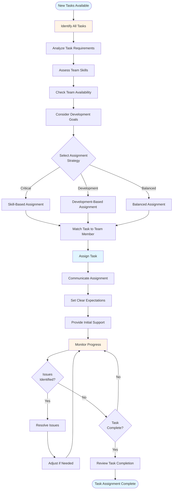
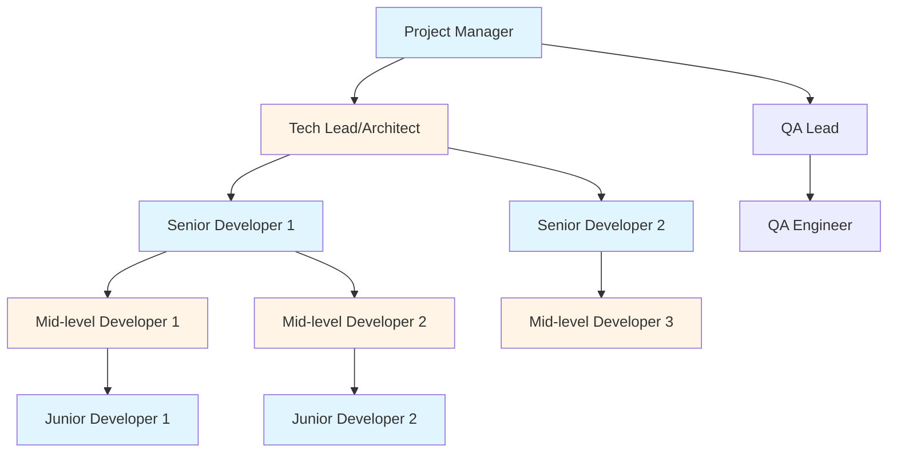
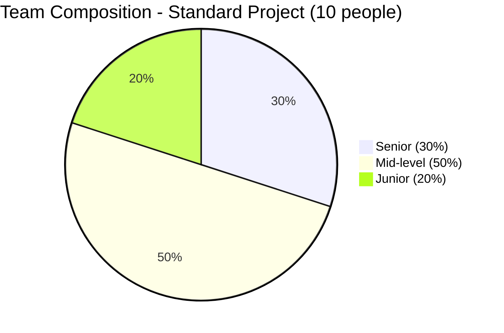
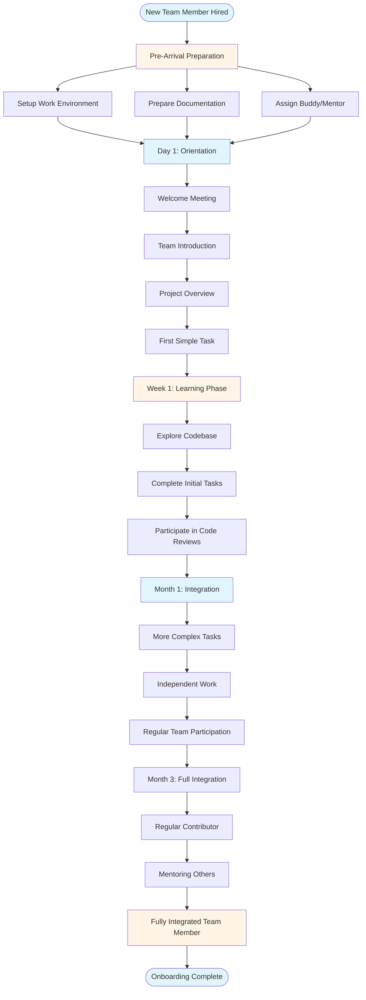
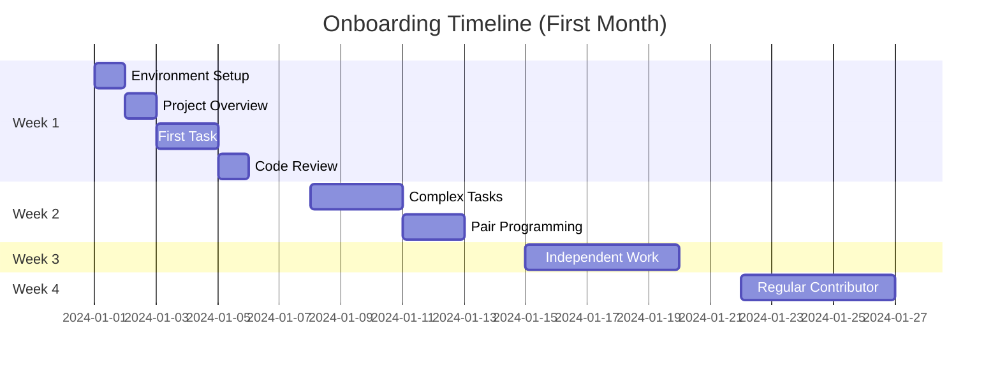
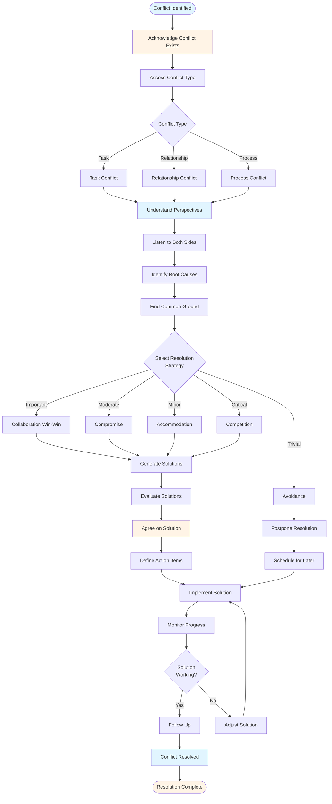

# Team Management & Leadership Guide - Comprehensive

## Table of Contents
1. [Introduction](#introduction)
2. [Task Assignment](#task-assignment)
3. [Team Composition](#team-composition)
4. [Training New Team Members](#training-new-team-members)
5. [Team Motivation](#team-motivation)
6. [Team Building](#team-building)
7. [Conflict Resolution](#conflict-resolution)
8. [Performance Evaluation](#performance-evaluation)
9. [Managing Diverse Teams](#managing-diverse-teams)
10. [Best Practices](#best-practices)
11. [Common Pitfalls](#common-pitfalls)
12. [Real-World Examples](#real-world-examples)
13. [Templates & Checklists](#templates--checklists)
14. [Tools & Software](#tools--software)
15. [Resources](#resources)
16. [Summary](#summary)

---

## Introduction

Effective team management and leadership are critical for project success. This guide covers all aspects of managing project teams, from task assignment to handling diverse team members. A well-managed team is productive, motivated, and delivers quality work.

### Who This Guide Is For
- Project managers leading teams
- Team leads managing developers
- Anyone responsible for team management
- Leaders wanting to improve team effectiveness

### Key Learning Objectives
- Master effective task assignment
- Understand optimal team composition
- Learn to train and onboard new members
- Motivate and build strong teams
- Resolve conflicts effectively
- Evaluate performance fairly
- Manage diverse teams successfully

---

## Task Assignment

### Overview

Task assignment is the process of allocating work to team members based on their skills, availability, and development needs. Effective task assignment maximizes productivity and team growth.

### Task Assignment Process

### Factors to Consider

#### 1. Skills and Competency
- **Required Skills**: What skills does the task need?
- **Team Skills**: Who has these skills?
- **Skill Level**: Junior, mid-level, or senior?
- **Skill Match**: Best fit for the task

#### 2. Availability
- **Current Workload**: How busy is the team member?
- **Other Commitments**: Other projects or tasks
- **Time Zone**: For distributed teams
- **Sprint Capacity**: In Agile projects

#### 3. Development Goals
- **Career Growth**: Assign tasks that help growth
- **Skill Building**: Stretch assignments
- **Interest**: Tasks team members want
- **Mentoring**: Pair junior with senior

#### 4. Task Characteristics
- **Complexity**: Match complexity to skill level
- **Urgency**: Assign to available, skilled person
- **Dependencies**: Consider task dependencies
- **Risk**: Assign risky tasks to experienced members

### Task Assignment Strategies

#### Strategy 1: Skill-Based Assignment
Assign tasks to people with best skills

**Pros**:
- Fastest delivery
- Highest quality
- Lower risk

**Cons**:
- May not develop others
- Overloads skilled members
- Creates knowledge silos

**When to Use**:
- Critical tasks
- Tight deadlines
- High-risk work

#### Strategy 2: Development-Based Assignment
Assign tasks to help team members grow

**Pros**:
- Builds team capability
- Increases engagement
- Reduces knowledge silos

**Cons**:
- Slower delivery
- May need more support
- Higher risk

**When to Use**:
- Non-critical tasks
- Long-term projects
- Team building focus

#### Strategy 3: Balanced Assignment
Mix of skill-based and development-based

**Pros**:
- Balances delivery and growth
- Sustainable approach
- Team satisfaction

**Cons**:
- Requires careful planning
- More complex

**When to Use**:
- Most situations
- Long-term projects
- Balanced team

### Task Assignment Best Practices

1. **Clear Task Description**
   - What needs to be done
   - Why it's important
   - Acceptance criteria
   - Dependencies
   - Deadline

2. **Right Person, Right Task**
   - Match skills to requirements
   - Consider development needs
   - Balance workload

3. **Transparent Communication**
   - Explain assignment rationale
   - Set clear expectations
   - Provide context

4. **Provide Support**
   - Available for questions
   - Regular check-ins
   - Remove blockers

5. **Monitor Progress**
   - Track task status
   - Identify issues early
   - Adjust as needed

### Task Assignment Template

**Task Assignment Form**:
- **Task ID**: TASK-001
- **Task Name**: User Authentication Module
- **Assigned To**: John Doe
- **Assigned Date**: 2024-01-15
- **Due Date**: 2024-01-29
- **Priority**: High
- **Complexity**: Medium
- **Required Skills**: Java, Spring Security, JWT
- **Task Description**: [Detailed description]
- **Acceptance Criteria**: 
  - [ ] User can register
  - [ ] User can login
  - [ ] Password reset works
  - [ ] Security requirements met
- **Dependencies**: Database design must be complete
- **Support**: Senior developer available for questions
- **Status**: In Progress

### Common Task Assignment Mistakes

1. **Unclear Instructions**: Vague task descriptions
2. **Wrong Person**: Skill mismatch
3. **Overloading**: Too much work
4. **No Support**: Leaving person alone
5. **No Context**: Missing why and how
6. **Ignoring Preferences**: Not considering interests
7. **No Follow-up**: Assign and forget

---

## Team Composition

### Overview

Team composition refers to the mix of skills, experience levels, and roles in a project team. Optimal team composition balances productivity, cost, and team development.

### Team Structure Hierarchy

### Team Composition Visualization

### Team Composition Models

#### Model 1: Senior-Heavy Team
**Ratio**: 70% Senior, 30% Mid-level

**Characteristics**:
- High productivity
- Fast delivery
- High cost
- Limited growth opportunities

**When to Use**:
- Critical projects
- Tight deadlines
- Complex technical challenges
- High-risk projects

#### Model 2: Balanced Team
**Ratio**: 40% Senior, 40% Mid-level, 20% Junior

**Characteristics**:
- Good productivity
- Reasonable cost
- Growth opportunities
- Knowledge transfer

**When to Use**:
- Most projects
- Long-term projects
- Team development focus
- Sustainable growth

#### Model 3: Junior-Heavy Team
**Ratio**: 20% Senior, 30% Mid-level, 50% Junior

**Characteristics**:
- Lower productivity initially
- Lower cost
- High growth potential
- Requires mentoring

**When to Use**:
- Cost-sensitive projects
- Training programs
- Long-term capacity building
- Non-critical projects

### Optimal Team Composition

#### For Software Development Projects

**Recommended Ratio**: 30% Senior, 50% Mid-level, 20% Junior

**Rationale**:
- Senior: Architecture, complex problems, mentoring
- Mid-level: Core development, reliable delivery
- Junior: Learning, support tasks, future capacity

#### Team Size Considerations

**Small Team (3-5 people)**:
- 1 Senior (Tech Lead)
- 2-3 Mid-level
- 0-1 Junior

**Medium Team (6-10 people)**:
- 2-3 Senior (1 Tech Lead, 1-2 Senior Devs)
- 3-5 Mid-level
- 1-2 Junior

**Large Team (11-20 people)**:
- 3-4 Senior (1 Tech Lead, 2-3 Senior Devs)
- 6-10 Mid-level
- 2-4 Junior

### Role Distribution

#### Essential Roles

1. **Tech Lead / Architect** (Senior)
   - Technical decisions
   - Architecture design
   - Code reviews
   - Technical mentoring

2. **Senior Developers** (Senior)
   - Complex features
   - Problem solving
   - Mentoring
   - Quality assurance

3. **Mid-level Developers** (Mid-level)
   - Feature development
   - Bug fixes
   - Testing
   - Documentation

4. **Junior Developers** (Junior)
   - Simple features
   - Bug fixes
   - Testing
   - Learning

5. **QA Engineer** (Mid-level/Senior)
   - Test planning
   - Test execution
   - Bug reporting
   - Quality assurance

### Team Composition Best Practices

1. **Balance Skills**
   - Mix of frontend/backend
   - Different expertise areas
   - Complementary skills

2. **Consider Personalities**
   - Mix of introverts/extroverts
   - Different working styles
   - Team dynamics

3. **Plan for Growth**
   - Include junior members
   - Mentoring structure
   - Career development

4. **Account for Attrition**
   - Don't rely on single person
   - Knowledge sharing
   - Documentation

5. **Flexibility**
   - Can adjust as needed
   - Cross-training
   - Backup resources

### Team Composition Matrix

| Project Type | Senior % | Mid % | Junior % | Rationale |
|-------------|----------|-------|----------|-----------|
| Critical/Complex | 50-60 | 30-40 | 10 | Need expertise |
| Standard | 30-40 | 40-50 | 20-30 | Balanced |
| Training/Simple | 20-30 | 30-40 | 40-50 | Development focus |
| Maintenance | 20 | 50 | 30 | Cost-effective |

### Calculating Team Composition

**Example**: Team of 10 people, Standard project

**Calculation**:
- Senior: 10 × 35% = 3.5 → 4 people
- Mid-level: 10 × 45% = 4.5 → 4 people
- Junior: 10 × 20% = 2 people

**Total**: 4 + 4 + 2 = 10 people ✓

---

## Training New Team Members

### Overview

Effective onboarding and training of new team members is crucial for project success. Well-trained team members become productive faster and integrate better into the team.

### Onboarding Process Flow

### Training and Onboarding Activities

### Pre-Arrival Preparation

#### 1. Setup Work Environment
- [ ] Workspace ready
- [ ] Equipment provided (laptop, monitor, etc.)
- [ ] Access credentials prepared
- [ ] Development environment setup guide
- [ ] Documentation access

#### 2. Prepare Documentation
- [ ] Project overview document
- [ ] Architecture documentation
- [ ] Coding standards
- [ ] Development process guide
- [ ] Team contact list

#### 3. Assign Buddy/Mentor
- [ ] Select experienced team member
- [ ] Brief mentor on responsibilities
- [ ] Schedule initial meetings

### Day 1 Activities

#### Morning
- Welcome meeting with PM
- Team introduction
- Office tour
- Setup workspace
- Access setup

#### Afternoon
- Project overview presentation
- Architecture walkthrough
- Development environment setup
- First task assignment (simple)

### Week 1 Plan

**Day 1**: Setup and orientation
**Day 2**: Codebase exploration, first task
**Day 3**: Continue first task, code review
**Day 4**: Second task, team meetings
**Day 5**: Review week, plan next week

**Goals**:
- Understand project structure
- Complete first task
- Meet all team members
- Understand development process

### Month 1 Plan

**Week 1**: Orientation and first tasks
**Week 2**: More complex tasks, code reviews
**Week 3**: Independent work, mentoring
**Week 4**: Regular team member, feedback

**Goals**:
- Complete multiple tasks
- Understand codebase
- Integrate with team
- Start contributing independently

### Training Methods

#### 1. Pair Programming
- Work with experienced developer
- Learn by doing
- Immediate feedback
- Knowledge transfer

**Best For**: Complex features, learning codebase

#### 2. Code Reviews
- Review others' code
- Get code reviewed
- Learn best practices
- Understand standards

**Best For**: Learning standards, improving code quality

#### 3. Documentation Reading
- Architecture docs
- API documentation
- Coding standards
- Process guides

**Best For**: Understanding system, processes

#### 4. Training Sessions
- Technical training
- Process training
- Tool training
- Domain training

**Best For**: Learning new technologies, processes

#### 5. Mentoring
- Regular 1-on-1s
- Career guidance
- Technical guidance
- Problem solving

**Best For**: Long-term development, career growth

### Training Plan Template

**New Team Member Training Plan**:

**Name**: [Name]
**Role**: [Role]
**Start Date**: [Date]
**Mentor**: [Mentor Name]

**Week 1 Goals**:
- [ ] Complete environment setup
- [ ] Understand project overview
- [ ] Complete first task
- [ ] Meet all team members

**Week 2 Goals**:
- [ ] Complete 2-3 tasks
- [ ] Participate in code reviews
- [ ] Understand architecture
- [ ] Attend all team meetings

**Month 1 Goals**:
- [ ] Complete 5+ tasks
- [ ] Understand codebase structure
- [ ] Follow all processes
- [ ] Contribute to discussions

**Training Activities**:
- [ ] Pair programming sessions (Week 1-2)
- [ ] Code review participation (Week 2+)
- [ ] Training sessions (as needed)
- [ ] Documentation reading (ongoing)
- [ ] Regular mentoring (ongoing)

### Onboarding Best Practices

1. **Start Early**: Prepare before arrival
2. **Assign Buddy**: Experienced team member
3. **Clear Plan**: Structured onboarding plan
4. **First Task**: Simple, achievable task
5. **Regular Check-ins**: Daily in first week
6. **Documentation**: Keep updated
7. **Feedback**: Get and give feedback
8. **Patience**: Allow time to learn

### Common Onboarding Mistakes

1. **No Preparation**: Unprepared for new member
2. **Information Overload**: Too much at once
3. **No Buddy**: Left alone
4. **Complex First Task**: Overwhelming
5. **No Check-ins**: No support
6. **Outdated Docs**: Wrong information
7. **No Feedback**: Don't know how they're doing

---

## Team Motivation

### Overview

Motivated teams are more productive, creative, and committed. Understanding what motivates team members and creating an environment that fosters motivation is essential for project success.

### Motivation Theories

#### Maslow's Hierarchy of Needs
1. **Physiological**: Basic needs (salary, workspace)
2. **Safety**: Job security, safe environment
3. **Social**: Team belonging, relationships
4. **Esteem**: Recognition, respect
5. **Self-actualization**: Growth, achievement

#### Herzberg's Two-Factor Theory
**Hygiene Factors** (prevent dissatisfaction):
- Salary
- Work conditions
- Job security
- Company policies

**Motivators** (create satisfaction):
- Achievement
- Recognition
- Work itself
- Responsibility
- Growth

### Motivation Strategies

#### 1. Recognition and Appreciation
- **Public Recognition**: Team meetings, emails
- **Private Appreciation**: 1-on-1 feedback
- **Awards**: Employee of month, etc.
- **Thank You**: Simple thank you matters

**Examples**:
- "Great job on the authentication module!"
- "Your code review was very thorough."
- "Thanks for helping the new team member."

#### 2. Meaningful Work
- **Purpose**: Connect work to bigger picture
- **Impact**: Show how work matters
- **Autonomy**: Give ownership
- **Challenge**: Appropriate challenge level

**Examples**:
- Explain how feature helps users
- Show customer feedback
- Let them own features
- Assign stretch goals

#### 3. Growth Opportunities
- **Learning**: Training, courses
- **New Challenges**: Different types of work
- **Career Development**: Growth path
- **Mentoring**: Learn from others

**Examples**:
- Technical training
- Conference attendance
- Lead a feature
- Mentor junior member

#### 4. Work-Life Balance
- **Flexible Hours**: When possible
- **Remote Work**: If suitable
- **Time Off**: Respect time off
- **No Overwork**: Sustainable pace

**Examples**:
- Flexible start times
- Work from home options
- Respect weekends
- Monitor workload

#### 5. Team Environment
- **Positive Culture**: Supportive, positive
- **Open Communication**: Transparent
- **Collaboration**: Teamwork
- **Fun**: Enjoyable workplace

**Examples**:
- Team lunches
- Celebrations
- Open discussions
- Team activities

### Motivation During Difficult Times

#### When Project is Behind Schedule

**Strategies**:
1. **Transparent Communication**
   - Explain situation honestly
   - Share plan to recover
   - Involve team in solutions

2. **Focus on What's Controllable**
   - What can we do?
   - Small wins
   - Progress tracking

3. **Support and Resources**
   - Additional help if needed
   - Remove blockers
   - Provide support

4. **Maintain Morale**
   - Recognize efforts
   - Stay positive
   - Team building

5. **Learn and Improve**
   - Retrospectives
   - What went wrong?
   - How to prevent?

#### When Facing Technical Challenges

**Strategies**:
1. **Break Down Problems**
   - Smaller pieces
   - Manageable tasks
   - Quick wins

2. **Leverage Team**
   - Pair programming
   - Team discussions
   - External help if needed

3. **Celebrate Progress**
   - Small victories
   - Learning moments
   - Problem solving

4. **Provide Resources**
   - Time to research
   - Training if needed
   - Tools and support

### Motivation Best Practices

1. **Know Your Team**: Understand what motivates each person
2. **Regular Feedback**: Ongoing, not just reviews
3. **Be Genuine**: Authentic recognition
4. **Be Fair**: Consistent treatment
5. **Lead by Example**: Show motivation yourself
6. **Listen**: Hear team concerns
7. **Act**: Address issues promptly

---

## Team Building

### Overview

Team building activities strengthen relationships, improve communication, and create a positive team culture. Strong teams work better together and deliver better results.

### Team Building Objectives

1. **Build Relationships**: Get to know each other
2. **Improve Communication**: Better understanding
3. **Build Trust**: Trust among team members
4. **Enhance Collaboration**: Work together better
5. **Have Fun**: Enjoyable experiences
6. **Create Culture**: Positive team culture

### Types of Team Building Activities

#### 1. Social Activities
**Examples**:
- Team lunches
- Coffee breaks
- Happy hours
- Team dinners
- Birthday celebrations

**Benefits**:
- Casual interaction
- Build relationships
- Relaxed environment

**Frequency**: Weekly/Monthly

#### 2. Fun Activities
**Examples**:
- Game nights
- Sports activities
- Escape rooms
- Movie nights
- Team outings

**Benefits**:
- Fun and engaging
- Break from work
- Shared experiences

**Frequency**: Monthly/Quarterly

#### 3. Professional Development
**Examples**:
- Technical workshops
- Conferences together
- Learning sessions
- Code dojos
- Hackathons

**Benefits**:
- Learn together
- Skill building
- Team growth

**Frequency**: Monthly

#### 4. Volunteer Activities
**Examples**:
- Community service
- Charity work
- Environmental activities
- Teaching/mentoring

**Benefits**:
- Give back
- Shared purpose
- Team bonding

**Frequency**: Quarterly/Annually

### Team Building Best Practices

1. **Regular Activities**: Consistent schedule
2. **Involve Everyone**: All team members
3. **Variety**: Different types of activities
4. **During Work Hours**: When possible
5. **Voluntary**: Don't force participation
6. **Budget**: Allocate budget
7. **Feedback**: Get team input

### Team Building Calendar Example

**Monthly Plan**:
- **Week 1**: Team lunch
- **Week 2**: Technical workshop
- **Week 3**: Coffee break social
- **Week 4**: Fun activity (game, outing)

**Quarterly Plan**:
- **Q1**: Team outing (escape room)
- **Q2**: Volunteer activity
- **Q3**: Team building workshop
- **Q4**: Year-end celebration

### Using Team Members as Activity Leaders

#### Benefits
- **Ownership**: Team members take ownership
- **Leadership**: Develop leadership skills
- **Engagement**: More engaged team
- **Variety**: Different perspectives

#### How to Implement
1. **Identify Volunteers**: Who wants to lead?
2. **Rotate**: Different people each time
3. **Support**: Provide resources
4. **Recognize**: Appreciate leaders

#### Examples
- **Tech Lead**: Technical workshops
- **Social Person**: Social activities
- **Creative Person**: Fun activities
- **Organized Person**: Planning activities

---

## Conflict Resolution

### Overview

Conflicts are inevitable in teams. Effective conflict resolution maintains team harmony and productivity. Understanding conflict types and resolution strategies is essential.

### Types of Conflicts

#### 1. Task Conflicts
**About**: Work-related disagreements
**Examples**:
- Technical approach
- Design decisions
- Implementation methods
- Priorities

**Impact**: Usually positive if handled well

#### 2. Relationship Conflicts
**About**: Personal disagreements
**Examples**:
- Personality clashes
- Communication styles
- Personal values
- Past history

**Impact**: Usually negative, affects team

#### 3. Process Conflicts
**About**: How work is done
**Examples**:
- Workflow disagreements
- Process differences
- Role confusion
- Resource allocation

**Impact**: Can be positive if improves process

### Conflict Resolution Strategies

#### Strategy 1: Collaboration (Win-Win)
**Approach**: Work together to find solution
**When to Use**: Important issues, time available
**Best For**: Complex problems, long-term relationships

**Process**:
1. Understand both perspectives
2. Identify common goals
3. Brainstorm solutions
4. Agree on solution
5. Implement and monitor

#### Strategy 2: Compromise (Give and Take)
**Approach**: Both sides give something
**When to Use**: Moderate importance, limited time
**Best For**: Quick resolution, both sides can give

**Process**:
1. Identify what each side wants
2. Find middle ground
3. Agree on compromise
4. Implement

#### Strategy 3: Accommodation (Yield)
**Approach**: One side yields
**When to Use**: Issue not important to you, relationship important
**Best For**: Preserving relationships, minor issues

**Process**:
1. Assess importance
2. Decide to yield
3. Communicate decision
4. Move forward

#### Strategy 4: Competition (Win-Lose)
**Approach**: Pursue your position
**When to Use**: Critical issue, quick decision needed
**Best For**: Emergencies, when you're clearly right

**Process**:
1. Assess situation
2. Make decision
3. Communicate clearly
4. Explain rationale

#### Strategy 5: Avoidance (Withdraw)
**Approach**: Avoid or postpone
**When to Use**: Issue trivial, timing wrong
**Best For**: Minor issues, when emotions high

**Process**:
1. Assess if can be postponed
2. Schedule for later
3. Address when appropriate

### Conflict Resolution Process Flow

### Conflict Resolution Steps

#### Step 1: Acknowledge Conflict
- Recognize conflict exists
- Don't ignore it
- Address early

#### Step 2: Understand Perspectives
- Listen to both sides
- Understand concerns
- Identify root causes

#### Step 3: Find Common Ground
- Shared goals
- Common interests
- Team success

#### Step 4: Generate Solutions
- Brainstorm options
- Evaluate alternatives
- Consider trade-offs

#### Step 5: Agree on Solution
- Reach agreement
- Define actions
- Set timeline

#### Step 6: Implement and Monitor
- Execute solution
- Monitor progress
- Adjust if needed

### Conflict Resolution Best Practices

1. **Address Early**: Don't let it fester
2. **Stay Neutral**: As PM, be objective
3. **Listen Actively**: Understand all perspectives
4. **Focus on Issues**: Not personalities
5. **Find Win-Win**: When possible
6. **Document**: Important agreements
7. **Follow Up**: Ensure resolution works

### Common Conflict Scenarios

#### Scenario 1: Technical Disagreement
**Situation**: Two developers disagree on approach

**Resolution**:
1. Understand both approaches
2. Evaluate pros/cons
3. Consider team input
4. Make decision
5. Explain rationale

#### Scenario 2: Workload Dispute
**Situation**: Team member feels overloaded

**Resolution**:
1. Review workload
2. Assess fairness
3. Redistribute if needed
4. Set expectations
5. Monitor

#### Scenario 3: Personality Clash
**Situation**: Two team members don't get along

**Resolution**:
1. Understand issues
2. Focus on work
3. Set ground rules
4. Minimize interaction if needed
5. Team building

---

## Performance Evaluation

### Overview

Fair and timely performance evaluation motivates team members, identifies development needs, and recognizes contributions. Effective evaluation is ongoing, not just annual.

### Performance Evaluation Process Flow

```mermaid
flowchart TD
    Start([Evaluation Period]) --> Continuous[Continuous Evaluation<br/>Ongoing]
    Start --> Periodic[Periodic Evaluation<br/>Quarterly/Annually]
    
    Continuous --> Regular1on1[Regular 1-on-1s]
    Regular1on1 --> ProjectFeedback[Project Feedback]
    ProjectFeedback --> CodeReviews[Code Reviews]
    CodeReviews --> PeerFeedback[Peer Feedback]
    
    Periodic --> Prepare[Preparation Phase]
    Prepare --> GatherData[Gather Performance Data]
    GatherData --> ReviewGoals[Review Goals & Objectives]
    ReviewGoals --> PrepareExamples[Prepare Examples]
    
    PrepareExamples --> SelfAssessment[Self-Assessment]
    SelfAssessment --> TeamMemberEval[Team Member Evaluates Self]
    TeamMemberEval --> IdentifyStrengths[Identify Strengths/Weaknesses]
    IdentifyStrengths --> SetGoals[Set Development Goals]
    
    SetGoals --> EvalMeeting[Evaluation Meeting]
    EvalMeeting --> DiscussPerformance[Discuss Performance]
    DiscussPerformance --> ReviewExamples[Review Examples]
    ReviewExamples --> GiveFeedback[Give Feedback]
    GiveFeedback --> ListenConcerns[Listen to Concerns]
    ListenConcerns --> SetNewGoals[Set New Goals]
    
    SetNewGoals --> Document[Documentation Phase]
    Document --> RecordEval[Record Evaluation]
    RecordEval --> RecordFeedback[Record Feedback]
    RecordFeedback --> ActionItems[Set Action Items]
    ActionItems --> DevPlan[Create Development Plan]
    
    DevPlan --> FollowUp[Follow-Up Phase]
    FollowUp --> RegularCheckins[Regular Check-ins]
    RegularCheckins --> MonitorProgress[Monitor Progress]
    MonitorProgress --> ProvideSupport[Provide Support]
    ProvideSupport --> Adjust[Adjust as Needed]
    
    Adjust --> NextPeriod[Next Evaluation Period]
    NextPeriod --> End([Evaluation Cycle Complete])
    
    style Start fill:#e1f5ff
    style Continuous fill:#fff4e6
    style Periodic fill:#e1f5ff
    style EvalMeeting fill:#fff4e6
    style Document fill:#e1f5ff
    style FollowUp fill:#fff4e6
    style End fill:#e1f5ff
```

### Performance Evaluation Types

#### 1. Continuous Evaluation
**Frequency**: Ongoing
**Methods**:
- Regular 1-on-1s
- Project feedback
- Code reviews
- Peer feedback

**Benefits**:
- Timely feedback
- Course correction
- Better relationships

#### 2. Project-Based Evaluation
**Frequency**: End of project/sprint
**Methods**:
- Project retrospective
- Deliverable review
- Team feedback
- Self-assessment

**Benefits**:
- Project-specific
- Learning opportunity
- Team improvement

#### 3. Periodic Evaluation
**Frequency**: Quarterly/Annually
**Methods**:
- Formal review
- Goal assessment
- Development planning
- Compensation review

**Benefits**:
- Comprehensive view
- Career development
- Official record

### Performance Evaluation Criteria

#### Technical Skills
- **Code Quality**: Clean, maintainable code
- **Problem Solving**: Analytical thinking
- **Technical Knowledge**: Depth and breadth
- **Best Practices**: Following standards
- **Innovation**: Creative solutions

#### Delivery
- **Timeliness**: Meeting deadlines
- **Quality**: Few bugs, good testing
- **Completeness**: Full feature delivery
- **Efficiency**: Productivity
- **Reliability**: Consistent delivery

#### Collaboration
- **Communication**: Clear, effective
- **Teamwork**: Works well with others
- **Knowledge Sharing**: Helps others
- **Conflict Resolution**: Handles disagreements
- **Support**: Supports team members

#### Growth
- **Learning**: Continuous improvement
- **Adaptability**: Handles change
- **Initiative**: Takes ownership
- **Mentoring**: Helps others grow
- **Leadership**: Shows leadership

### Performance Evaluation Process

#### Step 1: Preparation
- Gather data (code reviews, feedback, metrics)
- Review goals
- Prepare examples
- Schedule meeting

#### Step 2: Self-Assessment
- Team member evaluates themselves
- Identifies strengths/weaknesses
- Sets goals
- Prepares questions

#### Step 3: Evaluation Meeting
- Discuss performance
- Review examples
- Give feedback
- Listen to concerns
- Set goals

#### Step 4: Documentation
- Document evaluation
- Record feedback
- Set action items
- Create development plan

#### Step 5: Follow-Up
- Regular check-ins
- Monitor progress
- Provide support
- Adjust as needed

### Performance Evaluation Best Practices

1. **Be Specific**: Use examples, not generalizations
2. **Be Balanced**: Strengths and areas for improvement
3. **Be Timely**: Don't wait for formal review
4. **Be Fair**: Consistent criteria
5. **Be Constructive**: Focus on development
6. **Be Honest**: Direct but respectful
7. **Be Actionable**: Clear next steps

### Recognition and Rewards

#### Types of Recognition

1. **Verbal Recognition**
   - Public praise
   - Team meetings
   - One-on-one
   - Thank you notes

2. **Written Recognition**
   - Email to team
   - Performance review
   - Company newsletter
   - LinkedIn recommendation

3. **Tangible Rewards**
   - Bonuses
   - Gift cards
   - Time off
   - Promotions

4. **Opportunities**
   - Interesting projects
   - Training
   - Conference attendance
   - Leadership roles

### Recognition Best Practices

1. **Be Timely**: Recognize soon after achievement
2. **Be Specific**: What exactly was good?
3. **Be Sincere**: Genuine appreciation
4. **Be Fair**: Consistent recognition
5. **Be Public**: When appropriate
6. **Be Meaningful**: What matters to person

---

## Managing Diverse Teams

### Overview

Modern teams are diverse in age, experience, culture, and beliefs. Effective management of diverse teams requires understanding, respect, and inclusive practices.

### Types of Diversity

#### 1. Age Diversity
- **Generations**: Gen Z, Millennials, Gen X, Boomers
- **Experience**: Junior to senior
- **Perspectives**: Different viewpoints

#### 2. Experience Diversity
- **Seniority**: Years of experience
- **Background**: Different companies/industries
- **Expertise**: Different skill areas

#### 3. Cultural Diversity
- **Nationality**: Different countries
- **Language**: Different languages
- **Work Styles**: Different approaches

#### 4. Religious Diversity
- **Beliefs**: Different religions
- **Practices**: Religious observances
- **Values**: Different value systems

### Managing Older Team Members

#### Challenges
- May resist change
- Different communication styles
- Technology adaptation
- Authority dynamics

#### Strategies
1. **Respect Experience**
   - Value their knowledge
   - Seek their input
   - Learn from them

2. **Clear Communication**
   - Direct communication
   - Explain rationale
   - Provide context

3. **Technology Support**
   - Training if needed
   - Patient support
   - Alternative methods

4. **Respect Authority**
   - Acknowledge seniority
   - Formal when appropriate
   - Respectful tone

5. **Leverage Strengths**
   - Experience
   - Mentoring
   - Stability
   - Wisdom

### Managing Senior Team Members

#### Challenges
- May question decisions
- Expect autonomy
- Higher expectations
- Ego management

#### Strategies
1. **Respect Expertise**
   - Value their input
   - Involve in decisions
   - Trust their judgment

2. **Provide Autonomy**
   - Don't micromanage
   - Give ownership
   - Trust execution

3. **Challenge Appropriately**
   - Interesting work
   - Growth opportunities
   - Leadership roles

4. **Fair Treatment**
   - Don't favor
   - Consistent standards
   - Respectful

5. **Recognition**
   - Acknowledge contributions
   - Public recognition
   - Career development

### Managing Team Members with Religious Practices

#### Understanding
- **Prayer Times**: May need breaks
- **Holidays**: Religious holidays
- **Dietary**: Food restrictions
- **Dress Code**: Religious attire
- **Work Schedule**: May need flexibility

#### Strategies
1. **Accommodate Practices**
   - Prayer time breaks
   - Flexible schedules
   - Holiday considerations
   - Dietary accommodations

2. **Respect Beliefs**
   - Don't mock or dismiss
   - Inclusive language
   - Respectful discussions
   - No pressure

3. **Inclusive Environment**
   - Team understanding
   - No discrimination
   - Equal opportunities
   - Supportive culture

4. **Communication**
   - Open dialogue
   - Understand needs
   - Find solutions
   - Document accommodations

5. **Team Education**
   - Cultural awareness
   - Respect training
   - Inclusive practices
   - Team building

### Managing Diverse Teams Best Practices

1. **Inclusive Leadership**
   - Value all contributions
   - Equal opportunities
   - Respect differences
   - Fair treatment

2. **Clear Communication**
   - Understand differences
   - Adapt communication
   - Clarify expectations
   - Regular check-ins

3. **Cultural Awareness**
   - Learn about cultures
   - Respect differences
   - Avoid stereotypes
   - Be sensitive

4. **Flexible Policies**
   - Accommodate needs
   - Flexible schedules
   - Remote work
   - Customized approaches

5. **Team Building**
   - Build understanding
   - Shared experiences
   - Respectful discussions
   - Common goals

6. **Conflict Management**
   - Address quickly
   - Understand perspectives
   - Find solutions
   - Maintain respect

### Diversity Benefits

1. **Better Solutions**: Different perspectives
2. **Innovation**: Creative thinking
3. **Problem Solving**: Various approaches
4. **Market Understanding**: Diverse customer base
5. **Team Growth**: Learn from each other

---

## Best Practices

### Overall Team Management Best Practices

1. **Know Your Team**
   - Understand individuals
   - What motivates them
   - Strengths/weaknesses
   - Career goals

2. **Clear Communication**
   - Transparent information
   - Regular updates
   - Open dialogue
   - Active listening

3. **Set Clear Expectations**
   - Role clarity
   - Goals and objectives
   - Performance standards
   - Timeline expectations

4. **Provide Support**
   - Remove blockers
   - Resources needed
   - Training/development
   - Emotional support

5. **Recognize and Reward**
   - Timely recognition
   - Fair rewards
   - Celebrate successes
   - Appreciate efforts

6. **Develop Team**
   - Growth opportunities
   - Training
   - Mentoring
   - Career development

7. **Build Trust**
   - Honest communication
   - Keep commitments
   - Be fair
   - Support team

8. **Handle Conflicts**
   - Address early
   - Fair resolution
   - Focus on issues
   - Maintain relationships

---

## Common Pitfalls

### Team Management Pitfalls

1. **Micromanagement**: Too much control
2. **No Direction**: Unclear goals
3. **Favoritism**: Unequal treatment
4. **Poor Communication**: Information gaps
5. **No Feedback**: Lack of guidance
6. **Ignoring Conflicts**: Letting issues fester
7. **No Recognition**: Not appreciating work
8. **Overloading**: Too much work
9. **No Development**: Not growing team
10. **Poor Onboarding**: Inadequate training

---

## Real-World Examples

### Example 1: Successful Team Composition

**Project**: E-commerce Platform
**Team**: 8 people
**Composition**: 2 Senior, 4 Mid-level, 2 Junior

**Result**:
- Senior: Architecture and complex features
- Mid-level: Core development
- Junior: Learning and support
- **Outcome**: On-time delivery, team growth

### Example 2: Effective Onboarding

**New Developer**: Junior, first job
**Onboarding Plan**: 4-week structured plan
**Support**: Senior mentor, daily check-ins

**Result**:
- Week 1: Setup and first task
- Week 2: More tasks, code reviews
- Week 3: Independent work
- Week 4: Regular contributor
- **Outcome**: Productive in 1 month

### Example 3: Conflict Resolution

**Conflict**: Two developers disagree on architecture
**Approach**: Facilitated discussion, technical review
**Resolution**: Combined approach, both satisfied

**Result**: Better solution, maintained relationship

---

## Templates & Checklists

### Task Assignment Checklist

- [ ] Task clearly defined
- [ ] Right person selected
- [ ] Skills match requirements
- [ ] Availability confirmed
- [ ] Dependencies identified
- [ ] Deadline set
- [ ] Support available
- [ ] Communication sent
- [ ] Progress tracking setup

### Onboarding Checklist

- [ ] Workspace ready
- [ ] Equipment provided
- [ ] Access granted
- [ ] Documentation prepared
- [ ] Mentor assigned
- [ ] First task ready
- [ ] Team introduced
- [ ] Training plan created
- [ ] Regular check-ins scheduled

### Performance Evaluation Template

**Employee**: [Name]
**Period**: [Date Range]
**Evaluator**: [Name]

**Strengths**:
- [Strength 1 with example]
- [Strength 2 with example]
- [Strength 3 with example]

**Areas for Improvement**:
- [Area 1 with example]
- [Area 2 with example]

**Goals for Next Period**:
- [Goal 1]
- [Goal 2]
- [Goal 3]

**Development Plan**:
- [Action 1]
- [Action 2]

---

## Tools & Software

### Team Management Tools

1. **Jira**: Task assignment, tracking
2. **Asana**: Project and task management
3. **Monday.com**: Team collaboration
4. **Trello**: Simple task management
5. **Microsoft Teams**: Communication and collaboration

### Performance Management Tools

1. **15Five**: Performance reviews
2. **Lattice**: Performance management
3. **Culture Amp**: Employee feedback
4. **BambooHR**: HR management

### Communication Tools

1. **Slack**: Team communication
2. **Microsoft Teams**: Collaboration
3. **Zoom**: Video meetings
4. **Discord**: Team chat

---

## Resources

### Books

1. "The Five Dysfunctions of a Team" - Patrick Lencioni
2. "Drive" - Daniel Pink
3. "Leaders Eat Last" - Simon Sinek
4. "Crucial Conversations" - Kerry Patterson

### Online Resources

1. **PMI**: Project Management Institute
2. **Harvard Business Review**: Leadership articles
3. **TED Talks**: Leadership and team talks

---

## Summary

### Key Takeaways

1. **Task Assignment**: Right person, right task, clear communication
2. **Team Composition**: Balanced mix for productivity and growth
3. **Training**: Structured onboarding accelerates productivity
4. **Motivation**: Understand what motivates, provide support
5. **Team Building**: Regular activities strengthen team
6. **Conflict Resolution**: Address early, focus on issues
7. **Performance Evaluation**: Ongoing, fair, constructive
8. **Diversity**: Respect differences, inclusive practices

### Final Recommendations

1. **Know Your Team**: Understand individuals
2. **Communicate Clearly**: Transparent, regular
3. **Support Growth**: Development opportunities
4. **Recognize Contributions**: Timely appreciation
5. **Handle Conflicts**: Address early, fairly
6. **Build Culture**: Positive, inclusive environment
7. **Lead by Example**: Model desired behavior

Remember: Great teams don't just happen - they're built through effective management, clear communication, and genuine care for team members.

---

**Last Updated**: 2024

**Related Guides**:
- [Project Methodologies Guide](./PROJECT_METHODOLOGIES_GUIDE.md)
- [Communication & Negotiation Guide](./COMMUNICATION_NEGOTIATION_GUIDE.md)
- [Monitoring, Control & Reporting Guide](./MONITORING_CONTROL_REPORTING_GUIDE.md)

