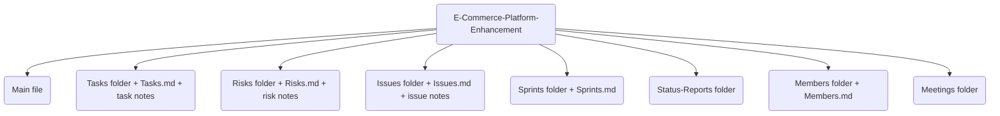

# Sample Project Reference

Use this as a ready-made example of the full workflow. You can duplicate the folder or open it side-by-side while creating a new project.

## Primary Sample

- Path: [[Projects/Active/E-Commerce-Platform-Enhancement/E-Commerce-Platform-Enhancement|E-Commerce Platform Enhancement]]
- Includes: main project note, Tasks, Risks, Issues, Sprints overview, Status-Reports, Members, Meetings folder placeholder.
- Dataview queries are live; use it to verify your frontmatter/paths when creating new projects.

## Quick Structure Snapshot

## How to Clone as a Template

1) Duplicate the folder to `Projects/Active/<New-Project>/`.
2) Rename the main file and all overview files to match the new project folder name where needed.
3) In every file, replace `project-name` / `project` values with the new display name; update paths in Dataview `FROM` clauses to the new folder name.
4) Clear task/risk/issue/status-report content; keep frontmatter keys.
5) Verify with `Project-Dashboard.md` that the new project appears and queries run without errors.

