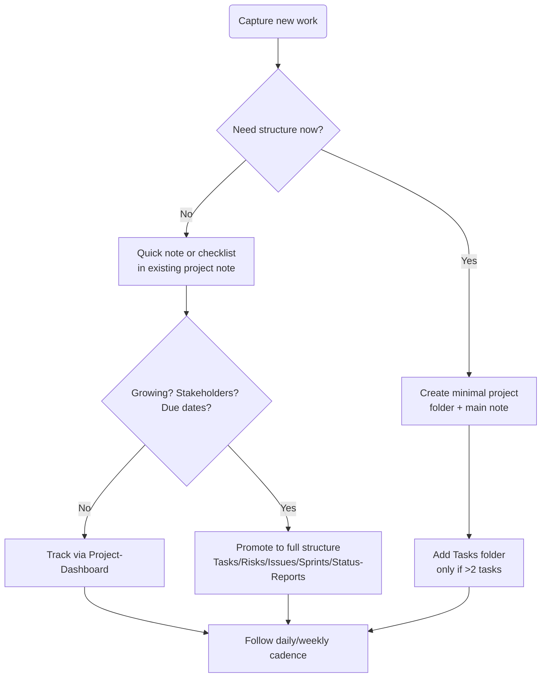

# Projects Workflow (Minimal → Full)

This note gives you a fast path for capture and a structured path when projects grow. Links stay within `Projects/` so Dataview and Bases continue to work.

## Visual Map

## Minimal Workflow (fast capture)

- Create `Projects/Active/<Project-Name>/` only when it’s more than a one-off.
- Inside it, make `<Project-Name>.md` from `Templates/Project-Template.md` and fill **only**: `type`, `project-name`, `status`, `priority`, `start-date`.
- Tasks:
  - Use a simple checklist in the main note for very small efforts.
  - If tasks grow, add `Tasks/` + `Tasks/Tasks.md` (from `Templates/Tasks-Overview-Template.md`) and create task notes via `Templates/Task-Template.md` as needed.
- Keep risks/issues/sprints/status-reports empty unless you need them.

## Daily Flow (minimal or full)

- Open [[Projects/Project-Dashboard|Project-Dashboard.md]].
- Check **My Tasks** + **Upcoming Deadlines**.
- Update task `status` (and checkboxes). Add due dates/assignees when known.
- Capture new work:
  - Add a bullet under the project’s **Tasks** section (quick), or
  - Create a task note in `Tasks/` if it needs dates/assignee/story points.
- Optionally bump project `progress` and `status` in the main project frontmatter.

## Weekly Flow

- Review **Active Projects** in the dashboard; adjust `status`/`progress` (Bases is faster for bulk).
- Create/update one status report per stakeholder-facing project in `Status-Reports/` using `Templates/Status-Report-Template.md`.
- Sweep **High Priority Risks** and **Open Issues** sections; update owners/dates.
- If work is piling up, promote to the full structure (add Risks/Issues/Sprints folders).

## When to Promote to Full Structure

- Multiple stakeholders, deadlines, or external visibility.
- 3+ concurrent tasks or any cross-team dependencies.
- Risks/Issues need owners, reviews, or SLAs.
- You want sprint planning, capacity, or story-point tracking.

## Full Structure Checklist (per project)

- Main file: `<Project-Name>.md` from `Templates/Project-Template.md` with full frontmatter (status, priority, dates, client, team, budget, tags).
- Folders/files to add:
  - `Tasks/Tasks.md` + task notes (type: task)
  - `Risks/Risks.md` + risk notes (type: risk)
  - `Issues/Issues.md` + issue notes (type: issue)
  - `Sprints/Sprints.md` (+ optional sprint subfolders using sprint templates)
  - `Status-Reports/` (status-report notes)
  - `Meetings/` (optional meeting notes)
- Verify Dataview: paths use project folder name; frontmatter `project`/`project-name` matches display name; no `{{...}}` placeholders remain.

## Quick Links

- Dashboard: [[Projects/Project-Dashboard|Project-Dashboard.md]]
- Templates: [[Projects/Templates/Templates|Templates index]] (set in Obsidian Templates plugin)
- Bases: see [[Projects/Bases-Setup|Bases-Setup]] for column/filter suggestions
- Sample (full workflow reference): [[Projects/Active/E-Commerce-Platform-Enhancement/E-Commerce-Platform-Enhancement|E-Commerce Platform Enhancement]]

