# 01 SAP ABAP Basics Guide

## Table of Contents
1. [Introduction](#introduction)
2. [What is ABAP?](#what-is-abap)
3. [ABAP Language Characteristics](#abap-language-characteristics)
4. [ABAP Development Environment](#abap-development-environment)
5. [Data Types and Variables](#data-types-and-variables)
6. [Control Structures](#control-structures)
7. [Naming Conventions](#naming-conventions)
8. [Your First ABAP Program](#your-first-abap-program)
9. [Best Practices](#best-practices)
10. [Common Pitfalls](#common-pitfalls)
11. [Summary](#summary)
12. [Resources](#resources)

---

## Introduction

### Overview
This guide provides a comprehensive introduction to SAP ABAP (Advanced Business Application Programming), the foundation for all SAP development. Whether you're new to ABAP or transitioning from other programming languages, this guide will establish the essential concepts you need to master.

### Learning Objectives
By the end of this guide, you will be able to:
- Understand what ABAP is and its role in SAP systems
- Navigate the ABAP development environment
- Declare variables and use different data types
- Implement control structures (IF, CASE, loops)
- Write your first ABAP program
- Follow ABAP naming conventions and best practices

### Prerequisites
- Basic understanding of programming concepts
- Access to an SAP system (or SAP GUI)
- Familiarity with business applications (helpful but not required)

### Who Should Read This Guide
- New ABAP developers
- Developers transitioning from other languages
- SAP consultants learning ABAP
- Students beginning SAP development

### Estimated Reading Time
2-3 hours (including hands-on practice)

---

## What is ABAP?

### Definition

**ABAP** (Advanced Business Application Programming) is SAP's proprietary, high-level programming language designed specifically for developing business applications within the SAP environment. Originally developed in the 1980s, ABAP has evolved significantly to support modern programming paradigms while maintaining its business-oriented focus.

### ABAP in the SAP Ecosystem

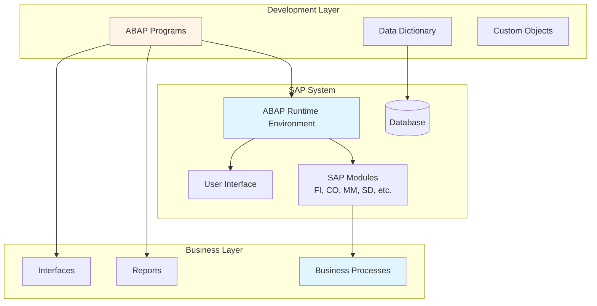

### Key Characteristics

1. **Business-Oriented**: Designed for business application development, not system programming
2. **Database-Integrated**: Seamless integration with SAP's database layer
3. **SAP-Native**: Tightly integrated with SAP's architecture and modules
4. **High-Level**: Abstracts low-level details, focusing on business logic
5. **Evolving**: Continuously updated with modern features (S/4HANA)

### ABAP Evolution Timeline

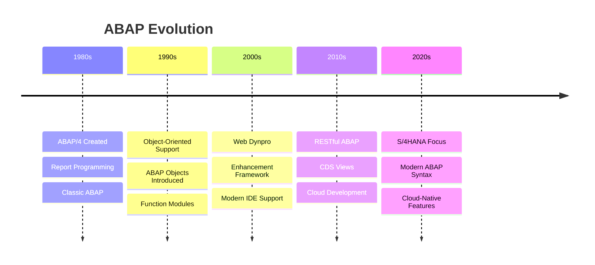

---

## ABAP Language Characteristics

### 1. High-Level Language

ABAP is designed to be readable and business-focused, making it easier for developers to express business logic clearly.

**Example - Readable Syntax**:
```abap
" Clear, business-oriented code
IF customer-credit_limit < order-total_amount.
  MESSAGE 'Credit limit exceeded' TYPE 'E'.
ENDIF.
```

### 2. Database Integration

ABAP provides Open SQL, which is database-independent and automatically optimized.

**Database Access Flow**:

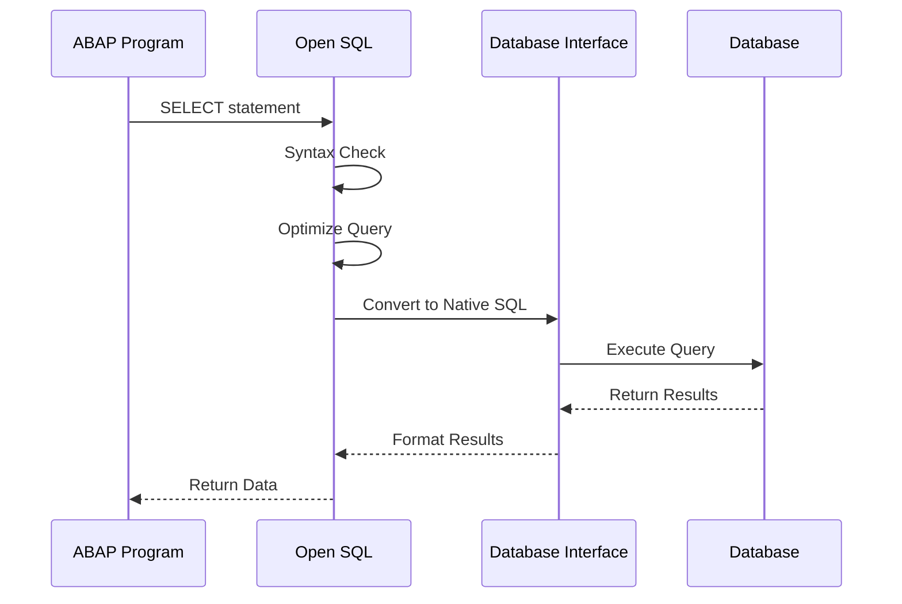

**Example - Database Access**:
```abap
" Open SQL - database independent
SELECT matnr, maktx 
  FROM mara 
  INTO TABLE @DATA(lt_materials)
  WHERE matnr LIKE 'MAT%'.
```

### 3. SAP Integration

ABAP has direct access to SAP's business objects and standard functions.

**SAP Integration Points**:

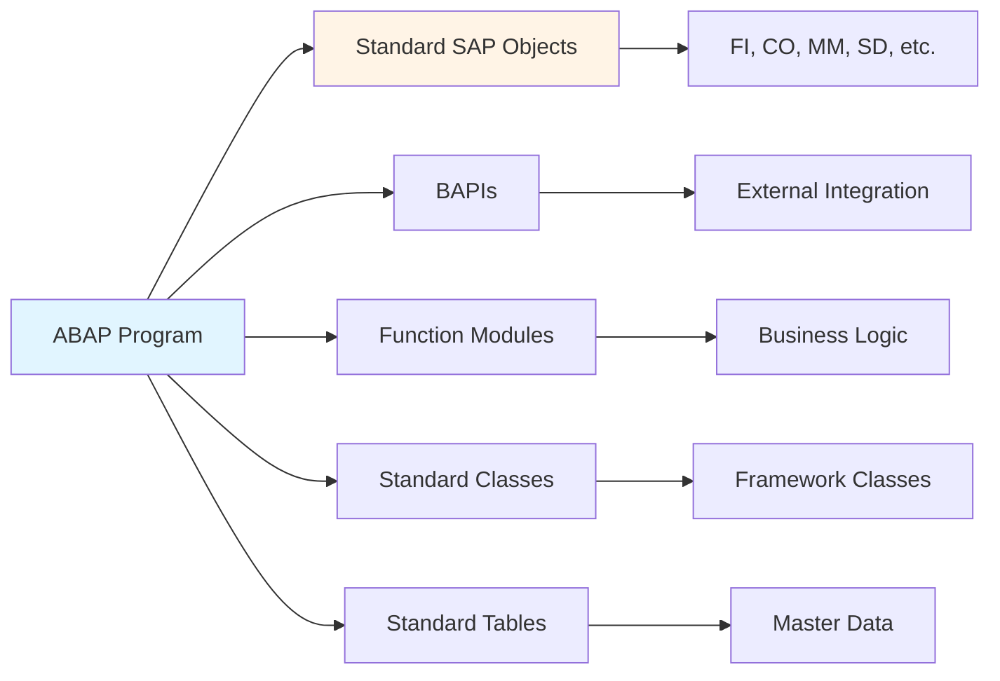

### 4. Object-Oriented Support

Modern ABAP fully supports object-oriented programming (ABAP Objects).

**OOP Support Levels**:

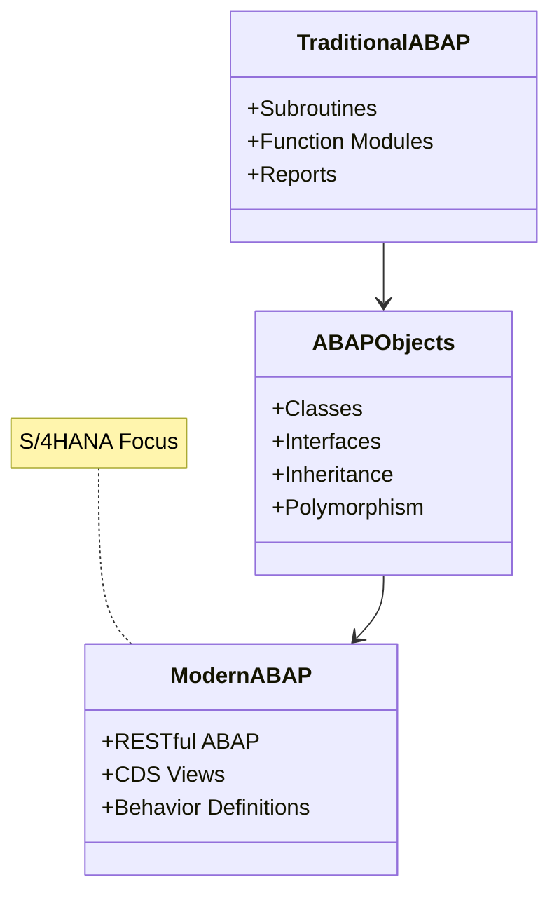

---

## ABAP Development Environment

### Development Tools Overview

ABAP can be developed using multiple tools, each suited for different scenarios.

### 1. SAP GUI (Traditional Development)

The classic SAP GUI provides transaction codes for different development tasks.

**Key Transactions**:

| Transaction | Purpose | Description |
|------------|---------|-------------|
| **SE80** | Object Navigator | Central development environment |
| **SE38** | ABAP Editor | Create and edit ABAP programs |
| **SE11** | Data Dictionary | Define database objects |
| **SE37** | Function Builder | Create function modules |
| **SE51** | Screen Painter | Design user screens |
| **SE24** | Class Builder | Create ABAP classes |

**Development Workflow in SAP GUI**:

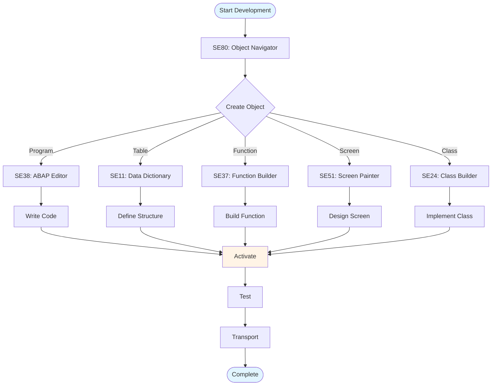

### 2. ABAP Development Tools (ADT) - Eclipse

Modern Eclipse-based IDE for ABAP development, preferred for ABAP Objects and modern development.

**ADT Features**:
- Syntax highlighting and code completion
- Integrated debugger
- Version control (Git) support
- Refactoring tools
- Code templates
- Integrated testing

**ADT vs SAP GUI Comparison**:

| Feature | SAP GUI | ADT (Eclipse) |
|---------|---------|---------------|
| Modern IDE | ❌ | ✅ |
| Code Completion | Basic | Advanced |
| Refactoring | Limited | Full Support |
| Version Control | Limited | Git Integration |
| Debugging | Good | Excellent |
| ABAP Objects | Basic | Excellent |
| Learning Curve | Steep | Moderate |

### 3. SAP Business Application Studio (BAS)

Cloud-based development environment for SAP Cloud Platform development.

**BAS Use Cases**:
- Cloud application development
- Full-stack development
- Modern web applications
- Integration with cloud services

### Development Environment Selection Guide

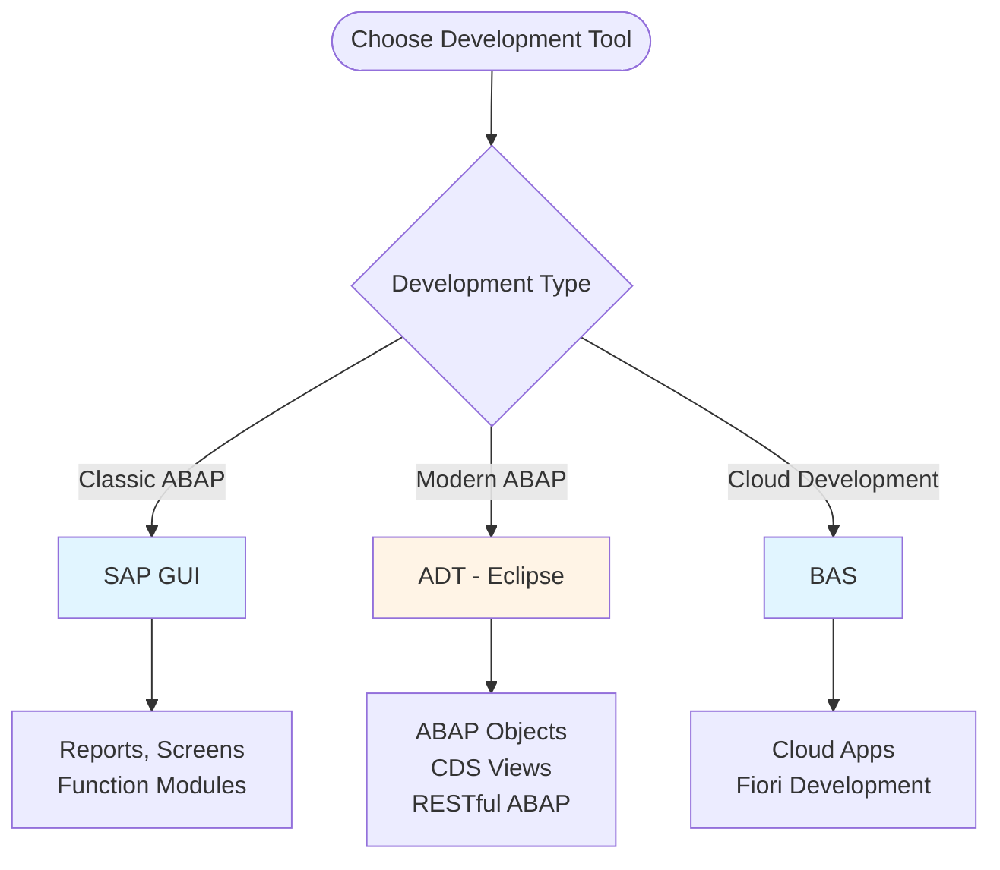

---

## Data Types and Variables

### ABAP Type System

ABAP has a comprehensive type system that supports both elementary and complex types.

### Elementary Data Types

#### Character Types

**CHAR (Character)**:
```abap
" Fixed-length character string
DATA: lv_name TYPE c LENGTH 20.  " 20 characters
lv_name = 'John Doe'.
```

**STRING (Dynamic String)**:
```abap
" Variable-length string
DATA: lv_description TYPE string.
lv_description = 'This is a dynamic string'.
```

**NUMC (Numeric Character)**:
```abap
" Numeric characters (leading zeros preserved)
DATA: lv_account TYPE n LENGTH 10.
lv_account = '0000123456'.  " Stored as numeric characters
```

**Character Type Comparison**:

| Type | Length | Use Case | Example |
|------|--------|----------|---------|
| CHAR | Fixed | Fixed-length text | Customer ID, Material Number |
| STRING | Dynamic | Variable-length text | Descriptions, Comments |
| NUMC | Fixed | Numeric with leading zeros | Account Numbers, Postal Codes |

#### Numeric Types

**Integer (I)**:
```abap
DATA: lv_quantity TYPE i.
lv_quantity = 100.
lv_quantity = lv_quantity + 50.  " Result: 150
```

**Packed Number (P)**:
```abap
" For decimal numbers (currency, quantities)
DATA: lv_price TYPE p DECIMALS 2 LENGTH 8.
lv_price = '1234.56'.
```

**Floating Point (F)**:
```abap
" For scientific calculations
DATA: lv_result TYPE f.
lv_result = 123.456789.
```

**Numeric Type Selection Guide**:

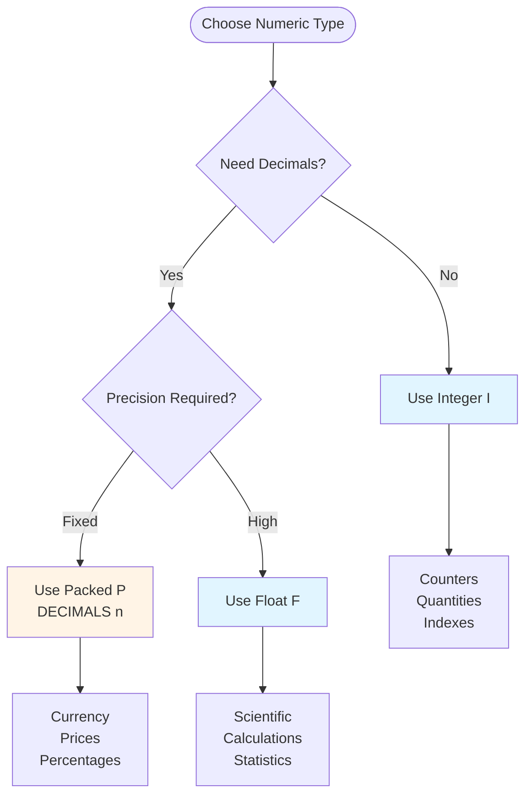

#### Date and Time Types

**Date (D)**:
```abap
" Format: YYYYMMDD (8 characters)
DATA: lv_birth_date TYPE d.
lv_birth_date = '19900115'.  " January 15, 1990

" Using system date
DATA: lv_today TYPE d.
lv_today = sy-datum.  " Current system date
```

**Time (T)**:
```abap
" Format: HHMMSS (6 characters)
DATA: lv_time TYPE t.
lv_time = '143000'.  " 2:30:00 PM

" Using system time
DATA: lv_now TYPE t.
lv_now = sy-uzeit.  " Current system time
```

**Timestamp**:
```abap
" For precise date/time
DATA: lv_timestamp TYPE timestamp.
GET TIME STAMP FIELD lv_timestamp.
```

**Date/Time Operations**:
```abap
DATA: lv_date1 TYPE d VALUE '20240101',
      lv_date2 TYPE d VALUE '20240115',
      lv_days TYPE i.

" Calculate difference in days
lv_days = lv_date2 - lv_date1.  " Result: 14 days

" Add days to date
lv_date2 = lv_date1 + 30.  " Add 30 days
```

#### Hexadecimal Type

```abap
" For binary data
DATA: lv_hex TYPE x LENGTH 10.
lv_hex = '48656C6C6F'.  " "Hello" in hex
```

### Variable Declaration

#### Basic Declaration

```abap
" Single variable
DATA: lv_customer_name TYPE string.

" Multiple variables
DATA: lv_name TYPE string,
      lv_age TYPE i,
      lv_salary TYPE p DECIMALS 2.
```

#### Constants

```abap
" Single constant
CONSTANTS: gc_company_code TYPE c LENGTH 4 VALUE '1000'.

" Multiple constants
CONSTANTS: gc_tax_rate TYPE p DECIMALS 2 VALUE '0.10',
           gc_max_retry TYPE i VALUE 3,
           gc_error_msg TYPE string VALUE 'An error occurred'.
```

**When to Use Constants**:
- Magic numbers or strings that appear multiple times
- Configuration values that shouldn't change
- Error messages or labels
- System-wide settings

#### Field Symbols

Field symbols are pointers to data objects, allowing dynamic data access.

```abap
" Declare field symbol
FIELD-SYMBOLS: <fs_data> TYPE any,
               <fs_material> TYPE mara.

" Assign to variable
ASSIGN lv_customer_name TO <fs_data>.
<fs_data> = 'New Name'.  " Modifies lv_customer_name

" Assign to internal table line
LOOP AT lt_materials ASSIGNING <fs_material>.
  <fs_material>-maktx = 'Updated Description'.
ENDLOOP.
```

**Field Symbol Use Cases**:

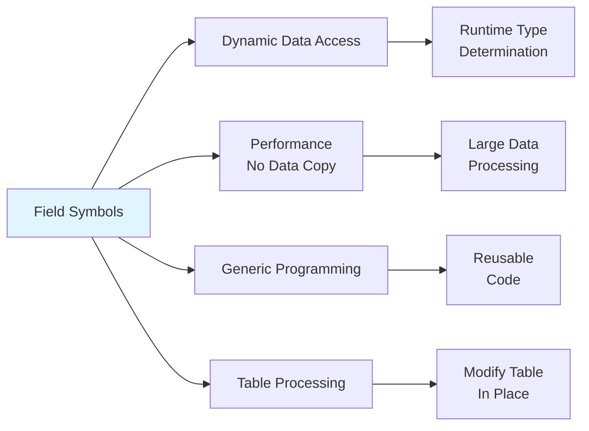

#### Data References

Data references provide object-oriented way to reference data.

```abap
" Declare data reference
DATA: lr_data TYPE REF TO data,
      lr_table TYPE REF TO data.

" Create reference to variable
DATA: lv_value TYPE i VALUE 100.
GET REFERENCE OF lv_value INTO lr_data.

" Dereference
FIELD-SYMBOLS: <fs_value> TYPE i.
ASSIGN lr_data->* TO <fs_value>.
<fs_value> = 200.  " Modifies lv_value
```

### Type Inference (Modern ABAP)

S/4HANA and modern ABAP support type inference using `DATA(...)`.

```abap
" Traditional way
DATA: lv_name TYPE string.
lv_name = 'John'.

" Modern way (type inference)
DATA(lv_name) = 'John'.  " Automatically TYPE string

" With initial value
DATA(lv_counter) = 0.  " Automatically TYPE i
DATA(lv_flag) = abap_true.  " Automatically TYPE abap_bool
```

---

## Control Structures

### Conditional Statements

Control structures allow programs to make decisions and repeat operations.

### IF Statement

**Basic IF**:
```abap
IF lv_amount > 1000.
  MESSAGE 'High value transaction' TYPE 'I'.
ENDIF.
```

**IF-ELSE**:
```abap
IF lv_status = 'A'.
  MESSAGE 'Active' TYPE 'S'.
ELSE.
  MESSAGE 'Inactive' TYPE 'W'.
ENDIF.
```

**IF-ELSEIF-ELSE**:
```abap
IF lv_amount > 10000.
  lv_discount = '0.20'.  " 20% discount
ELSEIF lv_amount > 5000.
  lv_discount = '0.10'.  " 10% discount
ELSEIF lv_amount > 1000.
  lv_discount = '0.05'.  " 5% discount
ELSE.
  lv_discount = '0.00'.  " No discount
ENDIF.
```

**IF Statement Flow**:

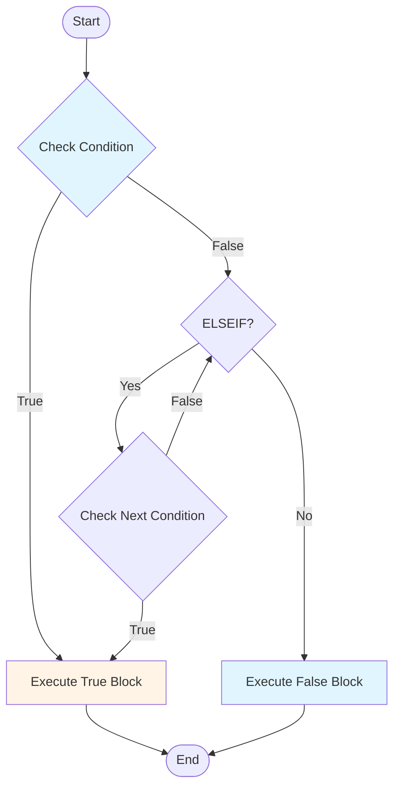

### CASE Statement

CASE is more efficient than multiple IF-ELSEIF for value-based decisions.

**Basic CASE**:
```abap
CASE lv_status.
  WHEN 'A'.
    MESSAGE 'Active' TYPE 'S'.
  WHEN 'I'.
    MESSAGE 'Inactive' TYPE 'W'.
  WHEN 'B'.
    MESSAGE 'Blocked' TYPE 'E'.
  WHEN OTHERS.
    MESSAGE 'Unknown status' TYPE 'E'.
ENDCASE.
```

**CASE with Multiple Values**:
```abap
CASE lv_status.
  WHEN 'A' OR 'ACTIVE' OR '1'.
    " Handle active status
  WHEN 'I' OR 'INACTIVE' OR '0'.
    " Handle inactive status
  WHEN OTHERS.
    " Handle other cases
ENDCASE.
```

**CASE vs IF Performance**:

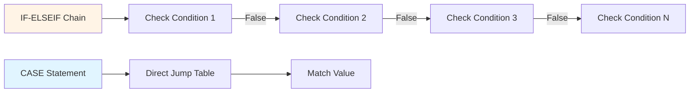

**When to Use CASE vs IF**:
- **CASE**: When checking a single variable against multiple specific values
- **IF**: When conditions are complex (comparisons, logical operators, ranges)

### Loops

#### DO Loop

Fixed number of iterations.

```abap
" Execute 10 times
DO 10 TIMES.
  WRITE: / sy-index.  " Current iteration (1 to 10)
ENDDO.

" With counter
DATA: lv_counter TYPE i.
DO 10 TIMES.
  lv_counter = lv_counter + 1.
  " Process
ENDDO.
```

**DO Loop Flow**:

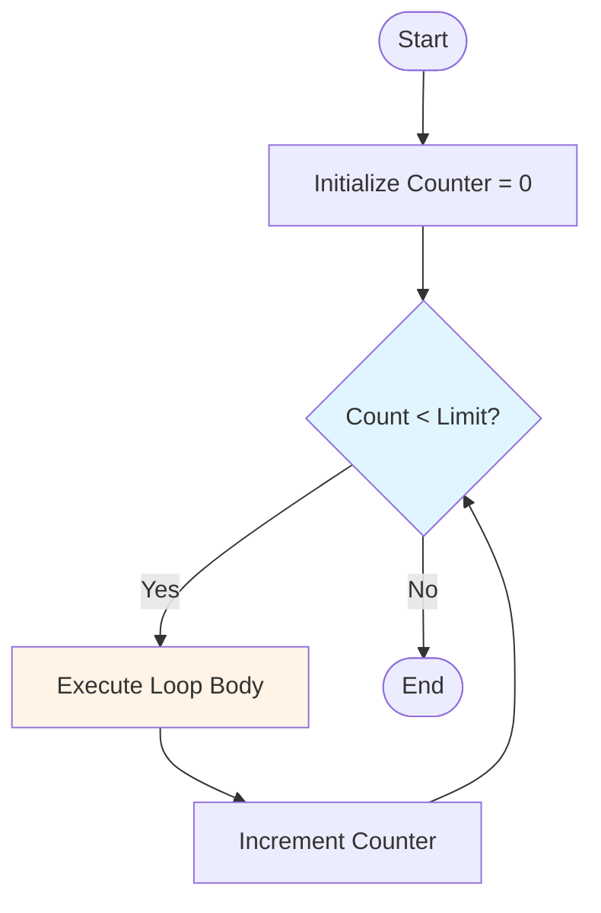

#### WHILE Loop

Condition-based iteration.

```abap
DATA: lv_counter TYPE i VALUE 0.

WHILE lv_counter < 100.
  lv_counter = lv_counter + 1.
  " Process
ENDWHILE.
```

**WHILE Loop Example - Reading Until Condition**:
```abap
DATA: lv_found TYPE abap_bool VALUE abap_false,
      lv_index TYPE i VALUE 1.

WHILE lv_found = abap_false AND lv_index <= lines( lt_materials ).
  READ TABLE lt_materials INDEX lv_index INTO DATA(ls_material).
  IF ls_material-matnr = 'MAT001'.
    lv_found = abap_true.
  ELSE.
    lv_index = lv_index + 1.
  ENDIF.
ENDWHILE.
```

#### LOOP AT

Iterate through internal tables.

```abap
" Basic loop
LOOP AT lt_materials INTO DATA(ls_material).
  WRITE: / ls_material-matnr, ls_material-maktx.
ENDLOOP.

" With WHERE clause
LOOP AT lt_materials INTO DATA(ls_material)
  WHERE matnr LIKE 'MAT%'.
  " Process matching materials
ENDLOOP.

" Using field symbol (more efficient)
LOOP AT lt_materials ASSIGNING FIELD-SYMBOL(<fs_material>).
  <fs_material>-maktx = 'Updated'.
ENDLOOP.
```

**LOOP AT Performance Comparison**:

| Method | Use Case | Performance |
|--------|----------|-------------|
| `INTO` | Need to modify copy | Slower (data copy) |
| `ASSIGNING` | Modify in place | Faster (no copy) |
| `TRANSPORTING` | Read-only, specific fields | Fastest (minimal data) |

**Loop Control Statements**:

```abap
LOOP AT lt_materials INTO DATA(ls_material).
  " CONTINUE - skip to next iteration
  IF ls_material-matnr IS INITIAL.
    CONTINUE.
  ENDIF.
  
  " CHECK - continue if condition false
  CHECK ls_material-matnr IS NOT INITIAL.
  
  " EXIT - exit loop
  IF ls_material-matnr = 'STOP'.
    EXIT.
  ENDIF.
  
  " Process material
ENDLOOP.
```

**Loop Performance Best Practices**:

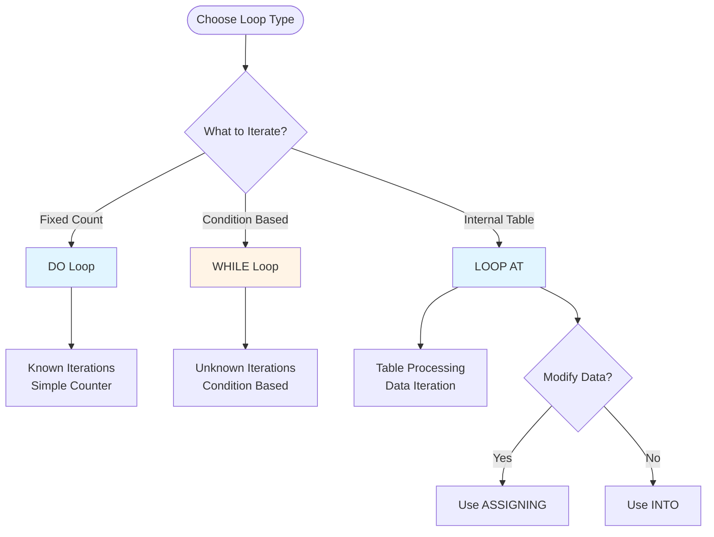

---

## Naming Conventions

### ABAP Naming Standards

Following consistent naming conventions improves code readability and maintainability.

### Variable Naming Prefixes

| Prefix | Meaning | Example |
|--------|---------|---------|
| `lv_` | Local variable | `lv_customer_name` |
| `gv_` | Global variable | `gv_system_date` |
| `ls_` | Local structure | `ls_customer_data` |
| `lt_` | Local internal table | `lt_customers` |
| `lr_` | Local reference | `lr_customer` |
| `lo_` | Local object | `lo_customer` |
| `lc_` | Local constant | `lc_max_retry` |
| `gc_` | Global constant | `gc_company_code` |
| `iv_` | Importing parameter | `iv_customer_id` |
| `ev_` | Exporting parameter | `ev_result` |
| `et_` | Exporting table | `et_customers` |
| `it_` | Importing table | `it_materials` |
| `mv_` | Member variable (class) | `mv_customer_id` |
| `ms_` | Member structure | `ms_header` |
| `mt_` | Member table | `mt_items` |

### Naming Convention Examples

**Good Naming**:
```abap
" Clear and descriptive
DATA: lv_customer_name TYPE string,
      lt_material_list TYPE TABLE OF mara,
      ls_order_header TYPE bapisdhd1,
      gc_max_retry_count TYPE i VALUE 3.
```

**Bad Naming**:
```abap
" Unclear and confusing
DATA: x TYPE string,           " What is x?
      temp TYPE TABLE OF mara, " What is temp?
      data TYPE bapisdhd1,     " Too generic
      max TYPE i.              " Max what?
```

### Naming Best Practices

1. **Be Descriptive**: Names should clearly indicate purpose
2. **Use Prefixes**: Always use appropriate prefixes
3. **Avoid Abbreviations**: Unless widely understood (e.g., `id`, `num`)
4. **Use Underscores**: For multi-word names (`customer_name` not `customername`)
5. **Consistent Style**: Follow the same pattern throughout

**Naming Decision Tree**:

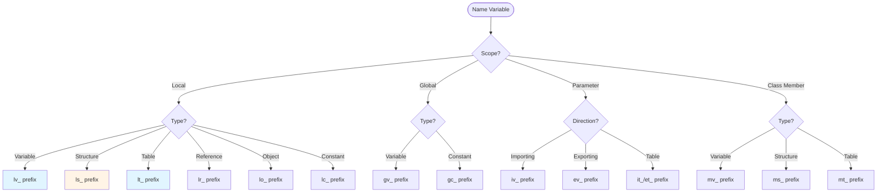

---

## Your First ABAP Program

### Step-by-Step Tutorial

Let's create a complete ABAP program from scratch.

### Program: Customer Information Display

**Step 1: Program Structure**

```abap
REPORT z_customer_display.

" This program displays customer information
" Author: Your Name
" Date: 2024
```

**Step 2: Data Declarations**

```abap
" Selection screen parameters
PARAMETERS: p_custid TYPE kunnr OBLIGATORY.

" Data declarations
DATA: lv_customer_name TYPE name1_gp,
      lv_city TYPE ort01_gp,
      lv_country TYPE land1_gp,
      lv_credit_limit TYPE dmbtr.
```

**Step 3: Selection Screen Event**

```abap
INITIALIZATION.
  " Set default values or initializations
  WRITE: / 'Customer Information Display Program'.
```

**Step 4: Main Processing**

```abap
START-OF-SELECTION.
  " Read customer data
  SELECT SINGLE name1 city country credit_limit
    FROM kna1
    INTO (lv_customer_name, lv_city, lv_country, lv_credit_limit)
    WHERE kunnr = p_custid.
  
  " Check if customer found
  IF sy-subrc = 0.
    " Display customer information
    WRITE: / 'Customer ID:', p_custid,
           / 'Name:', lv_customer_name,
           / 'City:', lv_city,
           / 'Country:', lv_country,
           / 'Credit Limit:', lv_credit_limit.
  ELSE.
    MESSAGE 'Customer not found' TYPE 'E'.
  ENDIF.
```

**Complete Program**:

```abap
REPORT z_customer_display.

"**********************************************************************
"* Program: Customer Information Display
"* Purpose: Display customer master data
"* Author: Your Name
"* Date: 2024
"**********************************************************************

" Selection screen
PARAMETERS: p_custid TYPE kunnr OBLIGATORY.

" Data declarations
DATA: lv_customer_name TYPE name1_gp,
      lv_city TYPE ort01_gp,
      lv_country TYPE land1_gp,
      lv_credit_limit TYPE dmbtr.

" Initialization
INITIALIZATION.
  WRITE: / '=== Customer Information Display ===',
         / ''.

" Main processing
START-OF-SELECTION.
  " Read customer data from database
  SELECT SINGLE name1 city country credit_limit
    FROM kna1
    INTO (lv_customer_name, lv_city, lv_country, lv_credit_limit)
    WHERE kunnr = p_custid.
  
  " Check if customer was found
  IF sy-subrc = 0.
    " Display customer information
    WRITE: / 'Customer ID:', 20 p_custid,
           / 'Name:', 20 lv_customer_name,
           / 'City:', 20 lv_city,
           / 'Country:', 20 lv_country,
           / 'Credit Limit:', 20 lv_credit_limit CURRENCY 'USD'.
  ELSE.
    " Customer not found
    MESSAGE 'Customer not found' TYPE 'E'.
  ENDIF.
```

**Program Execution Flow**:

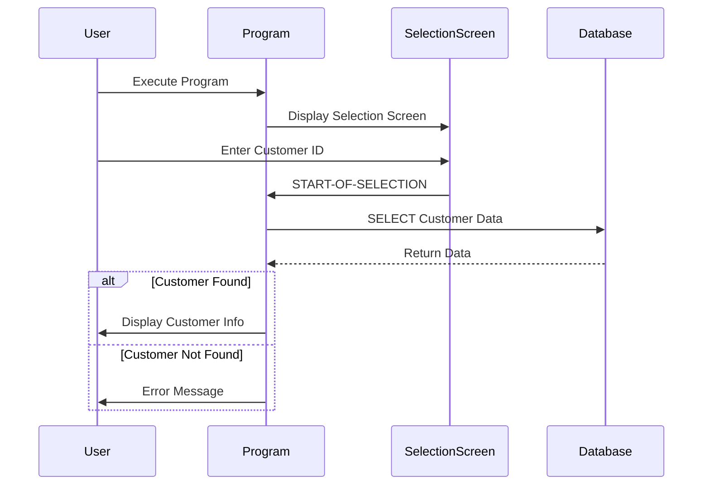

### Modern ABAP Version (S/4HANA)

Here's the same program using modern ABAP syntax:

```abap
REPORT z_customer_display_modern.

"**********************************************************************
"* Program: Customer Information Display (Modern ABAP)
"* Purpose: Display customer master data using modern syntax
"* Author: Your Name
"* Date: 2024
"**********************************************************************

PARAMETERS: p_custid TYPE kunnr OBLIGATORY.

START-OF-SELECTION.
  " Modern ABAP: Inline declaration and single statement
  SELECT SINGLE name1, city, country, credit_limit
    FROM kna1
    WHERE kunnr = @p_custid
    INTO @DATA(ls_customer).
  
  " Check result using modern syntax
  IF sy-subrc <> 0.
    MESSAGE |Customer { p_custid } not found| TYPE 'E'.
    RETURN.
  ENDIF.
  
  " Display using string template (modern ABAP)
  DATA(lv_output) = |Customer ID: { ls_customer-name1 }| &&
                     |\nName: { ls_customer-name1 }| &&
                     |\nCity: { ls_customer-city }| &&
                     |\nCountry: { ls_customer-country }| &&
                     |\nCredit Limit: { ls_customer-credit_limit }|.
  
  WRITE: / lv_output.
```

**Modern ABAP Features Used**:
- Inline declarations (`DATA(...)`)
- Host variables (`@variable`)
- String templates (`|...|`)
- Early returns
- Expression-based syntax

---

## Best Practices

### Code Organization

1. **Structure Your Code**:
```abap
REPORT z_program_name.

"**********************************************************************
"* Header comments with program info
"**********************************************************************

" Global data declarations
DATA: ...

" Selection screen
SELECT-OPTIONS: ...

" Events
INITIALIZATION.
  ...

START-OF-SELECTION.
  ...

" Subroutines
FORM process_data.
  ...
ENDFORM.
```

2. **Use Meaningful Names**: Always use descriptive variable names
3. **Comment Complex Logic**: Explain why, not what
4. **Group Related Code**: Keep related functionality together

### Error Handling

```abap
" Always check sy-subrc after database operations
SELECT SINGLE * FROM mara INTO ls_material
  WHERE matnr = lv_matnr.

IF sy-subrc <> 0.
  MESSAGE 'Material not found' TYPE 'E'.
  RETURN.
ENDIF.
```

### Performance Considerations

1. **Avoid SELECT in Loops**: Use `FOR ALL ENTRIES` instead
2. **Select Only Needed Fields**: Don't use `SELECT *`
3. **Use Appropriate Data Types**: Choose right type for the data

### Code Quality Checklist

- [ ] Meaningful variable names with proper prefixes
- [ ] Proper error handling
- [ ] Comments for complex logic
- [ ] Consistent code formatting
- [ ] No hardcoded values (use constants)
- [ ] Proper data type selection
- [ ] Performance considerations applied

---

## Common Pitfalls

### 1. Forgetting to Check sy-subrc

**Bad**:
```abap
SELECT SINGLE * FROM mara INTO ls_material
  WHERE matnr = lv_matnr.
" No check - program may crash if material not found
WRITE: / ls_material-maktx.
```

**Good**:
```abap
SELECT SINGLE * FROM mara INTO ls_material
  WHERE matnr = lv_matnr.
IF sy-subrc = 0.
  WRITE: / ls_material-maktx.
ELSE.
  MESSAGE 'Material not found' TYPE 'E'.
ENDIF.
```

### 2. Using Wrong Data Types

**Bad**:
```abap
DATA: lv_price TYPE i.  " Integer - loses decimals
lv_price = '123.45'.  " Will be 123
```

**Good**:
```abap
DATA: lv_price TYPE p DECIMALS 2.  " Packed number
lv_price = '123.45'.  " Correctly stores 123.45
```

### 3. Not Initializing Variables

**Bad**:
```abap
DATA: lv_total TYPE p.
" lv_total may contain garbage value
lv_total = lv_total + 100.
```

**Good**:
```abap
DATA: lv_total TYPE p VALUE 0.
" Explicitly initialized
lv_total = lv_total + 100.
```

### 4. Hardcoded Values

**Bad**:
```abap
IF lv_status = 'A'.  " What does 'A' mean?
  " Process
ENDIF.
```

**Good**:
```abap
CONSTANTS: lc_status_active TYPE c LENGTH 1 VALUE 'A'.

IF lv_status = lc_status_active.
  " Process
ENDIF.
```

### 5. Poor Variable Naming

**Bad**:
```abap
DATA: x TYPE string,
      temp TYPE i,
      data TYPE mara.
```

**Good**:
```abap
DATA: lv_customer_name TYPE string,
      lv_counter TYPE i,
      ls_material TYPE mara.
```

---

## Summary

### Key Takeaways

1. **ABAP** is SAP's proprietary programming language for business applications
2. **Development Tools**: SAP GUI (SE80, SE38), ADT (Eclipse), or BAS (Cloud)
3. **Data Types**: Choose appropriate types (CHAR, STRING, I, P, D, T)
4. **Control Structures**: IF, CASE, DO, WHILE, LOOP AT
5. **Naming Conventions**: Use prefixes (lv_, ls_, lt_, etc.)
6. **Best Practices**: Error handling, meaningful names, proper structure

### What You've Learned

- ✅ Understanding of ABAP language and its characteristics
- ✅ Knowledge of ABAP development environments
- ✅ Ability to declare variables and use data types
- ✅ Implementation of control structures
- ✅ Following naming conventions
- ✅ Writing your first ABAP program

### Next Steps

Continue your learning journey with:
- **02_SAP_ABAP_DATA_DICTIONARY_GUIDE.md**: Learn about Data Dictionary objects
- **03_SAP_ABAP_INTERNAL_TABLES_GUIDE.md**: Master internal table operations
- **04_SAP_ABAP_REPORTS_GUIDE.md**: Create professional reports

### Practice Exercises

1. Create a program that calculates the area of a circle
2. Write a program that displays system date and time
3. Create a program with selection screen to filter materials
4. Implement a program using all three loop types (DO, WHILE, LOOP AT)

---

## Resources

### SAP Official Documentation
- [SAP Help Portal - ABAP](https://help.sap.com/viewer/product/SAP_NETWEAVER_AS_ABAP/7.5/en-US)
- [ABAP Keyword Documentation](https://help.sap.com/doc/abapdoc_752_index_htm/7.52/en-US/index.htm)

### Learning Resources
- SAP Community: [ABAP Development](https://community.sap.com/topics/abap)
- openSAP: Free ABAP courses
- SAP Learning Hub: Official SAP training

### Tools
- **SE80**: Object Navigator
- **SE38**: ABAP Editor
- **SE11**: Data Dictionary
- **ADT**: ABAP Development Tools for Eclipse

---

**Last Updated**: 2024

**Related Guides**:
- [02_SAP_ABAP_DATA_DICTIONARY_GUIDE.md](./02_SAP_ABAP_DATA_DICTIONARY_GUIDE.md) - Next: Learn about Data Dictionary
- [SAP ABAP Programming Guide (Comprehensive)](../SAP_ABAP_PROGRAMMING_GUIDE.md) - Complete reference

