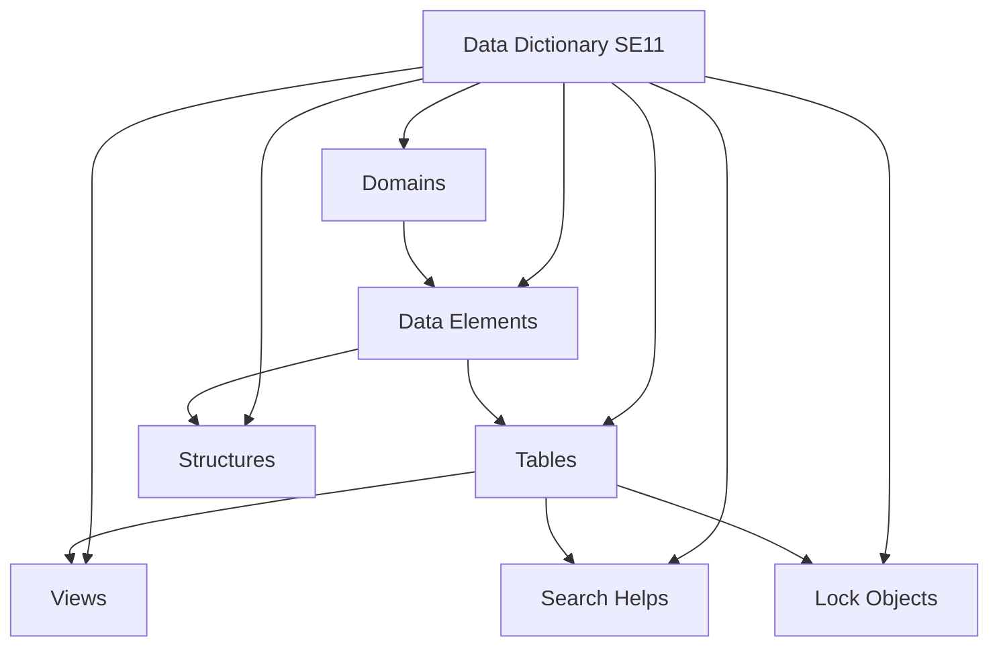
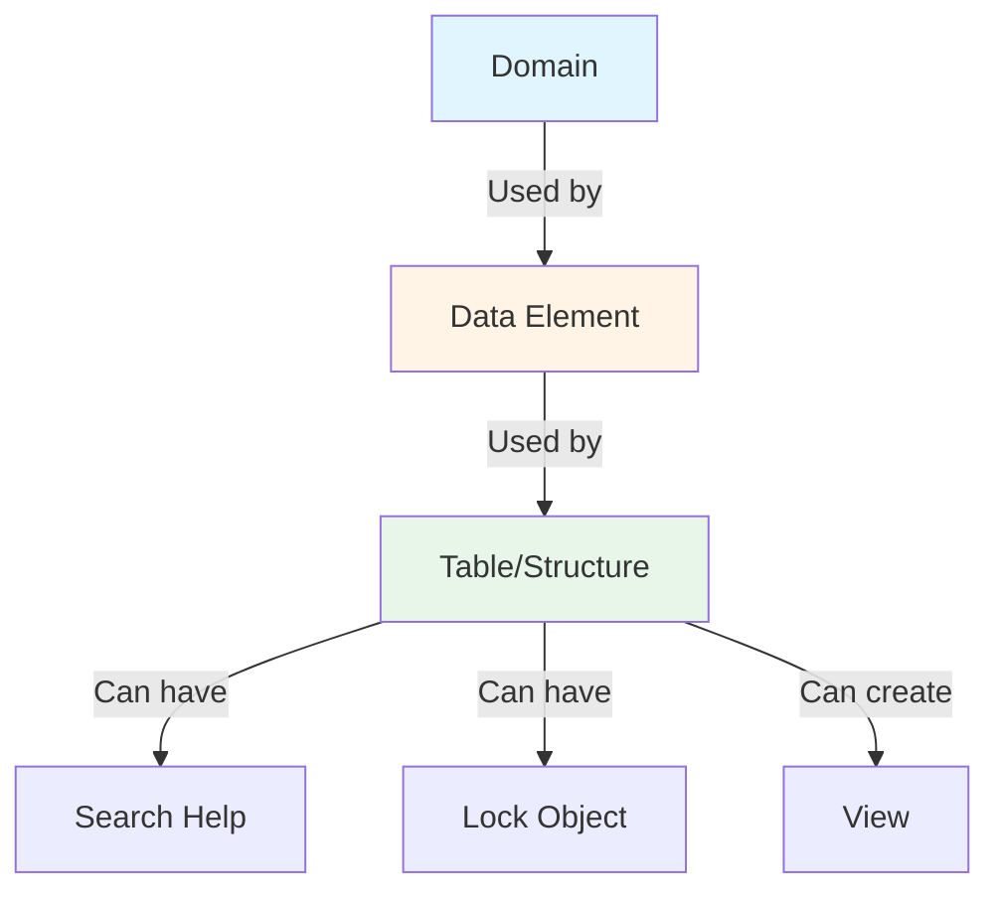
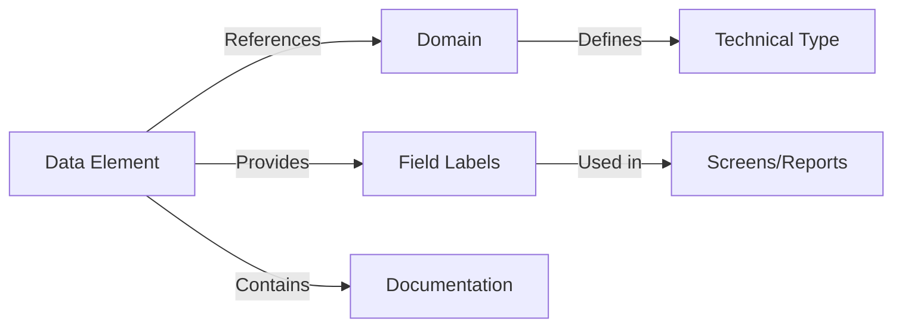
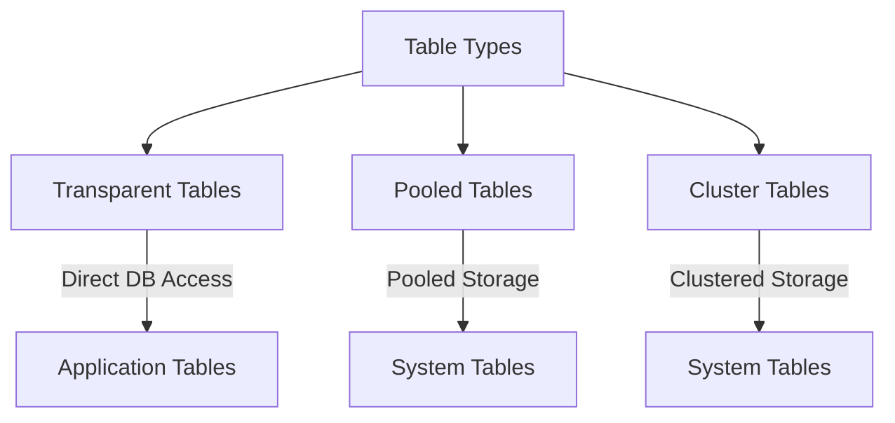
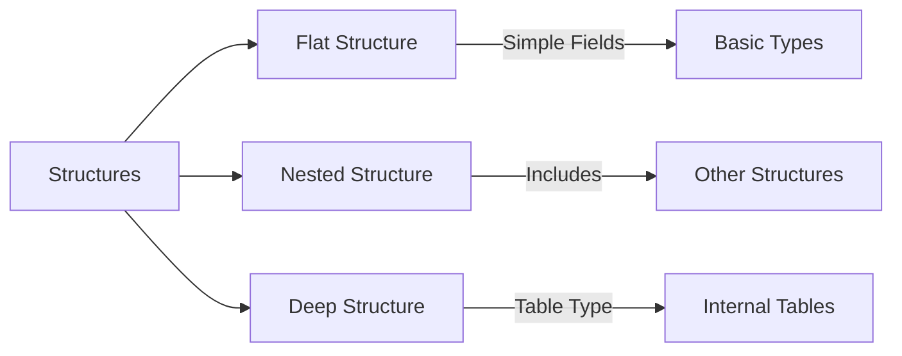
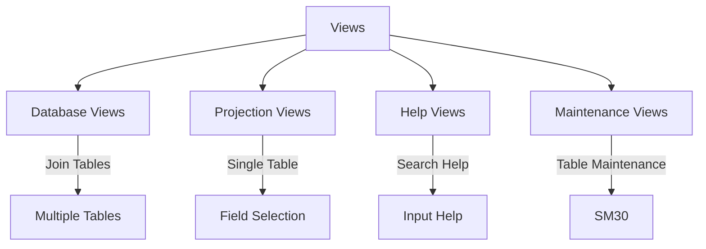
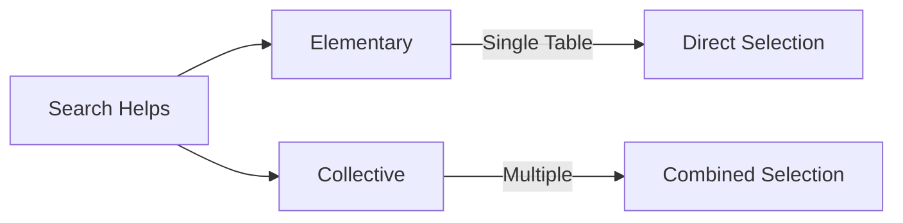
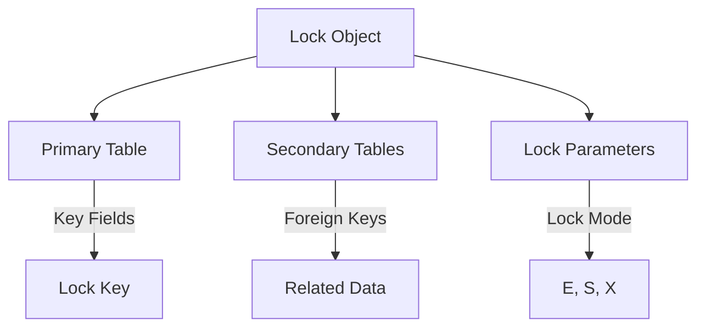
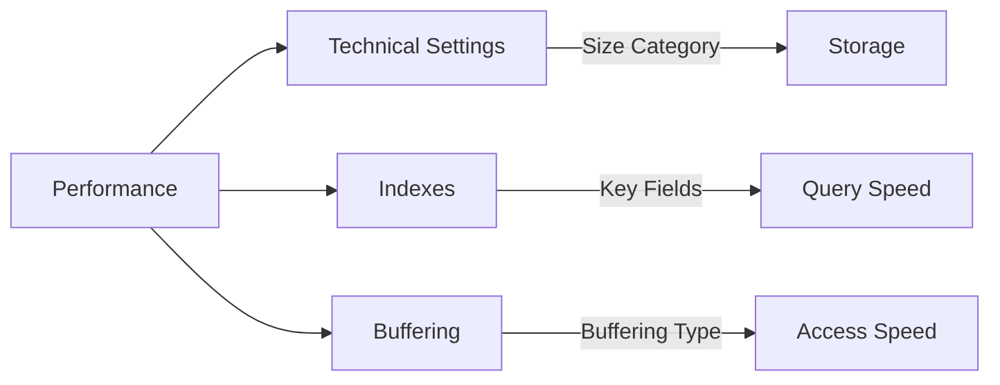

# SAP ABAP Data Dictionary Guide

**Complete guide to SAP Data Dictionary (SE11)**

---

## 📚 Table of Contents

1. [Introduction](#introduction)
2. [Data Dictionary Overview](#data-dictionary-overview)
3. [Domains](#domains)
4. [Data Elements](#data-elements)
5. [Tables](#tables)
6. [Structures](#structures)
7. [Views](#views)
8. [Search Helps](#search-helps)
9. [Lock Objects](#lock-objects)
10. [Table Maintenance](#table-maintenance)
11. [Best Practices](#best-practices)
12. [Examples](#examples)

---

## Introduction

The SAP Data Dictionary (Transaction: **SE11**) is the central repository for all data definitions in an SAP system. It provides a single source of truth for data structures used across the entire system.



---

## Data Dictionary Overview

### Key Concepts

**Data Dictionary Components**:
- **Domain**: Technical definition (data type, length, value range)
- **Data Element**: Semantic definition (field label, documentation)
- **Table**: Database table definition
- **Structure**: Reusable data structure
- **View**: Logical view of data
- **Search Help**: Input help for fields
- **Lock Object**: Lock mechanism for data

### Data Dictionary Hierarchy



---

## Domains

### What is a Domain?

A **Domain** defines the technical characteristics of a field:
- Data type (CHAR, NUMC, DATS, etc.)
- Length
- Decimal places
- Value range (fixed values or intervals)
- Conversion routines

### Creating a Domain

**Transaction**: SE11 → Select "Domain" → Enter name (e.g., `ZLEAVE_TYPE`)

**Steps**:
1. Enter domain name
2. Click "Create"
3. Enter short description
4. Define data type and length
5. Define value range (if needed)
6. Save and activate

### Domain Example

```abap
" Domain: ZLEAVE_TYPE
" Description: Leave Type Domain
" Data Type: CHAR
" Length: 4
" Fixed Values:
"   'ANNU' - Annual Leave
"   'SICK' - Sick Leave
"   'PERS' - Personal Leave
"   'MATR' - Maternity Leave
```

### Domain Properties

| Property | Description | Example |
|----------|-------------|---------|
| **Data Type** | Technical type | CHAR, NUMC, DATS, TIMS |
| **Length** | Field length | 10, 8, 15 |
| **Decimal Places** | For numeric types | 2, 3 |
| **Value Range** | Allowed values | Fixed values or intervals |
| **Conversion Routine** | Output conversion | DATE, TIME |

---

## Data Elements

### What is a Data Element?

A **Data Element** provides semantic meaning to a field:
- Field label (short, medium, long, heading)
- Documentation
- References a domain for technical definition

### Creating a Data Element

**Transaction**: SE11 → Select "Data Element" → Enter name (e.g., `ZLEAVE_TYPE_ELEM`)

**Steps**:
1. Enter data element name
2. Click "Create"
3. Enter short description
4. Assign domain
5. Enter field labels
6. Add documentation
7. Save and activate

### Data Element Structure



### Field Labels

| Label Type | Length | Usage |
|------------|--------|-------|
| **Short** | 10 chars | Column headers, lists |
| **Medium** | 20 chars | Screen fields |
| **Long** | 40 chars | Detailed descriptions |
| **Heading** | 20 chars | Report headers |

---

## Tables

### What is a Table?

A **Table** defines a database table structure:
- Fields and their types
- Primary key
- Foreign keys
- Indexes
- Technical settings

### Table Types



### Creating a Table

**Transaction**: SE11 → Select "Database Table" → Enter name (e.g., `ZLEAVE_REQ_HDR`)

**Steps**:
1. Enter table name
2. Click "Create"
3. Enter short description
4. Go to "Delivery and Maintenance" tab:
   - Delivery Class: A (Application table)
   - Data Browser/Table View: Display/Maintenance Allowed
5. Go to "Fields" tab:
   - Add fields with data elements
   - Mark key fields
6. Go to "Entry help/check" tab:
   - Add search helps
7. Save and activate

### Table Example: ZLEAVE_REQ_HDR

| Field Name | Data Element | Key | Data Type | Length | Description |
|------------|--------------|-----|-----------|--------|-------------|
| MANDT | MANDT | X | CLNT | 3 | Client |
| REQ_ID | ZLEAVE_REQ_ID | X | CHAR | 10 | Request ID |
| EMPLOYEE_ID | PERNR_D | | NUMC | 8 | Employee Number |
| LEAVE_TYPE | ZLEAVE_TYPE | | CHAR | 4 | Leave Type |
| START_DATE | DATUM | | DATS | 8 | Start Date |
| END_DATE | DATUM | | DATS | 8 | End Date |
| DAYS | ZLEAVE_DAYS | | DEC | 5,2 | Number of Days |
| STATUS | ZLEAVE_STATUS | | CHAR | 1 | Status |
| CREATED_BY | SYUNAME | | CHAR | 12 | Created By |
| CREATED_DATE | TIMESTAMP | | TIMESTAMP | 15 | Creation Date |

### Table Technical Settings

**Transaction**: SE11 → Table → Utilities → Technical Settings

**Settings**:
- **Data Class**: APPL0 (Master data), APPL1 (Transaction data), APPL2 (Organization data)
- **Size Category**: 0-4 (expected number of records)
- **Buffering**: 
  - No buffering
  - Buffering allowed
  - Full buffering
  - Generic buffering
  - Single record buffering

### Foreign Keys

**Purpose**: Maintain referential integrity between tables

**Example**:
```
ZLEAVE_REQ_HDR.EMPLOYEE_ID → PA0001.PERNR
```

**Creating Foreign Key**:
1. Go to "Entry help/check" tab
2. Select field
3. Click "Foreign Keys"
4. Create foreign key relationship
5. Define check table

---

## Structures

### What is a Structure?

A **Structure** is a reusable data type that groups related fields together. Unlike tables, structures are not stored in the database.

### Structure Types



### Creating a Structure

**Transaction**: SE11 → Select "Structure" → Enter name (e.g., `ZST_LEAVE_REQUEST`)

**Steps**:
1. Enter structure name
2. Click "Create"
3. Enter short description
4. Add fields with data elements
5. Save and activate

### Structure Example

```abap
" Structure: ZST_LEAVE_REQUEST
" Description: Leave Request Structure

" Fields:
"   REQ_ID      TYPE ZLEAVE_REQ_ID
"   EMPLOYEE_ID TYPE PERNR_D
"   LEAVE_TYPE  TYPE ZLEAVE_TYPE
"   START_DATE  TYPE DATUM
"   END_DATE    TYPE DATUM
"   DAYS        TYPE ZLEAVE_DAYS
"   STATUS      TYPE ZLEAVE_STATUS
```

### Using Structures in ABAP

```abap
DATA: ls_request TYPE zst_leave_request.

ls_request-req_id = 'REQ0000001'.
ls_request-employee_id = '00001234'.
ls_request-leave_type = 'ANNU'.
ls_request-start_date = '20260119'.
ls_request-end_date = '20260123'.
ls_request-days = 5.
ls_request-status = 'P'.
```

---

## Views

### What is a View?

A **View** is a logical representation of data from one or more tables. Views don't store data; they provide a way to access data.

### View Types



### Database View

**Purpose**: Join multiple tables

**Example**: Join leave request with employee data

```abap
" View: ZV_LEAVE_REQUEST_EMP
" Tables: ZLEAVE_REQ_HDR, PA0001
" Join: ZLEAVE_REQ_HDR.EMPLOYEE_ID = PA0001.PERNR
```

### Creating a Database View

**Steps**:
1. SE11 → Select "View" → Enter name
2. Select "Database View"
3. Enter short description
4. Add tables
5. Define join conditions
6. Select fields
7. Save and activate

---

## Search Helps

### What is a Search Help?

A **Search Help** provides input help (F4) for fields, allowing users to search and select values.

### Search Help Types



### Creating a Search Help

**Transaction**: SE11 → Select "Search Help" → Enter name (e.g., `ZLEAVE_EMPLOYEE`)

**Steps**:
1. Enter search help name
2. Click "Create"
3. Enter short description
4. Go to "Data collection" tab:
   - Add selection method (table/view)
   - Define search fields
   - Define result fields
5. Go to "Dialog behavior" tab:
   - Define dialog type
6. Save and activate

### Search Help Example

```abap
" Search Help: ZLEAVE_EMPLOYEE
" Selection Method: PA0001
" Search Fields: PERNR, ENAME
" Result Fields: PERNR, ENAME, ORGEH
```

### Assigning Search Help to Field

1. Open table/structure in SE11
2. Select field
3. Go to "Entry help/check" tab
4. Enter search help name
5. Save and activate

---

## Lock Objects

### What is a Lock Object?

A **Lock Object** defines a lock mechanism to prevent concurrent access to the same data.

### Lock Object Structure



### Lock Modes

| Mode | Description | Usage |
|------|-------------|-------|
| **E (Exclusive)** | Exclusive lock | Write operations |
| **S (Shared)** | Shared lock | Read operations |
| **X (Exclusive, not cumulative)** | Exclusive, non-cumulative | Critical updates |

### Creating a Lock Object

**Transaction**: SE11 → Select "Lock Object" → Enter name (e.g., `EZLEAVE_REQ`)

**Steps**:
1. Enter lock object name (must start with E)
2. Click "Create"
3. Enter short description
4. Define primary table
5. Define lock parameters
6. Save and activate

### Using Lock Objects in ABAP

```abap
" Lock object: EZLEAVE_REQ
" Function modules generated:
"   ENQUEUE_EZLEAVE_REQ - Lock
"   DEQUEUE_EZLEAVE_REQ - Unlock

" Lock example:
CALL FUNCTION 'ENQUEUE_EZLEAVE_REQ'
  EXPORTING
    req_id = lv_req_id
  EXCEPTIONS
    foreign_lock = 1
    system_failure = 2
    OTHERS = 3.

IF sy-subrc = 0.
  " Perform update
  " ...
  
  " Unlock
  CALL FUNCTION 'DEQUEUE_EZLEAVE_REQ'
    EXPORTING
      req_id = lv_req_id.
ENDIF.
```

---

## Table Maintenance

### Table Maintenance Generator

**Purpose**: Generate maintenance screens for tables (SM30)

**Transaction**: SE11 → Table → Utilities → Table Maintenance Generator

**Steps**:
1. Enter authorization group
2. Select maintenance type:
   - One step
   - Two step
3. Generate
4. Test (SM30)

### Maintenance View

**Purpose**: Create maintenance view for multiple related tables

**Transaction**: SE11 → Select "View" → "Maintenance View"

---

## Best Practices

### Naming Conventions

| Object Type | Prefix | Example |
|-------------|--------|---------|
| **Domain** | Z | ZLEAVE_TYPE |
| **Data Element** | Z | ZLEAVE_TYPE_ELEM |
| **Table** | Z | ZLEAVE_REQ_HDR |
| **Structure** | ZST_ | ZST_LEAVE_REQUEST |
| **View** | ZV_ | ZV_LEAVE_REQUEST_EMP |
| **Search Help** | Z | ZLEAVE_EMPLOYEE |
| **Lock Object** | EZ | EZLEAVE_REQ |

### Design Guidelines

1. **Always use Data Elements**: Never use domains directly in tables
2. **Reuse Domains**: Create reusable domains for common data types
3. **Document Everything**: Add descriptions and documentation
4. **Use Foreign Keys**: Maintain referential integrity
5. **Optimize Technical Settings**: Configure buffering appropriately
6. **Create Indexes**: For frequently queried fields

### Performance Considerations



---

## Examples

### Complete Example: Leave Request System

**Step 1: Create Domain**
```
Domain: ZLEAVE_STATUS
Data Type: CHAR
Length: 1
Fixed Values:
  'P' - Pending
  'A' - Approved
  'R' - Rejected
  'C' - Cancelled
```

**Step 2: Create Data Element**
```
Data Element: ZLEAVE_STATUS_ELEM
Domain: ZLEAVE_STATUS
Field Labels:
  Short: Status
  Medium: Request Status
  Long: Leave Request Status
```

**Step 3: Create Table**
```
Table: ZLEAVE_REQ_HDR
Fields:
  MANDT (Key) - MANDT
  REQ_ID (Key) - ZLEAVE_REQ_ID
  STATUS - ZLEAVE_STATUS_ELEM
  ...
```

**Step 4: Create Search Help**
```
Search Help: ZLEAVE_EMPLOYEE
Table: PA0001
Search: PERNR, ENAME
Result: PERNR, ENAME
```

**Step 5: Assign Search Help**
```
Table: ZLEAVE_REQ_HDR
Field: EMPLOYEE_ID
Search Help: ZLEAVE_EMPLOYEE
```

---

## Common Transactions

| Transaction | Purpose |
|-------------|---------|
| **SE11** | Data Dictionary |
| **SE12** | Display Data Dictionary |
| **SE13** | Maintain Technical Settings |
| **SE14** | Database Utility |
| **SM30** | Table Maintenance |
| **SE16** | Data Browser |
| **SE16N** | Enhanced Data Browser |

---

## Troubleshooting

### Common Issues

1. **Activation Errors**
   - Check dependencies
   - Verify all referenced objects exist
   - Check naming conventions

2. **Foreign Key Errors**
   - Verify check table exists
   - Check field types match
   - Verify key fields

3. **Search Help Not Appearing**
   - Check search help is active
   - Verify assignment in table
   - Check user authorization

---

## References

- [ABAP Basics Guide](./01_SAP_ABAP_BASICS_GUIDE.md)
- [Internal Tables Guide](./03_SAP_ABAP_INTERNAL_TABLES_GUIDE.md)
- [SAP Help - Data Dictionary](https://help.sap.com/doc/abapdocu_latest_index_htm/latest/en-US/index.htm)

---

**Next**: [Internal Tables Guide](./03_SAP_ABAP_INTERNAL_TABLES_GUIDE.md)

