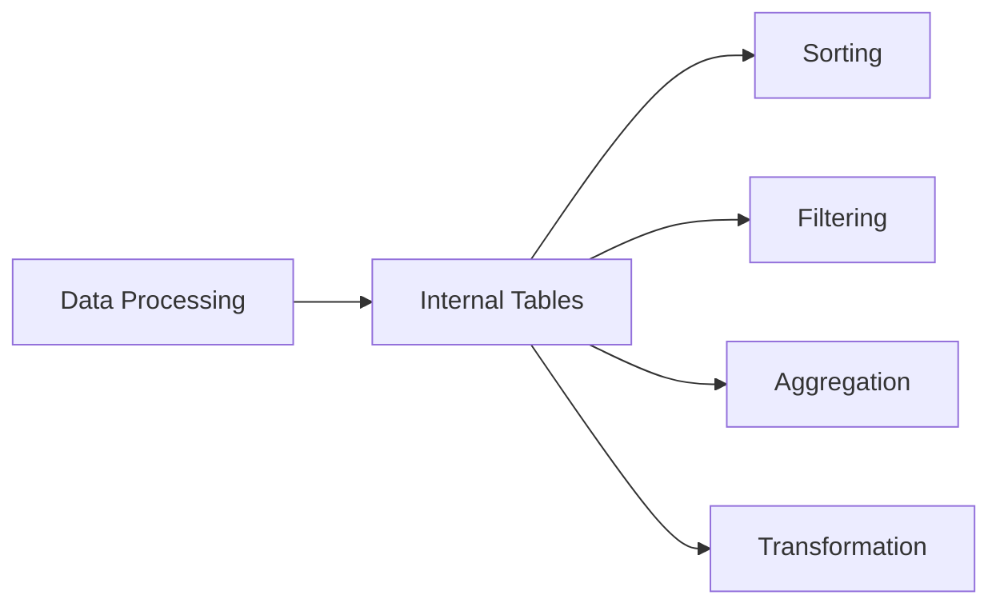
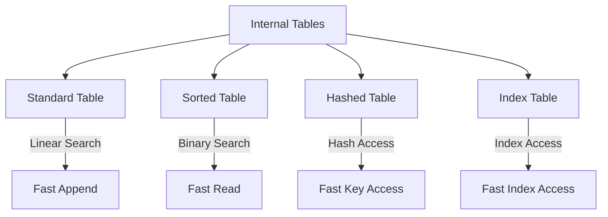
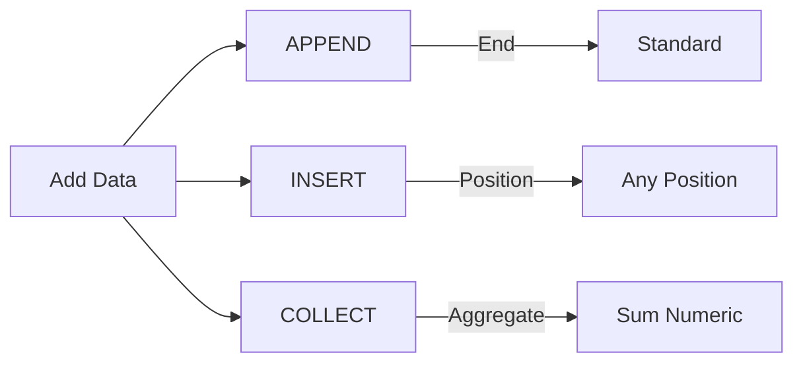
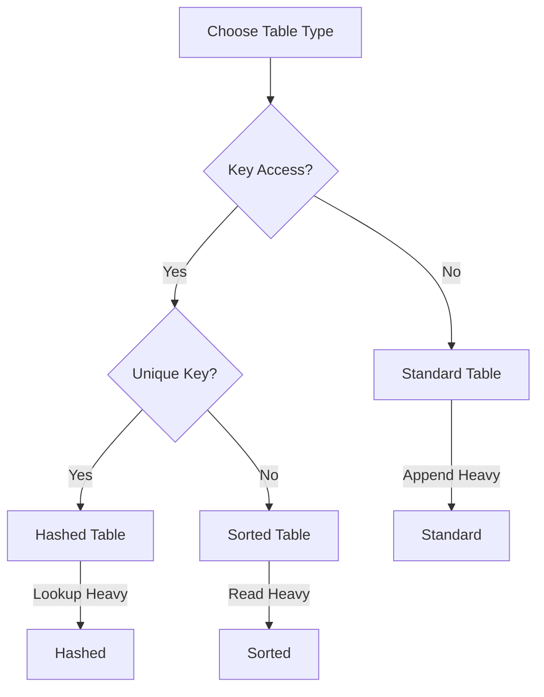

# SAP ABAP Internal Tables Guide

**Complete guide to working with internal tables in ABAP**

---

## 📚 Table of Contents

1. [Introduction](#introduction)
2. [Internal Table Types](#internal-table-types)
3. [Creating Internal Tables](#creating-internal-tables)
4. [Operations](#operations)
5. [Modern ABAP Syntax](#modern-abap-syntax)
6. [Performance Optimization](#performance-optimization)
7. [Best Practices](#best-practices)
8. [Examples](#examples)

---

## Introduction

**Internal Tables** are dynamic data structures in ABAP that store multiple rows of data in memory. They are essential for processing data in ABAP programs.

### Why Internal Tables?



**Use Cases**:
- Store database query results
- Process multiple records
- Transform data
- Temporary data storage
- Data manipulation

---

## Internal Table Types

### Table Type Categories



### 1. Standard Table

**Characteristics**:
- No unique key required
- Linear search
- Fast append
- Index-based access

**Use When**:
- Need to append data frequently
- Order doesn't matter
- No unique key requirement

### 2. Sorted Table

**Characteristics**:
- Unique or non-unique key
- Sorted by key
- Binary search
- Slower insert

**Use When**:
- Need sorted data
- Frequent read operations
- Key-based access

### 3. Hashed Table

**Characteristics**:
- Unique key required
- Hash-based access
- Fastest key access
- No index

**Use When**:
- Large datasets
- Frequent key-based lookups
- Unique key available

### 4. Index Table

**Characteristics**:
- Subset of Standard/Sorted
- Index-based access
- Fast sequential access

---

## Creating Internal Tables

### Method 1: Using TYPE

```abap
" Standard table
DATA: lt_flights TYPE STANDARD TABLE OF sflight.

" Sorted table
DATA: lt_flights TYPE SORTED TABLE OF sflight
      WITH UNIQUE KEY carrid connid fldate.

" Hashed table
DATA: lt_flights TYPE HASHED TABLE OF sflight
      WITH UNIQUE KEY carrid connid fldate.
```

### Method 2: Using LIKE

```abap
DATA: ls_flight TYPE sflight,
      lt_flights LIKE STANDARD TABLE OF ls_flight.
```

### Method 3: Using Table Type

```abap
" Define table type in SE11
" Then use:
DATA: lt_flights TYPE ztt_flight.
```

### Method 4: Inline Declaration (Modern ABAP)

```abap
" Modern ABAP 7.40+
DATA(lt_flights) = VALUE ty_flight_tab( ).
```

---

## Operations

### Adding Data



#### APPEND

```abap
DATA: lt_flights TYPE TABLE OF sflight,
      ls_flight TYPE sflight.

" Append single row
ls_flight-carrid = 'LH'.
ls_flight-connid = '0400'.
APPEND ls_flight TO lt_flights.

" Append multiple rows
APPEND LINES OF lt_source TO lt_target.
```

#### INSERT

```abap
" Insert at specific position
INSERT ls_flight INTO lt_flights INDEX 1.

" Insert sorted (for sorted tables)
INSERT ls_flight INTO TABLE lt_flights.
```

#### COLLECT

```abap
" Collect aggregates numeric fields
DATA: BEGIN OF ls_sum,
        carrid TYPE sflight-carrid,
        price_sum TYPE sflight-price,
      END OF ls_sum,
      lt_sum LIKE TABLE OF ls_sum.

ls_sum-carrid = 'LH'.
ls_sum-price_sum = 100.
COLLECT ls_sum INTO lt_sum.

ls_sum-carrid = 'LH'.
ls_sum-price_sum = 200.
COLLECT ls_sum INTO lt_sum.
" Result: LH with price_sum = 300
```

### Reading Data

```abap
" Read by index
READ TABLE lt_flights INTO ls_flight INDEX 1.

" Read by key
READ TABLE lt_flights INTO ls_flight
  WITH KEY carrid = 'LH' connid = '0400'.

" Read into field symbol
READ TABLE lt_flights ASSIGNING FIELD-SYMBOL(<fs_flight>) INDEX 1.
IF sy-subrc = 0.
  <fs_flight>-price = 500.
ENDIF.

" Modern ABAP: Read with expression
DATA(ls_flight) = lt_flights[ 1 ].
DATA(ls_flight2) = lt_flights[ carrid = 'LH' connid = '0400' ].
```

### Modifying Data

```abap
" Modify by index
MODIFY lt_flights FROM ls_flight INDEX 1.

" Modify by key
MODIFY TABLE lt_flights FROM ls_flight.

" Modify using field symbol
READ TABLE lt_flights ASSIGNING FIELD-SYMBOL(<fs>) INDEX 1.
IF sy-subrc = 0.
  <fs>-price = 600.
ENDIF.
```

### Deleting Data

```abap
" Delete by index
DELETE lt_flights INDEX 1.

" Delete by key
DELETE TABLE lt_flights FROM ls_flight.

" Delete where condition
DELETE lt_flights WHERE carrid = 'LH'.

" Delete adjacent duplicates
DELETE ADJACENT DUPLICATES FROM lt_flights
  COMPARING carrid connid.
```

### Sorting

```abap
" Sort standard table
SORT lt_flights BY carrid connid fldate.

" Sort descending
SORT lt_flights BY price DESCENDING.

" Sort with multiple fields
SORT lt_flights BY carrid ASCENDING
                   price DESCENDING.
```

---

## Modern ABAP Syntax

### VALUE Operator

```abap
" Create and populate in one step
DATA(lt_flights) = VALUE ty_flight_tab(
  ( carrid = 'LH' connid = '0400' price = 500 )
  ( carrid = 'AA' connid = '0017' price = 600 )
).

" With structure
DATA(ls_flight) = VALUE sflight(
  carrid = 'LH'
  connid = '0400'
  price = 500
).
```

### FOR Operator

```abap
" Create table from another table
DATA(lt_filtered) = VALUE ty_flight_tab(
  FOR ls_flight IN lt_flights
  WHERE ( carrid = 'LH' )
  ( ls_flight )
).

" With transformation
DATA(lt_transformed) = VALUE ty_result_tab(
  FOR ls_flight IN lt_flights
  ( carrid = ls_flight-carrid
    total_price = ls_flight-price * 1.1 )
).
```

### REDUCE Operator

```abap
" Aggregate data
DATA(lv_total) = REDUCE i(
  INIT sum = 0
  FOR ls_flight IN lt_flights
  NEXT sum = sum + ls_flight-price
).

" Find maximum
DATA(lv_max_price) = REDUCE sflight-price(
  INIT max = 0
  FOR ls_flight IN lt_flights
  NEXT max = COND #( WHEN ls_flight-price > max
                     THEN ls_flight-price
                     ELSE max )
).
```

### FILTER Operator

```abap
" Filter table
DATA(lt_filtered) = FILTER #(
  lt_flights
  WHERE carrid = 'LH' AND price > 500
).
```

### CORRESPONDING Operator

```abap
" Copy matching fields
DATA: lt_source TYPE TABLE OF sflight,
      lt_target TYPE TABLE OF ty_flight.

lt_target = CORRESPONDING #( lt_source ).
```

---

## Performance Optimization

### Table Type Selection



### Performance Tips

1. **Use Appropriate Table Type**
   - Standard: Frequent append
   - Sorted: Frequent read with key
   - Hashed: Large dataset with unique key

2. **Avoid Nested Loops**
```abap
" Bad: O(n²)
LOOP AT lt_outer INTO ls_outer.
  LOOP AT lt_inner INTO ls_inner WHERE key = ls_outer-key.
    " Process
  ENDLOOP.
ENDLOOP.

" Good: Use sorted/hashed table
LOOP AT lt_outer INTO ls_outer.
  READ TABLE lt_inner INTO ls_inner
    WITH KEY key = ls_outer-key
    BINARY SEARCH.
  IF sy-subrc = 0.
    " Process
  ENDIF.
ENDLOOP.
```

3. **Use BINARY SEARCH**
```abap
" For sorted tables
SORT lt_flights BY carrid.
READ TABLE lt_flights INTO ls_flight
  WITH KEY carrid = 'LH'
  BINARY SEARCH.
```

4. **Limit Data Early**
```abap
" Filter in SELECT
SELECT * FROM sflight
  INTO TABLE lt_flights
  WHERE carrid = 'LH'
    AND price > 500.
```

---

## Best Practices

### Naming Conventions

| Prefix | Type | Example |
|--------|------|---------|
| **lt_** | Internal table | `lt_flights` |
| **ls_** | Structure | `ls_flight` |
| **lv_** | Variable | `lv_count` |
| **lo_** | Object reference | `lo_alv` |

### Code Organization

```abap
" Recommended structure:
" 1. Type definitions
" 2. Data declarations
" 3. Selection screen
" 4. Main processing
" 5. Form routines
```

### Error Handling

```abap
" Always check sy-subrc
READ TABLE lt_flights INTO ls_flight INDEX 1.
IF sy-subrc = 0.
  " Process
ELSE.
  MESSAGE 'Record not found' TYPE 'E'.
ENDIF.

" Modern ABAP: Use expressions
TRY.
    DATA(ls_flight) = lt_flights[ 1 ].
  CATCH cx_sy_itab_line_not_found.
    MESSAGE 'Record not found' TYPE 'E'.
ENDTRY.
```

---

## Examples

### Example 1: Basic Operations

```abap
REPORT z_internal_table_basic.

TYPES: BEGIN OF ty_employee,
         empno TYPE pernr_d,
         name TYPE string,
         dept TYPE string,
         salary TYPE p DECIMALS 2,
       END OF ty_employee,
       ty_employee_tab TYPE STANDARD TABLE OF ty_employee.

DATA: lt_employees TYPE ty_employee_tab,
      ls_employee TYPE ty_employee.

" Add employees
ls_employee-empno = '00001234'.
ls_employee-name = 'John Doe'.
ls_employee-dept = 'IT'.
ls_employee-salary = 5000.
APPEND ls_employee TO lt_employees.

ls_employee-empno = '00005678'.
ls_employee-name = 'Jane Smith'.
ls_employee-dept = 'HR'.
ls_employee-salary = 6000.
APPEND ls_employee TO lt_employees.

" Read employee
READ TABLE lt_employees INTO ls_employee
  WITH KEY empno = '00001234'.
IF sy-subrc = 0.
  WRITE: / ls_employee-name, ls_employee-salary.
ENDIF.

" Modify salary
READ TABLE lt_employees ASSIGNING FIELD-SYMBOL(<fs_emp>) INDEX 1.
IF sy-subrc = 0.
  <fs_emp>-salary = 5500.
ENDIF.

" Sort by salary
SORT lt_employees BY salary DESCENDING.

" Display all
LOOP AT lt_employees INTO ls_employee.
  WRITE: / ls_employee-empno,
           ls_employee-name,
           ls_employee-salary.
ENDLOOP.
```

### Example 2: Modern ABAP

```abap
REPORT z_internal_table_modern.

TYPES: BEGIN OF ty_flight,
         carrid TYPE sflight-carrid,
         connid TYPE sflight-connid,
         price TYPE sflight-price,
       END OF ty_flight,
       ty_flight_tab TYPE STANDARD TABLE OF ty_flight.

" Create with VALUE
DATA(lt_flights) = VALUE ty_flight_tab(
  ( carrid = 'LH' connid = '0400' price = 500 )
  ( carrid = 'AA' connid = '0017' price = 600 )
  ( carrid = 'LH' connid = '0401' price = 550 )
).

" Filter with FOR
DATA(lt_lh_flights) = VALUE ty_flight_tab(
  FOR ls_flight IN lt_flights
  WHERE ( carrid = 'LH' )
  ( ls_flight )
).

" Aggregate with REDUCE
DATA(lv_total) = REDUCE sflight-price(
  INIT sum = 0
  FOR ls_flight IN lt_flights
  NEXT sum = sum + ls_flight-price
).

" Find maximum
DATA(lv_max_price) = REDUCE sflight-price(
  INIT max = 0
  FOR ls_flight IN lt_flights
  NEXT max = COND #( WHEN ls_flight-price > max
                     THEN ls_flight-price
                     ELSE max )
).

WRITE: / 'Total:', lv_total,
       / 'Maximum:', lv_max_price.
```

### Example 3: Performance Optimization

```abap
REPORT z_internal_table_performance.

" Use sorted table for frequent reads
TYPES: ty_flight_tab TYPE SORTED TABLE OF sflight
       WITH UNIQUE KEY carrid connid fldate.

DATA: lt_flights TYPE ty_flight_tab.

" Populate
SELECT * FROM sflight
  INTO TABLE lt_flights
  UP TO 1000 ROWS.

" Fast read with key (binary search)
DATA: ls_flight TYPE sflight.
READ TABLE lt_flights INTO ls_flight
  WITH KEY carrid = 'LH' connid = '0400' fldate = '20240101'.

" Use hashed table for lookups
TYPES: ty_flight_hash TYPE HASHED TABLE OF sflight
       WITH UNIQUE KEY carrid connid fldate.

DATA: lt_flights_hash TYPE ty_flight_hash.
lt_flights_hash = lt_flights.

" Fastest key access
READ TABLE lt_flights_hash INTO ls_flight
  WITH TABLE KEY carrid = 'LH'
                 connid = '0400'
                 fldate = '20240101'.
```

---

## Common Transactions

| Transaction | Purpose |
|-------------|---------|
| **SE11** | Data Dictionary (for table types) |
| **SE38** | ABAP Editor |
| **SE80** | Object Navigator |

---

## Troubleshooting

### Common Issues

1. **Performance Problems**
   - Use appropriate table type
   - Avoid nested loops
   - Use BINARY SEARCH for sorted tables

2. **Memory Issues**
   - Limit data size
   - Use SELECT with WHERE clause
   - Clear tables when done

3. **Key Errors**
   - Check key uniqueness for hashed tables
   - Verify key fields are filled

---

## References

- [ABAP Basics Guide](./01_SAP_ABAP_BASICS_GUIDE.md)
- [Data Dictionary Guide](./02_SAP_ABAP_DATA_DICTIONARY_GUIDE.md)
- [Reports Guide](./04_SAP_ABAP_REPORTS_GUIDE.md)
- [Performance Guide](./10_SAP_ABAP_PERFORMANCE_GUIDE.md)

---

**Next**: [Reports Guide](./04_SAP_ABAP_REPORTS_GUIDE.md)

