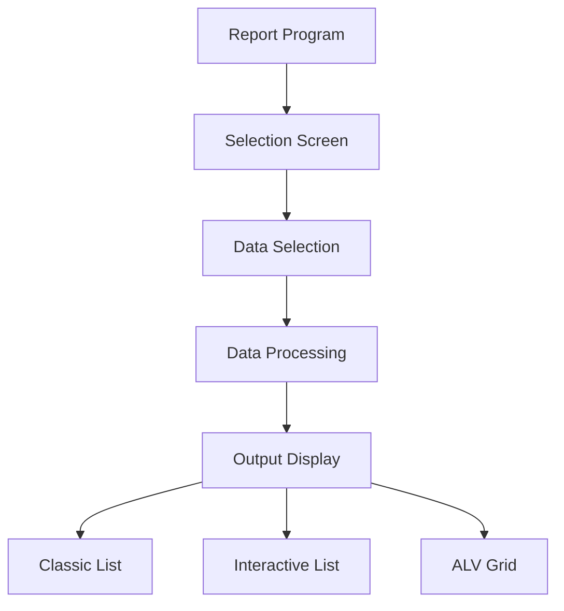
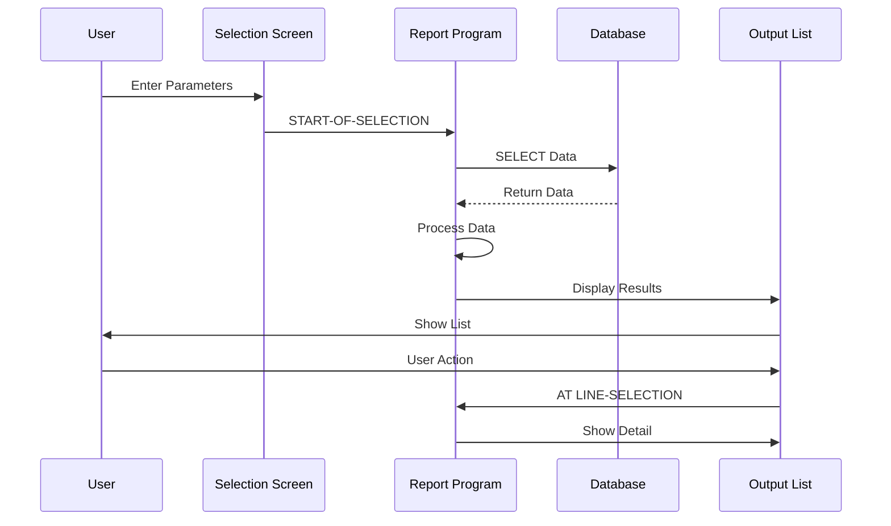
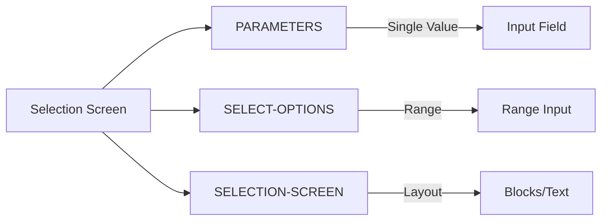
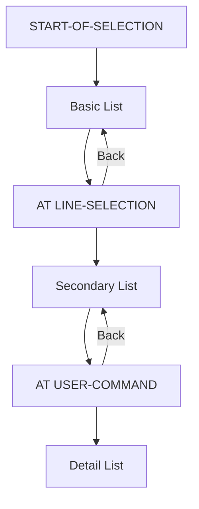
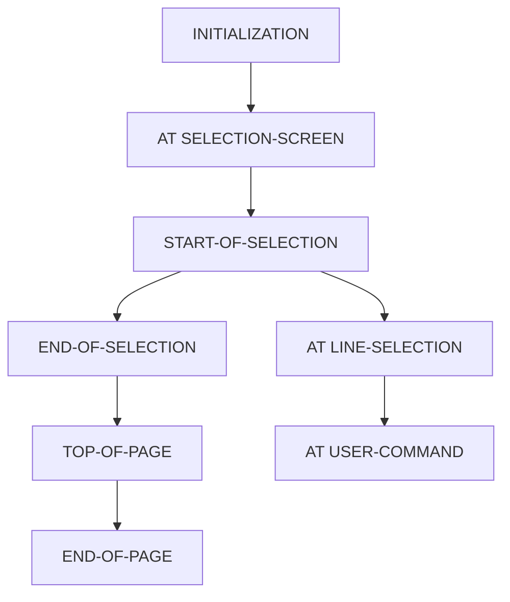
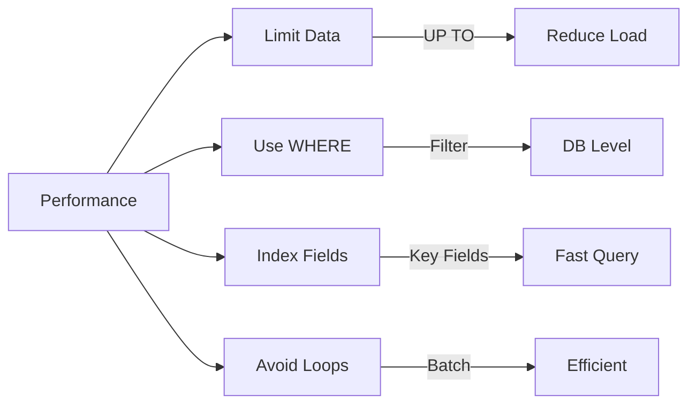

# SAP ABAP Reports Guide

**Complete guide to creating ABAP reports**

---

## 📚 Table of Contents

1. [Introduction](#introduction)
2. [Report Types](#report-types)
3. [Selection Screens](#selection-screens)
4. [Classic Reports](#classic-reports)
5. [Interactive Reports](#interactive-reports)
6. [ALV Reports](#alv-reports)
7. [Report Events](#report-events)
8. [Best Practices](#best-practices)
9. [Examples](#examples)

---

## Introduction

**ABAP Reports** are programs that read data from the database and display it in various formats. Reports are one of the most common ABAP program types.

### Report Architecture



### Report Flow



---

## Report Types

### 1. Classic Reports

**Characteristics**:
- Simple list output
- WRITE statements
- Basic formatting
- Limited interactivity

**Use When**:
- Simple data display
- Quick reports
- Legacy requirements

### 2. Interactive Reports

**Characteristics**:
- Multiple detail levels
- Drill-down capability
- User interaction
- Secondary lists

**Use When**:
- Need detail views
- Hierarchical data
- User navigation required

### 3. ALV Reports

**Characteristics**:
- Rich functionality
- Sorting, filtering, exporting
- Professional appearance
- Modern approach

**Use When**:
- Professional reports
- User-friendly interface
- Rich features needed

---

## Selection Screens

### Basic Selection Screen

```abap
REPORT z_basic_report.

" Parameters
PARAMETERS: p_empno TYPE pernr_d,
            p_date TYPE datum DEFAULT sy-datum.

" Select-options
SELECT-OPTIONS: s_dept FOR p_dept,
                s_salary FOR p_salary.

" Selection screen blocks
SELECTION-SCREEN BEGIN OF BLOCK b1 WITH FRAME TITLE TEXT-001.
PARAMETERS: p_option1 TYPE c RADIOBUTTON GROUP grp1,
            p_option2 TYPE c RADIOBUTTON GROUP grp1.
SELECTION-SCREEN END OF BLOCK b1.

START-OF-SELECTION.
  " Report logic
```

### Selection Screen Elements



### Selection Screen Example

```abap
REPORT z_employee_report.

SELECTION-SCREEN BEGIN OF BLOCK b1 WITH FRAME TITLE TEXT-001.
PARAMETERS: p_empno TYPE pernr_d OBLIGATORY.
SELECT-OPTIONS: s_date FOR sy-datum.
PARAMETERS: p_dept TYPE string.
SELECTION-SCREEN END OF BLOCK b1.

SELECTION-SCREEN BEGIN OF BLOCK b2 WITH FRAME TITLE TEXT-002.
PARAMETERS: p_detailed AS CHECKBOX DEFAULT 'X'.
PARAMETERS: p_export AS CHECKBOX.
SELECTION-SCREEN END OF BLOCK b2.

INITIALIZATION.
  " Set default values
  s_date-sign = 'I'.
  s_date-option = 'BT'.
  s_date-low = sy-datum - 30.
  s_date-high = sy-datum.
  APPEND s_date.

START-OF-SELECTION.
  PERFORM get_data.
  PERFORM display_data.
```

---

## Classic Reports

### Basic Classic Report

```abap
REPORT z_classic_report.

DATA: lt_flights TYPE TABLE OF sflight,
      ls_flight TYPE sflight.

SELECT-OPTIONS: s_carrid FOR ls_flight-carrid.

START-OF-SELECTION.
  SELECT * FROM sflight
    INTO TABLE lt_flights
    WHERE carrid IN s_carrid.

  " Display header
  WRITE: / 'Flight Report',
         / 'Date:', sy-datum,
         / sy-uline.

  " Display data
  LOOP AT lt_flights INTO ls_flight.
    WRITE: / ls_flight-carrid,
             ls_flight-connid,
             ls_flight-fldate,
             ls_flight-price.
  ENDLOOP.
```

### Report Formatting

```abap
" Headers and footers
TOP-OF-PAGE.
  WRITE: / 'Company Name',
         / 'Report Title',
         / sy-uline.

END-OF-PAGE.
  WRITE: / sy-uline,
         / 'Page', sy-pagno.

" Line formatting
WRITE: /(10) ls_flight-carrid LEFT-JUSTIFIED,
       (15) ls_flight-connid CENTERED,
       (12) ls_flight-price RIGHT-JUSTIFIED CURRENCY 'USD'.

" Colors
FORMAT COLOR COL_HEADING.
WRITE: / 'Header Text'.
FORMAT COLOR OFF.

" Hotspot (clickable)
FORMAT HOTSPOT ON.
WRITE: / ls_flight-carrid.
FORMAT HOTSPOT OFF.
```

---

## Interactive Reports

### Interactive Report Structure



### Interactive Report Example

```abap
REPORT z_interactive_report.

DATA: lt_flights TYPE TABLE OF sflight,
      ls_flight TYPE sflight,
      lv_index TYPE sy-tabix.

SELECT-OPTIONS: s_carrid FOR ls_flight-carrid.

START-OF-SELECTION.
  SELECT * FROM sflight
    INTO TABLE lt_flights
    WHERE carrid IN s_carrid
    UP TO 100 ROWS.

  " Display basic list
  LOOP AT lt_flights INTO ls_flight.
    lv_index = sy-tabix.
    WRITE: / sy-vline,
             (3) ls_flight-carrid HOTSPOT,
             sy-vline,
             (4) ls_flight-connid,
             sy-vline,
             (10) ls_flight-price,
             sy-vline.
    HIDE: lv_index.
  ENDLOOP.

AT LINE-SELECTION.
  " Show detail for selected line
  READ TABLE lt_flights INTO ls_flight INDEX lv_index.
  IF sy-subrc = 0.
    " Display detail
    WRITE: / 'Flight Details:',
           / 'Airline:', ls_flight-carrid,
           / 'Connection:', ls_flight-connid,
           / 'Date:', ls_flight-fldate,
           / 'Price:', ls_flight-price.
  ENDIF.

AT USER-COMMAND.
  CASE sy-ucomm.
    WHEN 'BACK'.
      " Return to previous list
      SET SCREEN 0.
    WHEN 'EXIT'.
      LEAVE PROGRAM.
  ENDCASE.
```

### List Levels

```abap
" Basic list (level 0)
START-OF-SELECTION.
  WRITE: / 'Basic List'.

" Secondary list (level 1)
AT LINE-SELECTION.
  " Create new list
  SKIP.
  WRITE: / 'Secondary List'.

" Tertiary list (level 2)
AT LINE-SELECTION.
  SKIP.
  WRITE: / 'Detail List'.

" Navigation
AT USER-COMMAND.
  CASE sy-ucomm.
    WHEN 'BACK'.
      " Go back one level
      LEAVE TO LIST-PROCESSING.
    WHEN 'EXIT'.
      LEAVE PROGRAM.
  ENDCASE.
```

---

## ALV Reports

### ALV Report Example

```abap
REPORT z_alv_report.

DATA: lt_flights TYPE TABLE OF sflight,
      lo_alv TYPE REF TO cl_salv_table,
      lo_functions TYPE REF TO cl_salv_functions,
      lo_display TYPE REF TO cl_salv_display_settings.

SELECT-OPTIONS: s_carrid FOR lt_flights-carrid.

START-OF-SELECTION.
  SELECT * FROM sflight
    INTO TABLE lt_flights
    WHERE carrid IN s_carrid
    UP TO 100 ROWS.

  " Create ALV
  cl_salv_table=>factory(
    IMPORTING r_salv_table = lo_alv
    CHANGING t_table = lt_flights
  ).

  " Enable functions
  lo_functions = lo_alv->get_functions( ).
  lo_functions->set_all( abap_true ).

  " Display settings
  lo_display = lo_alv->get_display_settings( ).
  lo_display->set_striped_pattern( abap_true ).
  lo_display->set_list_header( 'Flight Report' ).

  " Display
  lo_alv->display( ).
```

**See**: [ALV Programming Guide](./07_SAP_ABAP_ALV_PROGRAMMING_GUIDE.md) for detailed ALV information.

---

## Report Events

### Event Flow



### Event Descriptions

| Event | Trigger | Purpose |
|-------|---------|---------|
| **INITIALIZATION** | Before selection screen | Set default values |
| **AT SELECTION-SCREEN** | User input validation | Validate parameters |
| **START-OF-SELECTION** | After F8/Execute | Main processing |
| **END-OF-SELECTION** | After START-OF-SELECTION | Final processing |
| **TOP-OF-PAGE** | New page | Header output |
| **END-OF-PAGE** | End of page | Footer output |
| **AT LINE-SELECTION** | User clicks line | Interactive detail |
| **AT USER-COMMAND** | User command | Handle commands |

### Event Example

```abap
REPORT z_report_events.

DATA: lt_data TYPE TABLE OF sflight.

PARAMETERS: p_carrid TYPE sflight-carrid.

INITIALIZATION.
  " Set defaults
  p_carrid = 'LH'.

AT SELECTION-SCREEN.
  " Validate input
  IF p_carrid IS INITIAL.
    MESSAGE 'Please enter airline' TYPE 'E'.
  ENDIF.

AT SELECTION-SCREEN ON p_carrid.
  " Field-specific validation
  IF p_carrid NOT IN ( 'LH', 'AA', 'UA' ).
    MESSAGE 'Invalid airline' TYPE 'E'.
  ENDIF.

START-OF-SELECTION.
  " Main processing
  SELECT * FROM sflight
    INTO TABLE lt_data
    WHERE carrid = p_carrid
    UP TO 100 ROWS.

  " Display data
  LOOP AT lt_data INTO DATA(ls_data).
    WRITE: / ls_data-carrid, ls_data-connid, ls_data-price.
  ENDLOOP.

END-OF-SELECTION.
  " Final processing
  WRITE: / 'Total records:', lines( lt_data ).

TOP-OF-PAGE.
  " Header
  WRITE: / 'Flight Report',
         / 'Date:', sy-datum,
         / sy-uline.

END-OF-PAGE.
  " Footer
  WRITE: / sy-uline,
         / 'Page', sy-pagno.
```

---

## Best Practices

### Performance



1. **Limit Data**: Use `UP TO n ROWS`
2. **Filter Early**: Use WHERE in SELECT
3. **Use Indexes**: Query indexed fields
4. **Avoid Nested Loops**: Use efficient algorithms

### Code Organization

```abap
" Recommended structure:
REPORT z_well_structured_report.

" 1. Type definitions
TYPES: BEGIN OF ty_report,
         ...
       END OF ty_report.

" 2. Data declarations
DATA: lt_data TYPE TABLE OF ty_report.

" 3. Selection screen
SELECTION-SCREEN BEGIN OF BLOCK b1...
SELECTION-SCREEN END OF BLOCK b1.

" 4. Initialization
INITIALIZATION.
  PERFORM set_defaults.

" 5. Validation
AT SELECTION-SCREEN.
  PERFORM validate_input.

" 6. Main processing
START-OF-SELECTION.
  PERFORM get_data.
  PERFORM process_data.
  PERFORM display_data.

" 7. Form routines
FORM get_data.
  ...
ENDFORM.
```

### Error Handling

```abap
START-OF-SELECTION.
  TRY.
      SELECT * FROM sflight
        INTO TABLE @lt_data
        WHERE carrid = @p_carrid
        UP TO 100 ROWS.
    CATCH cx_sy_dynamic_osql_error.
      MESSAGE 'Database error' TYPE 'E'.
  ENDTRY.

  IF lt_data IS INITIAL.
    MESSAGE 'No data found' TYPE 'I'.
    RETURN.
  ENDIF.
```

---

## Examples

### Example 1: Employee Report

```abap
REPORT z_employee_report.

TYPES: BEGIN OF ty_emp_report,
         empno TYPE pernr_d,
         name TYPE string,
         dept TYPE string,
         salary TYPE p DECIMALS 2,
       END OF ty_emp_report.

DATA: lt_employees TYPE TABLE OF ty_emp_report,
      ls_employee TYPE ty_emp_report.

SELECTION-SCREEN BEGIN OF BLOCK b1 WITH FRAME TITLE TEXT-001.
SELECT-OPTIONS: s_empno FOR ls_employee-empno,
                s_dept FOR ls_employee-dept.
PARAMETERS: p_salary TYPE p DECIMALS 2.
SELECTION-SCREEN END OF BLOCK b1.

START-OF-SELECTION.
  " Get data
  SELECT p~pernr AS empno
         p~ename AS name
         p~orgeh AS dept
         FROM pa0001 AS p
         INTO CORRESPONDING FIELDS OF TABLE lt_employees
         WHERE p~pernr IN s_empno
           AND p~orgeh IN s_dept
           AND p~endda >= sy-datum
           AND p~begda <= sy-datum.

  " Filter by salary if provided
  IF p_salary > 0.
    DELETE lt_employees WHERE salary < p_salary.
  ENDIF.

  " Display
  PERFORM display_report.

FORM display_report.
  " Header
  WRITE: / 'Employee Report',
         / 'Date:', sy-datum,
         / sy-uline.

  " Data
  LOOP AT lt_employees INTO ls_employee.
    WRITE: / ls_employee-empno,
             ls_employee-name,
             ls_employee-dept,
             ls_employee-salary CURRENCY 'USD'.
  ENDLOOP.

  " Summary
  WRITE: / sy-uline,
         / 'Total Employees:', lines( lt_employees ).
ENDFORM.
```

### Example 2: Interactive Report

```abap
REPORT z_interactive_employee.

DATA: lt_employees TYPE TABLE OF pa0001,
      ls_employee TYPE pa0001,
      lv_index TYPE sy-tabix.

SELECT-OPTIONS: s_empno FOR ls_employee-pernr.

START-OF-SELECTION.
  SELECT * FROM pa0001
    INTO TABLE lt_employees
    WHERE pernr IN s_empno
      AND endda >= sy-datum
      AND begda <= sy-datum
    UP TO 100 ROWS.

  " Display list
  LOOP AT lt_employees INTO ls_employee.
    lv_index = sy-tabix.
    WRITE: / sy-vline,
             (8) ls_employee-pernr HOTSPOT,
             sy-vline,
             (40) ls_employee-ename,
             sy-vline,
             (20) ls_employee-orgeh,
             sy-vline.
    HIDE: lv_index.
  ENDLOOP.

AT LINE-SELECTION.
  " Show detail
  READ TABLE lt_employees INTO ls_employee INDEX lv_index.
  IF sy-subrc = 0.
    SKIP.
    WRITE: / 'Employee Details:',
           / 'Number:', ls_employee-pernr,
           / 'Name:', ls_employee-ename,
           / 'Department:', ls_employee-orgeh,
           / 'Position:', ls_employee-plans.
  ENDIF.
```

---

## Common Transactions

| Transaction | Purpose |
|-------------|---------|
| **SE38** | ABAP Editor (create reports) |
| **SE80** | Object Navigator |
| **SE11** | Data Dictionary |
| **SE93** | Maintain Transaction Codes |

---

## Troubleshooting

### Common Issues

1. **No Data Displayed**
   - Check WHERE clause
   - Verify data exists
   - Check authorization

2. **Performance Issues**
   - Limit data with UP TO
   - Use WHERE clause
   - Create indexes

3. **Selection Screen Issues**
   - Check OBLIGATORY flag
   - Verify data types
   - Check validation logic

---

## References

- [ABAP Basics Guide](./01_SAP_ABAP_BASICS_GUIDE.md)
- [Internal Tables Guide](./03_SAP_ABAP_INTERNAL_TABLES_GUIDE.md)
- [ALV Programming Guide](./07_SAP_ABAP_ALV_PROGRAMMING_GUIDE.md)
- [Performance Guide](./10_SAP_ABAP_PERFORMANCE_GUIDE.md)

---

**Next**: [Function Modules Guide](./05_SAP_ABAP_FUNCTION_MODULES_GUIDE.md)

