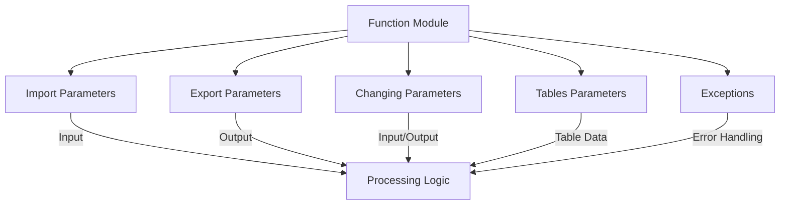
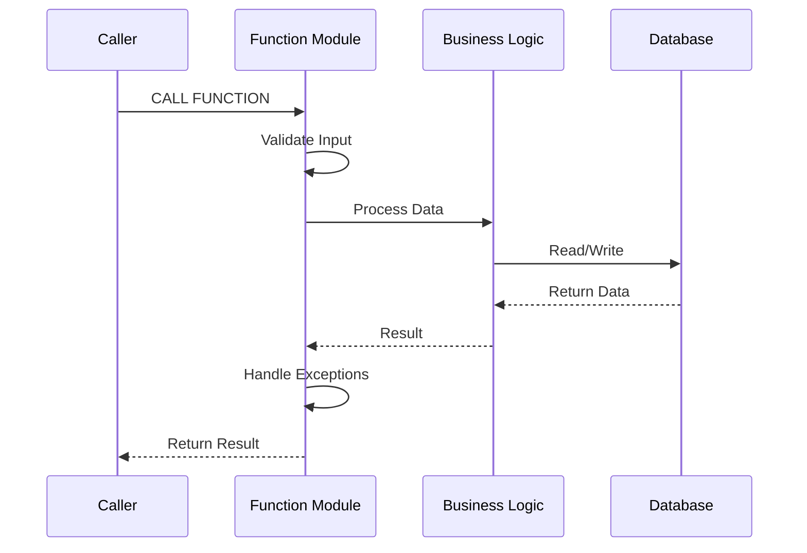
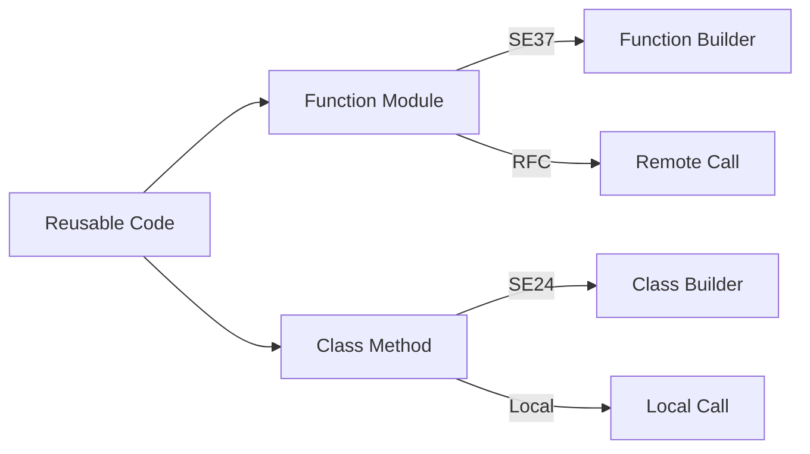
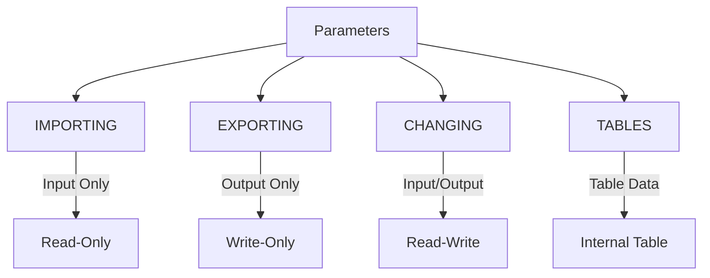
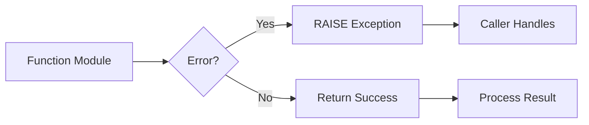
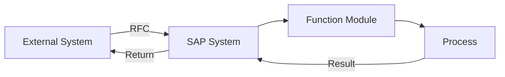
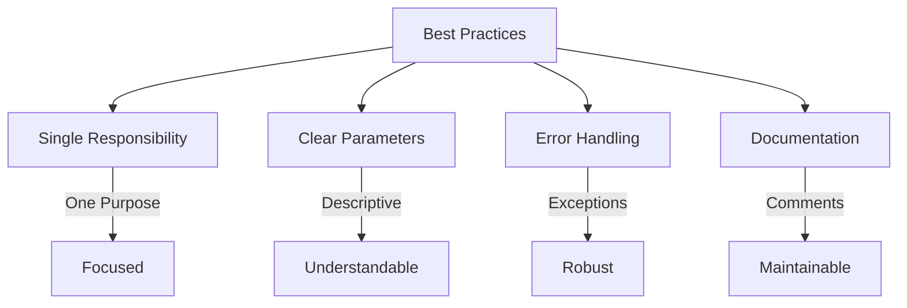

# SAP ABAP Function Modules Guide

**Complete guide to creating and using Function Modules**

---

## 📚 Table of Contents

1. [Introduction](#introduction)
2. [Function Module Overview](#function-module-overview)
3. [Creating Function Modules](#creating-function-modules)
4. [Parameters](#parameters)
5. [Exceptions](#exceptions)
6. [Tables](#tables)
7. [RFC Function Modules](#rfc-function-modules)
8. [Calling Function Modules](#calling-function-modules)
9. [Best Practices](#best-practices)
10. [Examples](#examples)

---

## Introduction

**Function Modules** are reusable procedures in ABAP that encapsulate business logic. They can be called from ABAP programs, other function modules, or external systems via RFC.

### Function Module Architecture



### Function Module Flow



---

## Function Module Overview

### What is a Function Module?

A **Function Module** is:
- A reusable procedure
- Stored in Function Builder (SE37)
- Can have import/export/changing parameters
- Can raise exceptions
- Can be called locally or remotely (RFC)

### Function Module vs. Methods



| Aspect | Function Module | Class Method |
|--------|----------------|--------------|
| **Location** | Function Builder | Class Builder |
| **RFC** | Supported | Not directly |
| **Modern** | Legacy | Modern ABAP |
| **Reusability** | High | High |
| **OOP** | No | Yes |

---

## Creating Function Modules

### Step-by-Step Creation

**Transaction**: SE37 (Function Builder)

**Steps**:
1. Enter function module name (e.g., `Z_LEAVE_GET_EMPLOYEE`)
2. Click "Create"
3. Enter short description
4. Define attributes:
   - Processing type: Normal/Remote-enabled
   - Short text
5. Define parameters (Import/Export/Changing/Tables)
6. Define exceptions
7. Write source code
8. Activate
9. Test

### Function Module Structure

```abap
FUNCTION z_leave_get_employee.
*"----------------------------------------------------------------------
*"*"Local Interface:
*"  IMPORTING
*"     VALUE(IV_EMPLOYEE_ID) TYPE PERNR_D
*"  EXPORTING
*"     VALUE(EV_EMPLOYEE_NAME) TYPE STRING
*"     VALUE(EV_DEPARTMENT) TYPE STRING
*"  EXCEPTIONS
*"     EMPLOYEE_NOT_FOUND
*"----------------------------------------------------------------------

  " Function module logic
  SELECT SINGLE ename orgeh
    FROM pa0001
    INTO (ev_employee_name, ev_department)
    WHERE pernr = iv_employee_id
      AND endda >= sy-datum
      AND begda <= sy-datum.

  IF sy-subrc <> 0.
    RAISE employee_not_found.
  ENDIF.

ENDFUNCTION.
```

---

## Parameters

### Parameter Types



### IMPORTING Parameters

**Purpose**: Pass data INTO function module

```abap
FUNCTION z_example.
*"  IMPORTING
*"     VALUE(IV_EMPLOYEE_ID) TYPE PERNR_D
*"     VALUE(IV_DATE) TYPE DATUM DEFAULT sy-datum

  " Use importing parameters
  DATA: lv_id TYPE pernr_d.
  lv_id = iv_employee_id.
  
ENDFUNCTION.
```

### EXPORTING Parameters

**Purpose**: Return data FROM function module

```abap
FUNCTION z_example.
*"  EXPORTING
*"     VALUE(EV_EMPLOYEE_NAME) TYPE STRING
*"     VALUE(EV_STATUS) TYPE CHAR1

  " Set exporting parameters
  ev_employee_name = 'John Doe'.
  ev_status = 'A'.
  
ENDFUNCTION.
```

### CHANGING Parameters

**Purpose**: Pass data IN and OUT (bidirectional)

```abap
FUNCTION z_example.
*"  CHANGING
*"     VALUE(CV_COUNTER) TYPE I

  " Modify changing parameter
  cv_counter = cv_counter + 1.
  
ENDFUNCTION.
```

### TABLES Parameters

**Purpose**: Pass internal tables

```abap
FUNCTION z_example.
*"  TABLES
*"     IT_INPUT TYPE ZTT_EMPLOYEE
*"     ET_OUTPUT TYPE ZTT_RESULT

  " Process tables
  LOOP AT it_input INTO DATA(ls_input).
    " Process
    APPEND ls_input TO et_output.
  ENDLOOP.
  
ENDFUNCTION.
```

---

## Exceptions

### Exception Handling



### Defining Exceptions

```abap
FUNCTION z_leave_get_employee.
*"  EXCEPTIONS
*"     EMPLOYEE_NOT_FOUND
*"     INVALID_INPUT
*"     SYSTEM_ERROR

  " Validate input
  IF iv_employee_id IS INITIAL.
    RAISE invalid_input.
  ENDIF.

  " Get data
  SELECT SINGLE ename
    FROM pa0001
    INTO ev_employee_name
    WHERE pernr = iv_employee_id.

  IF sy-subrc <> 0.
    RAISE employee_not_found.
  ENDIF.

ENDFUNCTION.
```

### Handling Exceptions

```abap
" Call function module
CALL FUNCTION 'Z_LEAVE_GET_EMPLOYEE'
  EXPORTING
    iv_employee_id = lv_empno
  IMPORTING
    ev_employee_name = lv_name
  EXCEPTIONS
    employee_not_found = 1
    invalid_input = 2
    system_error = 3
    OTHERS = 4.

" Check return code
CASE sy-subrc.
  WHEN 0.
    " Success
    WRITE: / 'Employee:', lv_name.
  WHEN 1.
    MESSAGE 'Employee not found' TYPE 'E'.
  WHEN 2.
    MESSAGE 'Invalid input' TYPE 'E'.
  WHEN 3.
    MESSAGE 'System error' TYPE 'E'.
  WHEN OTHERS.
    MESSAGE 'Unknown error' TYPE 'E'.
ENDCASE.
```

---

## Tables

### Tables Parameters

**Purpose**: Pass internal tables to/from function module

```abap
FUNCTION z_process_employees.
*"  TABLES
*"     IT_EMPLOYEES TYPE ZTT_EMPLOYEE
*"     ET_RESULTS TYPE ZTT_RESULT

  DATA: ls_result TYPE zst_result.

  " Process input table
  LOOP AT it_employees INTO DATA(ls_employee).
    " Process employee
    ls_result-empno = ls_employee-empno.
    ls_result-status = 'PROCESSED'.
    APPEND ls_result TO et_results.
  ENDLOOP.

ENDFUNCTION.
```

### Calling with Tables

```abap
DATA: lt_employees TYPE TABLE OF zst_employee,
      lt_results TYPE TABLE OF zst_result.

" Populate input table
APPEND VALUE #( empno = '00001234' ) TO lt_employees.

" Call function
CALL FUNCTION 'Z_PROCESS_EMPLOYEES'
  TABLES
    it_employees = lt_employees
    et_results = lt_results.

" Process results
LOOP AT lt_results INTO DATA(ls_result).
  WRITE: / ls_result-empno, ls_result-status.
ENDLOOP.
```

---

## RFC Function Modules

### Remote Function Call (RFC)

**Purpose**: Call function modules from external systems



### Creating RFC Function Module

**Steps**:
1. SE37 → Create Function Module
2. Attributes → Processing Type: **Remote-Enabled Module**
3. Define parameters
4. Write code
5. Activate

### RFC Example

```abap
FUNCTION z_rfc_get_employee_data.
*"----------------------------------------------------------------------
*"*"Remote Interface:
*"  IMPORTING
*"     VALUE(IV_EMPLOYEE_ID) TYPE PERNR_D
*"  EXPORTING
*"     VALUE(EV_EMPLOYEE_NAME) TYPE STRING
*"     VALUE(EV_DEPARTMENT) TYPE STRING
*"  EXCEPTIONS
*"     EMPLOYEE_NOT_FOUND
*"----------------------------------------------------------------------

  " RFC-enabled function module
  SELECT SINGLE ename orgeh
    FROM pa0001
    INTO (ev_employee_name, ev_department)
    WHERE pernr = iv_employee_id
      AND endda >= sy-datum
      AND begda <= sy-datum.

  IF sy-subrc <> 0.
    RAISE employee_not_found.
  ENDIF.

ENDFUNCTION.
```

---

## Calling Function Modules

### CALL FUNCTION Statement

```abap
" Basic call
CALL FUNCTION 'Z_LEAVE_GET_EMPLOYEE'
  EXPORTING
    iv_employee_id = lv_empno
  IMPORTING
    ev_employee_name = lv_name
  EXCEPTIONS
    employee_not_found = 1
    OTHERS = 2.

IF sy-subrc <> 0.
  " Handle error
ENDIF.
```

### Modern ABAP: Function Call

```abap
" Modern syntax (7.40+)
DATA(lv_name) = z_leave_get_employee( iv_employee_id = lv_empno ).
```

### Calling with Tables

```abap
CALL FUNCTION 'Z_PROCESS_DATA'
  TABLES
    it_input = lt_input
    et_output = lt_output
  EXCEPTIONS
    error = 1
    OTHERS = 2.
```

### Dynamic Function Call

```abap
DATA: lv_funcname TYPE funcname,
      lt_par TYPE TABLE OF rfcpara.

lv_funcname = 'Z_LEAVE_GET_EMPLOYEE'.

" Build parameter table
APPEND VALUE #( name = 'IV_EMPLOYEE_ID' value = lv_empno ) TO lt_par.

" Call dynamically
CALL FUNCTION lv_funcname
  PARAMETER-TABLE lt_par
  EXCEPTIONS
    function_not_found = 1
    OTHERS = 2.
```

---

## Best Practices

### Design Guidelines



1. **Single Responsibility**: One function = one purpose
2. **Clear Naming**: Use descriptive names
3. **Parameter Validation**: Validate all inputs
4. **Error Handling**: Use exceptions appropriately
5. **Documentation**: Document parameters and logic

### Naming Conventions

| Prefix | Meaning | Example |
|--------|---------|---------|
| **Z_** | Custom function | `Z_LEAVE_GET_EMPLOYEE` |
| **Y_** | Custom function | `Y_CALCULATE_TOTAL` |
| **IV_** | Importing variable | `iv_employee_id` |
| **EV_** | Exporting variable | `ev_employee_name` |
| **CV_** | Changing variable | `cv_counter` |
| **IT_** | Input table | `it_employees` |
| **ET_** | Export table | `et_results` |

### Performance

1. **Limit Data**: Use WHERE clauses
2. **Avoid Loops**: Use efficient algorithms
3. **Use Indexes**: Query indexed fields
4. **Batch Processing**: Process in batches

---

## Examples

### Example 1: Get Employee Data

```abap
FUNCTION z_leave_get_employee_data.
*"----------------------------------------------------------------------
*"*"Local Interface:
*"  IMPORTING
*"     VALUE(IV_EMPLOYEE_ID) TYPE PERNR_D
*"  EXPORTING
*"     VALUE(EV_EMPLOYEE_NAME) TYPE STRING
*"     VALUE(EV_DEPARTMENT) TYPE STRING
*"     VALUE(EV_MANAGER_ID) TYPE PERNR_D
*"  EXCEPTIONS
*"     EMPLOYEE_NOT_FOUND
*"     INVALID_INPUT
*"----------------------------------------------------------------------

  " Validate input
  IF iv_employee_id IS INITIAL.
    RAISE invalid_input.
  ENDIF.

  " Get employee data
  SELECT SINGLE ename orgeh vorges
    FROM pa0001
    INTO (ev_employee_name, ev_department, ev_manager_id)
    WHERE pernr = iv_employee_id
      AND endda >= sy-datum
      AND begda <= sy-datum.

  IF sy-subrc <> 0.
    RAISE employee_not_found.
  ENDIF.

ENDFUNCTION.
```

### Example 2: Process Leave Requests

```abap
FUNCTION z_leave_process_requests.
*"----------------------------------------------------------------------
*"*"Local Interface:
*"  IMPORTING
*"     VALUE(IV_REQUEST_ID) TYPE ZLEAVE_REQ_ID
*"  EXPORTING
*"     VALUE(EV_STATUS) TYPE ZLEAVE_STATUS
*"     VALUE(EV_MESSAGE) TYPE STRING
*"  EXCEPTIONS
*"     REQUEST_NOT_FOUND
*"     PROCESSING_ERROR
*"----------------------------------------------------------------------

  DATA: ls_request TYPE zleave_req_hdr.

  " Get request
  SELECT SINGLE *
    FROM zleave_req_hdr
    INTO ls_request
    WHERE req_id = iv_request_id.

  IF sy-subrc <> 0.
    RAISE request_not_found.
  ENDIF.

  " Process request
  TRY.
      " Business logic
      ls_request-status = 'A'.
      ls_request-approved_date = sy-datum.
      
      " Update database
      UPDATE zleave_req_hdr FROM ls_request.
      
      IF sy-subrc = 0.
        COMMIT WORK.
        ev_status = ls_request-status.
        ev_message = 'Request processed successfully'.
      ELSE.
        RAISE processing_error.
      ENDIF.
      
    CATCH cx_root INTO DATA(lo_error).
      ROLLBACK WORK.
      RAISE processing_error.
  ENDTRY.

ENDFUNCTION.
```

### Example 3: Batch Processing

```abap
FUNCTION z_leave_batch_approve.
*"----------------------------------------------------------------------
*"*"Local Interface:
*"  TABLES
*"     IT_REQUEST_IDS TYPE ZTT_REQ_ID
*"     ET_RESULTS TYPE ZTT_PROCESS_RESULT
*"  EXCEPTIONS
*"     NO_DATA
*"----------------------------------------------------------------------

  DATA: ls_result TYPE zst_process_result,
        lv_count TYPE i.

  " Validate input
  IF it_request_ids IS INITIAL.
    RAISE no_data.
  ENDIF.

  " Process each request
  LOOP AT it_request_ids INTO DATA(ls_req_id).
    CLEAR ls_result.
    ls_result-req_id = ls_req_id-req_id.
    
    " Process request
    CALL FUNCTION 'Z_LEAVE_PROCESS_REQUESTS'
      EXPORTING
        iv_request_id = ls_req_id-req_id
      IMPORTING
        ev_status = ls_result-status
        ev_message = ls_result-message
      EXCEPTIONS
        request_not_found = 1
        processing_error = 2
        OTHERS = 3.
    
    IF sy-subrc = 0.
      ls_result-success = abap_true.
      lv_count = lv_count + 1.
    ELSE.
      ls_result-success = abap_false.
      ls_result-message = 'Processing failed'.
    ENDIF.
    
    APPEND ls_result TO et_results.
  ENDLOOP.

ENDFUNCTION.
```

---

## Common Transactions

| Transaction | Purpose |
|-------------|---------|
| **SE37** | Function Builder |
| **SE80** | Object Navigator |
| **SM59** | RFC Destinations |
| **SE38** | ABAP Editor |

---

## Troubleshooting

### Common Issues

1. **Function Module Not Found**
   - Check function name
   - Verify function is active
   - Check namespace

2. **Parameter Mismatch**
   - Verify parameter names
   - Check data types
   - Verify parameter types (IMPORTING/EXPORTING)

3. **RFC Errors**
   - Check RFC destination (SM59)
   - Verify function is RFC-enabled
   - Check network connectivity

---

## References

- [ABAP Basics Guide](./01_SAP_ABAP_BASICS_GUIDE.md)
- [Internal Tables Guide](./03_SAP_ABAP_INTERNAL_TABLES_GUIDE.md)
- [Integration Guide](./15_SAP_ABAP_INTEGRATION_GUIDE.md)
- [SAP Help - Function Modules](https://help.sap.com/doc/abapdocu_latest_index_htm/latest/en-US/index.htm)

---

**Next**: [Screen Programming Guide](./06_SAP_ABAP_SCREEN_PROGRAMMING_GUIDE.md)

