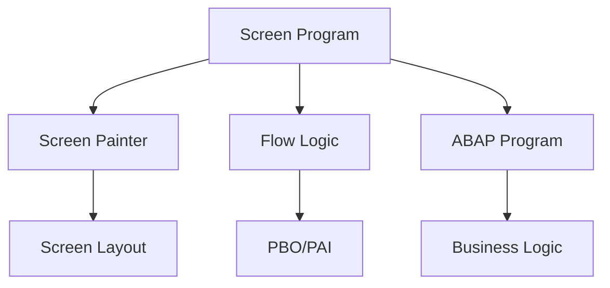
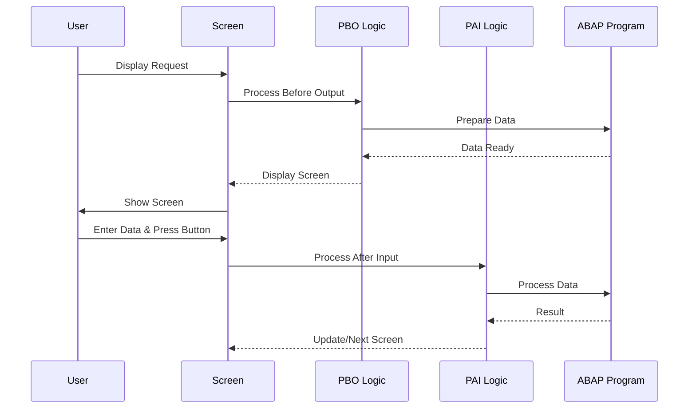
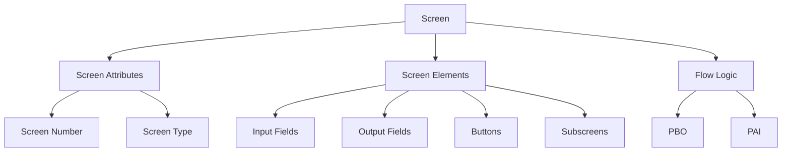
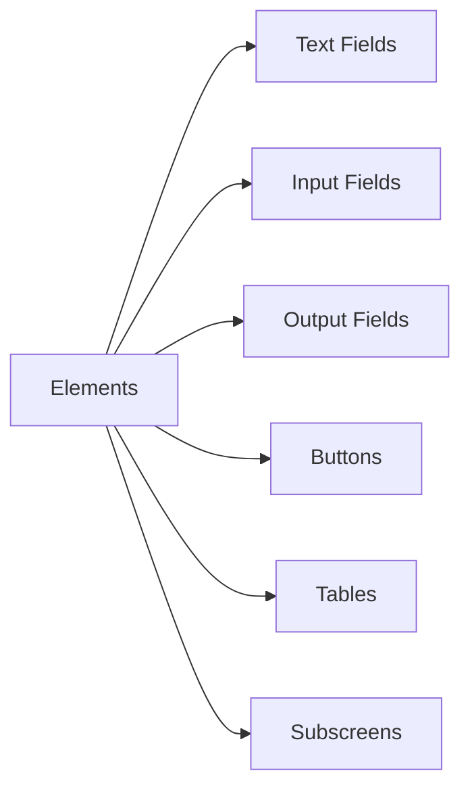
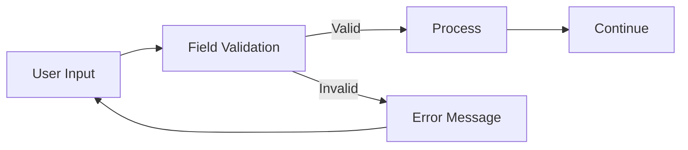
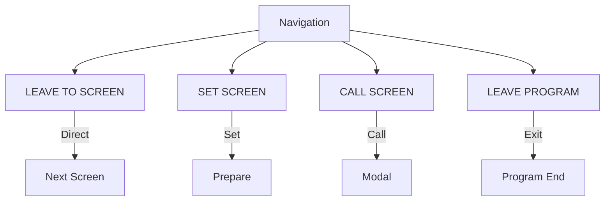
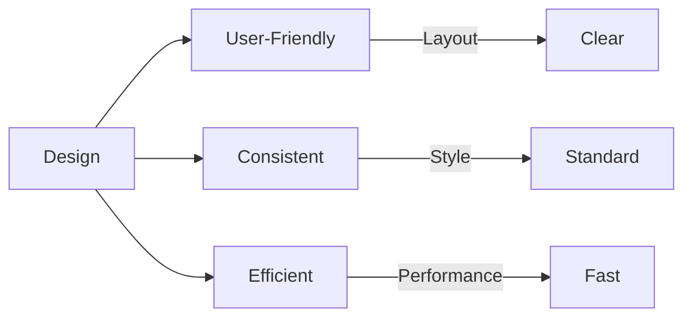

# SAP ABAP Screen Programming Guide

**Complete guide to creating SAP screens (Dynpros)**

---

## 📚 Table of Contents

1. [Introduction](#introduction)
2. [Screen Overview](#screen-overview)
3. [Screen Elements](#screen-elements)
4. [Screen Flow Logic](#screen-flow-logic)
5. [PBO (Process Before Output)](#pbo-process-before-output)
6. [PAI (Process After Input)](#pai-process-after-input)
7. [Field Validation](#field-validation)
8. [Screen Navigation](#screen-navigation)
9. [Best Practices](#best-practices)
10. [Examples](#examples)

---

## Introduction

**SAP Screens (Dynpros)** are user interfaces for ABAP programs, allowing interactive data entry and display.

### Screen Architecture



### Screen Flow



---

## Screen Overview

### Screen Components



### Screen Types

| Type | Number Range | Usage |
|------|-------------|-------|
| **Normal Screen** | 1000-9999 | Standard screens |
| **Subscreen** | 1000-9999 | Embedded screens |
| **Modal Dialog** | 1000-9999 | Popup dialogs |
| **Selection Screen** | 1000-9999 | Report selection |

---

## Screen Elements

### Common Screen Elements



### Element Types

1. **Text Fields**: Display text
2. **Input Fields**: User input
3. **Output Fields**: Display data
4. **Pushbuttons**: Action buttons
5. **Radio Buttons**: Option selection
6. **Checkboxes**: Boolean input
7. **Table Controls**: Tabular data
8. **Subscreens**: Embedded screens

---

## Screen Flow Logic

### Flow Logic Structure

```abap
PROCESS BEFORE OUTPUT.
  " PBO Logic
  MODULE status_0100.
  LOOP AT it_data.
    " Loop processing
  ENDLOOP.

PROCESS AFTER INPUT.
  " PAI Logic
  MODULE user_command_0100.
  FIELD p_field MODULE validate_field.
```

### Flow Logic Events

| Event | Trigger | Purpose |
|-------|---------|---------|
| **PBO** | Before screen display | Prepare screen |
| **PAI** | After user input | Process input |
| **POV** | F4 help | Provide input help |
| **POH** | F1 help | Provide field help |

---

## PBO (Process Before Output)

### PBO Purpose

**PBO** prepares the screen before it's displayed to the user.

### PBO Example

```abap
PROCESS BEFORE OUTPUT.
  MODULE status_0100.
  MODULE prepare_screen_data.
  LOOP AT it_data WITH CONTROL tc_data CURSOR tc_data-current_line.
    MODULE read_line.
  ENDLOOP.

MODULE status_0100 OUTPUT.
  " Set screen status
  SET PF-STATUS 'MAIN'.
  SET TITLEBAR 'TITLE_0100'.

  " Set field properties
  LOOP AT SCREEN.
    IF screen-name = 'P_EMPLOYEE'.
      screen-input = 1.
      screen-required = 1.
    ENDIF.
    MODIFY SCREEN.
  ENDLOOP.
ENDMODULE.

MODULE prepare_screen_data OUTPUT.
  " Prepare data for display
  IF p_employee IS NOT INITIAL.
    SELECT SINGLE ename
      FROM pa0001
      INTO p_employee_name
      WHERE pernr = p_employee.
  ENDIF.
ENDMODULE.
```

### PBO Modules

**Common PBO Tasks**:
- Set screen status
- Set titlebar
- Prepare data
- Set field properties
- Initialize table controls

---

## PAI (Process After Input)

### PAI Purpose

**PAI** processes user input after the user interacts with the screen.

### PAI Example

```abap
PROCESS AFTER INPUT.
  MODULE user_command_0100.
  FIELD p_employee MODULE validate_employee.

MODULE user_command_0100.
  CASE sy-ucomm.
    WHEN 'SAVE'.
      PERFORM save_data.
      MESSAGE 'Data saved' TYPE 'S'.
    WHEN 'CANCEL'.
      LEAVE TO SCREEN 0.
    WHEN 'BACK'.
      LEAVE TO SCREEN 0.
    WHEN 'EXIT'.
      LEAVE PROGRAM.
  ENDCASE.
ENDMODULE.

MODULE validate_employee.
  " Validate employee field
  IF p_employee IS INITIAL.
    MESSAGE 'Employee is required' TYPE 'E'.
    RETURN.
  ENDIF.

  " Check employee exists
  SELECT SINGLE pernr
    FROM pa0001
    INTO @DATA(lv_pernr)
    WHERE pernr = @p_employee.

  IF sy-subrc <> 0.
    MESSAGE 'Employee not found' TYPE 'E'.
  ENDIF.
ENDMODULE.
```

### PAI Modules

**Common PAI Tasks**:
- Handle user commands
- Validate input
- Process data
- Navigate to next screen
- Update database

---

## Field Validation

### Field-Level Validation

```abap
PROCESS AFTER INPUT.
  FIELD p_employee MODULE validate_employee.
  FIELD p_date MODULE validate_date.

MODULE validate_employee.
  IF p_employee IS INITIAL.
    MESSAGE 'Employee required' TYPE 'E'.
  ENDIF.
ENDMODULE.

MODULE validate_date.
  IF p_date < sy-datum.
    MESSAGE 'Date cannot be in past' TYPE 'E'.
  ENDIF.
ENDMODULE.
```

### Validation Flow



---

## Screen Navigation

### Navigation Methods



### Navigation Examples

```abap
" Leave to next screen
LEAVE TO SCREEN 0200.

" Set screen (display later)
SET SCREEN 0200.
LEAVE SCREEN.

" Call screen (modal)
CALL SCREEN 0300 STARTING AT 10 10
                ENDING AT 80 20.

" Exit program
LEAVE PROGRAM.

" Return from called screen
LEAVE TO SCREEN 0.
```

### Screen Chain

```abap
" Screen flow: 0100 -> 0200 -> 0300

" From 0100
MODULE user_command_0100.
  CASE sy-ucomm.
    WHEN 'NEXT'.
      LEAVE TO SCREEN 0200.
  ENDCASE.

" From 0200
MODULE user_command_0200.
  CASE sy-ucomm.
    WHEN 'NEXT'.
      LEAVE TO SCREEN 0300.
    WHEN 'BACK'.
      LEAVE TO SCREEN 0100.
  ENDCASE.
```

---

## Best Practices

### Screen Design



1. **Clear Layout**: Organize fields logically
2. **Consistent Design**: Follow SAP standards
3. **Field Validation**: Validate early
4. **Error Messages**: Clear and helpful
5. **Performance**: Load data efficiently

### Code Organization

```abap
" Recommended structure:
" 1. PBO modules
" 2. PAI modules
" 3. Field validations
" 4. User commands
" 5. Helper forms
```

---

## Examples

### Example 1: Complete Screen Program

```abap
PROGRAM z_leave_request_screen.

" Screen 0100: Main Screen
" Screen elements:
"   P_EMPLOYEE (Input)
"   P_EMPLOYEE_NAME (Output)
"   P_LEAVE_TYPE (Input)
"   P_START_DATE (Input)
"   P_END_DATE (Input)
"   P_DAYS (Output)
"   P_COMMENTS (Input)
"   Buttons: SAVE, CANCEL

" PBO
PROCESS BEFORE OUTPUT.
  MODULE status_0100.
  MODULE prepare_screen.

MODULE status_0100 OUTPUT.
  SET PF-STATUS 'MAIN'.
  SET TITLEBAR 'TITLE_0100'.

  " Set field properties
  LOOP AT SCREEN.
    CASE screen-name.
      WHEN 'P_EMPLOYEE_NAME'.
        screen-input = 0. " Output only
      WHEN 'P_DAYS'.
        screen-input = 0. " Output only
    ENDCASE.
    MODIFY SCREEN.
  ENDLOOP.
ENDMODULE.

MODULE prepare_screen OUTPUT.
  " Get employee name
  IF p_employee IS NOT INITIAL.
    SELECT SINGLE ename
      FROM pa0001
      INTO p_employee_name
      WHERE pernr = p_employee.
  ENDIF.

  " Calculate days
  IF p_start_date IS NOT INITIAL AND p_end_date IS NOT INITIAL.
    p_days = p_end_date - p_start_date + 1.
  ENDIF.
ENDMODULE.

" PAI
PROCESS AFTER INPUT.
  MODULE user_command_0100.
  FIELD p_employee MODULE validate_employee.
  FIELD p_start_date MODULE validate_dates.
  FIELD p_end_date MODULE validate_dates.

MODULE user_command_0100.
  CASE sy-ucomm.
    WHEN 'SAVE'.
      PERFORM save_request.
      IF sy-subrc = 0.
        MESSAGE 'Request saved' TYPE 'S'.
        LEAVE TO SCREEN 0.
      ENDIF.
    WHEN 'CANCEL'.
      LEAVE TO SCREEN 0.
  ENDCASE.
ENDMODULE.

MODULE validate_employee.
  IF p_employee IS INITIAL.
    MESSAGE 'Employee required' TYPE 'E'.
    RETURN.
  ENDIF.

  SELECT SINGLE pernr
    FROM pa0001
    INTO @DATA(lv_pernr)
    WHERE pernr = @p_employee.

  IF sy-subrc <> 0.
    MESSAGE 'Employee not found' TYPE 'E'.
  ENDIF.
ENDMODULE.

MODULE validate_dates.
  IF p_start_date IS NOT INITIAL AND p_end_date IS NOT INITIAL.
    IF p_end_date < p_start_date.
      MESSAGE 'End date must be after start date' TYPE 'E'.
    ENDIF.
  ENDIF.
ENDMODULE.

FORM save_request.
  " Save logic
  DATA: ls_request TYPE zleave_req_hdr.

  ls_request-employee_id = p_employee.
  ls_request-leave_type = p_leave_type.
  ls_request-start_date = p_start_date.
  ls_request-end_date = p_end_date.
  ls_request-days = p_days.
  ls_request-status = 'P'.
  ls_request-created_by = sy-uname.
  ls_request-created_date = sy-datum.

  INSERT zleave_req_hdr FROM ls_request.
ENDFORM.
```

---

## Common Transactions

| Transaction | Purpose |
|-------------|---------|
| **SE80** | Screen Painter |
| **SE38** | ABAP Editor |
| **SE51** | Screen Painter (Alternative) |

---

## Troubleshooting

### Common Issues

1. **Screen Not Displaying**
   - Check screen number
   - Verify screen is active
   - Check navigation logic

2. **Field Not Updating**
   - Check PBO logic
   - Verify field name
   - Check field properties

3. **Validation Not Working**
   - Check PAI module
   - Verify FIELD statement
   - Check error handling

---

## References

- [ABAP Basics Guide](./01_SAP_ABAP_BASICS_GUIDE.md)
- [Reports Guide](./04_SAP_ABAP_REPORTS_GUIDE.md)
- [ALV Programming Guide](./07_SAP_ABAP_ALV_PROGRAMMING_GUIDE.md)

---

**Next**: [ALV Programming Guide](./07_SAP_ABAP_ALV_PROGRAMMING_GUIDE.md)

