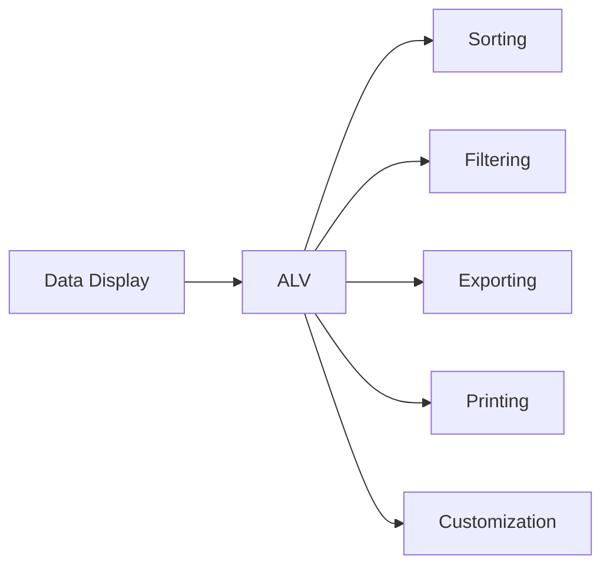
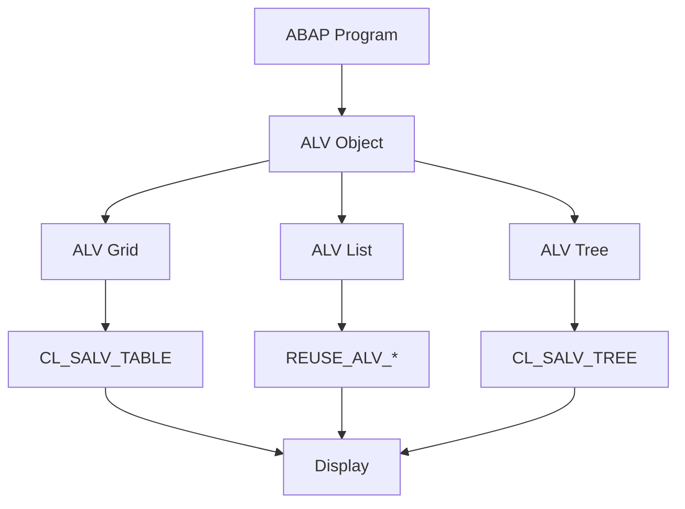
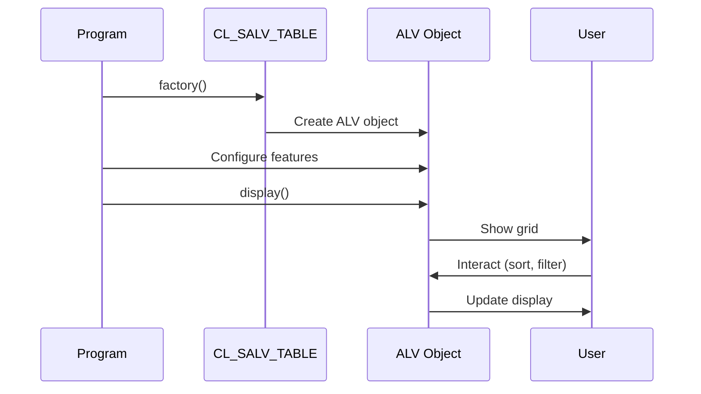
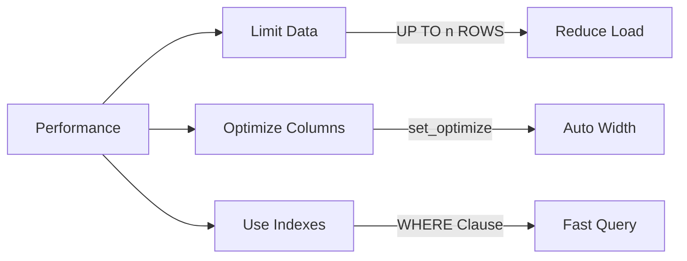

# SAP ABAP ALV Programming Guide

**Complete guide to ALV (ABAP List Viewer) programming**

---

## 📚 Table of Contents

1. [Introduction](#introduction)
2. [ALV Overview](#alv-overview)
3. [ALV Types](#alv-types)
4. [ALV Grid (CL_SALV_TABLE)](#alv-grid-cl_salv_table)
5. [ALV List (REUSE_ALV_GRID_DISPLAY)](#alv-list-reuse_alv_grid_display)
6. [ALV Tree](#alv-tree)
7. [ALV Features](#alv-features)
8. [Customization](#customization)
9. [Best Practices](#best-practices)
10. [Examples](#examples)

---

## Introduction

**ALV (ABAP List Viewer)** is SAP's standard tool for displaying data in tables, lists, and trees. It provides rich functionality including sorting, filtering, exporting, and more.

### Why ALV?



**Benefits**:
- ✅ Standard SAP tool
- ✅ Rich built-in features
- ✅ Easy to implement
- ✅ Professional appearance
- ✅ User-friendly interface

---

## ALV Overview

### ALV Architecture



### ALV Classes

| Class | Purpose | Usage |
|-------|---------|-------|
| **CL_SALV_TABLE** | ALV Grid (Modern) | Recommended for new development |
| **CL_SALV_LIST** | ALV List | Simple list display |
| **CL_SALV_TREE** | ALV Tree | Hierarchical data |
| **CL_GUI_ALV_GRID** | Classic ALV Grid | Legacy applications |

---

## ALV Types

### 1. ALV Grid (Modern - Recommended)

**Class**: `CL_SALV_TABLE`

**Features**:
- Modern object-oriented approach
- Full-featured grid display
- Easy customization
- Best performance

### 2. ALV List (Classic)

**Function Module**: `REUSE_ALV_GRID_DISPLAY`

**Features**:
- Simple implementation
- Classic SAP look
- Good for reports

### 3. ALV Tree

**Class**: `CL_SALV_TREE`

**Features**:
- Hierarchical display
- Expandable/collapsible nodes
- Tree structure

---

## ALV Grid (CL_SALV_TABLE)

### Basic ALV Grid Example

```abap
REPORT z_alv_basic_example.

DATA: lo_alv TYPE REF TO cl_salv_table,
      lt_data TYPE TABLE OF sflight.

" Get data
SELECT * FROM sflight
  INTO TABLE lt_data
  UP TO 100 ROWS.

" Create ALV object
cl_salv_table=>factory(
  IMPORTING r_salv_table = lo_alv
  CHANGING t_table = lt_data
).

" Display
lo_alv->display( ).
```

### ALV Grid with Features

```abap
REPORT z_alv_full_example.

DATA: lo_alv TYPE REF TO cl_salv_table,
      lo_functions TYPE REF TO cl_salv_functions,
      lo_display TYPE REF TO cl_salv_display_settings,
      lo_columns TYPE REF TO cl_salv_columns_table,
      lo_column TYPE REF TO cl_salv_column_table,
      lt_data TYPE TABLE OF sflight.

" Get data
SELECT * FROM sflight
  INTO TABLE lt_data
  UP TO 100 ROWS.

" Create ALV object
cl_salv_table=>factory(
  IMPORTING r_salv_table = lo_alv
  CHANGING t_table = lt_data
).

" Enable functions
lo_functions = lo_alv->get_functions( ).
lo_functions->set_all( abap_true ).

" Set display settings
lo_display = lo_alv->get_display_settings( ).
lo_display->set_striped_pattern( abap_true ).
lo_display->set_list_header( 'Flight Data Report' ).

" Optimize column widths
lo_columns = lo_alv->get_columns( ).
lo_columns->set_optimize( abap_true ).

" Set column properties
TRY.
    lo_column ?= lo_columns->get_column( 'CARRID' ).
    lo_column->set_short_text( 'Airline' ).
    lo_column->set_medium_text( 'Airline Code' ).
    lo_column->set_long_text( 'Airline Carrier ID' ).
  CATCH cx_salv_not_found.
ENDTRY.

" Display
lo_alv->display( ).
```

### ALV Grid Flow



---

## ALV List (REUSE_ALV_GRID_DISPLAY)

### Basic ALV List Example

```abap
REPORT z_alv_list_example.

TYPES: BEGIN OF ty_flight,
         carrid TYPE sflight-carrid,
         connid TYPE sflight-connid,
         fldate TYPE sflight-fldate,
         price TYPE sflight-price,
       END OF ty_flight.

DATA: lt_flight TYPE TABLE OF ty_flight,
      ls_layout TYPE slis_layout_alv,
      lt_fieldcat TYPE slis_t_fieldcat_alv.

" Get data
SELECT carrid connid fldate price
  FROM sflight
  INTO TABLE lt_flight
  UP TO 100 ROWS.

" Set layout
ls_layout-zebra = abap_true.
ls_layout-colwidth_optimize = abap_true.

" Display
CALL FUNCTION 'REUSE_ALV_GRID_DISPLAY'
  EXPORTING
    i_callback_program = sy-repid
    i_structure_name = 'TY_FLIGHT'
    is_layout = ls_layout
  TABLES
    t_outtab = lt_flight
  EXCEPTIONS
    program_error = 1
    OTHERS = 2.
```

### Field Catalog

```abap
DATA: lt_fieldcat TYPE slis_t_fieldcat_alv,
      ls_fieldcat TYPE slis_fieldcat_alv.

" Build field catalog manually
CLEAR ls_fieldcat.
ls_fieldcat-fieldname = 'CARRID'.
ls_fieldcat-tabname = 'LT_FLIGHT'.
ls_fieldcat-seltext_m = 'Airline'.
ls_fieldcat-outputlen = 3.
APPEND ls_fieldcat TO lt_fieldcat.

CLEAR ls_fieldcat.
ls_fieldcat-fieldname = 'PRICE'.
ls_fieldcat-tabname = 'LT_FLIGHT'.
ls_fieldcat-seltext_m = 'Price'.
ls_fieldcat-outputlen = 10.
ls_fieldcat-datatype = 'CURR'.
APPEND ls_fieldcat TO lt_fieldcat.

" Display with field catalog
CALL FUNCTION 'REUSE_ALV_GRID_DISPLAY'
  EXPORTING
    i_callback_program = sy-repid
    it_fieldcat = lt_fieldcat
    is_layout = ls_layout
  TABLES
    t_outtab = lt_flight.
```

---

## ALV Tree

### ALV Tree Example

```abap
REPORT z_alv_tree_example.

DATA: lo_tree TYPE REF TO cl_salv_tree,
      lo_nodes TYPE REF TO cl_salv_nodes,
      lo_node TYPE REF TO cl_salv_node,
      lt_data TYPE TABLE OF sflight.

" Get data
SELECT * FROM sflight
  INTO TABLE lt_data
  UP TO 50 ROWS.

" Create tree
cl_salv_tree=>factory(
  EXPORTING r_container = cl_gui_container=>default_screen
  IMPORTING r_salv_tree = lo_tree
  CHANGING t_table = lt_data
).

" Get nodes
lo_nodes = lo_tree->get_nodes( ).

" Add root node
lo_node = lo_nodes->add_node(
  related_node = ''
  relationship = cl_salv_nodes=>relat_last_child
  text = 'Flight Data'
  folder = abap_true
).

" Display
lo_tree->display( ).
```

---

## ALV Features

### Sorting

```abap
DATA: lo_sorts TYPE REF TO cl_salv_sorts,
      lo_sort TYPE REF TO cl_salv_sort.

" Get sorts
lo_sorts = lo_alv->get_sorts( ).

" Add sort
TRY.
    lo_sort = lo_sorts->add_sort(
      columnname = 'CARRID'
      sequence = if_salv_c_sort=>sort_up
    ).
  CATCH cx_salv_not_found.
ENDTRY.
```

### Filtering

```abap
DATA: lo_filters TYPE REF TO cl_salv_filters,
      lo_filter TYPE REF TO cl_salv_filter.

" Get filters
lo_filters = lo_alv->get_filters( ).

" Add filter
TRY.
    lo_filter = lo_filters->add_filter(
      columnname = 'CARRID'
      sign = 'I'
      option = 'EQ'
      low = 'LH'
    ).
  CATCH cx_salv_not_found.
ENDTRY.
```

### Aggregations

```abap
DATA: lo_aggregations TYPE REF TO cl_salv_aggregations,
      lo_aggregation TYPE REF TO cl_salv_aggregation.

" Get aggregations
lo_aggregations = lo_alv->get_aggregations( ).

" Add aggregation
TRY.
    lo_aggregation = lo_aggregations->add_aggregation(
      columnname = 'PRICE'
      aggregation = if_salv_c_aggregation=>total
    ).
  CATCH cx_salv_not_found.
ENDTRY.
```

### Selection

```abap
DATA: lo_selections TYPE REF TO cl_salv_selections.

" Get selections
lo_selections = lo_alv->get_selections( ).

" Set selection mode
lo_selections->set_selection_mode(
  value = if_salv_c_selection_mode=>multiple
).
```

---

## Customization

### Column Customization

```abap
DATA: lo_columns TYPE REF TO cl_salv_columns_table,
      lo_column TYPE REF TO cl_salv_column_table.

lo_columns = lo_alv->get_columns( ).

" Set column properties
TRY.
    lo_column ?= lo_columns->get_column( 'PRICE' ).
    
    " Set texts
    lo_column->set_short_text( 'Price' ).
    lo_column->set_medium_text( 'Ticket Price' ).
    lo_column->set_long_text( 'Flight Ticket Price' ).
    
    " Set visibility
    lo_column->set_visible( abap_true ).
    
    " Set technical
    lo_column->set_technical( abap_false ).
    
    " Set key
    lo_column->set_key( abap_false ).
    
    " Set currency
    lo_column->set_currency_column( 'CURRENCY' ).
    
  CATCH cx_salv_not_found.
ENDTRY.
```

### Color Settings

```abap
DATA: lo_color TYPE REF TO cl_salv_color.

TRY.
    lo_column ?= lo_columns->get_column( 'STATUS' ).
    lo_color = lo_column->get_color( ).
    lo_color->set_background( value = 5 ). " Yellow
  CATCH cx_salv_not_found.
ENDTRY.
```

### Hotspot (Clickable)

```abap
TRY.
    lo_column ?= lo_columns->get_column( 'CARRID' ).
    lo_column->set_cell_type( if_salv_c_cell_type=>hotspot ).
  CATCH cx_salv_not_found.
ENDTRY.
```

---

## Best Practices

### Performance



1. **Limit Data**: Use `UP TO n ROWS` for large datasets
2. **Optimize Columns**: Use `set_optimize( )`
3. **Use Indexes**: Query with indexed fields
4. **Lazy Loading**: Load data on demand

### Code Organization

```abap
" Recommended structure:
" 1. Data declarations
" 2. Selection screen (if needed)
" 3. Main processing
" 4. ALV creation method
" 5. ALV customization method
" 6. Event handlers (if needed)
```

### Error Handling

```abap
TRY.
    cl_salv_table=>factory(
      IMPORTING r_salv_table = lo_alv
      CHANGING t_table = lt_data
    ).
  CATCH cx_salv_msg.
    MESSAGE 'Error creating ALV' TYPE 'E'.
ENDTRY.
```

---

## Examples

### Complete Example: Leave Request Report

```abap
REPORT z_leave_request_report.

TYPES: BEGIN OF ty_leave_report,
         req_id TYPE zleave_req_id,
         employee_id TYPE pernr_d,
         employee_name TYPE string,
         leave_type TYPE zleave_type,
         start_date TYPE datum,
         end_date TYPE datum,
         days TYPE zleave_days,
         status TYPE zleave_status,
       END OF ty_leave_report.

DATA: lt_report TYPE TABLE OF ty_leave_report,
      ls_report TYPE ty_leave_report,
      lo_alv TYPE REF TO cl_salv_table,
      lo_functions TYPE REF TO cl_salv_functions,
      lo_display TYPE REF TO cl_salv_display_settings,
      lo_columns TYPE REF TO cl_salv_columns_table,
      lo_column TYPE REF TO cl_salv_column_table,
      lo_sorts TYPE REF TO cl_salv_sorts,
      lo_filters TYPE REF TO cl_salv_filters.

SELECTION-SCREEN BEGIN OF BLOCK b1 WITH FRAME TITLE TEXT-001.
SELECT-OPTIONS: s_date FOR sy-datum,
                 s_status FOR ls_report-status.
PARAMETERS: p_empno TYPE pernr_d.
SELECTION-SCREEN END OF BLOCK b1.

START-OF-SELECTION.
  PERFORM get_data.
  PERFORM create_alv.
  PERFORM customize_alv.
  PERFORM display_alv.

FORM get_data.
  SELECT h~req_id
         h~employee_id
         h~leave_type
         h~start_date
         h~end_date
         h~days
         h~status
         p~ename AS employee_name
    FROM zleave_req_hdr AS h
    INNER JOIN pa0001 AS p
      ON h~employee_id = p~pernr
    INTO TABLE @lt_report
    WHERE h~start_date IN @s_date
      AND h~status IN @s_status
      AND ( p_empno IS INITIAL OR h~employee_id = @p_empno ).
ENDFORM.

FORM create_alv.
  TRY.
      cl_salv_table=>factory(
        IMPORTING r_salv_table = lo_alv
        CHANGING t_table = lt_report
      ).
    CATCH cx_salv_msg.
      MESSAGE 'Error creating ALV' TYPE 'E'.
  ENDTRY.
ENDFORM.

FORM customize_alv.
  " Enable functions
  lo_functions = lo_alv->get_functions( ).
  lo_functions->set_all( abap_true ).

  " Display settings
  lo_display = lo_alv->get_display_settings( ).
  lo_display->set_striped_pattern( abap_true ).
  lo_display->set_list_header( 'Leave Request Report' ).

  " Optimize columns
  lo_columns = lo_alv->get_columns( ).
  lo_columns->set_optimize( abap_true ).

  " Customize columns
  PERFORM customize_columns.

  " Add default sort
  lo_sorts = lo_alv->get_sorts( ).
  TRY.
      lo_sorts->add_sort(
        columnname = 'START_DATE'
        sequence = if_salv_c_sort=>sort_down
      ).
    CATCH cx_salv_not_found.
  ENDTRY.
ENDFORM.

FORM customize_columns.
  DATA: lo_column TYPE REF TO cl_salv_column_table.

  lo_columns = lo_alv->get_columns( ).

  " REQ_ID
  TRY.
      lo_column ?= lo_columns->get_column( 'REQ_ID' ).
      lo_column->set_short_text( 'Request ID' ).
      lo_column->set_cell_type( if_salv_c_cell_type=>hotspot ).
    CATCH cx_salv_not_found.
  ENDTRY.

  " STATUS
  TRY.
      lo_column ?= lo_columns->get_column( 'STATUS' ).
      lo_column->set_short_text( 'Status' ).
    CATCH cx_salv_not_found.
  ENDTRY.

  " DAYS
  TRY.
      lo_column ?= lo_columns->get_column( 'DAYS' ).
      lo_column->set_short_text( 'Days' ).
    CATCH cx_salv_not_found.
  ENDTRY.
ENDFORM.

FORM display_alv.
  lo_alv->display( ).
ENDFORM.
```

---

## Common Transactions

| Transaction | Purpose |
|-------------|---------|
| **SE38** | ABAP Editor (for programs) |
| **SE80** | Object Navigator |
| **SE11** | Data Dictionary |
| **SE24** | Class Builder |

---

## Troubleshooting

### Common Issues

1. **ALV Not Displaying**
   - Check data table is not empty
   - Verify ALV object creation
   - Check for exceptions

2. **Column Not Visible**
   - Check column visibility setting
   - Verify field name matches
   - Check technical flag

3. **Performance Issues**
   - Limit data rows
   - Optimize database query
   - Use indexes

---

## References

- [ABAP Basics Guide](./01_SAP_ABAP_BASICS_GUIDE.md)
- [Data Dictionary Guide](./02_SAP_ABAP_DATA_DICTIONARY_GUIDE.md)
- [Reports Guide](./04_SAP_ABAP_REPORTS_GUIDE.md)
- [SAP Help - ALV](https://help.sap.com/doc/abapdocu_latest_index_htm/latest/en-US/index.htm)

---

**Next**: [ABAP Objects Guide](./08_SAP_ABAP_OBJECTS_GUIDE.md)

