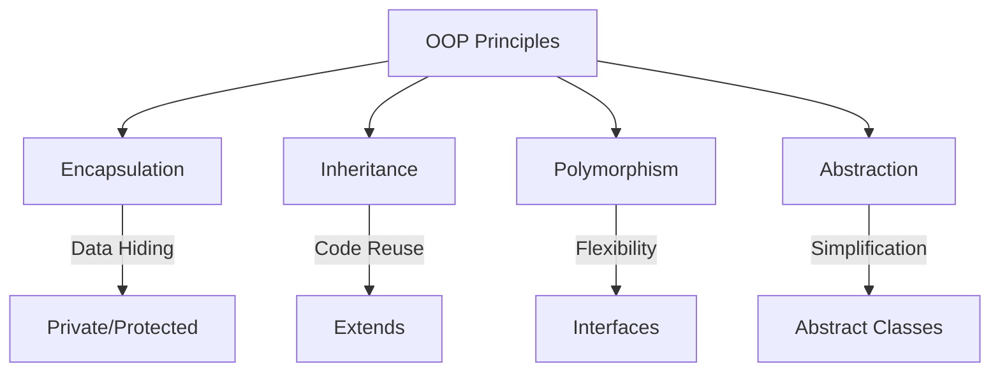
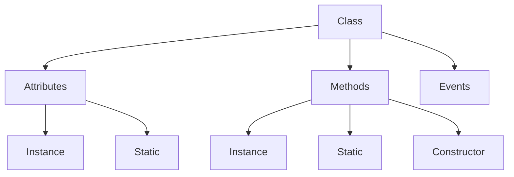
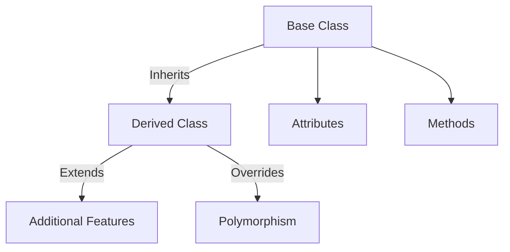
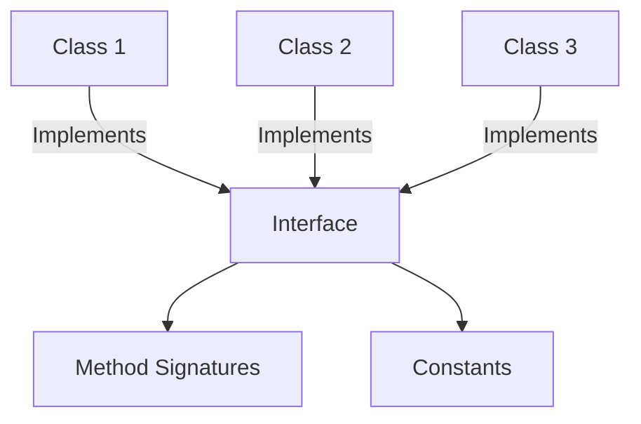
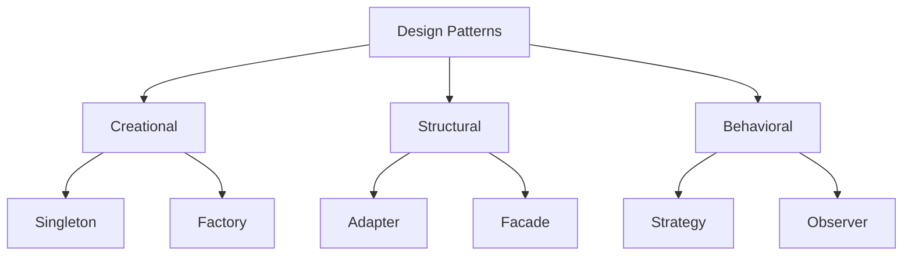
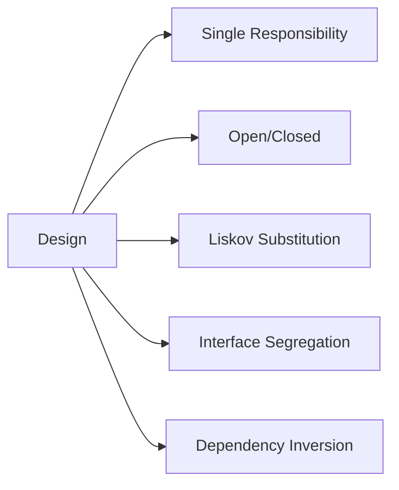

# SAP ABAP Objects Guide

**Complete guide to Object-Oriented Programming in ABAP**

---

## 📚 Table of Contents

1. [Introduction](#introduction)
2. [OOP Concepts](#oop-concepts)
3. [Classes and Objects](#classes-and-objects)
4. [Inheritance](#inheritance)
5. [Interfaces](#interfaces)
6. [Polymorphism](#polymorphism)
7. [Design Patterns](#design-patterns)
8. [Best Practices](#best-practices)
9. [Examples](#examples)

---

## Introduction

**ABAP Objects** brings object-oriented programming to ABAP, enabling modern, maintainable, and reusable code.

### OOP Principles



### OOP Benefits

- ✅ **Reusability**: Code can be reused
- ✅ **Maintainability**: Easier to maintain
- ✅ **Modularity**: Clear structure
- ✅ **Testability**: Easy to test
- ✅ **Scalability**: Easy to extend

---

## OOP Concepts

### Class Structure



### Visibility Sections

| Section | Access | Usage |
|---------|--------|-------|
| **PUBLIC** | Anywhere | Public API |
| **PROTECTED** | Class + Subclasses | Internal + Inheritance |
| **PRIVATE** | Class only | Internal implementation |

---

## Classes and Objects

### Creating a Class

**Transaction**: SE24 (Class Builder)

**Steps**:
1. Enter class name (e.g., `ZCL_LEAVE_REQUEST`)
2. Click "Create"
3. Define attributes
4. Define methods
5. Implement methods
6. Activate

### Class Definition

```abap
CLASS zcl_leave_request DEFINITION
  PUBLIC
  FINAL
  CREATE PRIVATE.

  PUBLIC SECTION.
    " Factory method
    CLASS-METHODS get_instance
      RETURNING VALUE(ro_instance) TYPE REF TO zcl_leave_request.

    " Instance methods
    METHODS create_request
      IMPORTING is_request_data TYPE zst_leave_request
      EXPORTING ev_request_id TYPE zleave_req_id
                et_messages TYPE bapiret2_t.

    METHODS get_request
      IMPORTING iv_request_id TYPE zleave_req_id
      EXPORTING es_request_data TYPE zst_leave_request
                et_messages TYPE bapiret2_t.

  PRIVATE SECTION.
    " Singleton instance
    CLASS-DATA: go_instance TYPE REF TO zcl_leave_request.

    " Private methods
    METHODS generate_request_id
      RETURNING VALUE(rv_request_id) TYPE zleave_req_id.

    METHODS save_to_database
      IMPORTING is_request_data TYPE zst_leave_request
      EXPORTING et_messages TYPE bapiret2_t.

ENDCLASS.
```

### Class Implementation

```abap
CLASS zcl_leave_request IMPLEMENTATION.

  METHOD get_instance.
    IF go_instance IS NOT BOUND.
      CREATE OBJECT go_instance.
    ENDIF.
    ro_instance = go_instance.
  ENDMETHOD.

  METHOD create_request.
    DATA: lv_request_id TYPE zleave_req_id.

    " Generate ID
    lv_request_id = generate_request_id( ).
    is_request_data-request_id = lv_request_id.

    " Save
    save_to_database(
      EXPORTING is_request_data = is_request_data
      IMPORTING et_messages = et_messages
    ).

    IF et_messages IS INITIAL.
      ev_request_id = lv_request_id.
    ENDIF.
  ENDMETHOD.

  METHOD generate_request_id.
    " Implementation
    CALL FUNCTION 'NUMBER_GET_NEXT'
      EXPORTING
        nr_range_nr = '01'
        object = 'ZLEAVE_REQ'
      IMPORTING
        number = DATA(lv_number)
      EXCEPTIONS
        OTHERS = 1.

    IF sy-subrc = 0.
      rv_request_id = |REQ{ lv_number }|.
    ENDIF.
  ENDMETHOD.

  METHOD save_to_database.
    " Implementation
    INSERT zleave_req_hdr FROM is_request_data.
    IF sy-subrc <> 0.
      APPEND VALUE #( type = 'E' id = 'ZLEAVE' number = '001'
                      message = 'Save failed' ) TO et_messages.
    ENDIF.
  ENDMETHOD.

ENDCLASS.
```

### Using Objects

```abap
" Create object
DATA: lo_request TYPE REF TO zcl_leave_request.

" Singleton pattern
lo_request = zcl_leave_request=>get_instance( ).

" Call method
lo_request->create_request(
  EXPORTING is_request_data = ls_request_data
  IMPORTING ev_request_id = lv_request_id
            et_messages = lt_messages
).
```

---

## Inheritance

### What is Inheritance?

**Inheritance** allows a class to inherit attributes and methods from another class.

### Inheritance Structure



### Inheritance Example

```abap
" Base class
CLASS zcl_leave_base DEFINITION
  PUBLIC
  ABSTRACT.

  PUBLIC SECTION.
    METHODS process_request
      IMPORTING iv_request_id TYPE zleave_req_id
      ABSTRACT.

  PROTECTED SECTION.
    DATA: mv_request_id TYPE zleave_req_id.

ENDCLASS.

" Derived class
CLASS zcl_leave_annual DEFINITION
  INHERITING FROM zcl_leave_base
  FINAL.

  PUBLIC SECTION.
    METHODS process_request REDEFINITION.

ENDCLASS.

CLASS zcl_leave_annual IMPLEMENTATION.

  METHOD process_request.
    " Annual leave specific processing
    mv_request_id = iv_request_id.
    " Process annual leave
  ENDMETHOD.

ENDCLASS.
```

### Inheritance Rules

1. **Single Inheritance**: ABAP supports single inheritance only
2. **REDEFINITION**: Use REDEFINITION to override methods
3. **SUPER**: Use SUPER to call parent method
4. **FINAL**: Use FINAL to prevent further inheritance

---

## Interfaces

### What is an Interface?

An **Interface** defines a contract that classes must implement.

### Interface Structure



### Interface Example

```abap
" Interface definition
INTERFACE zif_leave_validator.
  METHODS validate
    IMPORTING is_request_data TYPE zst_leave_request
    RETURNING VALUE(rv_valid) TYPE abap_bool.
ENDINTERFACE.

" Class implementing interface
CLASS zcl_leave_validator DEFINITION
  PUBLIC
  FINAL.

  PUBLIC SECTION.
    INTERFACES zif_leave_validator.

    METHODS validate_request
      IMPORTING is_request_data TYPE zst_leave_request
      RETURNING VALUE(rv_valid) TYPE abap_bool.

ENDCLASS.

CLASS zcl_leave_validator IMPLEMENTATION.

  METHOD zif_leave_validator~validate.
    rv_valid = validate_request( is_request_data ).
  ENDMETHOD.

  METHOD validate_request.
    " Validation logic
    IF is_request_data-employee_id IS INITIAL.
      rv_valid = abap_false.
      RETURN.
    ENDIF.
    rv_valid = abap_true.
  ENDMETHOD.

ENDCLASS.
```

### Using Interfaces

```abap
DATA: lo_validator TYPE REF TO zif_leave_validator.

CREATE OBJECT lo_validator TYPE zcl_leave_validator.

" Call via interface
DATA(lv_valid) = lo_validator->validate( is_request_data = ls_request ).
```

---

## Polymorphism

### What is Polymorphism?

**Polymorphism** allows objects of different types to be treated uniformly through a common interface.

### Polymorphism Example

```abap
" Base class
CLASS zcl_leave_processor DEFINITION
  PUBLIC
  ABSTRACT.

  PUBLIC SECTION.
    METHODS process ABSTRACT.

ENDCLASS.

" Derived classes
CLASS zcl_annual_processor DEFINITION
  INHERITING FROM zcl_leave_processor
  FINAL.

  PUBLIC SECTION.
    METHODS process REDEFINITION.

ENDCLASS.

CLASS zcl_sick_processor DEFINITION
  INHERITING FROM zcl_leave_processor
  FINAL.

  PUBLIC SECTION.
    METHODS process REDEFINITION.

ENDCLASS.

" Usage
DATA: lo_processor TYPE REF TO zcl_leave_processor.

" Polymorphic call
IF lv_leave_type = 'ANNU'.
  CREATE OBJECT lo_processor TYPE zcl_annual_processor.
ELSE.
  CREATE OBJECT lo_processor TYPE zcl_sick_processor.
ENDIF.

" Same method, different implementation
lo_processor->process( ).
```

---

## Design Patterns

### Common Patterns



### Singleton Pattern

```abap
CLASS zcl_leave_manager DEFINITION
  PUBLIC
  FINAL
  CREATE PRIVATE.

  PUBLIC SECTION.
    CLASS-METHODS get_instance
      RETURNING VALUE(ro_instance) TYPE REF TO zcl_leave_manager.

  PRIVATE SECTION.
    CLASS-DATA: go_instance TYPE REF TO zcl_leave_manager.

ENDCLASS.

CLASS zcl_leave_manager IMPLEMENTATION.

  METHOD get_instance.
    IF go_instance IS NOT BOUND.
      CREATE OBJECT go_instance.
    ENDIF.
    ro_instance = go_instance.
  ENDMETHOD.

ENDCLASS.
```

### Factory Pattern

```abap
CLASS zcl_leave_factory DEFINITION
  PUBLIC
  FINAL
  CREATE PUBLIC.

  PUBLIC SECTION.
    CLASS-METHODS create_validator
      IMPORTING iv_type TYPE string
      RETURNING VALUE(ro_validator) TYPE REF TO zif_leave_validator.

ENDCLASS.

CLASS zcl_leave_factory IMPLEMENTATION.

  METHOD create_validator.
    CASE iv_type.
      WHEN 'STANDARD'.
        CREATE OBJECT ro_validator TYPE zcl_standard_validator.
      WHEN 'STRICT'.
        CREATE OBJECT ro_validator TYPE zcl_strict_validator.
      WHEN OTHERS.
        CREATE OBJECT ro_validator TYPE zcl_default_validator.
    ENDCASE.
  ENDMETHOD.

ENDCLASS.
```

---

## Best Practices

### Class Design



1. **Single Responsibility**: One class, one purpose
2. **Encapsulation**: Hide implementation details
3. **Use Interfaces**: Program to interfaces
4. **Avoid Deep Inheritance**: Prefer composition
5. **Documentation**: Document public methods

### Naming Conventions

| Type | Prefix | Example |
|------|--------|---------|
| **Class** | ZCL_ | `ZCL_LEAVE_REQUEST` |
| **Interface** | ZIF_ | `ZIF_LEAVE_VALIDATOR` |
| **Object** | lo_ | `lo_request` |
| **Attribute** | mv_ | `mv_request_id` |
| **Method** | - | `create_request` |

---

## Examples

### Example 1: Complete Class

```abap
CLASS zcl_leave_calculator DEFINITION
  PUBLIC
  FINAL
  CREATE PUBLIC.

  PUBLIC SECTION.
    METHODS calculate_days
      IMPORTING iv_start_date TYPE datum
                iv_end_date TYPE datum
      RETURNING VALUE(rv_days) TYPE zleave_days.

    METHODS calculate_days_excluding_weekends
      IMPORTING iv_start_date TYPE datum
                iv_end_date TYPE datum
      RETURNING VALUE(rv_days) TYPE zleave_days.

  PRIVATE SECTION.
    METHODS is_weekend
      IMPORTING iv_date TYPE datum
      RETURNING VALUE(rv_is_weekend) TYPE abap_bool.

ENDCLASS.

CLASS zcl_leave_calculator IMPLEMENTATION.

  METHOD calculate_days.
    rv_days = iv_end_date - iv_start_date + 1.
  ENDMETHOD.

  METHOD calculate_days_excluding_weekends.
    DATA: lv_current_date TYPE datum,
          lv_days TYPE i.

    lv_current_date = iv_start_date.

    WHILE lv_current_date <= iv_end_date.
      IF is_weekend( lv_current_date ) = abap_false.
        lv_days = lv_days + 1.
      ENDIF.
      lv_current_date = lv_current_date + 1.
    ENDWHILE.

    rv_days = lv_days.
  ENDMETHOD.

  METHOD is_weekend.
    CALL FUNCTION 'DATE_GET_WEEK'
      EXPORTING
        date = iv_date
      IMPORTING
        weekday = DATA(lv_weekday).

    rv_is_weekend = boolc( lv_weekday = '6' OR lv_weekday = '7' ).
  ENDMETHOD.

ENDCLASS.
```

---

## Common Transactions

| Transaction | Purpose |
|-------------|---------|
| **SE24** | Class Builder |
| **SE80** | Object Navigator |
| **SE38** | ABAP Editor |

---

## References

- [ABAP Basics Guide](./01_SAP_ABAP_BASICS_GUIDE.md)
- [Best Practices Guide](./12_SAP_ABAP_BEST_PRACTICES_GUIDE.md)
- [Unit Testing Guide](./14_SAP_ABAP_UNIT_TESTING_GUIDE.md)

---

**Next**: [Debugging Guide](./09_SAP_ABAP_DEBUGGING_GUIDE.md)

