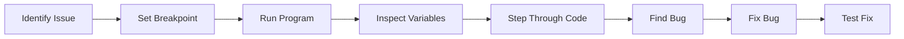
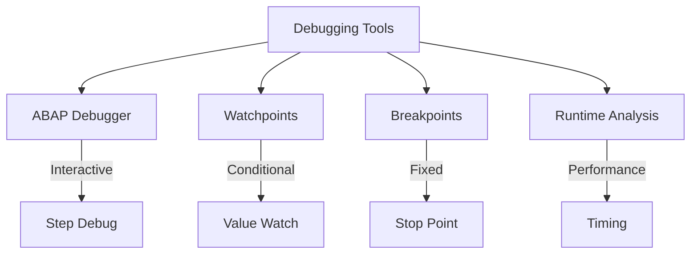
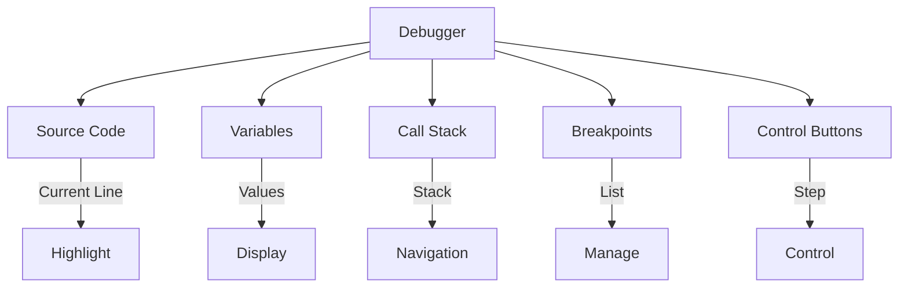
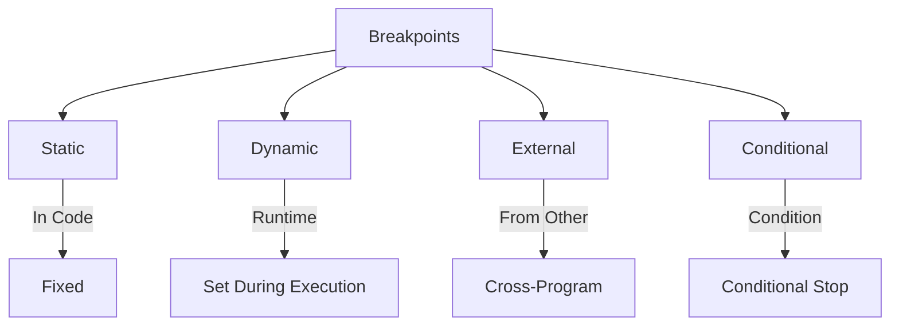
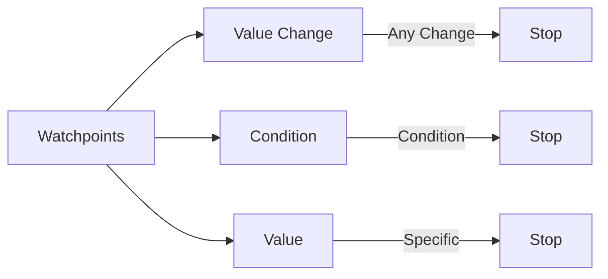
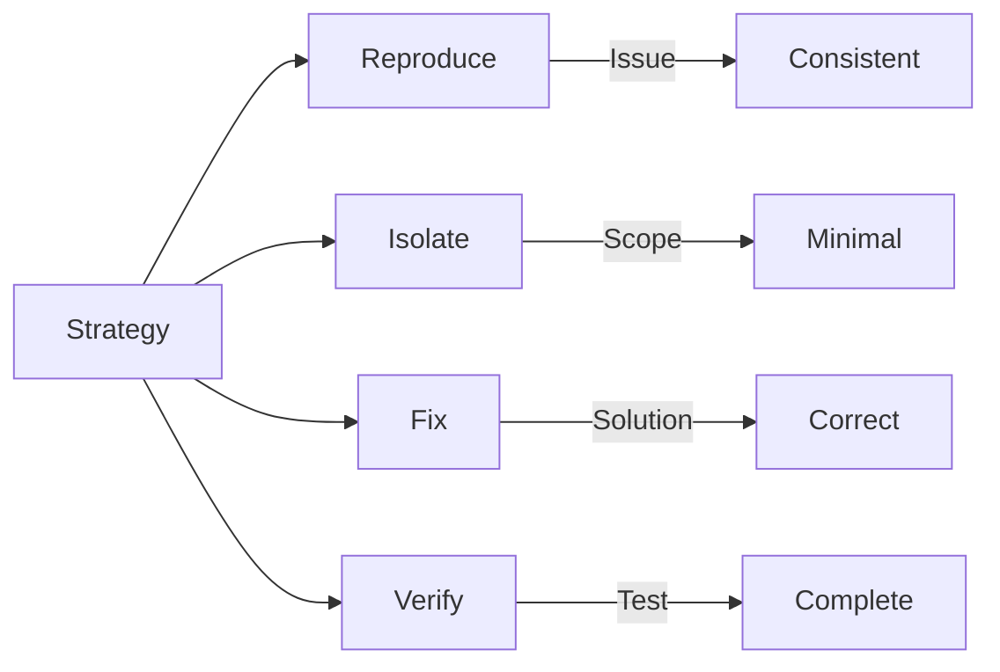

# SAP ABAP Debugging Guide

**Complete guide to debugging ABAP programs**

---

## 📚 Table of Contents

1. [Introduction](#introduction)
2. [Debugging Overview](#debugging-overview)
3. [ABAP Debugger](#abap-debugger)
4. [Breakpoints](#breakpoints)
5. [Watchpoints](#watchpoints)
6. [Debugging Techniques](#debugging-techniques)
7. [Advanced Debugging](#advanced-debugging)
8. [Best Practices](#best-practices)
9. [Examples](#examples)

---

## Introduction

**Debugging** is the process of finding and fixing errors in ABAP programs. Effective debugging skills are essential for ABAP developers.

### Debugging Process



### Debugging Tools



---

## Debugging Overview

### When to Debug

- Program crashes or errors
- Unexpected results
- Performance issues
- Logic errors
- Data inconsistencies

### Debugging Approaches

| Approach | Use When | Tool |
|----------|----------|------|
| **Step Debugging** | Logic errors | ABAP Debugger |
| **Watchpoints** | Value changes | Watchpoint |
| **Trace** | Performance | Runtime Analysis |
| **Logging** | Production issues | Application Log |

---

## ABAP Debugger

### Starting Debugger

**Methods**:
1. **Breakpoint**: Set breakpoint, run program
2. **Debugging Mode**: `/h` in command field
3. **External Breakpoint**: From another program

### Debugger Interface



### Debugger Controls

| Button | Action | Description |
|--------|--------|-------------|
| **F5** | Single Step | Execute current line |
| **F6** | Execute | Execute to next breakpoint |
| **F7** | Return | Return from current method |
| **F8** | Continue | Continue execution |
| **Shift+F5** | Execute | Execute current statement |

---

## Breakpoints

### Breakpoint Types



### Setting Breakpoints

**Method 1: In Code**
```abap
" Set breakpoint in ABAP code
BREAK-POINT.

" Conditional breakpoint
IF lv_condition = 'X'.
  BREAK-POINT.
ENDIF.
```

**Method 2: In Debugger**
- Place cursor on line
- Press F9 or click breakpoint icon
- Breakpoint appears as red dot

**Method 3: External Breakpoint**
- SE80 → Set External Breakpoint
- Specify program and line number

### Breakpoint Management

**View Breakpoints**: Debugger → Breakpoints tab

**Delete Breakpoint**: Click breakpoint icon again

**Disable Breakpoint**: Right-click → Disable

---

## Watchpoints

### What is a Watchpoint?

A **Watchpoint** stops execution when a variable's value changes or meets a condition.

### Watchpoint Types



### Creating Watchpoints

**In Debugger**:
1. Right-click variable
2. Select "Create Watchpoint"
3. Set condition (optional)
4. Watchpoint created

**Example**:
```
Variable: lv_status
Condition: lv_status = 'E'
Action: Stop when condition is true
```

### Watchpoint Example

```abap
" Debug code with watchpoint on lv_status
DATA: lv_status TYPE char1.

lv_status = 'P'. " Watchpoint: Stop if lv_status = 'E'
" ... processing ...
lv_status = 'A'. " Watchpoint: Stop if lv_status = 'E'
" ... processing ...
lv_status = 'E'. " Watchpoint triggers here!
```

---

## Debugging Techniques

### Step-by-Step Debugging


### Variable Inspection

**View Variables**:
- **Local Variables**: Current method variables
- **Global Variables**: Program-level variables
- **Object Attributes**: Object attributes
- **System Fields**: SY fields

**Change Variables**:
- Double-click variable
- Enter new value
- Press Enter

### Call Stack Navigation

**Purpose**: Navigate through method/program calls

**Usage**:
- View call stack in debugger
- Double-click stack entry
- Navigate to that point

---

## Advanced Debugging

### Debugging Internal Tables

```abap
" Inspect internal table
DATA: lt_flights TYPE TABLE OF sflight.

" In debugger:
" 1. Expand table
" 2. View table contents
" 3. Navigate through rows
" 4. Inspect individual fields
```

### Debugging Objects

```abap
" Inspect object
DATA: lo_request TYPE REF TO zcl_leave_request.

" In debugger:
" 1. Expand object reference
" 2. View attributes
" 3. Inspect method calls
```

### Debugging SQL Queries

**Transaction**: ST05 (SQL Trace)

**Steps**:
1. Activate trace
2. Run program
3. Deactivate trace
4. View SQL statements
5. Analyze performance

---

## Best Practices

### Debugging Strategy



1. **Reproduce Issue**: Make it happen consistently
2. **Isolate Problem**: Narrow down to specific area
3. **Set Breakpoints**: Strategic breakpoint placement
4. **Inspect Variables**: Check values at each step
5. **Document Findings**: Note what you discover

### Breakpoint Placement

**Good Locations**:
- Method entry points
- Before complex logic
- After data retrieval
- Before database updates
- Error handling sections

**Avoid**:
- Inside loops (unless needed)
- Frequently called methods
- System code

---

## Examples

### Example 1: Debugging Logic Error

```abap
" Issue: Calculation gives wrong result
METHOD calculate_total.
  DATA: lv_total TYPE p DECIMALS 2,
        lv_count TYPE i.

  " Set breakpoint here
  LOOP AT lt_items INTO ls_item.
    " Set breakpoint to inspect ls_item
    lv_total = lv_total + ls_item-amount.
    lv_count = lv_count + 1.
  ENDLOOP.

  " Set breakpoint to check lv_total
  " Expected: 1000, Actual: 500
  " Debug: Check if loop is executing correctly
  " Found: Loop only processes half the items
  " Fix: Check WHERE clause or table population
ENDMETHOD.
```

### Example 2: Debugging Data Issue

```abap
" Issue: Wrong data displayed
METHOD display_employee.
  " Set breakpoint
  SELECT SINGLE ename
    FROM pa0001
    INTO ev_employee_name
    WHERE pernr = iv_employee_id.

  " Set watchpoint: Stop if ev_employee_name is initial
  " Debug: Check if SELECT is finding data
  " Found: Employee ID format issue
  " Fix: Format employee ID correctly
ENDMETHOD.
```

---

## Common Transactions

| Transaction | Purpose |
|-------------|---------|
| **SE80** | Object Navigator (debug) |
| **SE38** | ABAP Editor (debug) |
| **ST05** | SQL Trace |
| **SE30** | Runtime Analysis |

---

## Troubleshooting

### Common Issues

1. **Debugger Not Starting**
   - Check `/h` command
   - Verify breakpoint set
   - Check user authorization

2. **Breakpoint Not Hitting**
   - Verify code path executes
   - Check breakpoint is active
   - Verify program version

3. **Variables Not Visible**
   - Check variable scope
   - Verify variable exists
   - Check debugger view settings

---

## References

- [ABAP Basics Guide](./01_SAP_ABAP_BASICS_GUIDE.md)
- [Performance Guide](./10_SAP_ABAP_PERFORMANCE_GUIDE.md)
- [Unit Testing Guide](./14_SAP_ABAP_UNIT_TESTING_GUIDE.md)

---

**Next**: [Performance Guide](./10_SAP_ABAP_PERFORMANCE_GUIDE.md)

