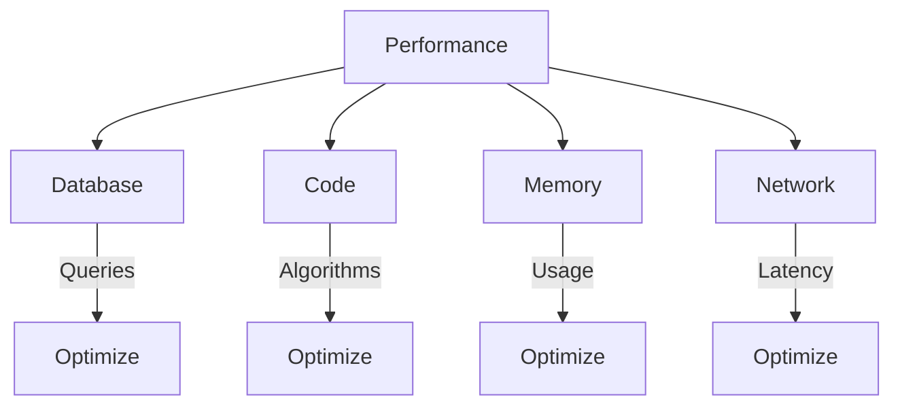
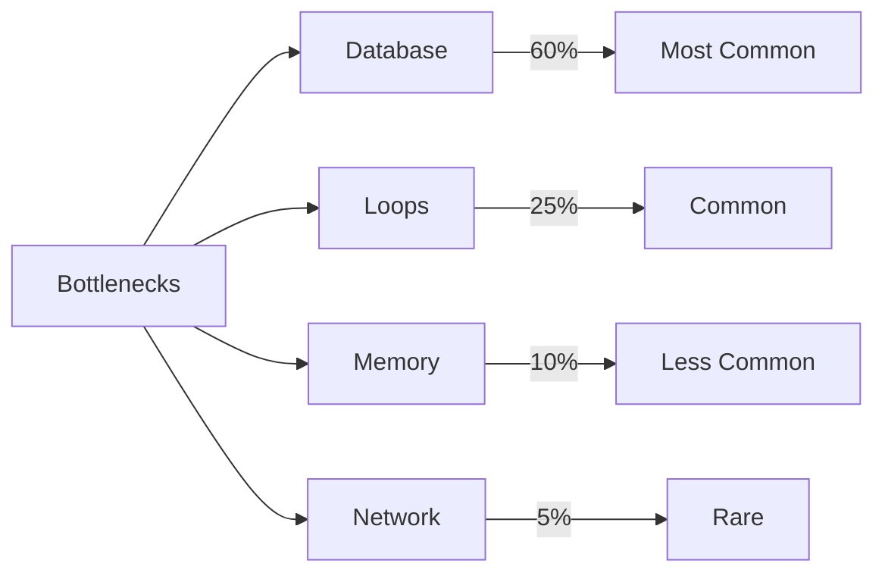
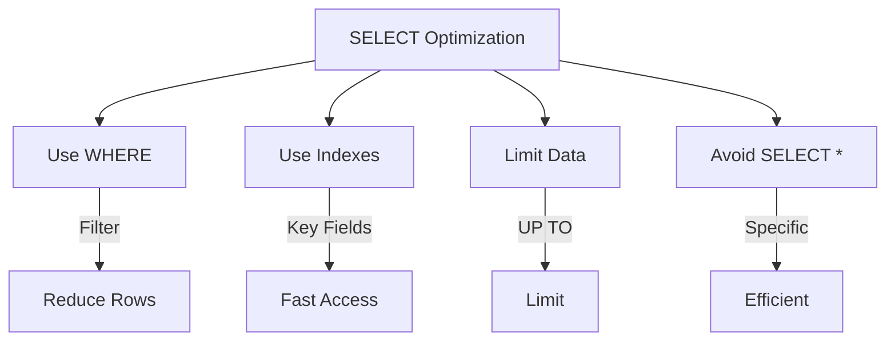
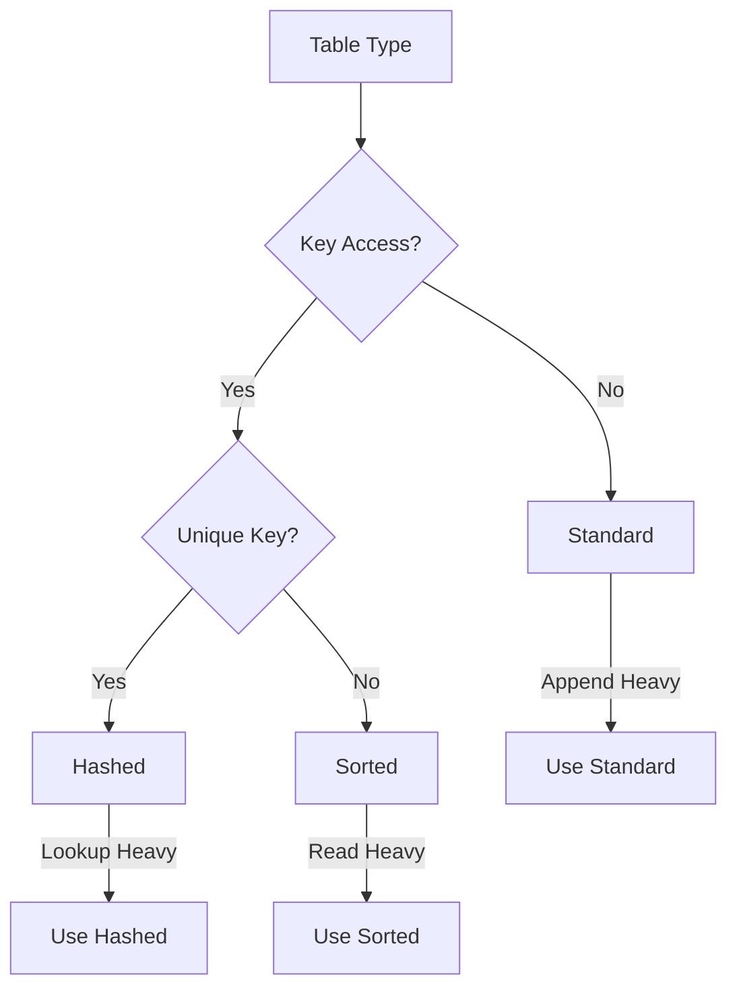
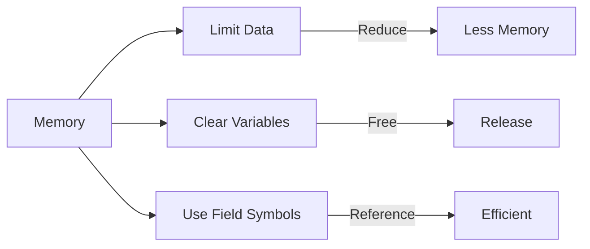
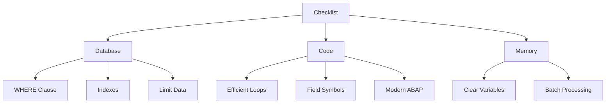

# SAP ABAP Performance Guide

**Complete guide to optimizing ABAP program performance**

---

## 📚 Table of Contents

1. [Introduction](#introduction)
2. [Performance Overview](#performance-overview)
3. [Database Optimization](#database-optimization)
4. [Internal Table Optimization](#internal-table-optimization)
5. [Code Optimization](#code-optimization)
6. [Memory Management](#memory-management)
7. [Performance Tools](#performance-tools)
8. [Best Practices](#best-practices)
9. [Examples](#examples)

---

## Introduction

**Performance optimization** is critical for ensuring SAP applications run efficiently and provide good user experience.

### Performance Factors



### Performance Targets

| Operation | Target | Critical |
|-----------|-------|----------|
| **Screen Response** | < 1 second | > 3 seconds |
| **Report Generation** | < 3 seconds | > 10 seconds |
| **Database Query** | < 500ms | > 2 seconds |
| **ALV Display** | < 2 seconds | > 5 seconds |

---

## Performance Overview

### Performance Bottlenecks



### Optimization Strategy

1. **Measure First**: Use performance tools
2. **Identify Bottleneck**: Find slowest part
3. **Optimize**: Apply optimization techniques
4. **Measure Again**: Verify improvement

---

## Database Optimization

### SELECT Statement Optimization



### Best Practices

1. **Always Use WHERE Clause**
```abap
" Bad
SELECT * FROM sflight INTO TABLE lt_flights.

" Good
SELECT * FROM sflight
  INTO TABLE lt_flights
  WHERE carrid = 'LH'
    AND fldate >= sy-datum.
```

2. **Use Indexed Fields**
```abap
" Use primary key or indexed fields
SELECT * FROM sflight
  INTO TABLE lt_flights
  WHERE carrid = 'LH'      " Indexed
    AND connid = '0400'    " Indexed
    AND fldate >= sy-datum.
```

3. **Limit Data**
```abap
" Use UP TO for large datasets
SELECT * FROM sflight
  INTO TABLE lt_flights
  WHERE carrid = 'LH'
  UP TO 1000 ROWS.
```

4. **Avoid SELECT in Loops**
```abap
" Bad: SELECT in loop
LOOP AT lt_employees INTO ls_employee.
  SELECT SINGLE ename
    FROM pa0001
    INTO ls_employee-name
    WHERE pernr = ls_employee-empno.
ENDLOOP.

" Good: SELECT all at once
SELECT pernr ename
  FROM pa0001
  INTO TABLE lt_employee_data
  FOR ALL ENTRIES IN lt_employees
  WHERE pernr = lt_employees-empno.
```

5. **Use FOR ALL ENTRIES Correctly**
```abap
" Check if table is not empty
IF lt_employees IS NOT INITIAL.
  SELECT pernr ename
    FROM pa0001
    INTO TABLE lt_data
    FOR ALL ENTRIES IN lt_employees
    WHERE pernr = lt_employees-empno.
ENDIF.
```

### Database Indexes

**Transaction**: SE11 → Table → Indexes

**Best Practices**:
- Create indexes on frequently queried fields
- Include key fields in WHERE clause
- Avoid too many indexes (slows INSERT/UPDATE)

---

## Internal Table Optimization

### Table Type Selection



### Performance Tips

1. **Use Appropriate Table Type**
```abap
" For frequent key lookups
DATA: lt_flights TYPE HASHED TABLE OF sflight
      WITH UNIQUE KEY carrid connid fldate.

" For sorted data
DATA: lt_flights TYPE SORTED TABLE OF sflight
      WITH NON-UNIQUE KEY carrid.
```

2. **Use BINARY SEARCH**
```abap
" Sort first
SORT lt_flights BY carrid.

" Then use BINARY SEARCH
READ TABLE lt_flights INTO ls_flight
  WITH KEY carrid = 'LH'
  BINARY SEARCH.
```

3. **Avoid Nested Loops**
```abap
" Bad: O(n²)
LOOP AT lt_outer INTO ls_outer.
  LOOP AT lt_inner INTO ls_inner WHERE key = ls_outer-key.
    " Process
  ENDLOOP.
ENDLOOP.

" Good: Use sorted/hashed table
LOOP AT lt_outer INTO ls_outer.
  READ TABLE lt_inner INTO ls_inner
    WITH KEY key = ls_outer-key
    BINARY SEARCH.
  IF sy-subrc = 0.
    " Process
  ENDIF.
ENDLOOP.
```

4. **Use Modern ABAP**
```abap
" Modern: More efficient
DATA(lt_filtered) = FILTER #(
  lt_flights
  WHERE carrid = 'LH' AND price > 500
).

" Instead of loop
```

---

## Code Optimization

### Algorithm Efficiency

```mermaid
graph LR
    A[Algorithm] --> B[O(1)]
    A --> C[O(log n)]
    A --> D[O(n)]
    A --> E[O(n²)]
    
    B -->|Best| F[Constant]
    C -->|Good| G[Logarithmic]
    D -->|Acceptable| H[Linear]
    E -->|Avoid| I[Quadratic]
```

### Code Optimization Tips

1. **Avoid Redundant Calculations**
```abap
" Bad
LOOP AT lt_data INTO ls_data.
  lv_total = lv_total + ls_data-amount * 1.1.
ENDLOOP.

" Good: Calculate constant once
DATA(lv_factor) = '1.1'.
LOOP AT lt_data INTO ls_data.
  lv_total = lv_total + ls_data-amount * lv_factor.
ENDLOOP.
```

2. **Use Field Symbols**
```abap
" More efficient than INTO
LOOP AT lt_flights ASSIGNING FIELD-SYMBOL(<fs_flight>).
  <fs_flight>-price = <fs_flight>-price * 1.1.
ENDLOOP.
```

3. **Batch Operations**
```abap
" Process in batches
DATA: lv_batch_size TYPE i VALUE 1000,
      lv_index TYPE i.

DO.
  CLEAR lt_batch.
  lv_index = sy-index * lv_batch_size.
  
  LOOP AT lt_data INTO ls_data FROM lv_index TO lv_index + lv_batch_size.
    APPEND ls_data TO lt_batch.
  ENDLOOP.
  
  IF lt_batch IS INITIAL.
    EXIT.
  ENDIF.
  
  " Process batch
  PERFORM process_batch USING lt_batch.
ENDDO.
```

---

## Memory Management

### Memory Optimization



### Best Practices

1. **Clear Large Tables**
```abap
" Clear when done
CLEAR: lt_large_table, ls_structure.
FREE: lt_large_table.
```

2. **Use Field Symbols**
```abap
" Avoids copying data
LOOP AT lt_data ASSIGNING FIELD-SYMBOL(<fs>).
  " Modify directly
  <fs>-field = 'value'.
ENDLOOP.
```

3. **Limit Memory Usage**
```abap
" Process in chunks
DO.
  CLEAR lt_chunk.
  SELECT * FROM large_table
    INTO TABLE lt_chunk
    UP TO 10000 ROWS.
  
  IF lt_chunk IS INITIAL.
    EXIT.
  ENDIF.
  
  " Process chunk
  PERFORM process_chunk USING lt_chunk.
  CLEAR lt_chunk.
ENDDO.
```

---

## Performance Tools

### Performance Analysis Tools

| Tool | Purpose | Transaction |
|------|---------|-------------|
| **Runtime Analysis** | Measure execution time | SE30 |
| **SQL Trace** | Analyze database queries | ST05 |
| **Memory Analysis** | Monitor memory usage | ST02 |
| **Code Inspector** | Static code analysis | SCI |

### Runtime Analysis (SE30)

**Steps**:
1. SE30 → Enter program name
2. Execute
3. View results
4. Analyze hotspots

### SQL Trace (ST05)

**Steps**:
1. ST05 → Activate trace
2. Execute program
3. Deactivate trace
4. View trace results
5. Analyze slow queries

---

## Best Practices

### Performance Checklist



1. ✅ Use WHERE clause in SELECT
2. ✅ Use indexed fields
3. ✅ Limit data with UP TO
4. ✅ Avoid SELECT in loops
5. ✅ Use appropriate table types
6. ✅ Use BINARY SEARCH
7. ✅ Avoid nested loops
8. ✅ Use field symbols
9. ✅ Clear large tables
10. ✅ Process in batches

---

## Examples

### Example 1: Optimized Report

```abap
REPORT z_optimized_report.

DATA: lt_flights TYPE HASHED TABLE OF sflight
      WITH UNIQUE KEY carrid connid fldate,
      ls_flight TYPE sflight.

SELECT-OPTIONS: s_carrid FOR ls_flight-carrid.

START-OF-SELECTION.
  " Optimized SELECT
  SELECT * FROM sflight
    INTO TABLE lt_flights
    WHERE carrid IN s_carrid
      AND fldate >= sy-datum
    UP TO 10000 ROWS.

  " Process with field symbol
  LOOP AT lt_flights ASSIGNING FIELD-SYMBOL(<fs_flight>).
    " Process
    <fs_flight>-price = <fs_flight>-price * 1.1.
  ENDLOOP.

  " Display
  PERFORM display_alv USING lt_flights.
```

### Example 2: Batch Processing

```abap
" Process large dataset in batches
DATA: lv_batch_size TYPE i VALUE 1000,
      lv_offset TYPE i.

DO.
  CLEAR lt_batch.
  
  " Get batch
  SELECT * FROM large_table
    INTO TABLE lt_batch
    UP TO lv_batch_size ROWS
    OFFSET lv_offset.
  
  IF lt_batch IS INITIAL.
    EXIT.
  ENDIF.
  
  " Process batch
  LOOP AT lt_batch ASSIGNING FIELD-SYMBOL(<fs>).
    " Process record
  ENDLOOP.
  
  " Update offset
  lv_offset = lv_offset + lv_batch_size.
  
  " Clear memory
  CLEAR lt_batch.
ENDDO.
```

---

## Common Transactions

| Transaction | Purpose |
|-------------|---------|
| **SE30** | Runtime Analysis |
| **ST05** | SQL Trace |
| **ST02** | Memory Analysis |
| **SCI** | Code Inspector |
| **SE11** | Data Dictionary (indexes) |

---

## Troubleshooting

### Common Performance Issues

1. **Slow Database Queries**
   - Check WHERE clause
   - Verify indexes
   - Use ST05 to trace

2. **Slow Loops**
   - Check for nested loops
   - Use appropriate table types
   - Use BINARY SEARCH

3. **Memory Issues**
   - Limit data size
   - Clear large tables
   - Process in batches

---

## References

- [Internal Tables Guide](./03_SAP_ABAP_INTERNAL_TABLES_GUIDE.md)
- [Reports Guide](./04_SAP_ABAP_REPORTS_GUIDE.md)
- [Best Practices Guide](./12_SAP_ABAP_BEST_PRACTICES_GUIDE.md)

---

**Next**: [Enhancement Framework Guide](./11_SAP_ABAP_ENHANCEMENT_FRAMEWORK_GUIDE.md)

