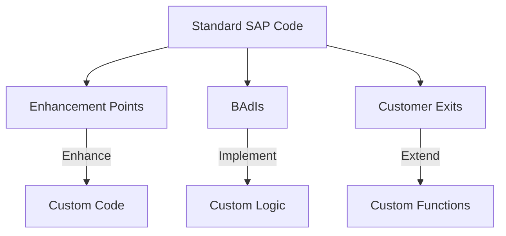
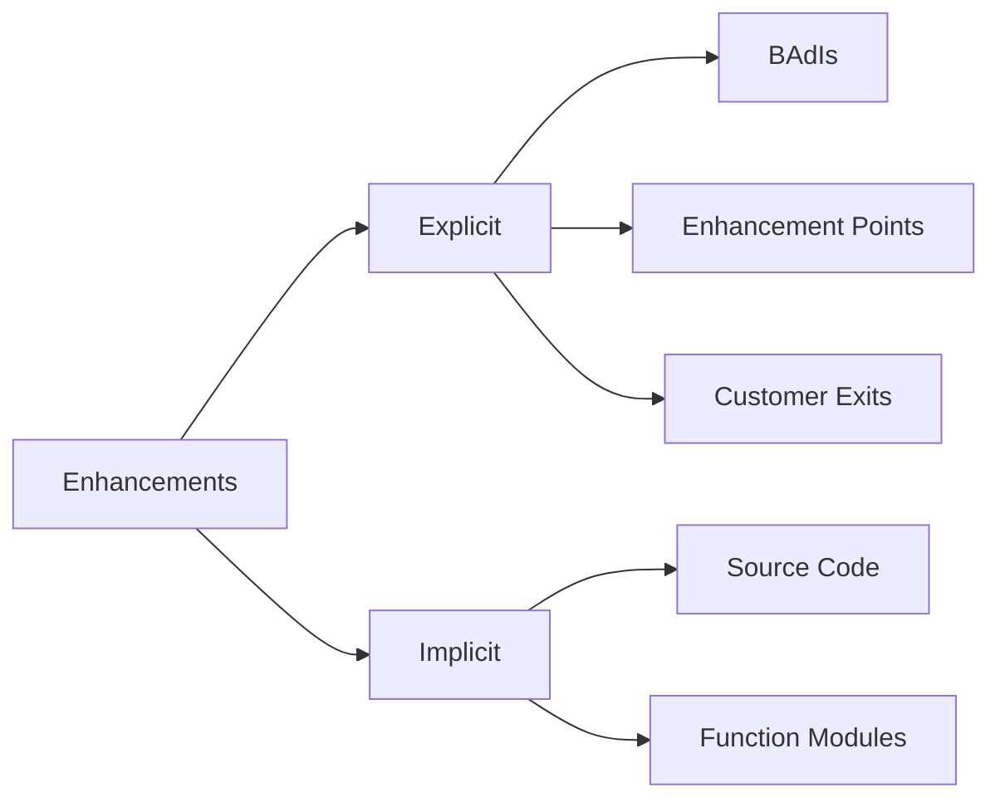
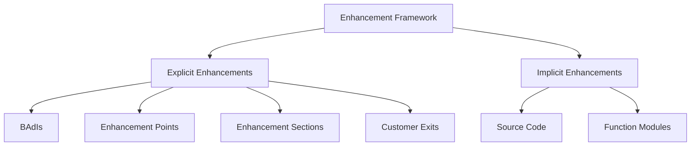
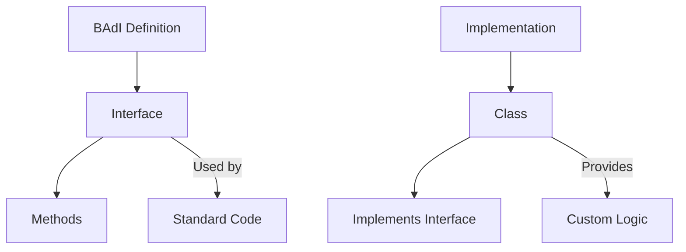
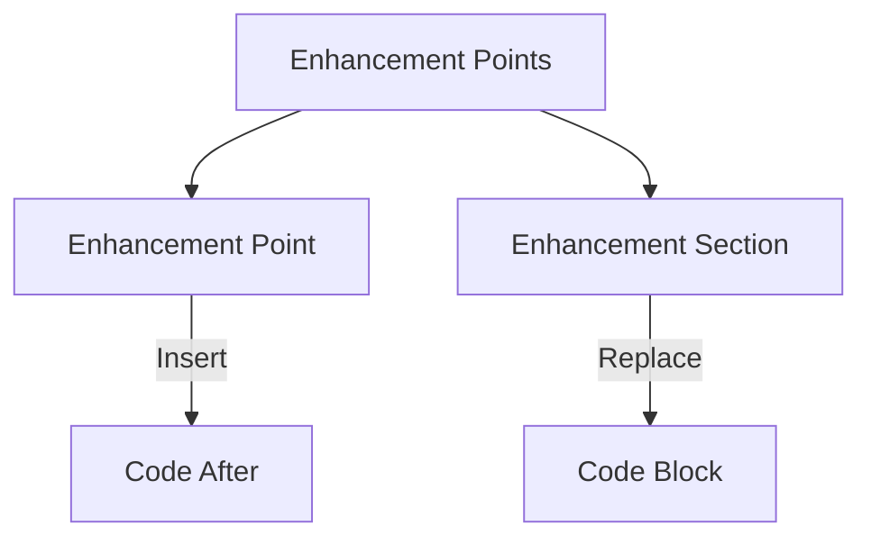
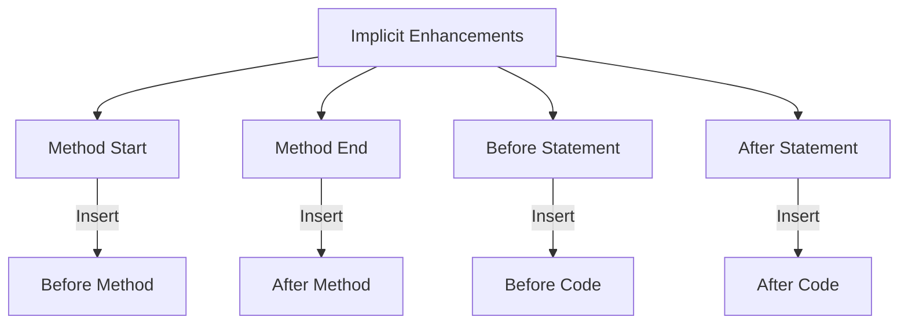
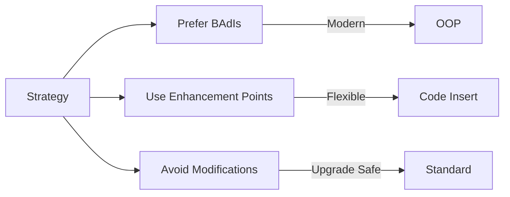

# SAP ABAP Enhancement Framework Guide

**Complete guide to SAP Enhancement Framework**

---

## 📚 Table of Contents

1. [Introduction](#introduction)
2. [Enhancement Framework Overview](#enhancement-framework-overview)
3. [Enhancement Types](#enhancement-types)
4. [BAdIs (Business Add-Ins)](#badis-business-add-ins)
5. [Enhancement Points](#enhancement-points)
6. [Customer Exits](#customer-exits)
7. [Implicit Enhancements](#implicit-enhancements)
8. [Best Practices](#best-practices)
9. [Examples](#examples)

---

## Introduction

**SAP Enhancement Framework** allows you to enhance standard SAP functionality without modifying standard code.

### Enhancement Architecture



### Enhancement Benefits

- ✅ **No Modification**: Don't modify standard code
- ✅ **Upgrade Safe**: Survives SAP upgrades
- ✅ **Flexible**: Multiple implementations
- ✅ **Maintainable**: Clear enhancement points

---

## Enhancement Framework Overview

### Enhancement Concepts



### Enhancement Types Comparison

| Type | Technology | Use When |
|------|-----------|----------|
| **BAdI** | Object-oriented | Modern enhancements |
| **Enhancement Point** | Source code | Add code at specific points |
| **Customer Exit** | Function modules | Legacy enhancements |
| **Implicit Enhancement** | Source code | Any enhancement point |

---

## Enhancement Types

### Enhancement Hierarchy



### When to Use Each Type

1. **BAdI**: Object-oriented, multiple implementations
2. **Enhancement Point**: Add code at specific location
3. **Enhancement Section**: Replace code section
4. **Customer Exit**: Legacy function module exits
5. **Implicit Enhancement**: Any standard code location

---

## BAdIs (Business Add-Ins)

### What is a BAdI?

**BAdI (Business Add-In)** is an object-oriented enhancement technique using interfaces.

### BAdI Architecture



### Creating BAdI Implementation

**Transaction**: SE18 (BAdI Builder) / SE19 (BAdI Implementation)

**Steps**:
1. SE18 → Find BAdI (e.g., `CL_EXITHANDLER`)
2. SE19 → Create Implementation
3. Enter implementation name
4. Implement interface methods
5. Activate

### BAdI Example

```abap
" BAdI: LE_SHP_DELIVERY_PROC
" Interface: IF_EX_LE_SHP_DELIVERY_PROC

" Implementation class
CLASS zcl_leave_delivery_impl DEFINITION
  PUBLIC
  FINAL
  CREATE PUBLIC.

  PUBLIC SECTION.
    INTERFACES if_ex_le_shp_delivery_proc.

ENDCLASS.

CLASS zcl_leave_delivery_impl IMPLEMENTATION.

  METHOD if_ex_le_shp_delivery_proc~change_delivery_header.
    " Custom logic
    cs_likp-vbeln = |Z{ cs_likp-vbeln }|.
  ENDMETHOD.

ENDCLASS.
```

### Using BAdI in Code

```abap
" Get BAdI instance
DATA: lo_badi TYPE REF TO if_ex_le_shp_delivery_proc.

GET BADI lo_badi
  FILTERS
    ...

" Call BAdI method
CALL BADI lo_badi->change_delivery_header
  CHANGING
    cs_likp = ls_likp.
```

---

## Enhancement Points

### What is an Enhancement Point?

An **Enhancement Point** is a location in standard code where you can insert custom code.

### Enhancement Point Types



### Creating Enhancement Point Implementation

**Transaction**: SE80

**Steps**:
1. SE80 → Find standard program/class
2. Find enhancement point
3. Right-click → Enhancement → Create Implementation
4. Enter implementation name
5. Write custom code
6. Activate

### Enhancement Point Example

```abap
" Standard code (enhanced)
METHOD process_leave_request.
  " Standard processing
  " ...
  
  " Enhancement Point: ZLEAVE_POST_PROCESSING
  " Custom code inserted here
  
  " More standard processing
  " ...
ENDMETHOD.

" Enhancement implementation
ENHANCEMENT-POINT zleave_post_processing.
  " Custom logic
  PERFORM send_notification_email.
  PERFORM update_statistics.
END-ENHANCEMENT-POINT.
```

---

## Customer Exits

### What is a Customer Exit?

**Customer Exits** are function module exits in standard SAP programs.

### Customer Exit Types

| Type | Description | Transaction |
|------|-------------|-------------|
| **Function Module Exit** | EXIT_* function modules | CMOD |
| **Menu Exit** | Additional menu items | CMOD |
| **Screen Exit** | Additional screen fields | CMOD |

### Using Customer Exits

**Transaction**: CMOD (Enhancement Projects)

**Steps**:
1. CMOD → Create Enhancement Project
2. Assign Enhancement (e.g., `MM06E001`)
3. Activate project
4. Implement exit function module

### Customer Exit Example

```abap
" Exit function: EXIT_SAPLMM06_001
" Called from standard program

FUNCTION z_exit_saplmm06_001.
*"----------------------------------------------------------------------
*"*"Local Interface:
*"  IMPORTING
*"     VALUE(I_MARA) TYPE MARA
*"  CHANGING
*"     VALUE(C_MARA) TYPE MARA
*"----------------------------------------------------------------------

  " Custom logic
  IF c_mara-matkl = '001'.
    c_mara-mtart = 'FERT'.
  ENDIF.

ENDFUNCTION.
```

---

## Implicit Enhancements

### What is an Implicit Enhancement?

**Implicit Enhancements** are enhancement points automatically available in standard code.

### Implicit Enhancement Locations



### Creating Implicit Enhancement

**Transaction**: SE80

**Steps**:
1. SE80 → Find standard class/method
2. Right-click → Enhancement → Enhancement Operations
3. Select enhancement type
4. Create implementation
5. Write code
6. Activate

### Implicit Enhancement Example

```abap
" Standard method
METHOD process_data.
  " Standard code
  SELECT * FROM table1...
  " Implicit enhancement point: After SELECT
  " Custom code can be inserted here
  
  " More standard code
  LOOP AT it_data...
    " Implicit enhancement point: Inside loop
    " Custom code can be inserted here
  ENDLOOP.
ENDMETHOD.

" Enhancement implementation
ENHANCEMENT 1  ZENH_LEAVE_PROCESS.
  " Custom code after SELECT
  PERFORM custom_processing.
ENDENHANCEMENT.
```

---

## Best Practices

### Enhancement Strategy



1. **Prefer BAdIs**: Modern, object-oriented
2. **Use Enhancement Points**: When BAdI not available
3. **Avoid Modifications**: Use enhancements instead
4. **Document Enhancements**: Document all enhancements
5. **Test Thoroughly**: Test enhancement implementations

### Enhancement Guidelines

1. **Minimal Code**: Keep enhancement code minimal
2. **No Side Effects**: Don't break standard functionality
3. **Error Handling**: Handle errors gracefully
4. **Performance**: Don't impact performance
5. **Upgrade Compatibility**: Ensure upgrade safety

---

## Examples

### Example 1: BAdI Implementation

```abap
" BAdI: LE_SHP_DELIVERY_PROC
" Purpose: Enhance delivery processing

CLASS zcl_delivery_enhancement DEFINITION
  PUBLIC
  FINAL
  CREATE PUBLIC.

  PUBLIC SECTION.
    INTERFACES if_ex_le_shp_delivery_proc.

ENDCLASS.

CLASS zcl_delivery_enhancement IMPLEMENTATION.

  METHOD if_ex_le_shp_delivery_proc~change_delivery_header.
    " Custom logic: Add custom field
    IF cs_likp-vbeln IS NOT INITIAL.
      " Custom processing
      PERFORM custom_delivery_processing USING cs_likp.
    ENDIF.
  ENDMETHOD.

ENDCLASS.
```

### Example 2: Enhancement Point

```abap
" Enhancement Point in standard method
" Location: CL_LEAVE_PROCESSOR->PROCESS_REQUEST

" Enhancement implementation
ENHANCEMENT-POINT zleave_custom_processing.
  " Custom validation
  IF iv_request_id IS NOT INITIAL.
    PERFORM custom_validation USING iv_request_id.
  ENDIF.
  
  " Custom notification
  PERFORM send_custom_notification USING iv_request_id.
END-ENHANCEMENT-POINT.
```

---

## Common Transactions

| Transaction | Purpose |
|-------------|---------|
| **SE18** | BAdI Builder |
| **SE19** | BAdI Implementation |
| **SE80** | Enhancement Operations |
| **CMOD** | Enhancement Projects |
| **SMOD** | Enhancement Maintenance |

---

## Troubleshooting

### Common Issues

1. **Enhancement Not Active**
   - Check enhancement is activated
   - Verify implementation exists
   - Check filter conditions

2. **BAdI Not Called**
   - Verify BAdI is active
   - Check filter values
   - Verify implementation

3. **Enhancement Conflicts**
   - Check multiple implementations
   - Verify execution order
   - Check filter conditions

---

## References

- [ABAP Objects Guide](./08_SAP_ABAP_OBJECTS_GUIDE.md)
- [Best Practices Guide](./12_SAP_ABAP_BEST_PRACTICES_GUIDE.md)
- [SAP Help - Enhancement Framework](https://help.sap.com/)

---

**Next**: [Integration Guide](./15_SAP_ABAP_INTEGRATION_GUIDE.md)

