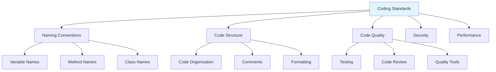
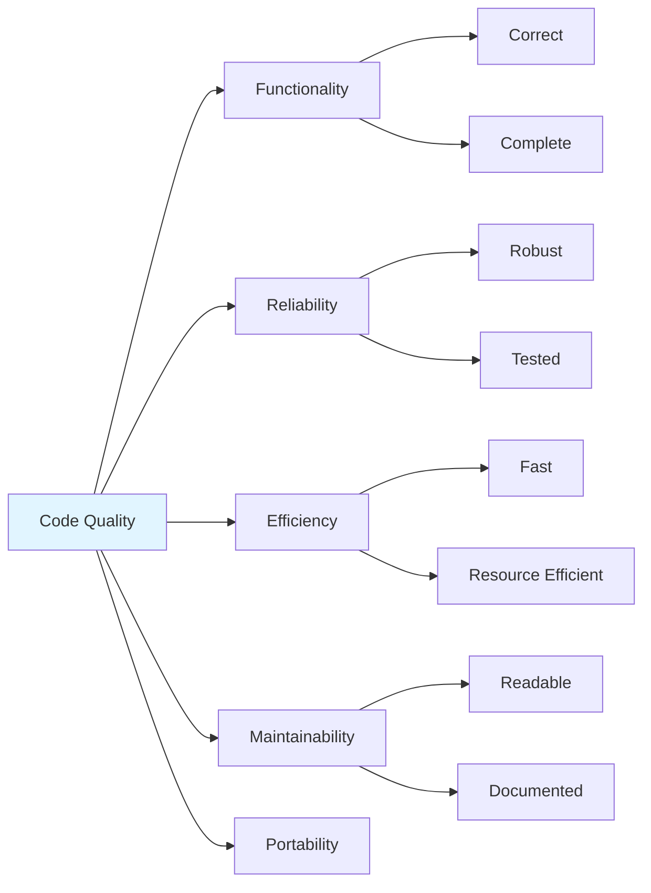
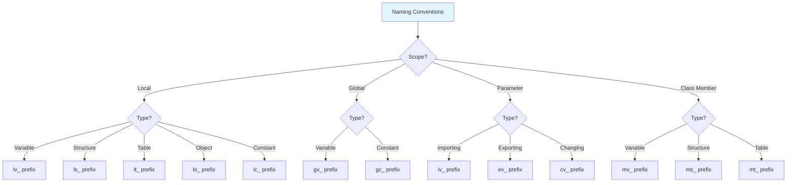
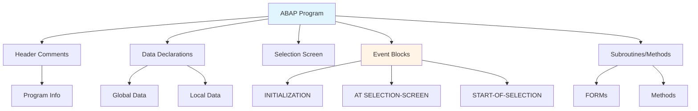
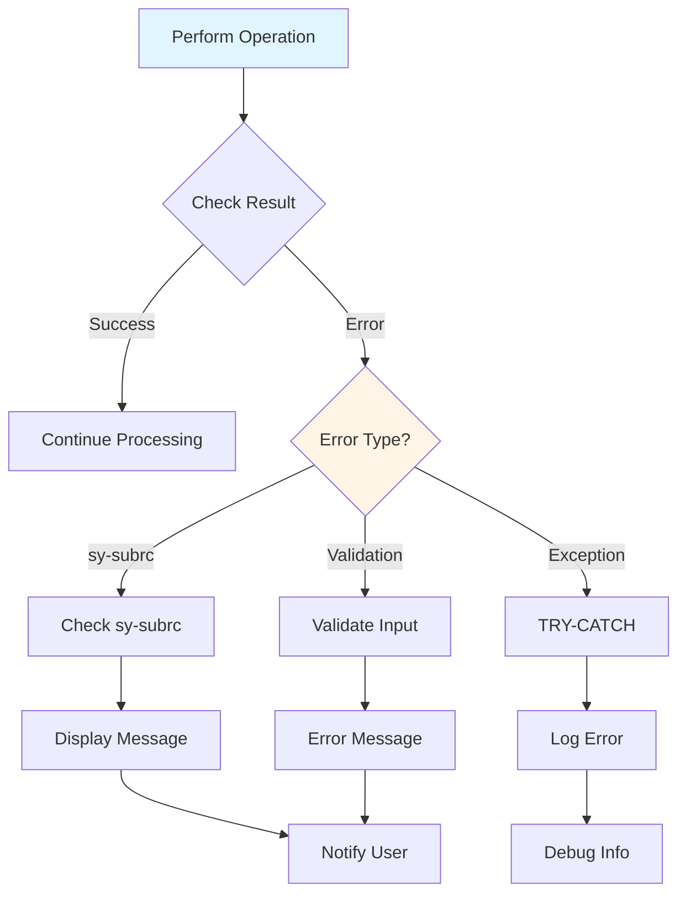
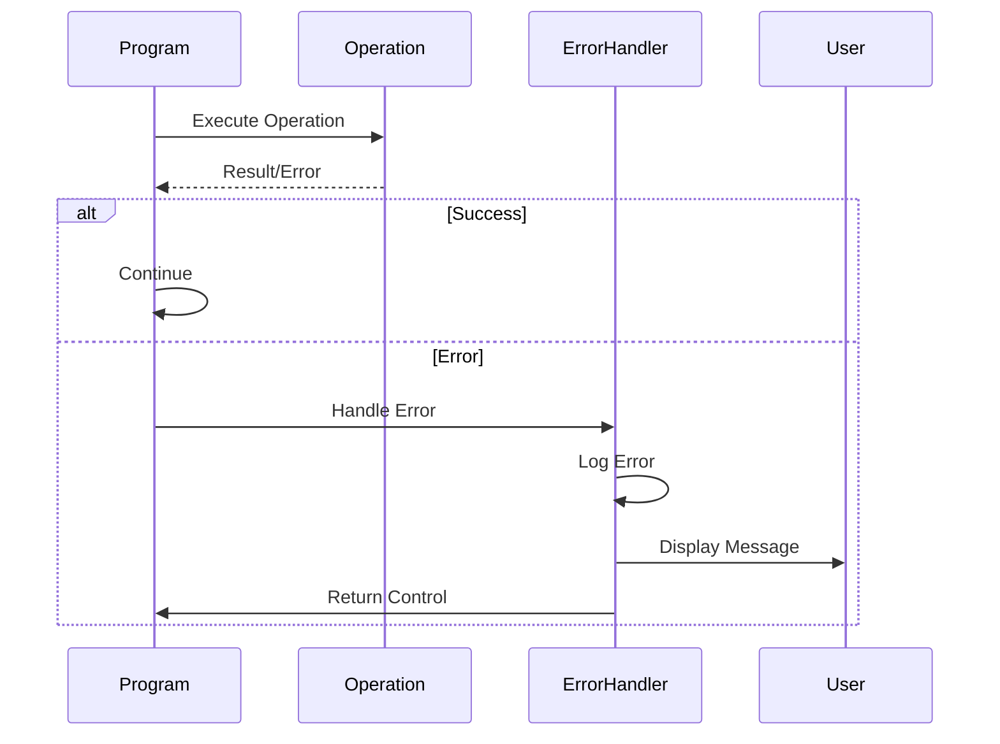
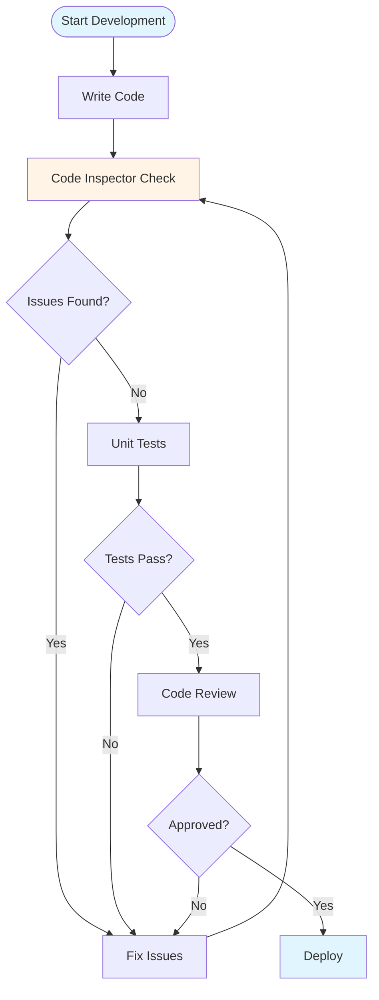
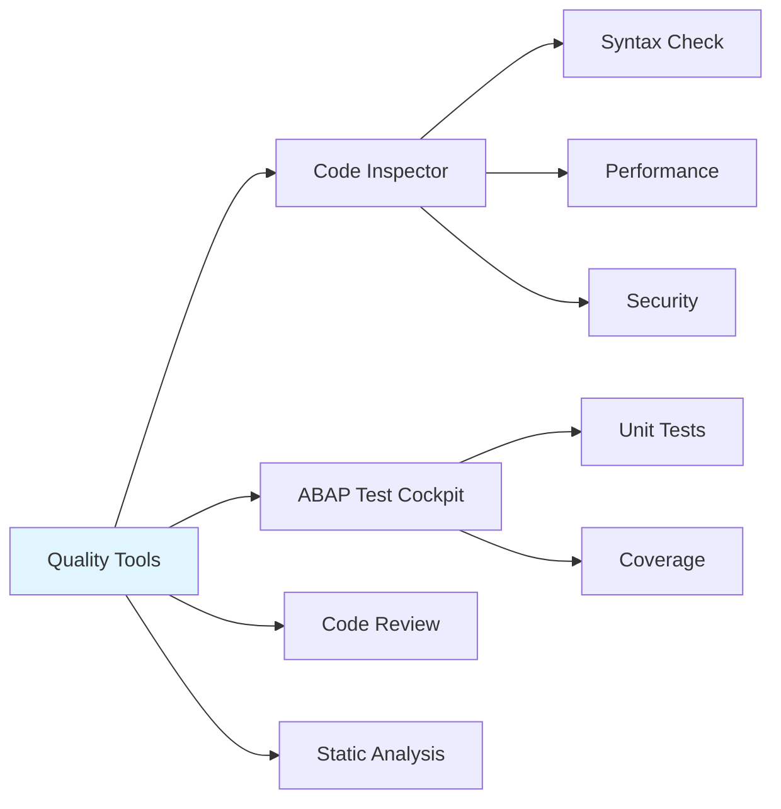

# 12 SAP ABAP Best Practices Guide

## Table of Contents
1. [Introduction](#introduction)
2. [Coding Standards](#coding-standards)
3. [Naming Conventions](#naming-conventions)
4. [Code Structure](#code-structure)
5. [Error Handling](#error-handling)
6. [Documentation](#documentation)
7. [Code Quality](#code-quality)
8. [Common Pitfalls](#common-pitfalls)
9. [Checklists](#checklists)
10. [Summary](#summary)
11. [Resources](#resources)

---

## Introduction

### Overview
This guide covers ABAP coding best practices, standards, and quality guidelines to write maintainable, efficient, and professional ABAP code.

### Learning Objectives
- Understand ABAP coding standards
- Follow naming conventions
- Structure code properly
- Handle errors effectively
- Write quality code

### Prerequisites
- Completed all previous guides
- Understanding of ABAP programming

### Estimated Reading Time
3-4 hours

---

## Coding Standards

### SAP Coding Standards

Follow SAP's official coding standards for consistency.

### Coding Standards Framework



### Key Principles

1. **Readability**: Code should be easy to read
2. **Maintainability**: Code should be easy to maintain
3. **Performance**: Code should be efficient
4. **Security**: Code should be secure
5. **Documentation**: Code should be documented

### Code Quality Dimensions



---

## Naming Conventions

### Naming Convention Hierarchy



### Variable Prefixes

- `lv_`: Local variable
- `gv_`: Global variable
- `ls_`: Local structure
- `lt_`: Local table
- `lo_`: Local object
- `iv_`: Importing parameter
- `ev_`: Exporting parameter

### Example

```abap
DATA: lv_customer_name TYPE string,
      lt_materials TYPE TABLE OF mara,
      lo_customer TYPE REF TO z_customer.
```

---

## Code Structure

### Code Organization Flow



### Program Structure

```abap
REPORT z_program_name.

"**********************************************************************
"* Header comments
"**********************************************************************

" Global data
DATA: ...

" Selection screen
SELECT-OPTIONS: ...

" Events
INITIALIZATION.
  ...

START-OF-SELECTION.
  ...

" Subroutines
FORM process_data.
  ...
ENDFORM.
```

---

## Error Handling

### Error Handling Strategy



### Always Check sy-subrc

```abap
SELECT * FROM mara INTO TABLE lt_materials.
IF sy-subrc <> 0.
  MESSAGE 'No materials found' TYPE 'W'.
  RETURN.
ENDIF.
```

### Exception Handling

```abap
TRY.
    " Code that may raise exception
  CATCH cx_root INTO DATA(lx_error).
    MESSAGE lx_error->get_text( ) TYPE 'E'.
ENDTRY.
```

### Error Handling Flow



---

## Documentation

### Header Comments

```abap
"**********************************************************************
"* Program: Z_CUSTOMER_REPORT
"* Purpose: Display customer information
"* Author: Your Name
"* Date: 2024
"**********************************************************************
```

### Code Comments

```abap
" Calculate total amount including tax
lv_total = lv_amount * ( 1 + lv_tax_rate ).
```

---

## Code Quality

### Code Quality Process



### Code Quality Tools



### Code Inspector

Use SE80 Code Inspector to check code quality.

**Code Inspector Checks**:
- Syntax errors
- Performance issues
- Security vulnerabilities
- Naming conventions
- Code complexity

### ABAP Test Cockpit (ATC)

Automated code quality checks.

**ATC Features**:
- Automated unit test execution
- Code coverage analysis
- Static code analysis
- Integration with CI/CD

---

## Common Pitfalls

### 1. Hardcoded Values

**Bad**:
```abap
IF lv_status = 'A'.
```

**Good**:
```abap
CONSTANTS: lc_status_active TYPE c LENGTH 1 VALUE 'A'.
IF lv_status = lc_status_active.
```

### 2. No Error Handling

Always handle errors and check sy-subrc.

---

## Checklists

### Development Checklist

- [ ] Code follows naming conventions
- [ ] Error handling implemented
- [ ] Code documented
- [ ] Performance optimized
- [ ] Security checks added
- [ ] Code reviewed

---

## Summary

### Key Takeaways

1. **Coding standards** ensure consistency
2. **Naming conventions** improve readability
3. **Error handling** is essential
4. **Documentation** aids maintenance
5. **Code quality** tools help identify issues

### Next Steps

- **13_SAP_ABAP_SECURITY_GUIDE.md**: Security
- **14_SAP_ABAP_UNIT_TESTING_GUIDE.md**: Unit testing

---

## Resources

### Tools
- **SE80**: Code Inspector
- **ATC**: ABAP Test Cockpit

### Related Guides
- [11_SAP_ABAP_ENHANCEMENT_FRAMEWORK_GUIDE.md](./11_SAP_ABAP_ENHANCEMENT_FRAMEWORK_GUIDE.md) - Previous
- [13_SAP_ABAP_SECURITY_GUIDE.md](./13_SAP_ABAP_SECURITY_GUIDE.md) - Next

---

**Last Updated**: 2024

